# 后效梯度

> 原文：<https://www.educba.com/after-effects-gradient/>

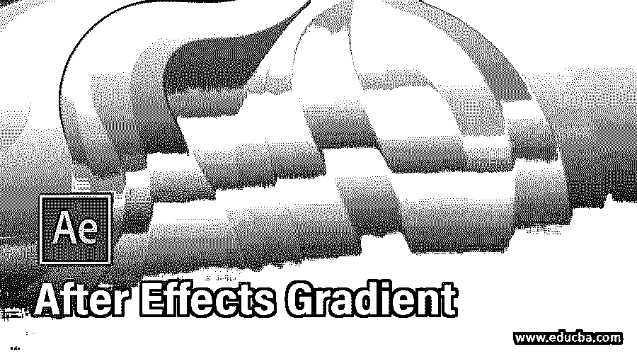

## 后效梯度介绍

后效中的渐变是一个超级平滑混合模式系统中不同颜色的组合。因此，您可以为您的项目创建一个非常有效的颜色组合动画，它将作为任何特定工作的背景。为了在这个软件中制作这种类型的渐变效果，我们必须对这个软件的一些参数进行管理，例如效果和预设，使用不同的工具，制作预合成和一些其他重要的操作术语，以便在其中获得这种效果。我们将在 after effects 中通过一个令人兴奋的渐变颜色的运动背景的例子，利用这个软件的一些特性来理解这个效果。所以让我们来看看吧。

### 如何在 after Effect 中使用渐变来制作运动背景？

我们可以按照一些简单的步骤，通过使用 after effect 的渐变功能来创建一个好的背景，但在开始之前，让我们看看这个软件的工作屏幕，以便我们可以很容易地理解我们在学习这个主题时将使用的不同术语。

<small>3D 动画、建模、仿真、游戏开发&其他</small>

在工作屏幕的顶部，有一个我们称之为菜单栏的栏，它有许多菜单；在这下面，我们有一个工具栏及其右侧的属性栏，在这个工具栏下面，我们有三个部分，在左侧我们有项目面板和效果控制面板，在中心我们有显示窗口，我们可以在其中看到我们当前的工作，在右侧我们有一些参数选项卡，如预览选项卡，对齐选项卡，效果和预设选项卡和其他一些。您可以根据自己的选择在工作屏幕的任何其他位置重新排列所有这些部分。

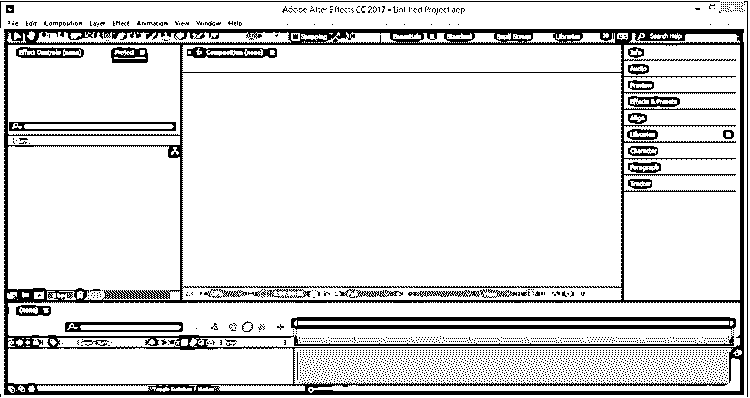

现在让我们来学习一篇新的作文。对于新组合，请转到菜单栏的组合菜单并单击它。然后，单击合成菜单下拉列表中的“新合成”选项，进行新合成。

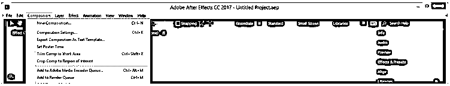

在“合成设置”框中为该合成进行所需的设置，然后点击该对话框的“确定”按钮。这将是我们的主要组成部分。

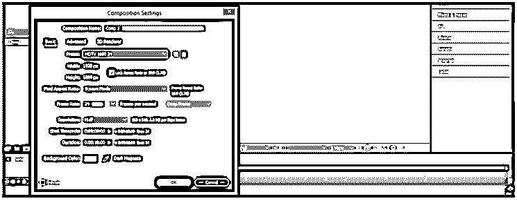

再次制作另一个构图，命名为渐变，然后点击这个构图框的 Ok 按钮。

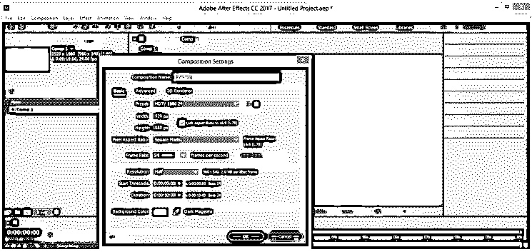

选择渐变组成，并前往该软件的工具栏。然后从它的椭圆工具点击它。

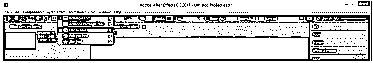

现在用这个工具画一个任意大小的圆。

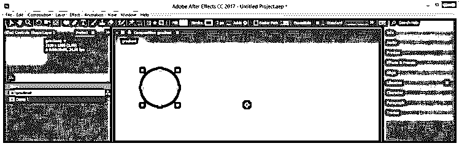

转到这个软件的参数部分的效果和预设选项，搜索填充效果，双击这个效果。

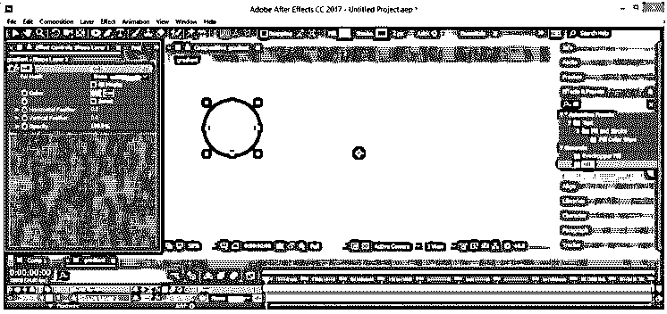

现在在效果和预设选项中搜索投影效果，双击它。

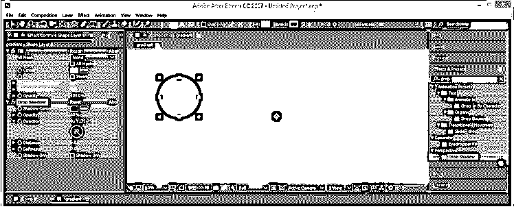

从“效果控制”选项卡中的填充参数更改填充的颜色。

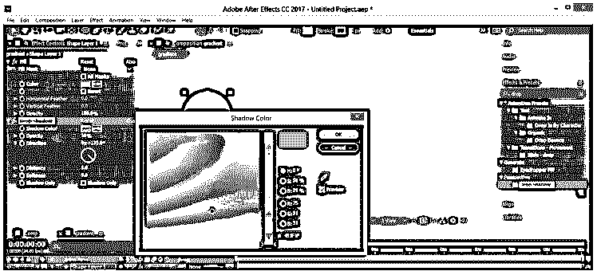

请改变阴影的颜色，并增加它与圆圈的距离。

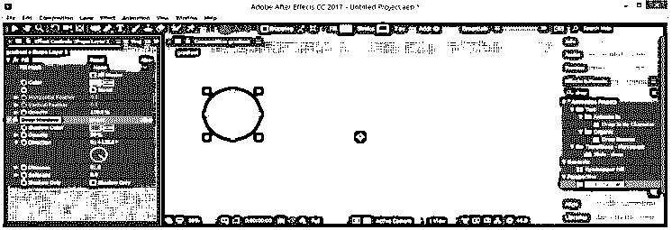

现在进入图层菜单，点击下拉列表中的新选项。然后，从“新建”下拉列表中选择“实体”选项。

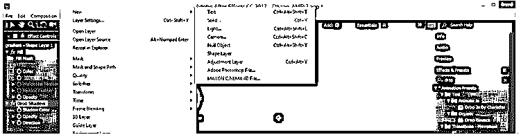

将其命名为背景，然后点击对话框中的确定按钮。

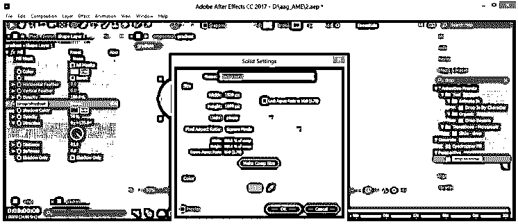

再次从效果和预设选项添加填充效果到这个固体层。

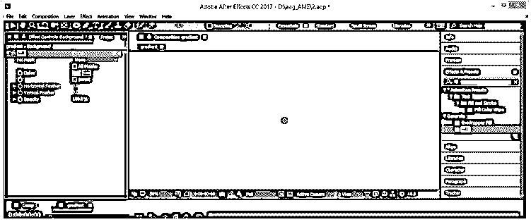

选择实心层的填充颜色。我会选择这种颜色。

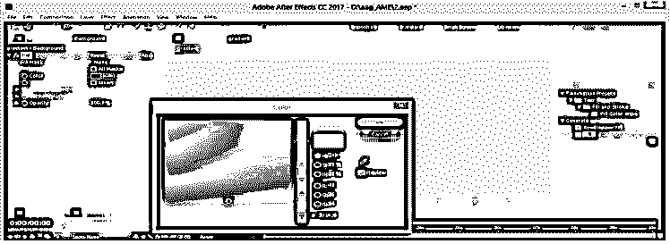

现在，通过按 Ctrl + D 按钮并改变新椭圆的颜色，创建一个椭圆图层的副本。

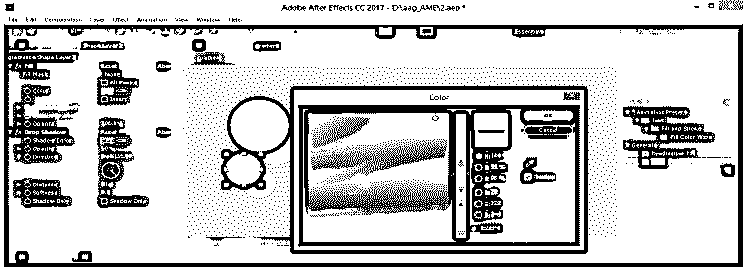

像这样用不同的颜色和大小复制这个图层。

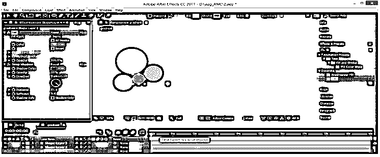

在 Comp 1 中放置渐变构图，这是我们的主要构图。

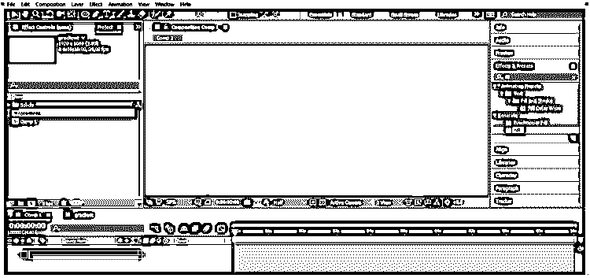

通过按键盘上的 Ctrl + X 键从渐变构图中剪切背景层。

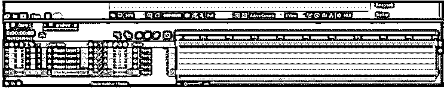

并将其粘贴到主成分中。

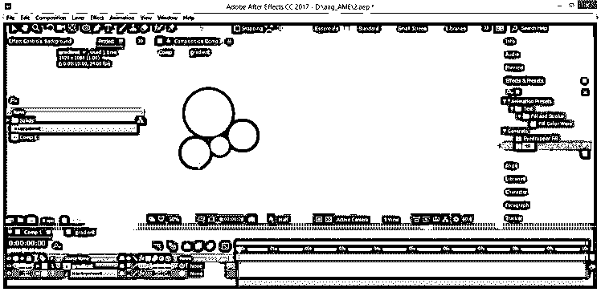

现在选择渐变层，在效果和预设选项中搜索湍流效果，双击它，你就会得到这种效果。

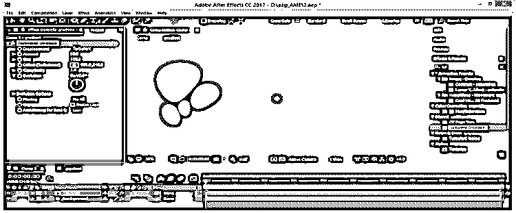

将金额设置为 20。

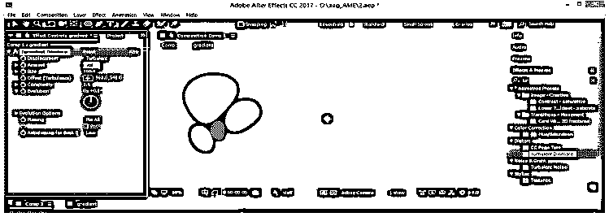

并且对于该效果中的平滑度，复杂度为 2。

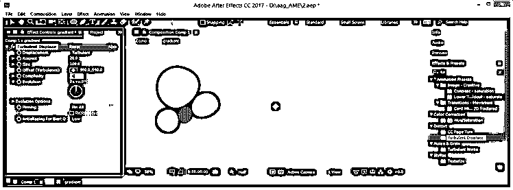

现在在效果和预设选项中搜索方向模糊效果，双击它。

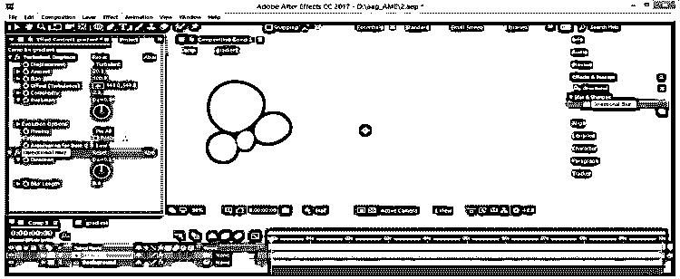

将模糊长度设置为 600。

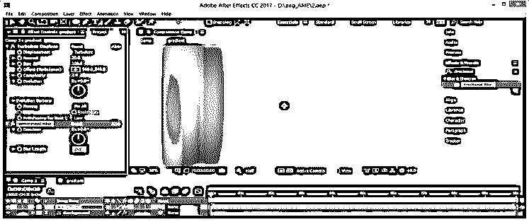

现在在效果和预设选项中搜索旋转效果并双击它。

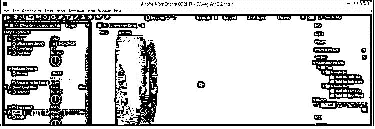

根据您的选择，从参数中更改旋转选项的角度。

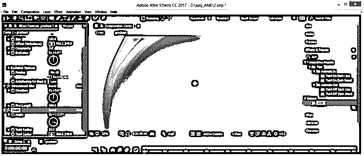

将旋转半径设定为 100。

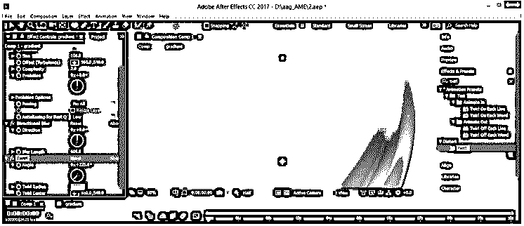

在效果和预设选项中搜索快速模糊效果并双击它。

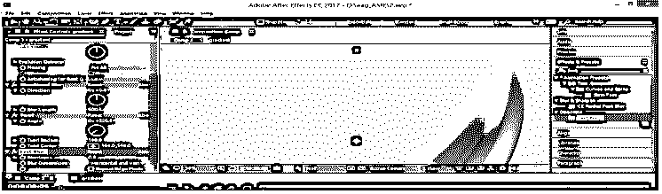

将模糊度设置为 10，以平滑所有颜色的混合。

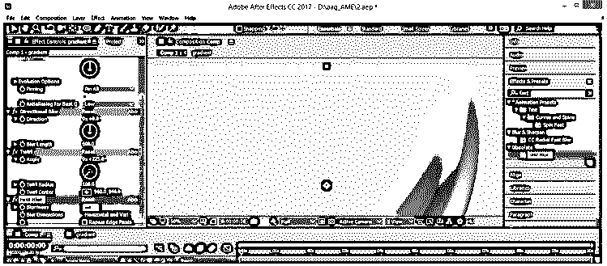

现在点击这个组合的锁定按钮来锁定它。

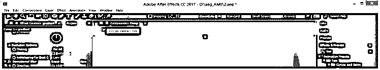

现在转到“视图”菜单，单击“新查看器”选项。

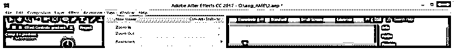

对于每个合成，您的合成窗口屏幕将像这样分成两个窗口。

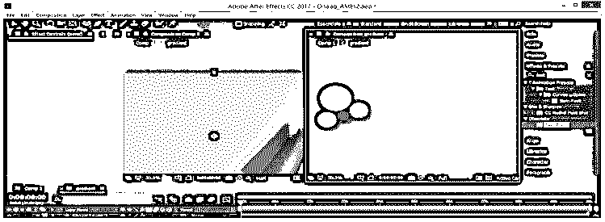

现在，通过按下键盘的 Ctrl + D 键复制这些圆，并将它们放置在不同的位置，你会看到更多的线条将添加到主构图中。

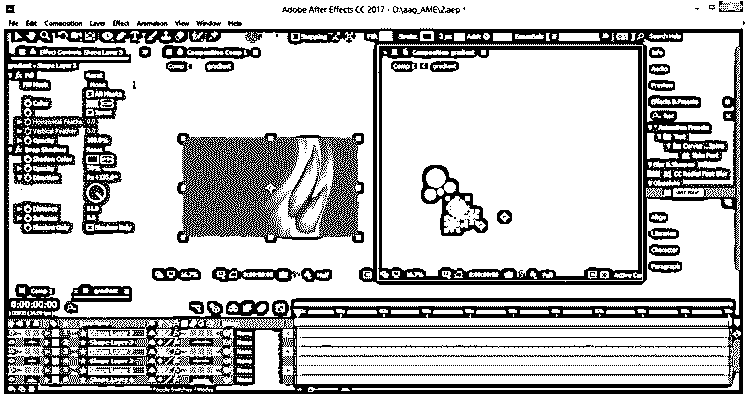

请一遍又一遍地做，然后根据你的情况展开所有的圆圈，以便在主构图中产生良好的旋转渐变效果。

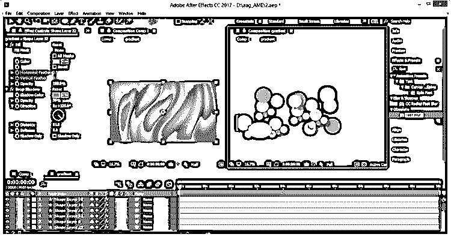

现在通过按 Ctrl + A 按钮选择形状的所有层，然后右键单击并选择预合成选项进行预合成。

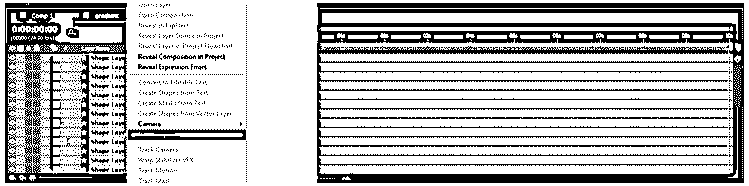

命名为渐变形状，然后点击确定按钮。

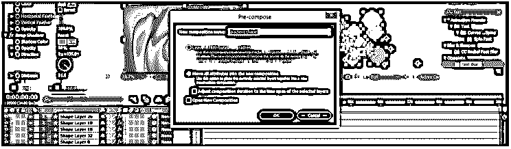

现在点击 P 按钮的位置属性的渐变形状层。我们会让它充满活力。点击这个属性的秒表图标，然后放置关键帧播放头为 10 秒，并像这样改变这一层的位置。

现在在效果和预设选项中搜索 CC 重复效果并双击它。

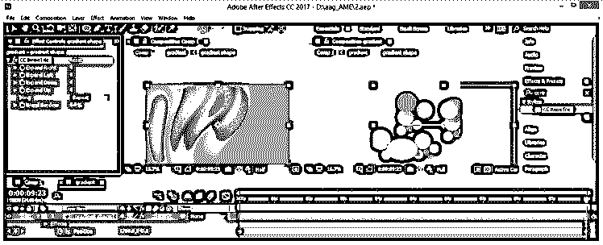

对于填充形状的左侧，区域设置“向左扩展”值为 800。

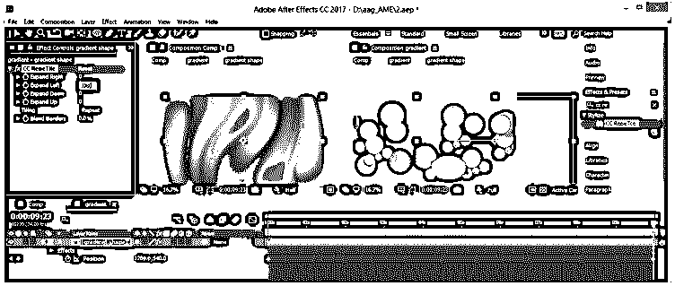

为所有形状的平滑连接设置平铺展开选项。

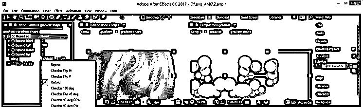

现在你可以播放动画了。

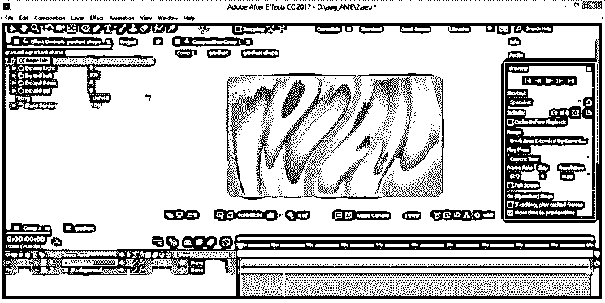

这样，你就可以在这个软件中使用渐变效果了。

### 结论–后效梯度

在这篇文章之后，你现在可以理解什么是渐变效果，以及你如何用你自己的想法处理它的参数来得到一个好的渐变效果。你可以通过练习来增加这方面的专业知识。

### 推荐文章

这是一个指南后的效果梯度。这里我们讨论如何在特效中使用渐变来制作运动背景。您也可以看看以下文章，了解更多信息–

1.  [特效预置后](https://www.educba.com/after-effects-presets/)
2.  [特效渲染后](https://www.educba.com/after-effects-render/)
3.  [后效表情](https://www.educba.com/after-effects-expressions/)
4.  [后效中的扭曲](https://www.educba.com/twixtor-in-after-effects/)

