# 特效表情列表

> 原文：<https://www.educba.com/after-effects-expressions-list/>

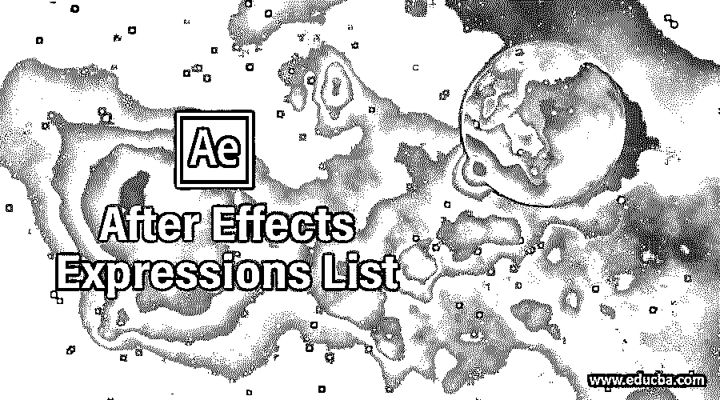

## 后效表达式列表介绍

表达式是编码的语言语法，通过它您可以激活对象的任何特定属性，而无需在该层的关键帧中应用太多的关键帧。在特效之后，我们有如此多的表达式，通过它们我们可以用不同的方式激活我们的对象，只需输入几行语法。你可以从一些免费的网站上找到这些特定表达的语法。所以今天，在这篇文章中，我们将讨论一些重要的表达，这些表达在我们制作动画后期效果时会对我们有所帮助。所以让我们向他们介绍一下。在这个主题中，我们将学习效果表达式列表。

### After 效果中的表达式列表

通过阅读本文，我们可以轻松地使用表达式来制作我们的对象的动画，并理解不同表达式的语法。因此，请继续阅读这篇文章，了解该软件的一些重要表达方式。但是在开始之前，我想我们应该看一下 After effects 的工作界面，以便更好地理解这个主题。

<small>3D 动画、建模、仿真、游戏开发&其他</small>

在顶部，我们有一个功能区，我们称之为菜单栏。在这个功能区下面，我们有一个工具栏，里面有很多工具可以让我们的工作变得简单。在这个工具栏下面，我们有三个部分，例如在左侧，我们有项目面板和效果控制面板，在中心，我们有合成窗口，在其中我们可以看到我们当前的；在右侧，我们有一些参数标签，如预览标签，对齐标签，效果和预设标签和其他一些。

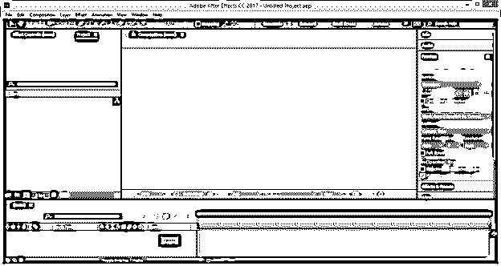

现在让我们做一个新的作文来学习不同的表达方式。对于新组合，请转到菜单栏的组合菜单，点击下拉列表中的“新组合”，或者您可以按键盘上的 Ctrl + N 按钮来创建新组合。

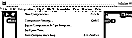

将会打开一个合成设置框。在构图框中根据您的需要进行设置，然后点击该框中的确定按钮。

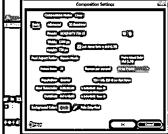

现在从这个软件的工具面板中选择矩形工具。

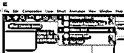

制作这种类型的两个矩形。

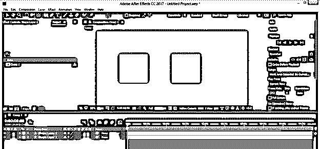

现在让我们开始逐一讨论这个软件的不同表达方式。第一个是价值表达。

#### 价值表现

使用该表达式，可以使对象的任何属性值具有动画效果。因此，让我们学习如何做到这一点。通过点击选择第一层，并按下旋转属性的 R 按钮，然后按住键盘的 Alt 键点击该属性的秒表图标。表达式框将在关键帧部分打开。

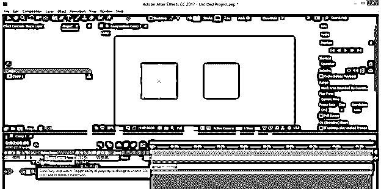

现在，在表达式框中输入值*2。

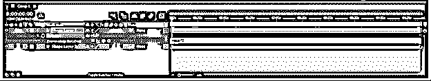

现在输入一个旋转值，如 30。

现在当你输入时，它会变成你给定值的两倍，因为你使用了值表达式。这样，你可以使用值表达式来为你的对象制作动画。

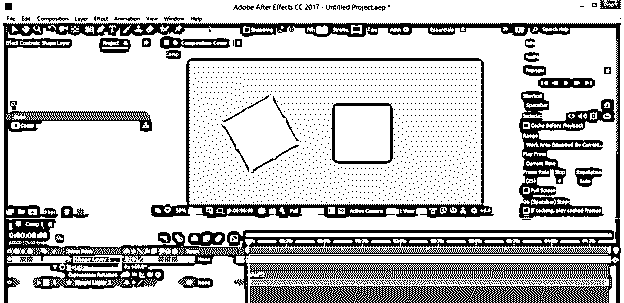

现在让我们讨论第二个问题，即层索引表达式。

#### 图层索引

通过该表达式，可以用对象不同层的值来激活对象的任何特定值。让我们来看看这个表达式，我们如何用它来做这件事。

现在，通过按住键盘的 shift 键选择两个层，并按下 P 按钮选择它们的位置属性，然后通过按住键盘的 Alt 键单击第一个层的秒表图标，以显示时间线帧部分的表达式框。

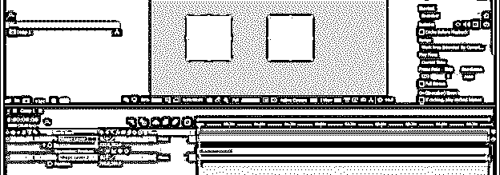

现在，在表达式类型框中键入[值[0]，值[1]]。

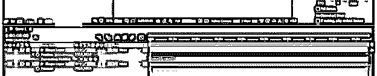

现在用 x 替换值[0]。

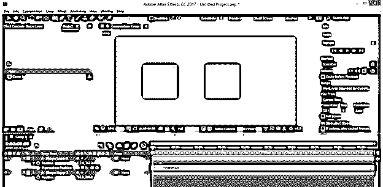

你会注意到这个语法中有一个错误，因为你没有指定 x 的值。

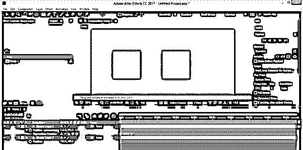

所以让我们来定义一下。首先，在“表达式”框中键入 X =,然后将该层的拾取擦拭拖动到下一层的 X 值，以指定 X 值。

一旦你连接上，你会发现一个语法会像这样自动出现。

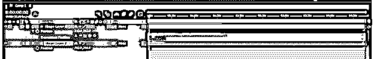

添加分号(；)在语法末尾。现在，第一层对象将位于第二层对象的 x 位置，因为我们将它与第二层对象的 x 位置值相连接。

现在，在语法中添加+ 250，使第一个对象与第二个对象偏移 250 的距离。

现在，您可以在语法的“形状层 2”处使用层索引表达式。

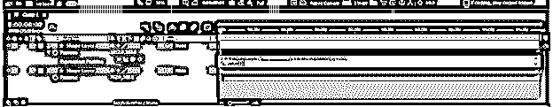

这些是索引号。

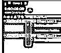

因此，在使用此表达式时，请键入 index +1 来代替“Shape layer 2 ”,因为我们希望将第一层(其索引号为 1)与第二层(其索引号为 2)连接起来。

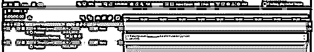

现在选择第一层，并制作它的副本，由于索引层表达式，所有副本将以相同的距离偏移。

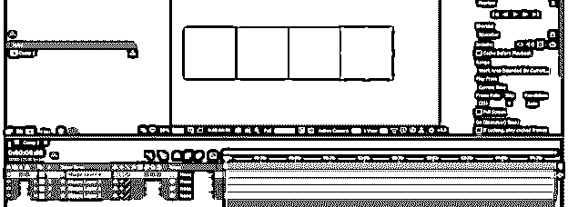

现在让我们讨论另一种表达方式，即时间表达方式。对于做任何动画都是非常有用的表达。

#### 时间表达式

通过这个表达式，你可以动画显示一个特定对象的任何属性的时间，让我们知道如何做。

为此，从这个软件的工具面板中选择一个文本工具，输入你想要的文本。例如，我将键入 EDUCBA，并通过按住表达式框键盘的 Alt 键单击该层的源文本属性的秒表图标。

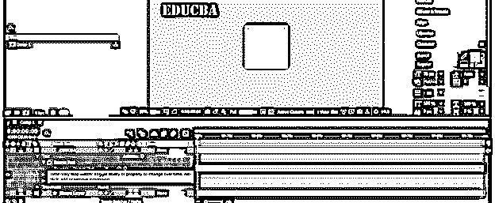

在表达式框中输入 Time*30。

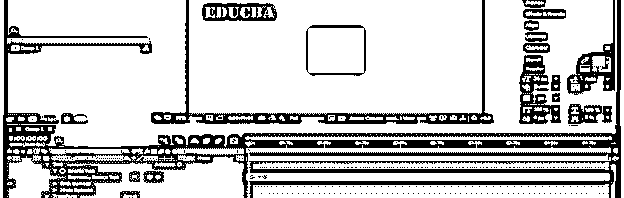

当你从“预览”标签的“播放”按钮播放这个动画时，你会发现数字计数代替了这样的文本。

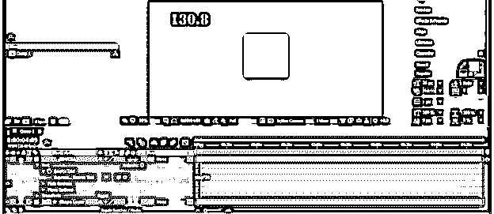

现在选择形状层点击它，并按下键盘上的 R 按钮为这一层的旋转属性。现在，按住键盘上的 Alt 键，单击该属性的秒表图标，以显示一个表达式框。

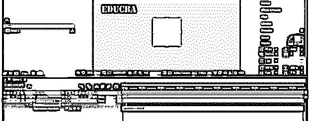

在这里输入时间*30。

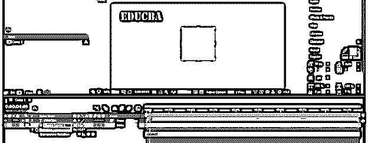

当你播放你的对象的动画时，你的对象将像这样在它的中心点旋转。

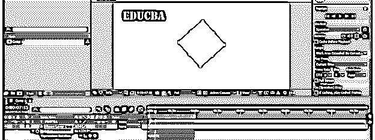

这些是这个软件的一些重要的表达，你现在可以很容易地处理。

### 结论–后效表达式列表

在这篇文章之后，你可以理解 After Effects 软件中有哪些表达式，以及如何处理它们的语法来用它们来制作你的对象的动画。你可以通过练习这些表达来学习更多的表达，并毫无问题地将它们用于你的项目工作中。

### 推荐文章

这是一个后效表达式列表的指南。这里我们讨论 After Effect 中的表达式列表，以及如何处理它们的语法来制作对象动画。您也可以看看以下文章，了解更多信息–

1.  [特效跟踪后](https://www.educba.com/after-effects-tracking/)
2.  [丛后效应](https://www.educba.com/plexus-after-effects/)
3.  [Duik After Effects](https://www.educba.com/duik-after-effects/)
4.  [特效渲染后](https://www.educba.com/after-effects-render/)

