# 后效绿屏

> 原文：<https://www.educba.com/after-effects-green-screen/>

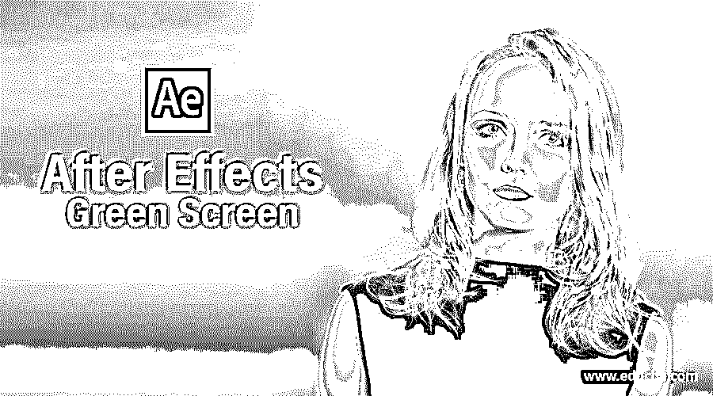

## 后效绿屏简介

Adobe After Effects 是一款动画和视频编辑软件。本文将学习如何在镜头中使用绿屏，通过在 after effects 中移除它来提供自定义背景。我们还将看到使用插件来做同样的事情。

### 到 After Effects 绿屏的步骤

不同的步骤如下所述:

<small>3D 动画、建模、仿真、游戏开发&其他</small>

#### 第一步

在开始更好地理解之前，让我们先熟悉一下界面。顶部是菜单栏，如文件、编辑等。，每个都有自己的子菜单。接下来，就在它的下面，我们有一个工具面板和它们的属性。在左侧，项目面板由项目文件和效果控制面板组成，显示应用于特定层的效果。然后是显示动画或视频预览的合成面板。在右上方，我们有各种布局预设，会根据作品类型进行排列。我们甚至可以创建自己的自定义布局。右边是用于编辑视频的各个部分。最后，在底部，有层和时间轴面板用于添加媒体和添加动画关键帧。

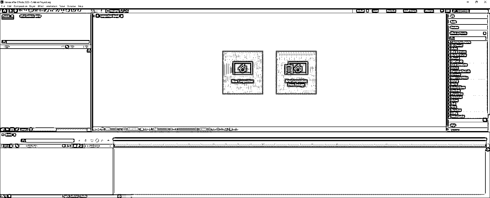

#### 第二步

双击项目面板，导入绿色背景的素材。

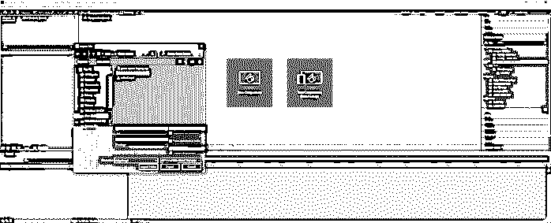

#### 第三步

在“图层”面板中拖动素材以创建构图，然后转到“窗口”->“效果和预设”

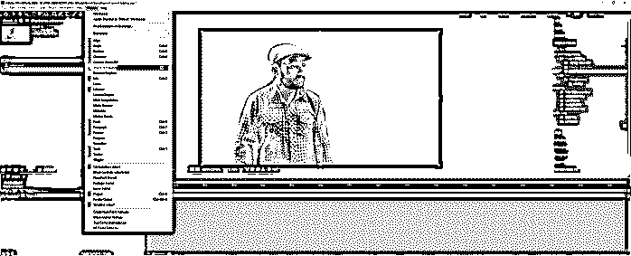

#### 第四步

在效果和预设面板中搜索 key，你会发现 Keylight + Key Cleaner +高级溢出抑制器。选择并将其拖到素材上。这将同时给我们三种不同的效果。

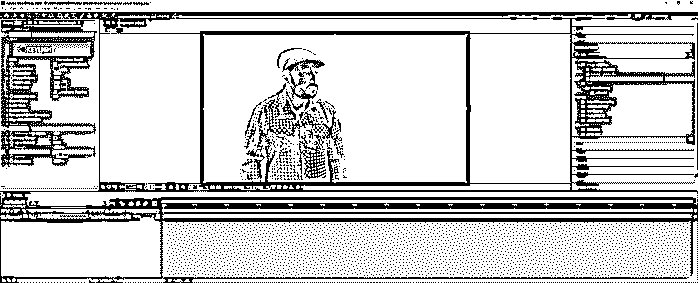

#### 第五步

我们可以看到在 Keylight 效果的屏幕颜色属性附近，有一个颜色选择器，所以用它来选择绿色。按 Ctrl 键可以对更大的区域进行采样，这也会增加拾色器的大小。

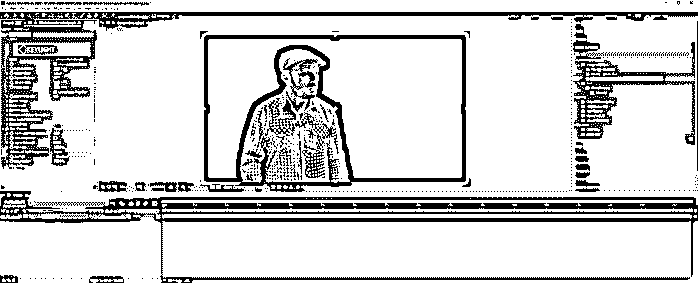

#### 第六步

您可以切换透明网格来查看透明区域。

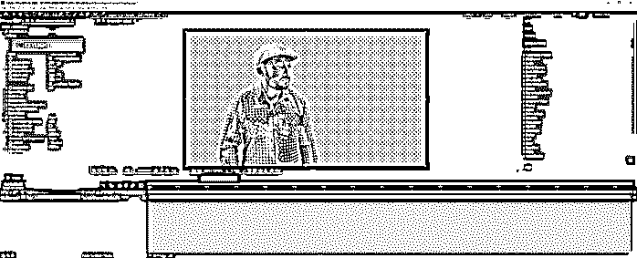

#### 第七步

当我们放大时，我们仍然可以在边缘看到绿色。所以，我们必须调整键光效果的参数。

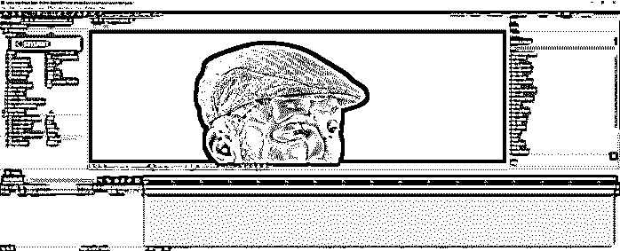

#### 第八步

首先，我们将视图设置为屏幕蒙版。这将清楚地显示隐藏在黑色中而在白色中可见的区域。

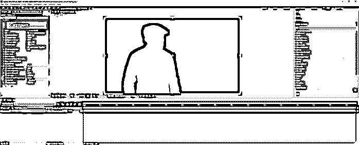

#### 第九步

在屏幕蒙版下拉菜单中,“裁剪黑色”和“裁剪白色”可以以这样一种方式调整它们，即深色部分完全是黑色，这将移除灰色区域，白色部分完全是白色，这也将移除灰色区域。

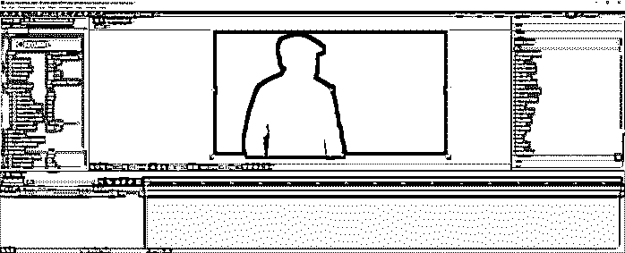

#### 步骤 10

将视图改回中间结果。不要将视图设置为最终结果，因为您可能会看到伪像，因为该视图不能很好地与 Key Cleaner 一起工作。

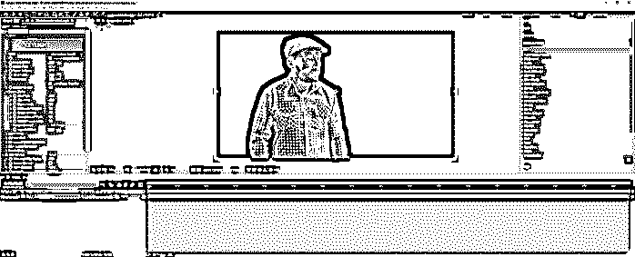

#### 步骤 11

在关键清洁器效果中，我们可以将额外的边缘半径减少到 5.0，以使主体更清晰一些。

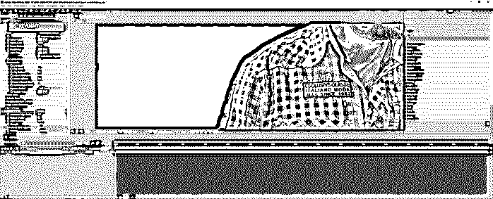

#### 第 12 步

然后检查以减少颤动，确保边缘或主体上没有视觉噪声。

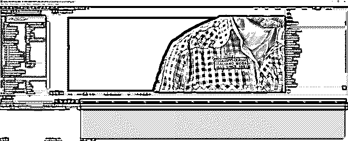

#### 步骤 13

由于颜色溢出，我们得到了许多绿色条纹，让我们打开高级溢出抑制器，它将消除它。这个效果会自动检测你用的是绿屏还是蓝屏。

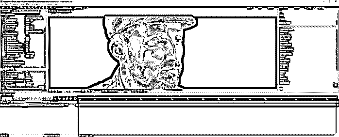

#### 第 14 步

如果这种效果给你一些不理想的结果，你可以改变方法为超，给你一些额外的设置来选择关键颜色和另一个颜色调整。

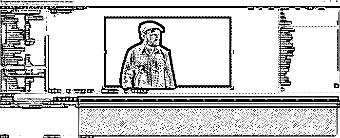

#### 第 15 步

如果你想让你的边缘更平滑一点，你可以使用屏幕缩小/放大选项和屏幕柔和度选项。

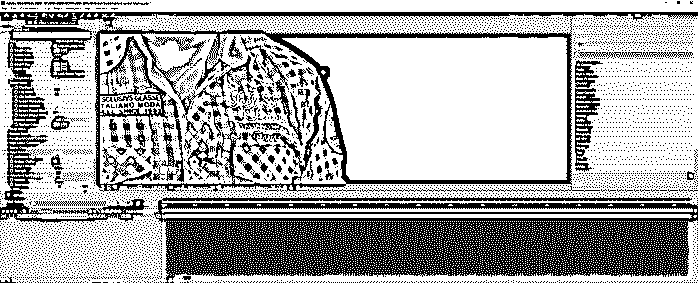

#### 步骤 16

现在让我们添加一个背景，用于导入图像并将其添加到底部的图层面板中。

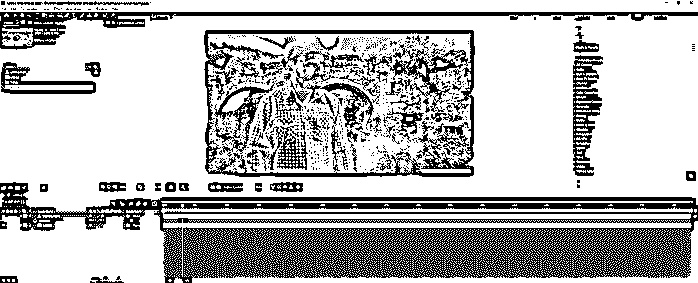

#### 第 17 步

然后，我们将创建一个新的调整层，右键单击图层面板，然后添加一个颜色校正效果，Lumetri 颜色。

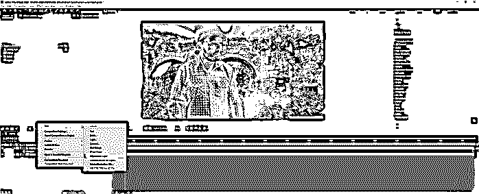

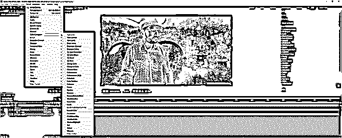

#### 步骤 18

接下来，我们做一些基本的色彩校正，比如调整白平衡来设置一天中的时间，同时调整温度和色调。最后，我们通过改变曝光、对比度、高光、阴影、白色和黑色来调整色调，使主体沉浸在环境中。

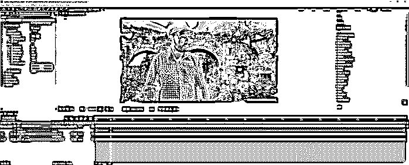

#### 步骤 19

我们已经在 after effects 中看到了内置方法；接下来，我们将使用 RG VFX 的插件，它将帮助我们进行抠像，为此，我们将创建一个新项目，导入我们的镜头，并用它创建一个构图。

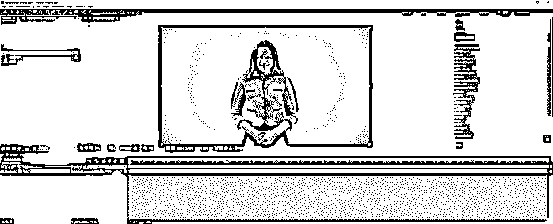

#### 第 20 步

要应用这个插件，请进入效果-> RG VFx -> Primatte Keyer 6

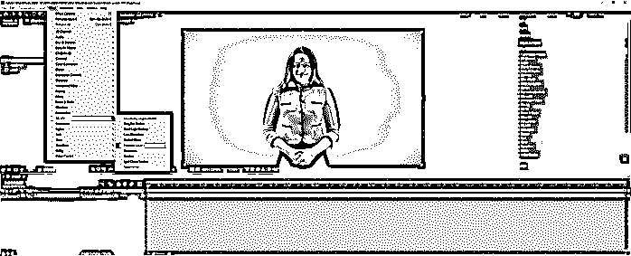

#### 步骤 21

在定义的键部分，首先，我们必须选择我们的样本样式。第一种是点样本样式，另一种是矩形样本样式。点样式类似于我们使用滴管的 Keylight 效果，但是您也可以拖动像素来创建轨迹并获得更好的样本区域。在矩形样式中，我们拖动一个盒子并对多个像素进行采样。让我们在选择背景工具时使用矩形样式。

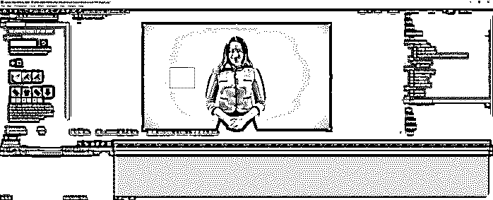

#### 第 22 步

改变视图为无光，现在使用一个干净的背景工具去除灰色区域。

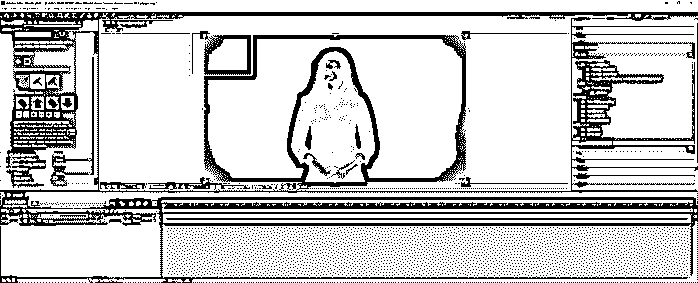

#### 步骤 23

然后使用一个干净的前景工具来消除白色的灰色。您可以在样本样式之间切换。

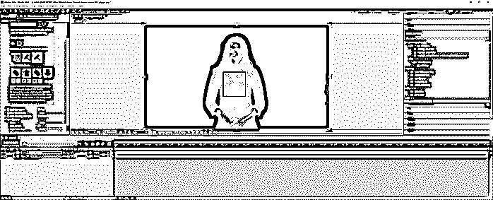

#### 第 24 步

另一个选择是检查核心遮罩，它会用白色填充主体内部的整个区域。

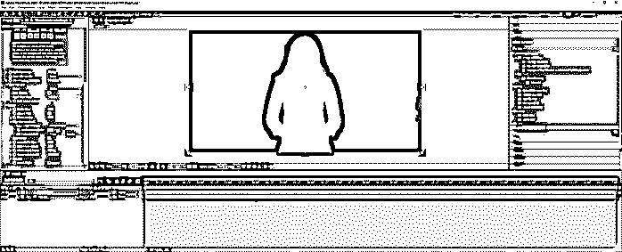

#### 第 25 步

接下来，将视图更改为 comp，我们还导入了一个背景。

#### 第 26 步

现在，我们将看到一些绿色条纹，所以要删除它们，启用溢出杀手。此外，使用收缩遮罩和遮罩模糊来平滑边缘。

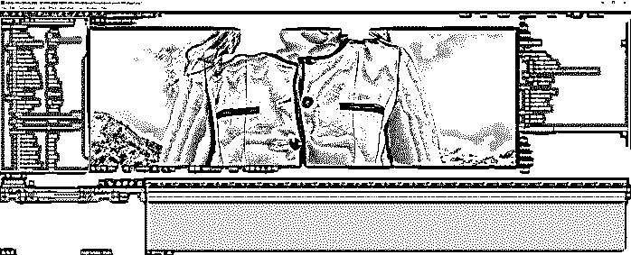

#### 第 27 步

我们可以使用 Deartifact 模式来减少图像边缘周围的区块，压缩算法通常会导致这种情况。根据拍摄素材的类型将其设置为 DV 或压缩。

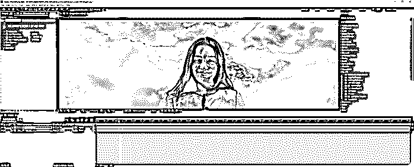

### 结论

在这篇文章中，我们不仅学习了如何在 After Effects 中使用默认的 keylight 效果，还学习了如何使用 RG VFx 插件，并使用 Primatte Keyer 6 效果来实现相同的效果，具有更多的功能和更大的灵活性来处理绿屏。

### 推荐文章

这是一个指南后，效果绿屏。这里我们讨论如何在 After Effects 中使用默认的 keylight 效果、RG VFx 插件和 Primatte Keyer 6 效果。您也可以看看以下文章，了解更多信息–

1.  [后效复读机](https://www.educba.com/after-effects-repeater/)
2.  [在特效之后抽动](https://www.educba.com/twitch-in-after-effects/)
3.  [Duik After Effects](https://www.educba.com/duik-after-effects/)
4.  [后效表情](https://www.educba.com/after-effects-expressions/)

