# 后效循环合成

> 原文：<https://www.educba.com/after-effects-loop-composition/>

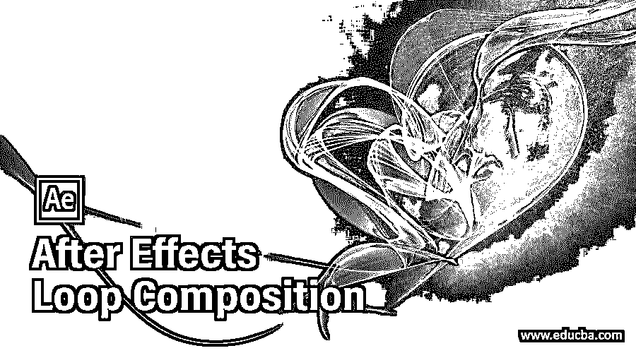

## 后效循环合成介绍

Adobe After Effects 是一个动画和视频编辑软件，在本文中，我们将学习如何循环合成。为此，首先，我们将创建一个简单的时钟动画，然后我们将在另一个 comp 中导入它，我们将看到如何循环它而不需要多次复制粘贴。

### 后效循环合成的步骤

不同的步骤如下所述:

<small>3D 动画、建模、仿真、游戏开发&其他</small>

#### 第一步

在开始更好地理解之前，让我们先熟悉一下界面。顶部是菜单栏，如文件、编辑等。，每个都有自己的子菜单。接下来，就在它的下面，我们有一个工具面板和它们的属性。在左侧，项目面板由项目文件和效果控制面板组成，显示应用于特定层的效果。然后是显示动画或视频预览的合成面板。在右上方，我们有各种布局预设，会根据作品类型进行排列。我们甚至可以创建自己的自定义布局。右边是用于编辑视频的各个部分。最后，在底部，有层和时间轴面板用于添加媒体和添加动画关键帧。

#### 第二步

右键单击项目面板创建一个新的组成命名为时钟，并设置持续时间为 5 秒，背景颜色为黑色。

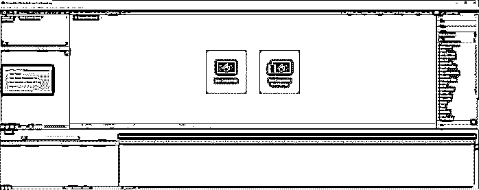

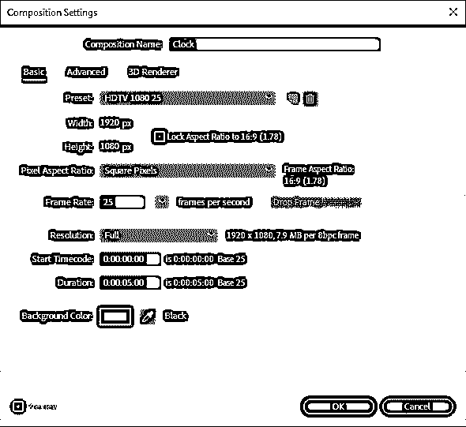

#### 第三步

从图层菜单创建一个新的实体或按 Ctrl + Y

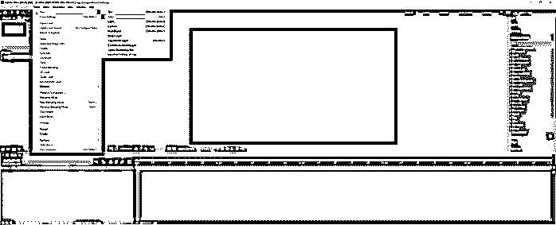

#### 第四步

命名为背景，并设置颜色浅粉红色

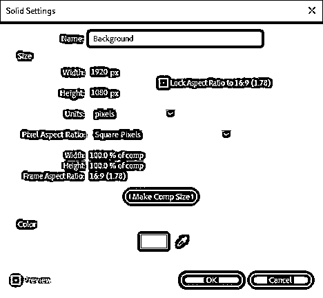

#### 第五步

选择椭圆工具或按 Q 键并按住 shift 键拖动以创建一个圆形图层，它是时钟的表面

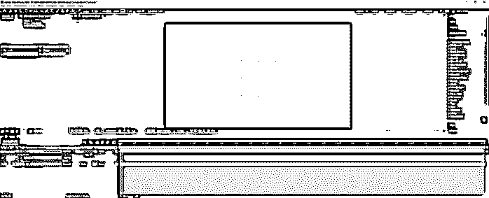

#### 第六步

然后使用钢笔工具或按 G，使时钟的分针。如果您已经选择了前一个形状层，线条将被添加到内容中，这是我们不想要的。

#### 第七步

因此，撤消它，不要选择任何其他东西，但只有钢笔工具，并创建一个新的形状点击一次，按住 shift 键，并点击结束，这将使一条直线。

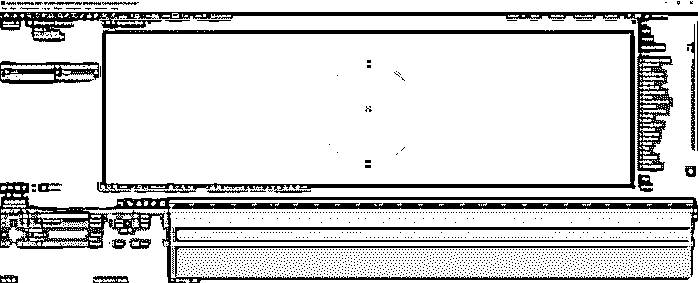

#### 第八步

同样，让时针。

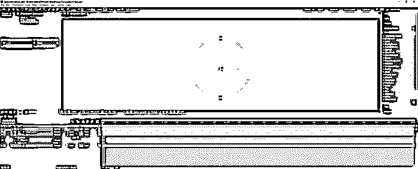

#### 第九步

相应地重命名图层，对于内容部分中的面部图层，我们将添加修剪路径来激活该线条图层。

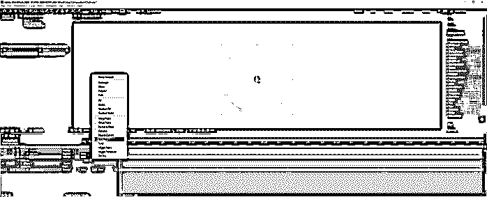

#### 步骤 10

通过在开始时点击秒表图标来设置关键帧，并将其设置为 100%，这意味着它是隐藏的。

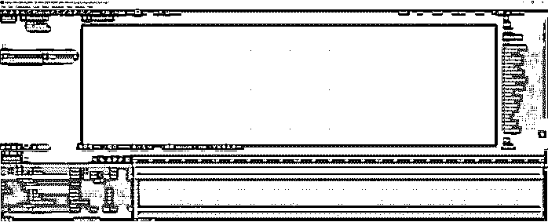

#### 步骤 11

然后在一些帧之后，将开始设置为 0%，这将自动添加一个关键帧。

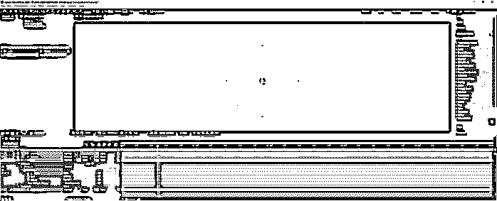

#### 第 12 步

在图表中，我们可以看到运动是线性的，这不是很令人满意。

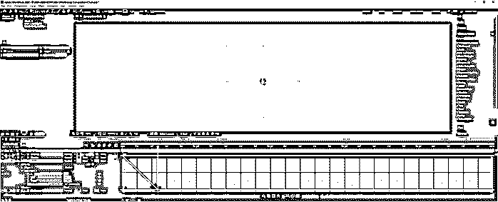

#### 步骤 13

因此，我们将通过调整关键帧速度来应用一些缓解，我们将影响设置为 75%。

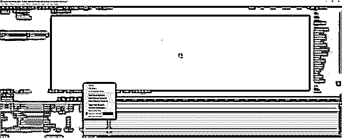

#### 第 14 步

现在我们可以看到，动画的图形是一个很好的 S 曲线。

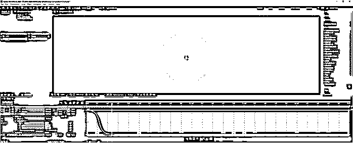

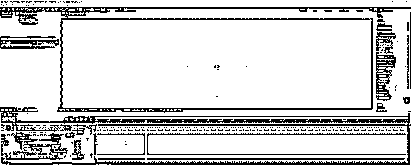

#### 第 15 步

类似地，我们向分钟添加修剪路径，并设置开始关键帧。

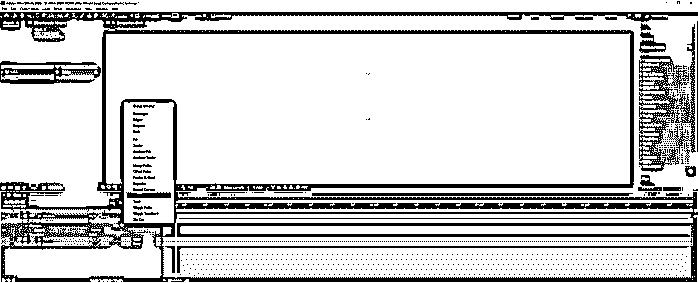

#### 步骤 16

调整动画，使其在面层之后开始。

#### 第 17 步

添加关键帧速度，并将影响设置为 75%

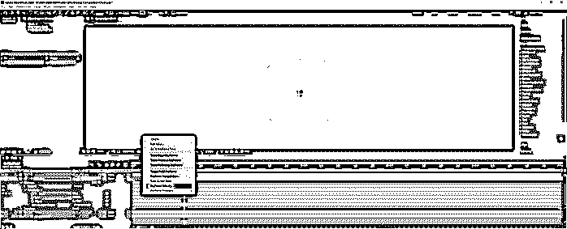

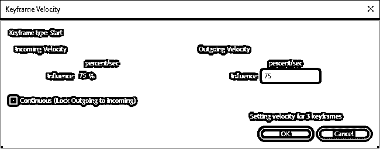

#### 步骤 18

锁定背景层，选择所有其他层，然后按 U 键，这将仅显示应用了关键帧的属性。

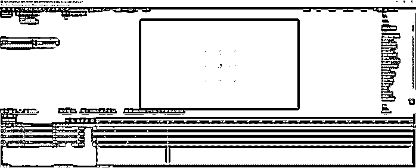

#### 步骤 19

在这里，我们可以调整时间，我们可以看到时针正从右侧移动到另一侧，这将动画从开始位置移除，并添加到结束属性。

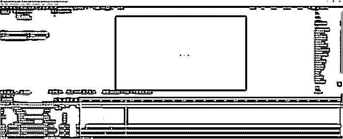

#### 第 20 步

现在我们的动画完成了，我们将把这个动画导入到另一个合成中并循环它。为此，我们创建了一个我们想要导入的 3 层的预构图。

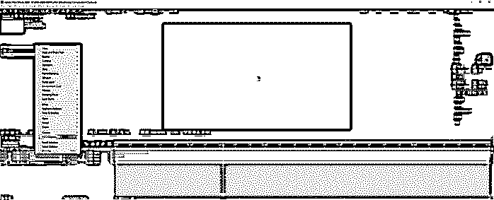

#### 步骤 21

将此预排版命名为“挂钟”，保持设置不变，然后单击“确定”。

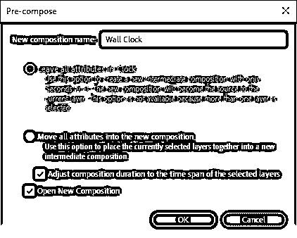

#### 第 22 步

将工作区域减少到 1 秒，并将伴奏修剪到工作区域，对挂钟图层也进行类似的操作

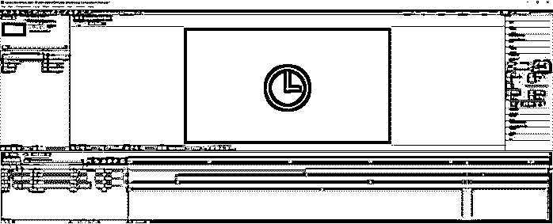

#### 步骤 23

这是一个组合，其中文本从左边开始动画，百分比发生变化，在这个组合中，我们需要添加我们的时钟，并无限循环，或者直到这个组合的大小。

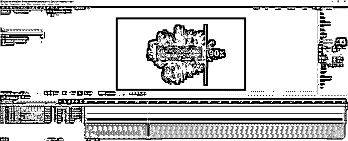

#### 第 24 步

在项目面板中双击以导入 clock comp，在其中，我们还会找到我们的挂钟 pre-comp。拖动“层”面板顶部的挂钟。我们找不到时钟，因为持续时间小于此 comp。

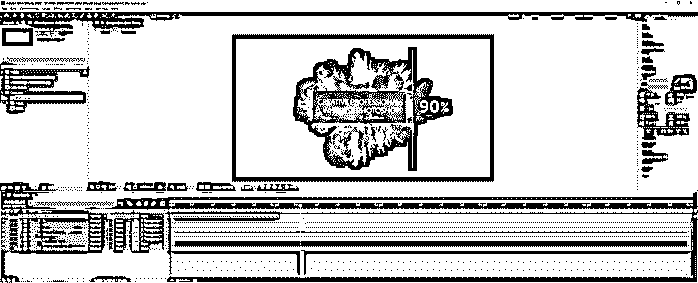

#### 第 25 步

把播放头带到挂钟的范围内，现在就可以看到了。可以通过平移和缩放进行调整，如图所示。

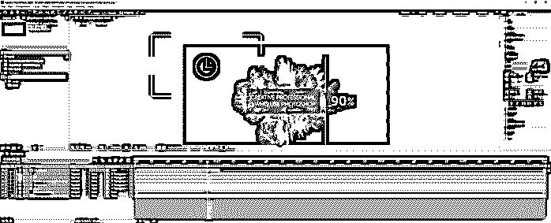

#### 第 26 步

要循环播放该动画，我们将通过右键单击该层或按 Ctrl + Alt + T 来启用时间重新映射

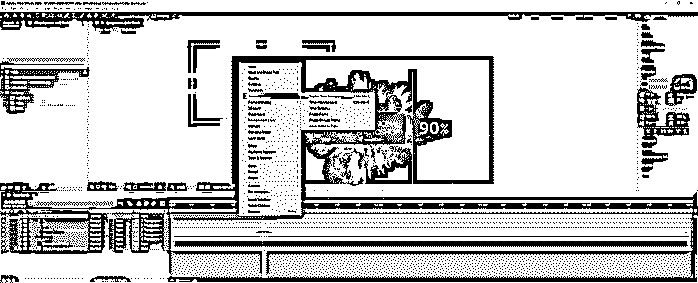

#### 第 27 步

时间重映射属性被添加到图层中，这将添加两个关键帧，一个在开始，一个在结束。现在按住 Alt 并单击时间重映射的秒表来添加一个表达式。

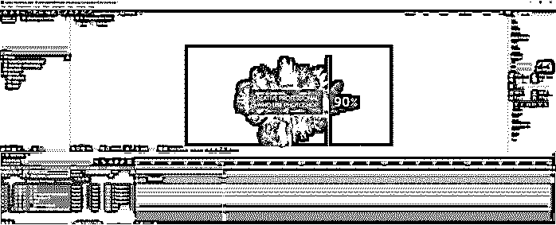

#### 步骤 28

单击右箭头并转到属性和循环(type = "cycle "，numKeyFrames = 0)

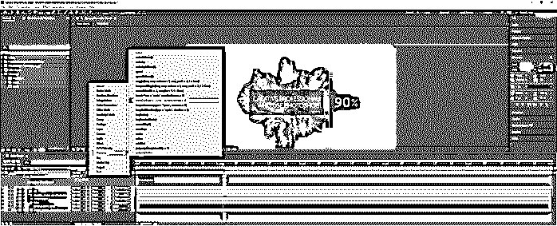

#### 步骤 29

由于添加了时间重映射，现在您可以拖动并扩展图层，直到时间线结束。表达式的名称是 loopOut，参数是使动画循环的循环类型，numKeyFrames 是 0，使动画不确定。

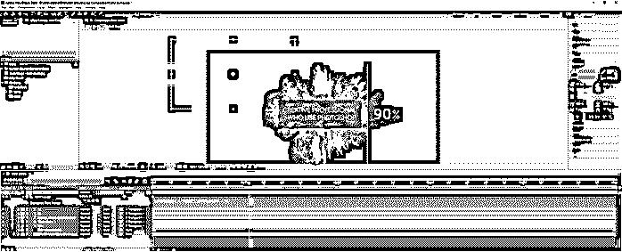

#### 步骤 30

现在播放动画，您可以看到动画一直播放到时间轴的末尾。您可以拖动时间重映射属性中的第二个关键帧来加快或减慢动画的速度。因此，我们已经完成了我们的循环组成后的影响。

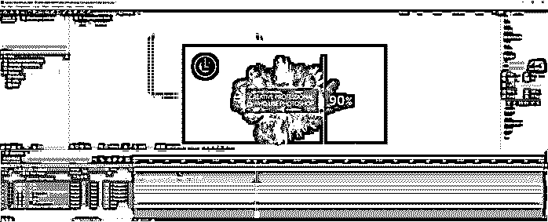

### 结论

在本文中，我们学习了如何使用 After Effects 中的修剪路径创建简单的动画，以及如何通过将合成导入到另一个合成中来循环合成，并使用时间重新映射技术和表达式来循环合成，而无需复制和粘贴。

### 推荐文章

这是一个关于后效循环合成的指南。在这里，我们讨论如何创建一个简单的动画使用修剪路径后，效果一步一步。您也可以看看以下文章，了解更多信息–

1.  [裁剪后的效果](https://www.educba.com/crop-in-after-effects/)
2.  [特效跟踪后](https://www.educba.com/after-effects-tracking/)
3.  [后效中的扭曲](https://www.educba.com/twixtor-in-after-effects/)
4.  [后效表情](https://www.educba.com/after-effects-expressions/)

