# 特效定格后

> 原文：<https://www.educba.com/after-effects-freeze-frame/>

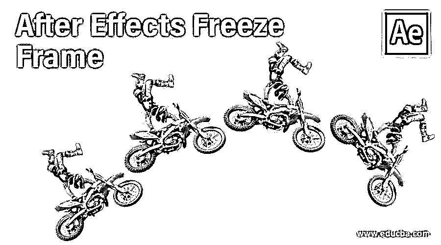

## 后效定格简介

Adobe After Effects 是一款动画和视频编辑软件，在本文中，我们将学习如何定格。出于这个目的，首先，我们将看看如何冻结视频镜头，然后应用这些技术来获得一种效果，这样我们就可以提前知道将要发生的动作，这将看起来非常惊人。

### 特效定格的步骤

不同的步骤如下所述:

<small>3D 动画、建模、仿真、游戏开发&其他</small>

#### 第一步

在开始更好地理解之前，让我们先熟悉一下界面。顶部是菜单栏，如文件、编辑等。，每个都有它的子菜单。接下来，就在它的下面，我们有一个工具面板和它们的属性。在左侧，项目面板由项目文件和效果控制面板组成，显示应用于特定层的效果。然后是显示动画或视频预览的合成面板。在右上方，我们有各种布局预设，会根据作品类型进行排列。我们甚至可以创建自己的自定义布局。右边是用于编辑视频的各个部分。最后，在底部，有层和时间轴面板用于添加媒体和添加动画关键帧。

#### 第二步

右键单击项目面板并导入文件。

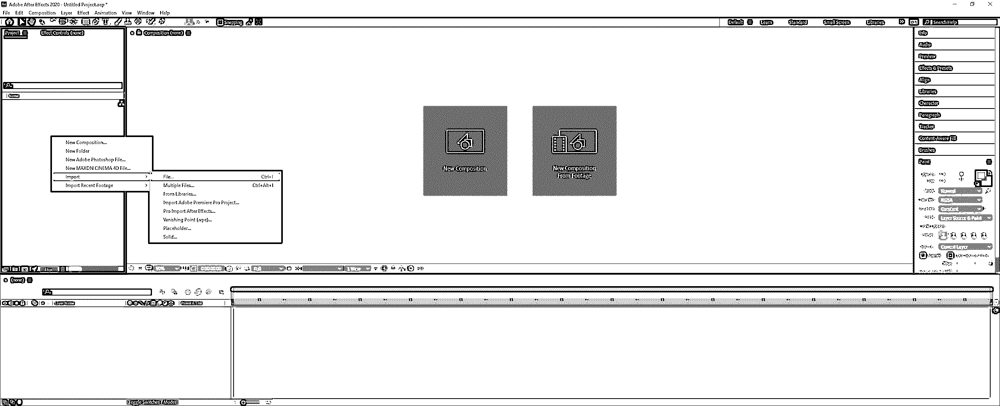

#### 第三步

右键单击视频并选择“从选区新建构图”，或者您可以将视频拖到“图层”面板中。

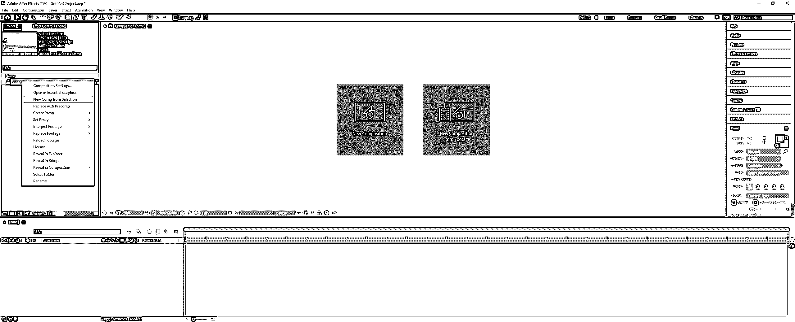

#### 第四步

首先，我们将确定视频中要冻结帧的区域，并添加标记以供参考。为此，去层->标记->添加标记或按星号*上的数字小键盘。在本视频中，我们将标记 2 个位置。确保在为这个效果选择视频之前，摄像机是稳定的，不会像现在这样移动，我们正在做 2D 定格效果。

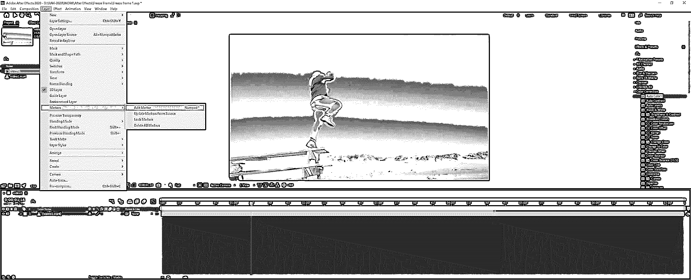

#### 第五步

我们已经添加了标记，在这些标记处，我们需要冻结帧，缩小工作区域，并将构图修剪到工作区域，或者按 Ctrl + Shift + X 移除多余的部分。

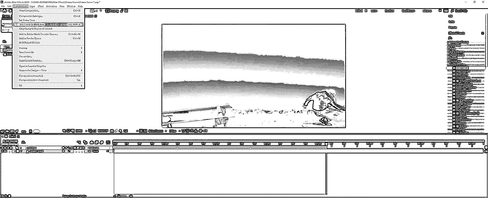

#### 第六步

由于我们已经放置了 2 个标记，我们必须复制视频两次。按 Ctrl + D 或者转到编辑->复制两次。将素材分别重命名为冻结帧 1 和冻结帧 2。

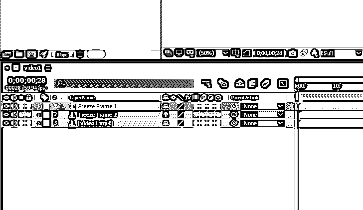

#### 第七步

转到第一层，这是冻结帧 1，并减少其大小，直到第一个标记。要缩小尺寸，请转到剪辑的末尾，当鼠标光标变成反方向的双水平箭头时，拖动剪辑。

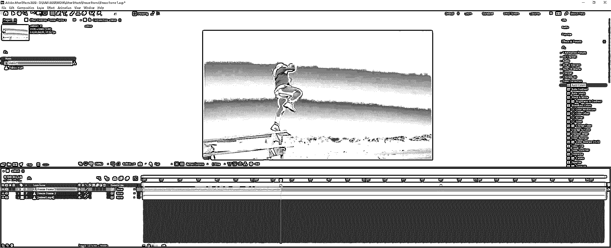

#### 第八步

类似地，转到第二层，这是冻结帧 2，并减少其大小到第二个标记。

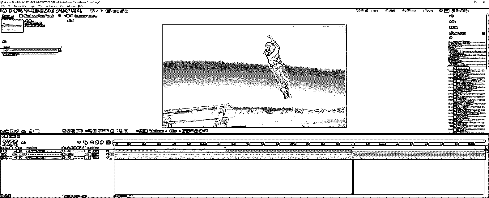

#### 第九步

将当前时间指示器放在第一个标记上。一个技巧是按住 shift 键，这将使指示器与标记和关键帧对齐。现在是时候冻结帧，所以右键单击冻结帧 1 层，并前往时间->冻结帧。

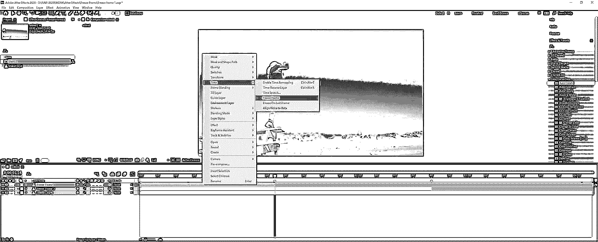

#### 步骤 10

冻结帧后，将向该图层添加时间重映射属性。此外，在左上角，我们可以看到镜头是 59.94 或 60 fps(每秒帧数)，当前时间重新映射设置为 1 秒和 14 帧，这是 0 的意义；00;01;14

#### 步骤 11

同样，将当前时间指示器放在第二个标记上，然后右键单击“冻结帧 2”图层，并转到“时间”->“冻结帧”。

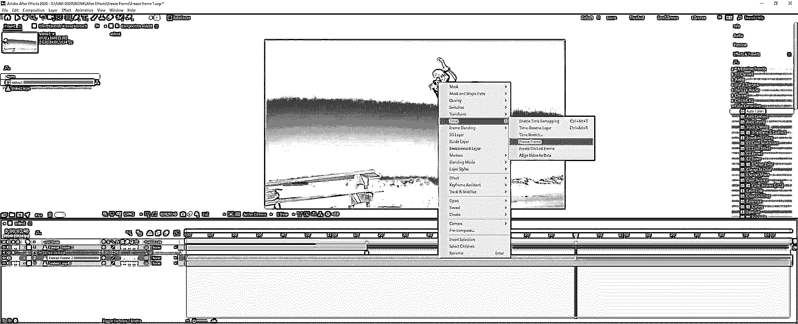

#### 第 12 步

为了避免混淆标记，我们可以通过右键单击来标记它们。此外，如果我们希望我们的时间线与标记对齐而不拖动它，则选择“转到标记时间”。

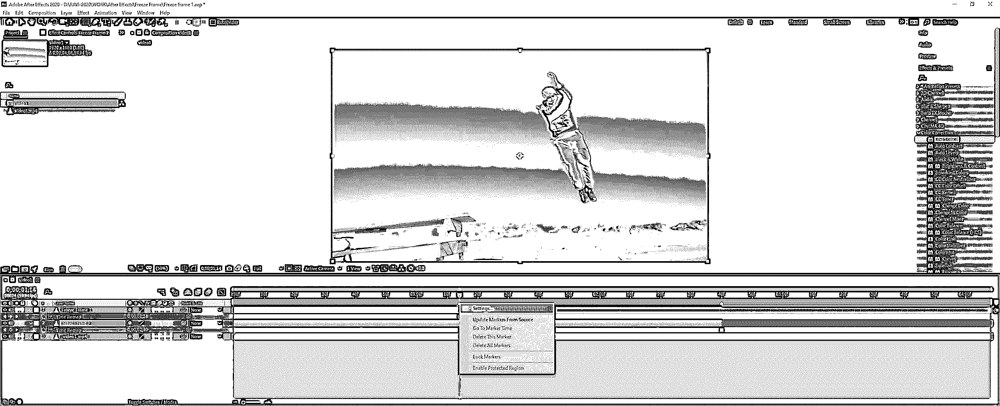

#### 步骤 13

在构图标记设置中，可以添加注释和标签，以区别于其他标记。

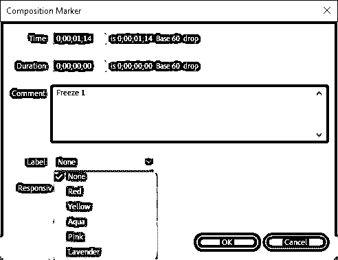

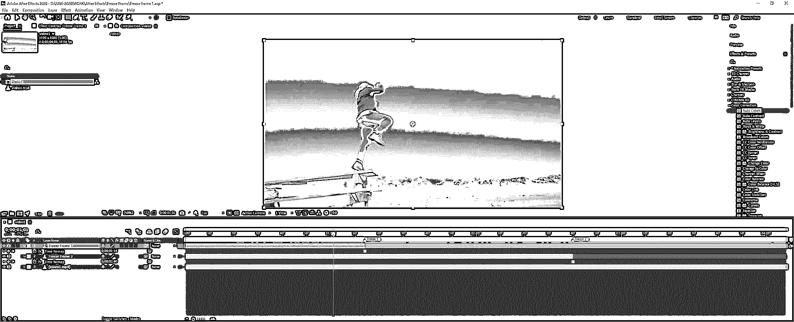

#### 第 14 步

这是定格效果中最重要的一步，我们将在定格图层上创建一个遮罩。因此，它将只显示那些我们想要冻结的部分。将时间指示器放在冻结 1 标记之前，并使用钢笔工具或按 g。双击合成面板中的合成名称，这将使合成面板全屏显示，并使创建遮罩变得更容易。在开始遮罩之前，请确保选择了冻结帧 1 层。然后创建这个人的轮廓，这个轮廓会一直显示到这个帧显示出来。

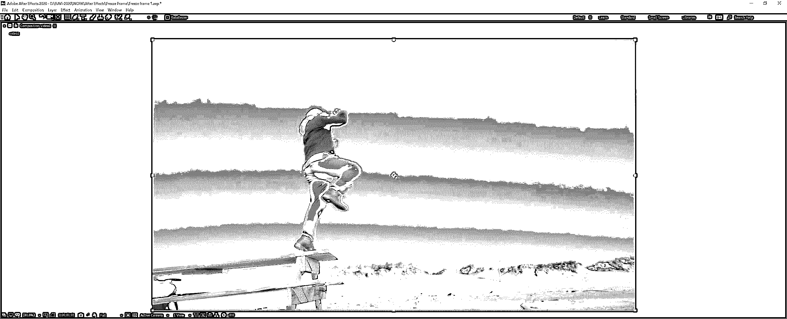

#### 第 15 步

我们已经完成了这个人的轮廓。在这一步，我们只需要这个人的轮廓。要获得准确的轮廓，您可以使用平移和缩放工具，同时通过按下空格键和鼠标滚轮保持钢笔工具。

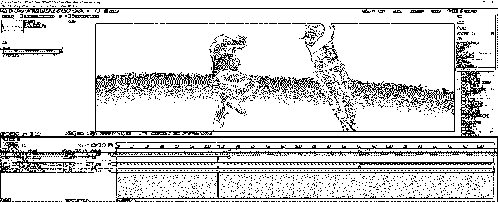

#### 步骤 16

接下来，将时间指示器放在“冻结 1”和“冻结 2”标记之间，确保选择了“冻结帧 2”层，然后像前面一样，使用钢笔工具创建轮廓。

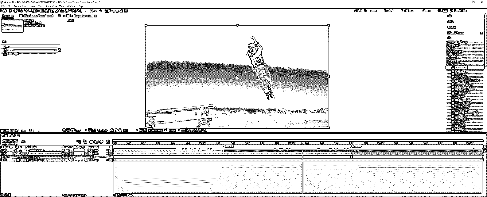

#### 第 17 步

如果你想改变蒙版轮廓的颜色，在图层中选择蒙版，点击蒙版 1 的色样，选择颜色。如果背景颜色与轮廓颜色混合，这很方便。

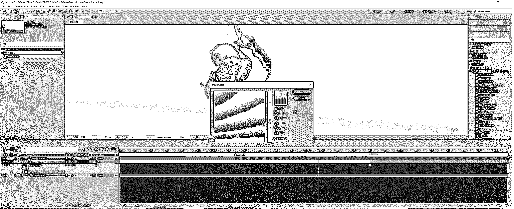

#### 步骤 18

你可以看到我们已经完成了这一层的轮廓。你可能已经注意到了，我们刚刚用钢笔工具画出了直边，而不是弯边。使用弯曲的边缘会更精确，但会花费更多的时间。因此，为了快速制作大纲并节省时间，我们将使用一个技巧。

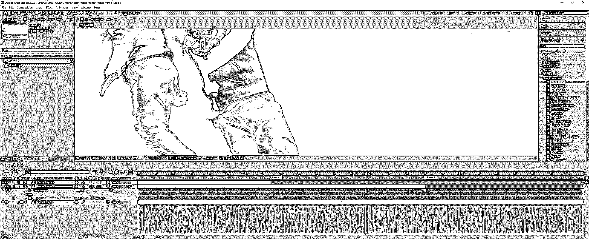

#### 步骤 19

在蒙版 1 下拉列表中，有一个蒙版羽化的属性，设置为 4.0，这将使硬边变得粗糙。所以两层都要做。

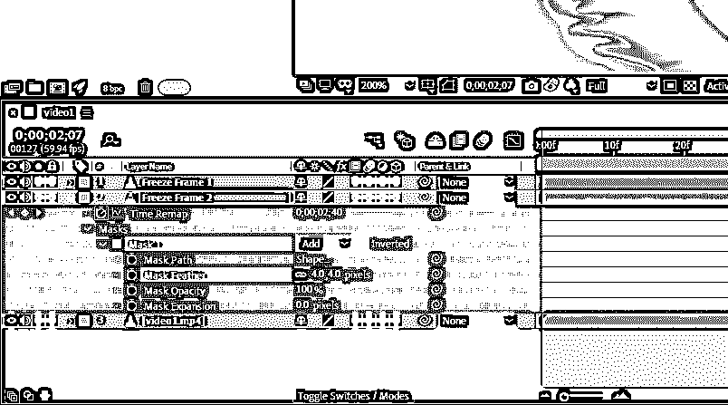

#### 第 20 步

所以，我们已经完成了我们的定格效果，你可以用空格来预览。

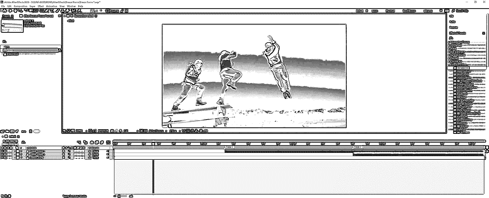

### 结论

在这篇文章中，我们已经学习了如何在 After Effects 中创建一个定格效果，并看到了钢笔工具的使用和遮罩的创建及其属性的使用。除此之外，我们还看到了如何使用记号笔来组织东西。

### 推荐文章

这是一个指南后，效果冻结帧。这里我们讨论如何在 After Effects 中创建一个定格效果以及步骤。您也可以看看以下文章，了解更多信息–

1.  [后效中的陷码](https://www.educba.com/trapcode-in-after-effects/)
2.  [特效跟踪后](https://www.educba.com/after-effects-tracking/)
3.  [Duik After Effects](https://www.educba.com/duik-after-effects/)
4.  [后效便携](https://www.educba.com/after-effects-portable/)

