# 效果移动锚点后

> 原文：<https://www.educba.com/after-effects-move-anchor-point/>

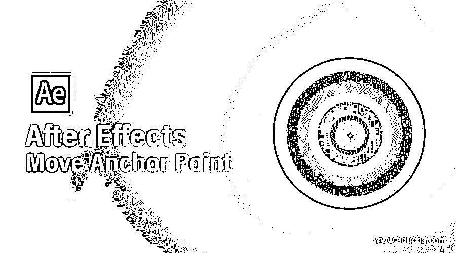

## After Effects 移动锚点简介

Adobe After Effects 是一款动画和视频编辑软件，在本文中，我们将学习如何移动和操纵锚点。为此，首先，我们将查看移动锚点的默认选项，然后我们将看到使用名为“移动锚点”的脚本来更改锚点位置。

### 效果移动定位点后的步骤

不同的步骤如下所述:

<small>3D 动画、建模、仿真、游戏开发&其他</small>

#### 第一步

界面顶部是菜单栏，如文件、编辑等。，每个都有自己的子菜单。在左侧，项目面板由项目文件和效果控制面板组成，显示应用于特定层的效果。然后是显示动画或视频预览的合成面板。

#### 第二步

右键单击项目面板，创建一个新的合成，更改名称，并保持默认设置。

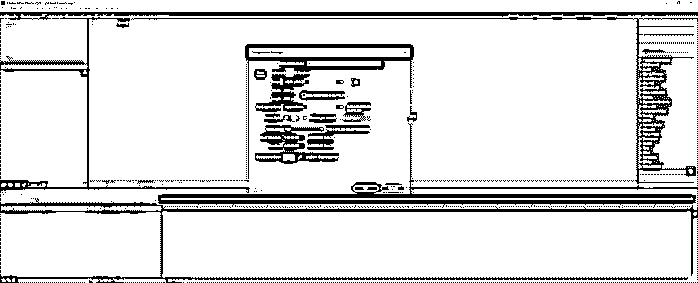

#### 第三步

双击项目面板导入背景图像文件。

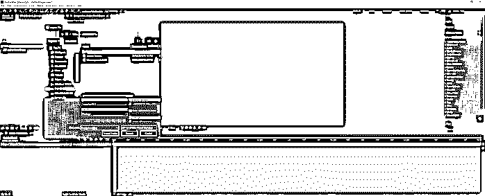

#### 第四步

将背景图像拖到“图层”面板上，创建一个背景图层。

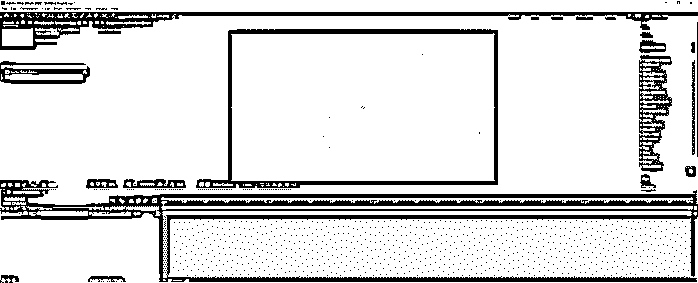

#### 第五步

选择矩形工具或按 q 键。将描边设置为 10px，填充为无。同样，设置描边颜色为深灰色。使用矩形工具拖动时按住 shift 键可创建一个正方形；您也可以按空格键来调整位置。正如我们所看到的，锚点在层的中心。

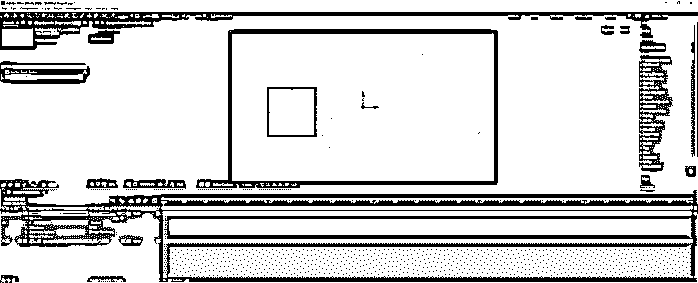

#### 第六步

要更改锚点的位置，我们将使用“在(锚点)后面平移”工具或按 y 键。然后单击并拖动层上的锚点。

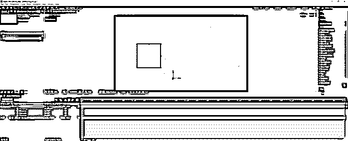

#### 第七步

要使锚点在形状上居中，您可以按住 Ctrl 并拖动，这将使该点对齐到中心，或者您可以在选择锚点的同时按住 Ctrl 并双击工具后面的平移，使锚点位于中心。

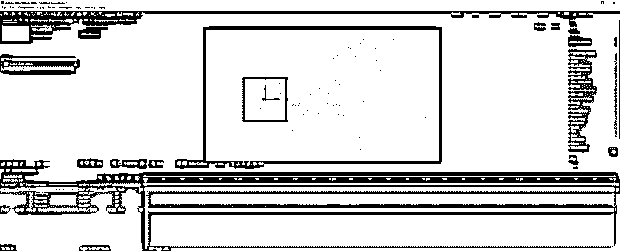

#### 第八步

现在选择椭圆工具或按 Q 键并再次按住 shift 键拖动鼠标来创建一个圆。和以前一样，定位点在中心。要更改此行为，请转到编辑->首选项->常规。

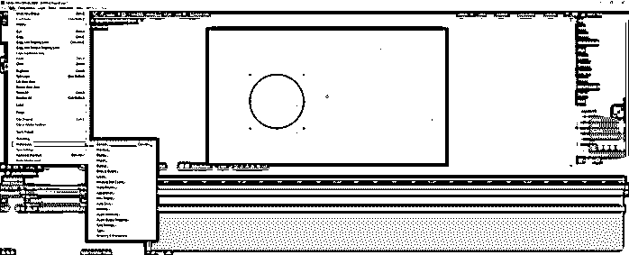

#### 第九步

确保选中“新形状层中的中心锚点”选项。

#### 步骤 10

同样，使用椭圆工具画一个圆，现在锚点应该默认为中心。

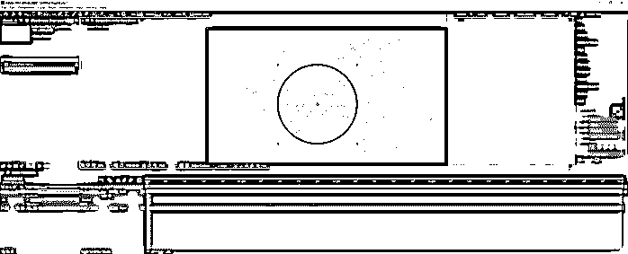

#### 步骤 11

接下来，我们将使用一个脚本来操纵锚点，这要健壮得多，我们可以更好地控制它，因此我们将使用“移动锚点”脚本。你可以从它的网站上购买，链接是 https://www.batchframe.com/tool/move-anchor-point-3.。下载压缩文件并解压后，你会得到如图所示的文件。

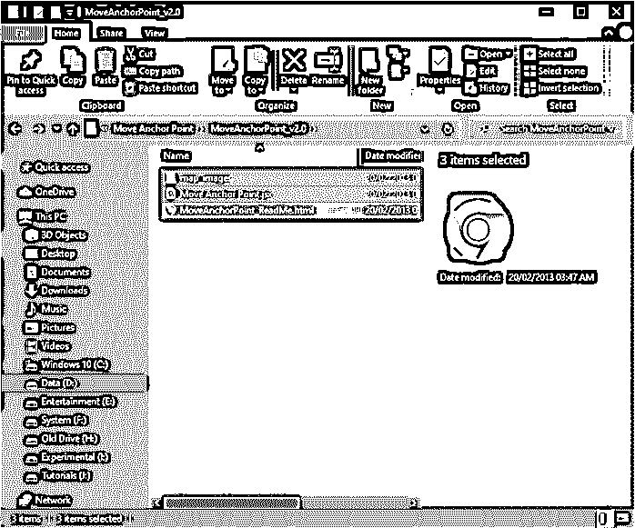

#### 第 12 步

首先，关闭 after-effects 程序，然后根据您的平台将文件复制到以下位置:

MAC:~/应用程序/Adobe After Effects 版本/脚本/ScriptUI 面板

windows:C:/Program Files/Adobe/Adobe After Effects 版本/支持文件/脚本/ScriptUI 面板

在 Windows 上，您可能会收到文件访问警告，因此授予权限。

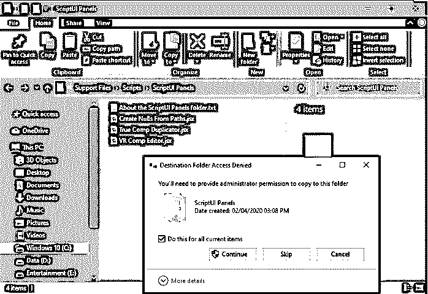

#### 步骤 13

现在打开 after-effects，进入窗口菜单，并验证移动锚点. jsx 存在。

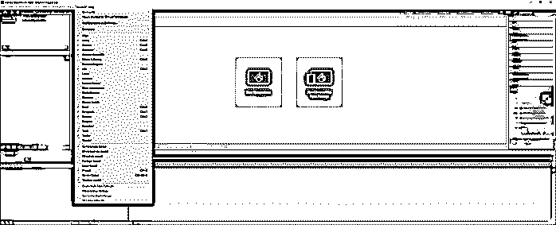

#### 第 14 步

这个插件或脚本基本上将定位点移动到顶部、中间、底部、左侧和右侧。因此，您可以像在 after effects 中停靠任何其他窗口一样停靠此窗口。

#### 第 15 步

让我们创建一个新的构图，如图所示。

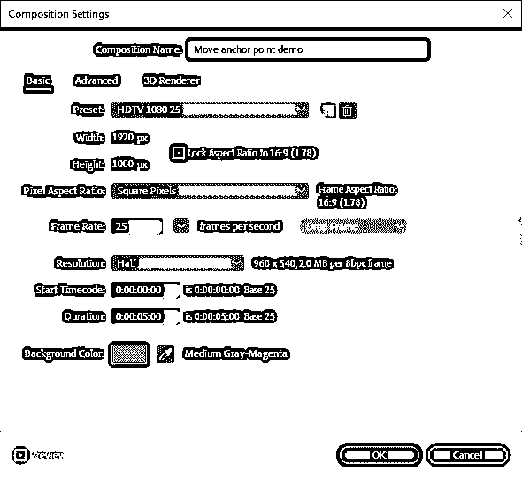

#### 步骤 16

右键单击图层面板，创建一个新的实体。

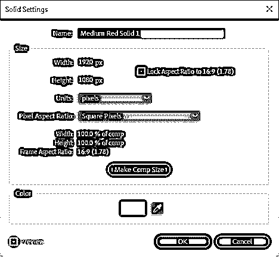

#### 第 17 步

使用移动锚点脚本，我们可以将锚点移动到任何边或角的位置，也可以将其居中。这是最基本的例子。

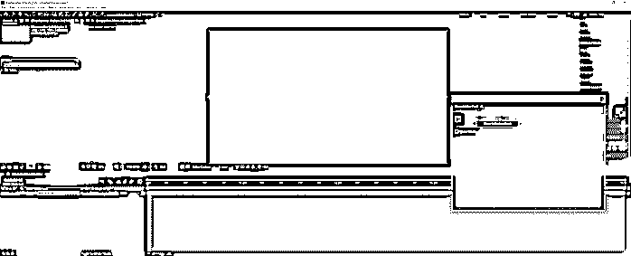

#### 步骤 18

接下来，删除这个实体，创建一个黄色填充的新实体，宽度和高度为 200 像素。

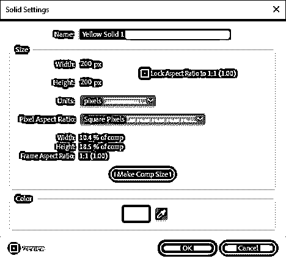

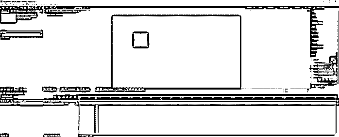

#### 步骤 19

然后转到编辑->复制或按 Ctrl + D 复制实体 4 次。

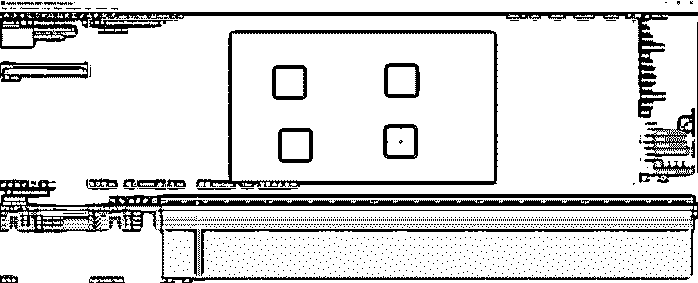

#### 第 20 步

选择所有四个实体并使用移动锚点工具，它会将所有四个锚点移动到所需的位置。如果在不同的图层上有多个实体，并且希望同时操作它们，这将非常方便。这是一个方便和省时的方法。例如，想象你有 20 或 30 个立体，你想移动所有的锚点，这将是一个艰苦的过程。

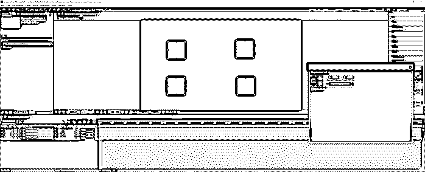

#### 步骤 21

现在隐藏除一个以外的所有实体，并通过按 P 键为该位置设置一个关键帧，这将给出位置并单击计时器。然后更改位置，并进一步移动时间轴以设置另一个关键帧。然后更改锚点，因为您可以看到实体框架的位置保持不变，但只有路径发生了变化。

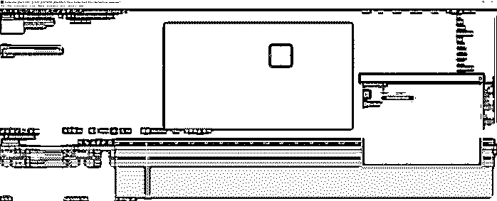

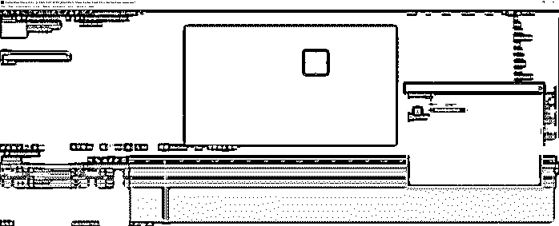

#### 第 22 步

我们甚至可以添加表情，方法是转到动画，然后添加表情，看到图层摆动，但锚点保持不变。

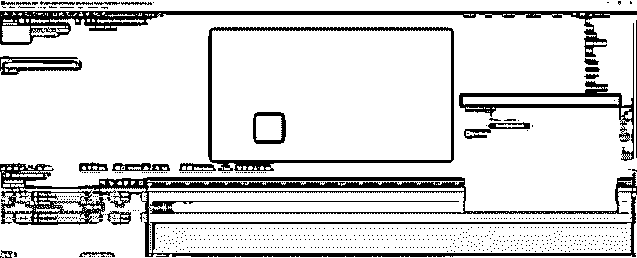

#### 步骤 23

删除所有实体，并创建另一个实体，如图所示。

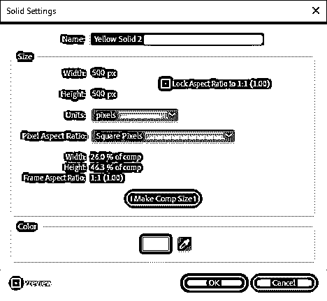

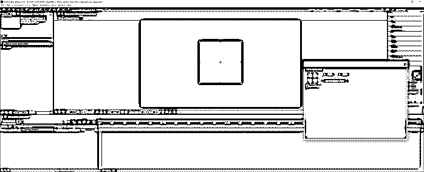

#### 第 24 步

我们现在来看看“移动到自定义点”功能，在该功能中，整个实体在左上角被视为 0，在右下角被视为 1，根据该功能，我们为锚点设置了一个自定义位置。例如，如果我们想从顶部和左侧，我们给 0.75 的 X 和 Y，并点击移动到海关点。如果该点大于 1 或小于 0，则锚点将在实体外部。

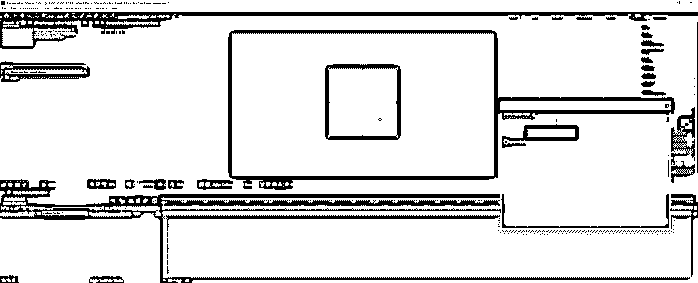

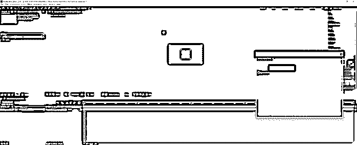

#### 第 25 步

如果我们创建一个复合尺寸的实体，并为其添加一个遮罩，并将锚点设置为中心，则它将使遮罩居中，如果选择了忽略遮罩，则锚点将与实体对齐，而不是与遮罩对齐。

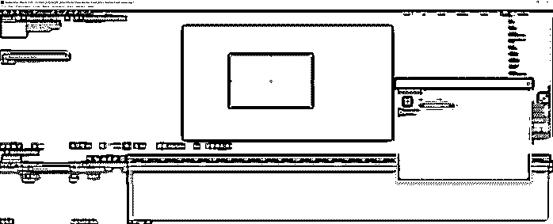

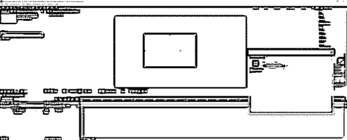

### 结论

在本文中，我们学习了如何使用内置工具(一种锚点工具)操纵锚点，为了更好地控制锚点，我们使用了移动锚点工具，不仅可以操纵位置，还可以根据比例以及遮罩内部设置自定义位置。

### 推荐文章

这是一个移动锚点后的效果指南。这里我们讨论如何使用内置工具操作锚点的步骤。您也可以看看以下文章，了解更多信息–

1.  [后期特效中的变形](https://www.educba.com/morphing-in-after-effects/)
2.  [后效复读机](https://www.educba.com/after-effects-repeater/)
3.  [后期效果中的摄像机跟踪](https://www.educba.com/camera-tracking-in-after-effects/)
4.  [后期效果中的动画](https://www.educba.com/animation-in-after-effects/)

