# 后效 Quicktime

> 原文：<https://www.educba.com/after-effects-quicktime/>

## After effects QuickTime 简介

Adobe After Effects 是一款动画和视频编辑软件。本文将学习 QuickTime 格式的工作原理，以及以这种 Apple 格式和各种编解码器导出视频的不同选项。我们还将看到 QuickTime 格式的各种预设，并比较它的文件大小。

### After effects Quicktime 的步骤

下面是下面提到的步骤

<small>3D 动画、建模、仿真、游戏开发&其他</small>

#### 第一步

在开始更好地理解之前，让我们先熟悉一下界面。顶部是菜单栏，如文件、编辑等。，每个都有自己的子菜单。接下来，就在它的下面，我们有一个工具面板和它们的属性。在左侧，项目面板由项目文件和效果控制面板组成，显示应用于特定层的效果。然后是显示动画或视频预览的合成面板。在右上方，我们有各种布局预设，会根据作品类型进行排列。我们甚至可以创建自己的自定义布局。右边是用于编辑视频的各个部分。最后，在底部，有层和时间轴面板用于添加媒体和添加动画关键帧。

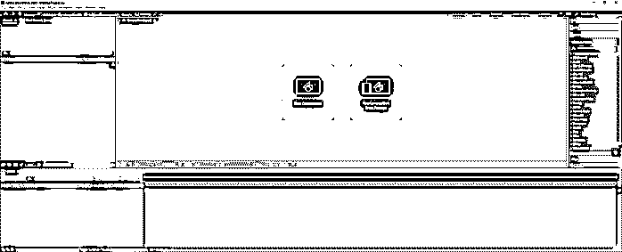

#### 第二步

让我们从菜单中创建一个新的组合或按 Ctrl + N

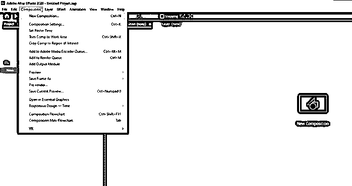

#### 第三步

保持相同的设置，单击确定。

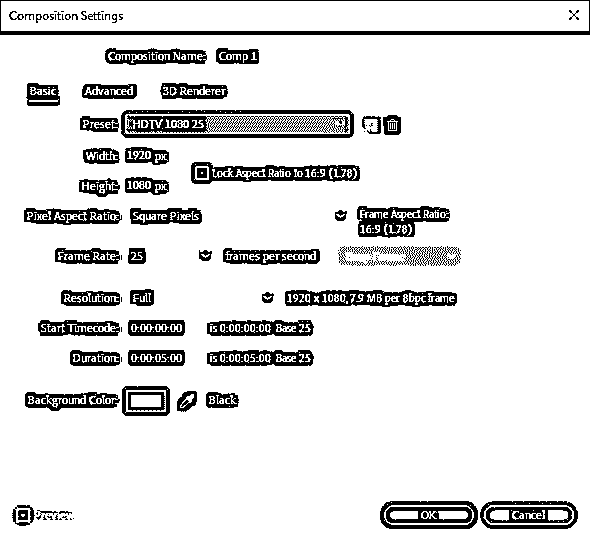

#### 第四步

在“图层”面板中创建实体，或者从菜单中创建实体

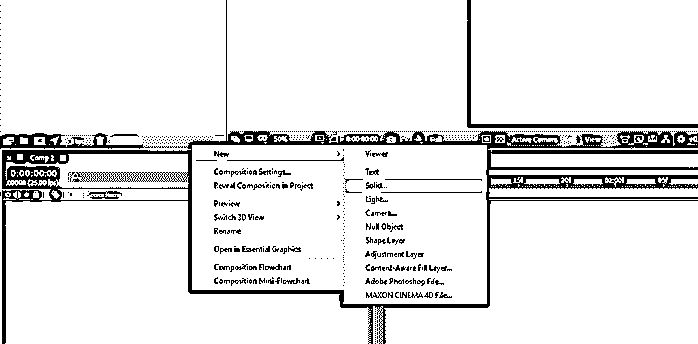

#### 第五步

保持设置不变，然后单击确定。

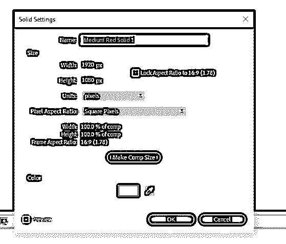

#### 第六步

使用矩形工具或按 Q 键，然后绘制一个正方形。按住 shift 制作一个完美的正方形。

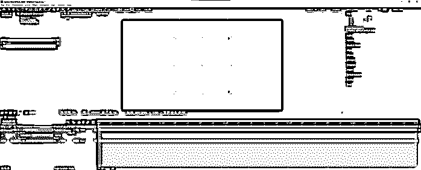

#### 第七步

在“图层”面板中，设置“描边宽度”属性的关键帧。

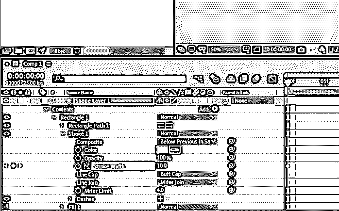

#### 第八步

然后将当前时间指示器移动到 1 秒左右，设置另一个关键帧，并将笔画宽度更改为 50.0

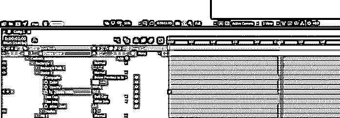

#### 第九步

现在我们已经创建了一个简单的动画，我们将看到如何以 QuickTime 格式导出。

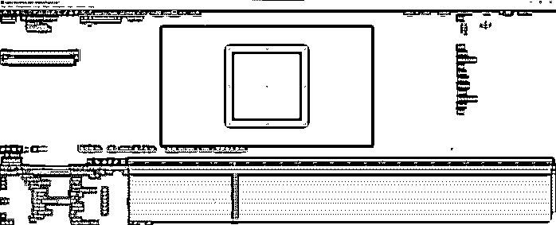

#### 步骤 10

在导出之前，我们将更改伴奏的大小，并通过将工作区域调整到当前时间指示器的位置来将伴奏修剪到工作区域。

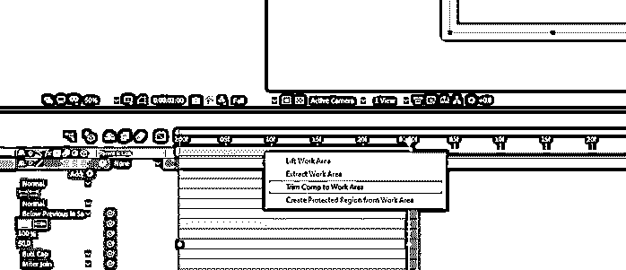

#### 步骤 11

在导出时，我们可以导出到渲染队列或添加到媒体编码器队列。不同之处在于，如果您在渲染队列中导出，您将直接从 adobe after effects 中导出；如果您选择从 media encoder 队列中导出，则必须安装 adobe media encoder，它不仅可以从 after effects 中导出媒体，还可以从 adobe premiere pro 等各种其他 adobe 产品中导出媒体。其他选项是导出为 premiere pro 项目，该项目将直接在 Premiere Pro 中打开。最后一个选项是在马辰影院 4D 浏览器中导出，这需要一个 4D 影院插件，以便以该格式导出后效。在本文中，我们将使用 Adobe media encoder 导出 QuickTime 格式。

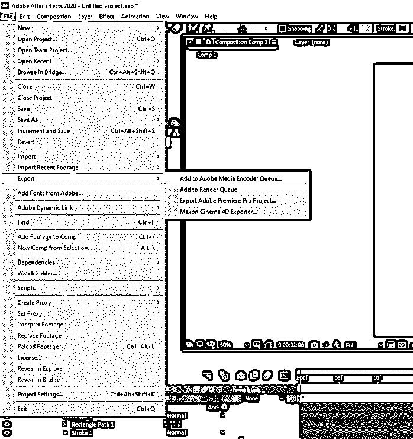

#### 第 12 步

我们可以看到，剪辑被添加到媒体编码器渲染队列中，从这里，我们可以选择格式，预设，输出文件，并查看当前状态。例如，在格式中，选择 QuickTime 并点击它。

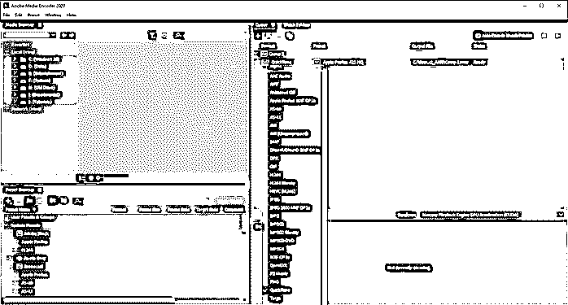

#### 步骤 13

您将在导出设置中看到一个带有 QuickTime 格式选项的对话框。除此之外，您还会看到视频的预览，如果您想要修剪视频的某个部分，您可以在其中设定入点和出点标记。默认情况下，源范围设置为工作区。首先，将预设设置为 Apple ProRes 422 HQ，并保持所有设置不变，同时确保如果有音频，请选中导出视频和音频，然后单击确定。

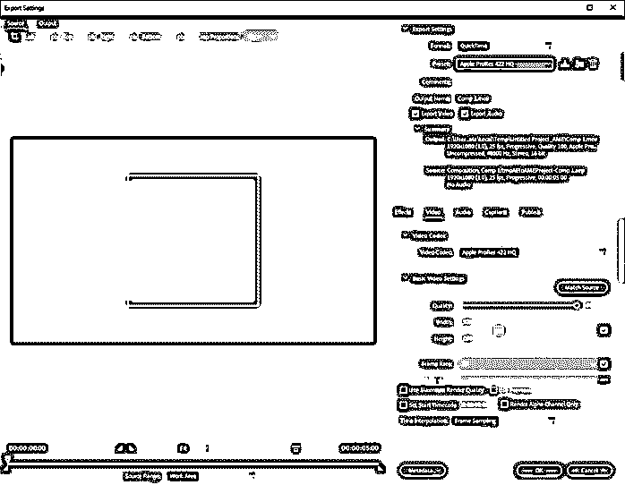

#### 第 14 步

单击绿色的播放按钮开始队列渲染，或按 enter 键。您也可以选择渲染器、使用显卡的 mercury playback engine GPU Acceleration(CUDA)或不使用 GPU 的仅 Mercury playback engine 软件。

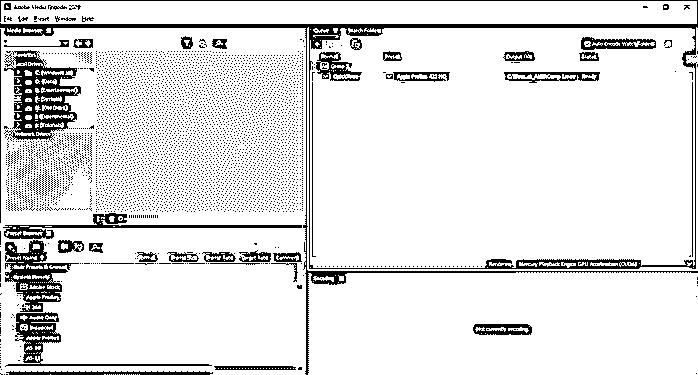

#### 第 15 步

在此预设中完成渲染后，将会在状态旁边看到一个绿色勾号，状态将会完成。对于较长的剪辑，您可以在“编码”面板中看到进度。

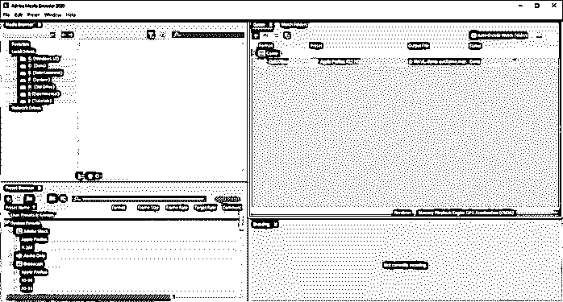

#### 步骤 16

改变预设为苹果 ProRes 422 LT，也改变输出文件的位置，然后渲染。我们现在可以比较各种预设的文件大小。

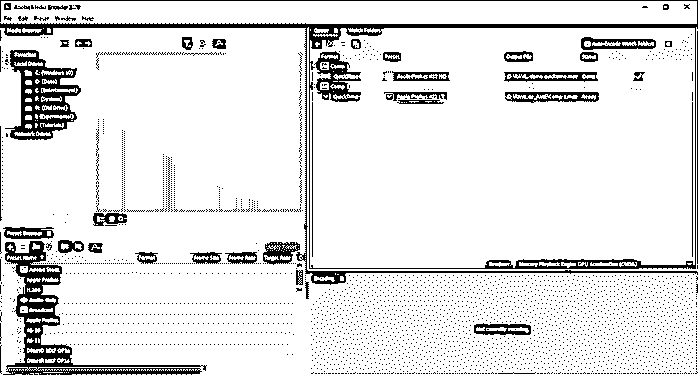

#### 第 17 步

接下来，我们添加了相同的视频，以使用不同的预设 Apple ProRes 422 代理、Apple ProRes 422、Apple ProRes 4444(带 alpha)和 Apple ProRes 4444 导出 4 次

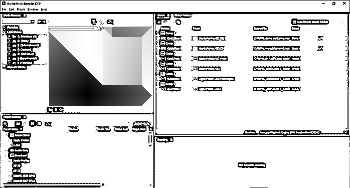

#### 步骤 18

在文件大小方面我们可以看到，Apple ProRes 4444 带 alpha 的文件大小最大，Apple ProRes 422 Proxy 的文件大小最小，这也影响了输出的质量。

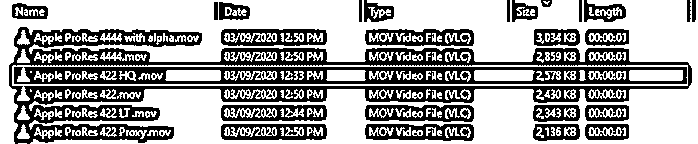

#### 步骤 19

现在我们来看一些 NTSC 预置，分别是 NTSC DV 24p，NTSC DV 宽屏 24p，NTSC DV 宽屏。

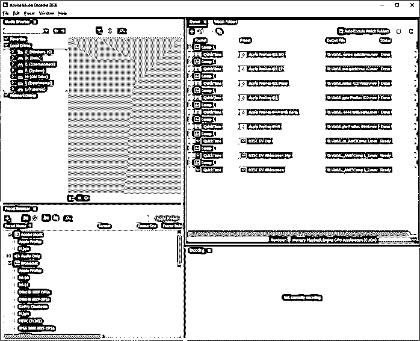

#### 第 20 步

我们来对比一下文件大小，可以看到除了宽屏的，其他的基本相当。

#### 步骤 21

现在让我们来看看一些 GoPro 预设，即 GoPro CineForm RGB 12 位，alpha 处于最大位深度，GoPro CineForm RBG 12 位，alpha，GoPro Cineform YUV 10 位。

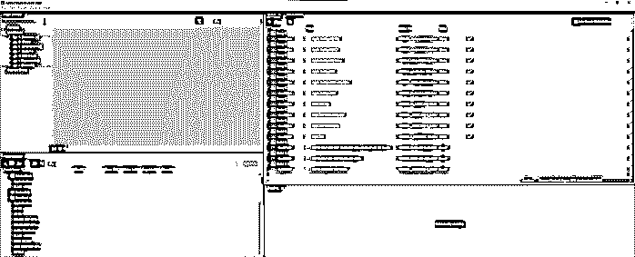

#### 第 22 步

正如我们可以看到的，12 位版本比 10 位版本的 GoPro 文件更大

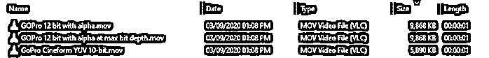

#### 步骤 23

现在让我们看看苹果 ProRes 422 HQ 的 adobe stock 4k vs HD vs UHD 版本，并进行比较。

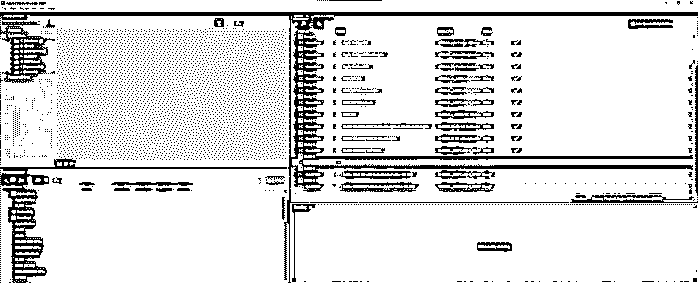

#### 第 24 步

正如我们所见，Adobe Stock 4K DCI 有一个最大文件大小，UHD 紧随其后，HD 有最小的文件大小，这完全取决于输出分辨率。

### 结论

在本文中，我们学习了如何使用 QuickTime 格式，这是 Apple 的专有格式，用于从 after-effects 中导出视频。mov 文件扩展名。我们还看到了影响文件大小和质量的各种输出预设，也看到了使用 adobe 媒体编码器来导出剪辑。

### 推荐文章

这是一个 Quicktime 后效指南。在这里，我们讨论使用 QuickTime 格式和苹果公司的专有格式，用于从 after-effects 导出视频。mov 文件扩展名。您也可以看看以下文章，了解更多信息–

1.  [特效动画后](https://www.educba.com/after-effects-cartoon/)
2.  [特效跟踪后](https://www.educba.com/after-effects-tracking/)
3.  [丛后效应](https://www.educba.com/plexus-after-effects/)
4.  [Logo 展示后效果](https://www.educba.com/logo-reveal-after-effects/)

