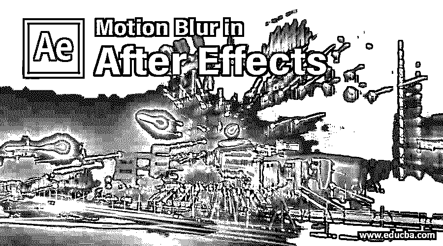
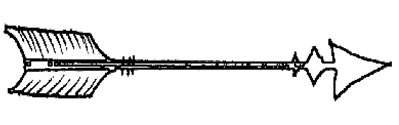
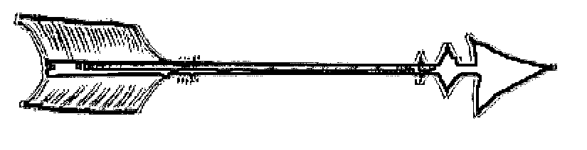
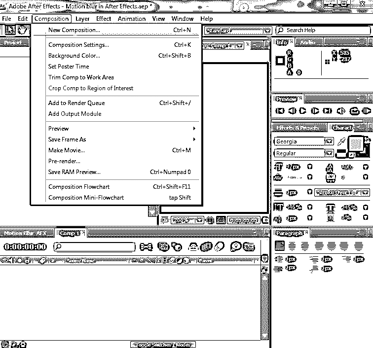
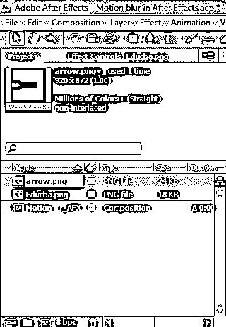
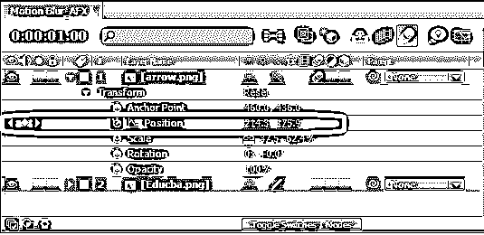
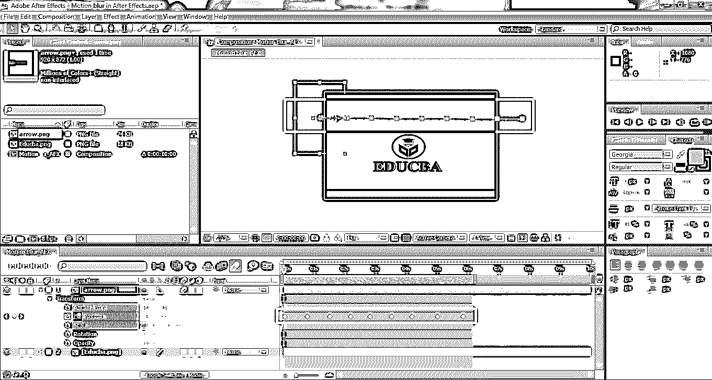
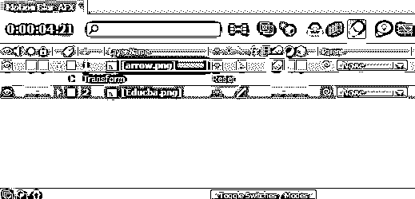

# 后期效果中的运动模糊

> 原文：<https://www.educba.com/motion-blur-in-after-effects/>

## After Effects 中的运动模糊介绍

After-effects 是 Adobe systems 为动画制作和服务的软件；电影制作、电视和所有其他数字视觉效果的后期制作工作。现在，我们将讨论一个最重要的影响因素，即运动模糊，它在给画面中的运动物体增加运动感方面起着关键的作用。这种技术用于标识、标题制作和宣传视频制作，以动态突出品牌名称及其标识。我们将在下面看到更多运动模糊的技术属性。

### 在后期效果中应用运动模糊

运动模糊属性根据我们应用效果的层向对象添加运动。这种效果用于叙述、制作标题，使用这种功能还可以做更多的事情。我们将看到使用 After effects 对文件进行运动效果的完整创建。基于屏幕或帧的大小，物体运动的清晰度增加和减少。根据我们正在进行的项目，有一些标准的屏幕尺寸需要维护。我们将采用 After effects 的常规默认尺寸作为演示。下面是几个应用运动模糊前后的演示，以便于理解。

<small>3D 动画、建模、仿真、游戏开发&其他</small>

*   **没有运动效果的层**

*   **带运动效果的图层**

通过比较两幅图像，我们可以发现应用了运动效果的图层更具动态感，感觉像是箭头在移动，而在第一幅第一幅图像中，箭头清晰地出现在一个地方。在第二张和第三张的图片中，箭头共享它的像素，这增加了画面的动感；我们来看看一步一步的过程。

**第一步:**根据需求创建新的构图或项目，并准备好动画的所有先决条件，如项目窗口、图层窗口、关键帧等默认打开；如果没有，请转到菜单栏中的窗口，并根据需要启用它们。可以根据需要配置工作空间或屏幕大小。

**步骤 2:** 加载任何格式所需的图层，如图像、视频等。为了在今天的视频中创建新的视频，我们将为箭头层(arrow)添加动作，就好像它从一边移动到另一边一样。根据需要将层加载到项目窗格中，这些层必须在素材中，并正确排列它们，以便一个在另一个上出现。

**第三步:**打开图层窗格，打开箭头图层的变换属性下拉菜单，点击位置(秒表图标按钮)；开始关键帧，这必须将层从一个地方移动到另一个地方，无论我们需要什么方向。

将创建一个带计时的轨道并放置在屏幕上。在并行定位和设置运动位置时，我们需要同时考虑屏幕上的位置和时间，这是根据需要显示的。

**第四步:**给物体多次运动后，我们可以在屏幕上看到几个正方形，在动画窗格中看到几个菱形。每个菱形和正方形表示物体流入的运动。我们可以通过选择它们来删除它们中的任何一个，并且要查看运动轨迹，请单击空格键或键盘上的 0 键来检查对象的方向。

第五步:现在，我们要给图层添加运动，图层必须移动。要添加运动效果，启用两个运动选项[将运动效果](https://www.educba.com/motion-effect-in-photoshop/)应用到图层。启用运动效果后，对象在边界处设置轻微的像素等级，以赋予其运动外观和感觉。两个停止点之间的顶点(屏幕上的方框)描述了对象运动的持续时间。如果它们靠得太近，物体移动得快；如果它们远离，物体移动缓慢。

*   **到受影响的层:**在层窗格菜单栏(顶部)，我们有一个运动选项，一个单选按钮；激活此运动可见性后，层列表在 motion 中显示在屏幕上时会启用运动。
*   **单个层:**我们已经创建了关键帧和跟踪流的层。该特定层会收到一个运动选项，如下所示。此选项仅用于我们为其添加了关键帧以使运动变为动态的层。

**第 6 步:**查看素材，并做出更改(如果有)。根据我们的系统配置，渲染时间将用于保存和导出到任何其他文件格式。工作时，可以随时移除或修改关键帧和运动轨迹。要选择多个关键帧，使用 **Shift +拖动鼠标箭头**。要删除单个关键帧，请使用鼠标光标，选择关键帧，然后按键盘上的 delete 键。这需要更多的练习，学习者必须在多个相似的概念上努力，以熟悉关键和实践。

完成的项目看起来像这样，使用文件另存为和导出选项，我们可以共享和保存不同格式的文件。在这个项目中，我们使用关键帧和图层和图层面板的运动按钮，使箭头从左向右移动。关键帧有助于保持对象的运动均匀和有规律，而不会因为运动的周期性间隔而变得快速和缓慢。定位的变换属性有助于以平滑的方式创建从一个地方到另一个地方的运动。通过继续这些方面，可以创建多层运动。

### 结论

这种技巧有助于以简单的方式接近和[将运动图形归档到屏幕](https://www.educba.com/motion-graphics-in-after-effects/)上，就像想象的那样，并将概念变为现实。对于用户来说，这是更平滑和更容易实现运动使用后的效果。电影、电视、YouTube 工作室、摄影师和动画师可以利用这一点，创造更聪明的方法。

### 推荐文章

这是一个运动模糊后的效果指南。在这里，我们讨论的介绍和应用运动模糊的各种步骤后的效果的例子。您也可以阅读以下文章，了解更多信息——

1.  [运动图像——优势和职业发展](https://www.educba.com/what-is-motion-graphics/)
2.  什么是后效？|有什么用途？
3.  [在 After Effects 中创建徽标动画](https://www.educba.com/logo-animation-in-after-effects/)
4.  [如何在后期特效中应用蒙版？](https://www.educba.com/mask-in-after-effects/)
5.  [后期效果模糊](https://www.educba.com/blur-in-after-effects/)
6.  [Illustrator 中的模糊](https://www.educba.com/blur-in-illustrator/)
7.  [使用 Maya 软件渲染物体的步骤](https://www.educba.com/rendering-in-maya/)
8.  [雨后效果|方法](https://www.educba.com/rain-in-after-effects/)

