# 后期效果中的混合模式

> 原文：<https://www.educba.com/blending-modes-in-after-effects/>

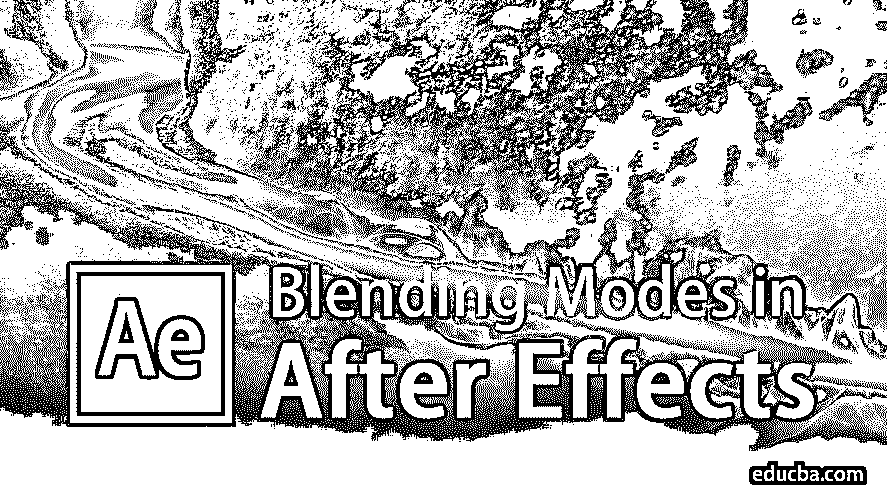

## After Effects 中混合模式介绍？

Adobe After Effects 是一个视频编辑和动画程序，通常由图形设计师、视频编辑和 VFX 艺术家使用。该计划有一个巨大的工具和预置集合，使该计划更加苛刻和有用。After-effects 是后期制作编辑和添加效果和附加组件最常用的应用程序之一。大多数视频编辑人员使用 Adobe Photoshop 进行图像编辑，然后使用 Adobe After Effects 进行视频修改和编辑。

adobe after effects 提供的质量是同一领域的任何其他软件无法比拟的。After Effects 主要用于电影编辑和电视工作室的 2d 动画和视频编辑。特效中的混合模式工具非常有用，在很大程度上帮助了设计师。混合模式使用多层创建惊人的效果和 [VFX 效果](https://www.educba.com/what-is-vfx/)，工作简单易行。

<small>3D 动画、建模、仿真、游戏开发&其他</small>

### 应用中的重要混合模式

混合模式也用作任何项目中的迷你效果。这些混合模式是向任何图层添加效果的最快方式。这些可以从时间轴面板本身应用。在 After Effects 中，有许多混合模式可以应用来获得所需的结果。

*   **变亮**–这种模式在图像的闪电中很有用，也可以去除图像的黑色色调。
*   **对比度**–该模式使用多种混合模式，增强图像质量。
*   **变暗**–该模式在使图像变暗时非常有用，并且可以去除图像中的白色。
*   **正常**–该模式作为正常模式使用，没有任何影响。
*   **颜色**–该模式适用于色调、饱和度和亮度。
*   **差异**–该模式指定层之间的高光。

这些混合模式可以应用于任何图层，以在连续图层上进行蒙版和创建效果。应用混合模式是风格化图层的最简单的方法，而不需要深入程序。这些迷你效果可以很容易地从时间轴部分应用，也可以修改。

### 在 After Effects 中应用混合模式

我们以这样的方式应用混合模式，它[在顶层创建一个蒙版](https://www.educba.com/mask-in-after-effects/)，给场景一个全新的外观和姿态。

#### 1.屏幕

这种混合模式通常用于去除图像的暗度。当必须移除任何图像的黑色部分并与另一个图像混合时，此模式很有用。这可以通过在顶层应用效果并在底部保留背景来实现。

**屏幕示例**

步骤 1: 从图层面板打开一个新的构图。

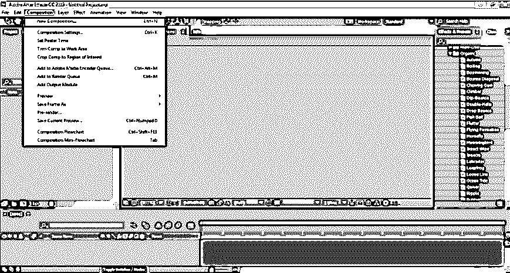

**步骤 2:** 从“文件”菜单，转到“导入”,点击“文件”,从设备导入图像。

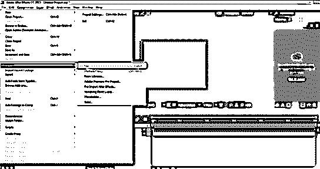

**第三步:**选择背景的图像，如下图所示。

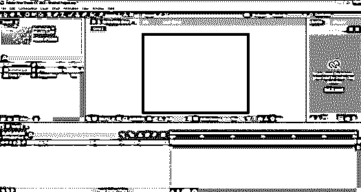

**第四步:**接下来，将图像拖放到时间轴面板。

**步骤 5:** 现在，像之前一样从设备导入另一个文件，如下所示。

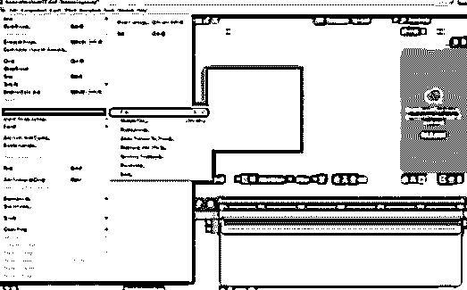

**第六步:**将图像放到时间轴面板上。

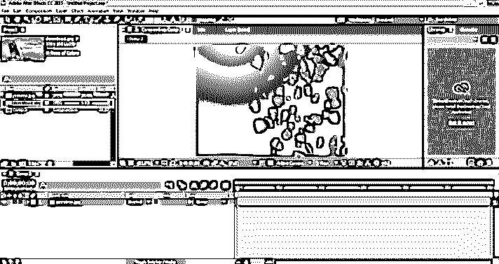

**步骤 7:** 将这张图片放在背景图片上方的时间轴面板中。

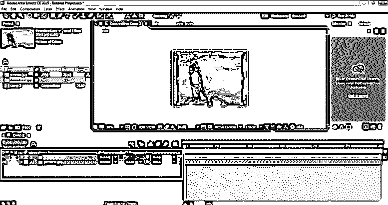

**步骤 8:** 现在，使用模式选项，选择屏幕并查看所需结果。

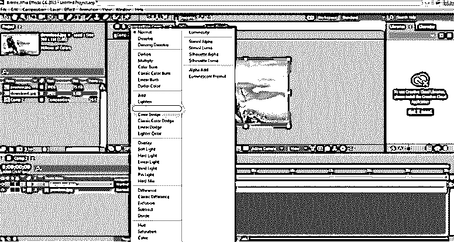

你会看到图像的黑色部分使用这种混合模式被删除。

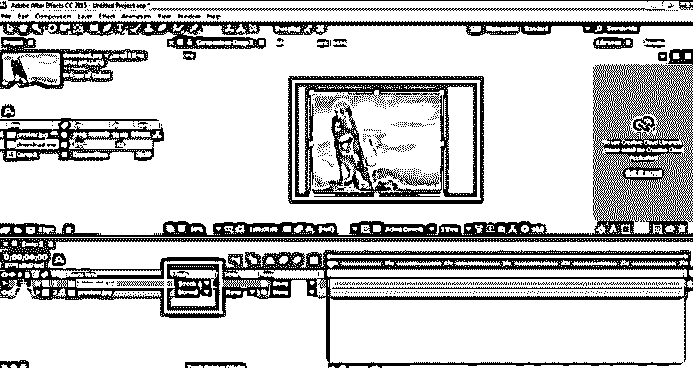

#### 2.多样地

这种模式正好和屏幕模式相反。此模式会移除图像的白色部分，并相应地混合其他图像。

**乘法的例子**

步骤 1: 从图层面板打开一个新的构图。

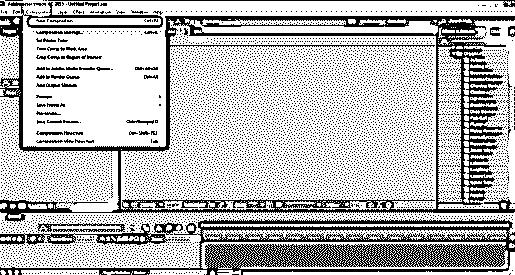

**第二步:**从文件菜单，进入导入，点击文件，从设备导入图像；选择背景图像，如下图所示。

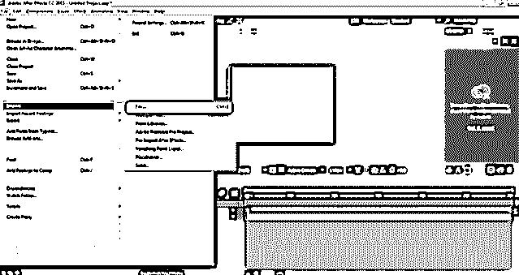

**第三步:**选择背景的图像，如下图所示。

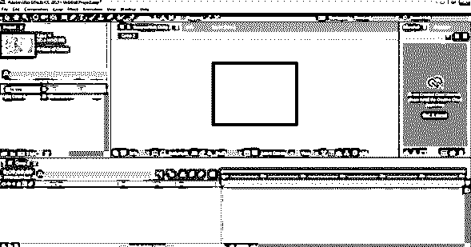

**第四步:**接下来，将图像拖放到时间轴面板。

**第五步:**现在，导入需要编辑的图片。

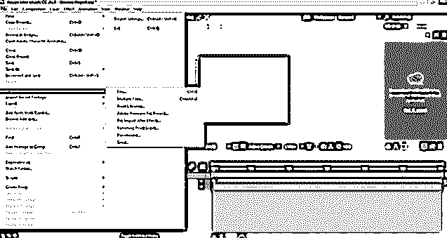

**第六步:**从设备导入图像，如下图。

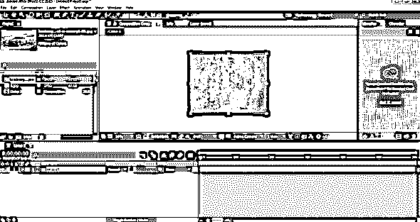

**步骤 7:** 将这张图片放在背景图片上方的时间轴面板中。

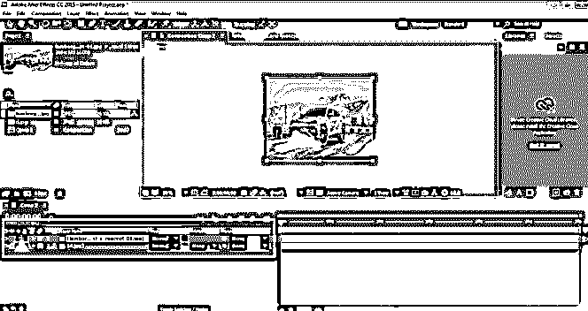

**第 8 步:**现在，我们使用模式选项，选择乘法来查看想要的结果。

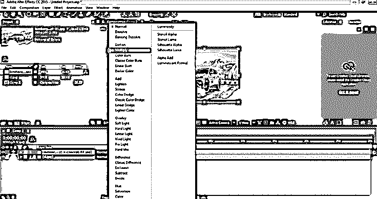

你会看到图像的白色部分使用这种混合模式被删除。乘法有助于创建一个复古的形象。

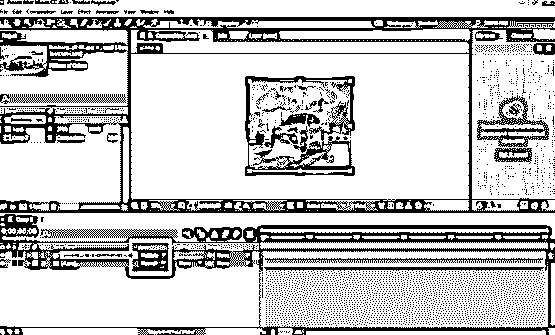

#### 3.颜色烧伤

这种模式有助于使图像变暗，同时与背景融为一体。顾名思义，结果给人一种烧焦的感觉。

**颜色灼伤的例子**

步骤 1: 从图层面板打开一个新的构图。

**步骤 2:** 从“文件”菜单，转到“导入”,点击“文件”,从设备导入图像。

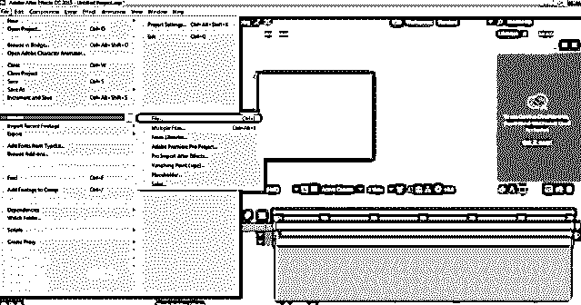

**第三步:**选择背景的图像，如下图所示。

**第四步:**接下来，将图像拖放到时间轴面板。

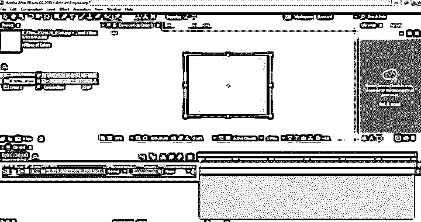

**第五步:**现在，导入需要编辑的图片。

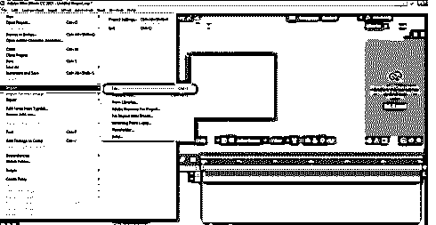

**第六步:**将其放置在背景图片上方，如下图。

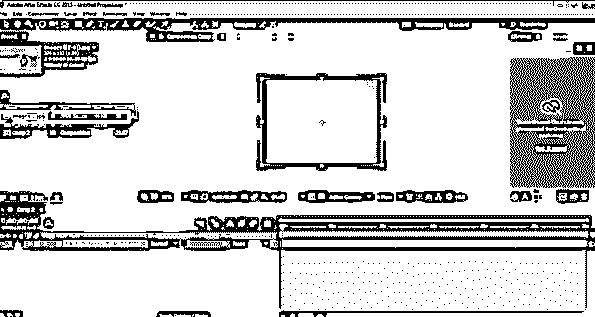

**步骤 7:** 将这张图片放在背景图片上方的时间轴面板中。

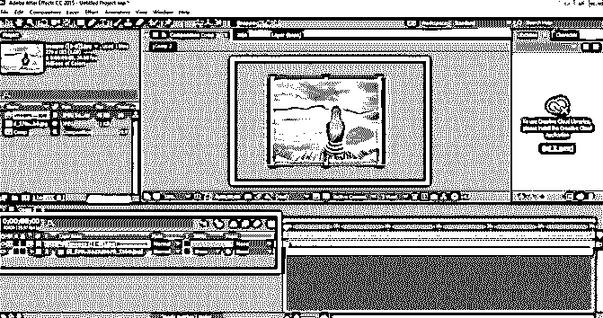

**第 8 步:**现在，使用模式选项，选择彩色刻录，并查看所需的结果。

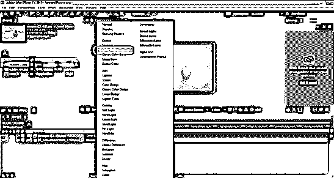

第 9 步:你会看到图像已经改变了它的外观，它现在给人一种烧焦的感觉，同时它与背景融为一体。

**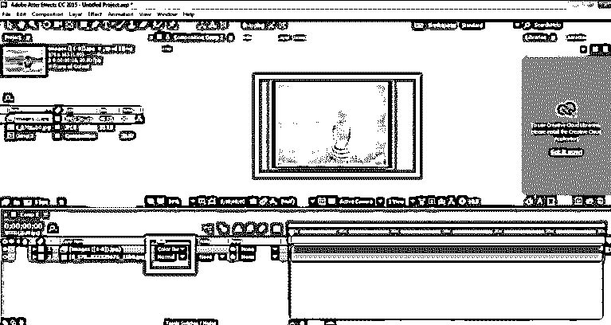

** 

### 结论

这些是 Adobe After Effects 中混合模式的一些示例。有许多模式可以应用于期望的结果。没有两种混合模式是相同的；每种模式都有不同的输出和不同的功能。使用混合模式的最大好处是它们可以快速应用和修改。只需点击一下，我们就可以改变图像的外观和风格。大多数设计师只使用这些混合模式，并使用它们编辑他们的视频。

### 推荐文章

这是一个在特效中混合模式的指南。这里我们讨论 after effects 中混合模式的例子，应用中重要的混合模式，各种混合模式的作用和说明。你也可以浏览我们的文章来了解更多-

1.  [什么是后效](https://www.educba.com/what-is-after-effects/)
2.  [搅拌机插件](https://www.educba.com/blender-plugins/)
3.  [Illustrator 中的混合工具](https://www.educba.com/blend-tool-in-illustrator/)
4.  [Illustrator 中的混合模式](https://www.educba.com/blending-modes-in-illustrator/)

