# 后效中的慢动作

> 原文：<https://www.educba.com/slow-motion-in-after-effects/>

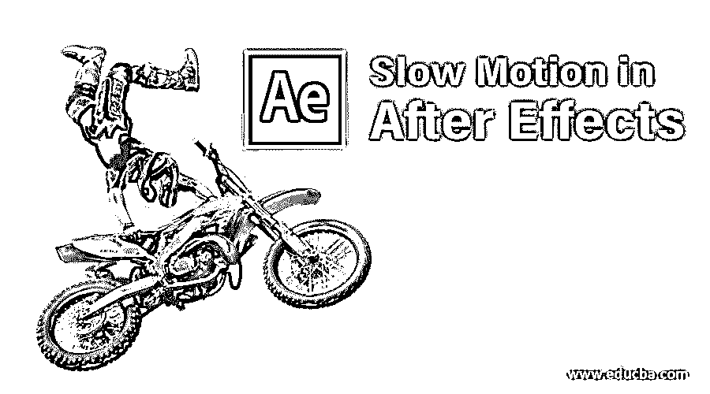

## After Effects 中的慢动作介绍

在这篇文章中，我们将看到一个关于后效中慢动作的概要。慢动作只不过是让一个剪辑变得缓慢，但这并不像我们所说的那样容易做到；制作一个剪辑慢动作有很多过程和方法，如果我们在慢动作中没有使用正确的过程，帧速率会受到影响。正如我们所知，现在，我们可以在 DSLR 和手机中默认拍摄慢动作，但对于一个帖子剪辑，如果我们需要改变持续时间或需要做慢，我们可以使用慢动作方法。

看到某物缓慢移动是很有趣的；让我们看看它是如何工作的。

<small>3D 动画、建模、仿真、游戏开发&其他</small>

### 在 After Effects 中创建慢动作

下面的 下面的 分别是步骤 到 创建 慢速 动作在效果 后讲解 中的 细节。

**第一步:**导入视频文件。

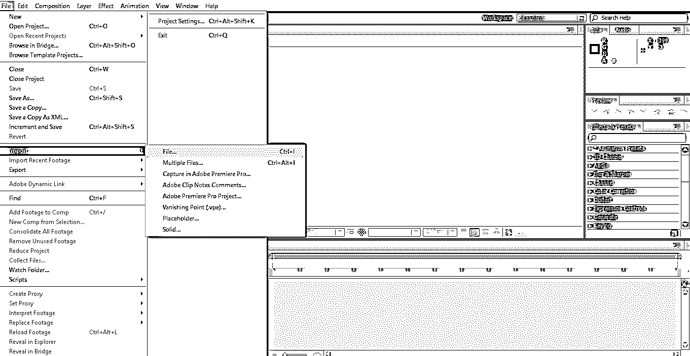

**第二步:**把视频拿到时间线上。

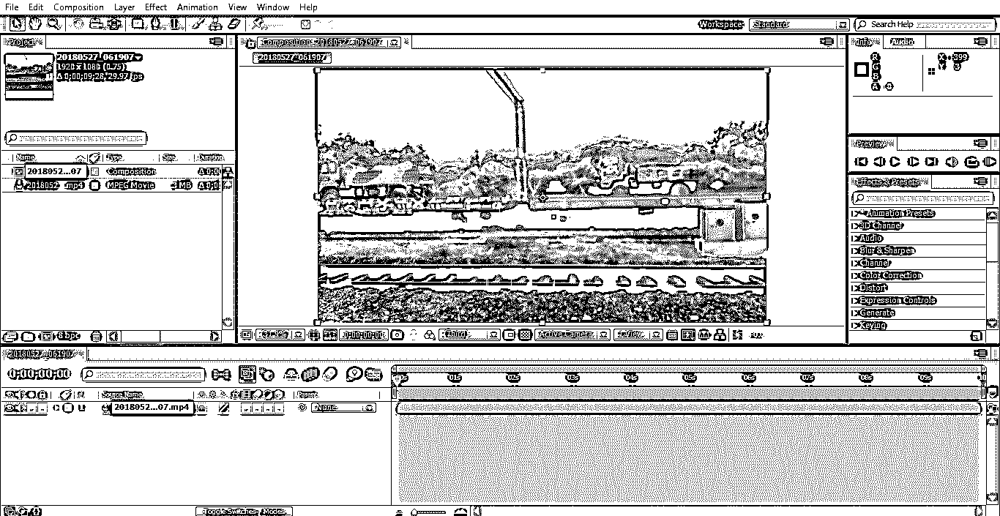

我们导入了行驶列车的视频；我们需要选择移动物体视频，因为我们现在要尝试慢动作效果；为此，我们需要一些移动的物体。

**第三步:**修剪视频；如果你有大的内容，修剪到你想要的，因为在应用效果后，它会去渲染，它可能会变得缓慢或冻结。

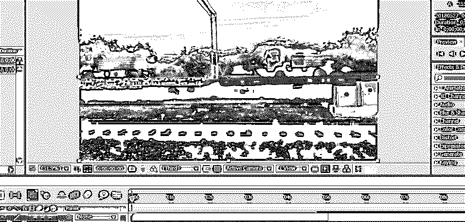

第四步:我将使用两种方法进行慢动作:时间重映射，第二种是时间拉伸。

让我们从时间渐变开始。现在开始行动，去图层，点击时间，选择时间映射。快捷键是 **Ctrl+Alt+T** 。

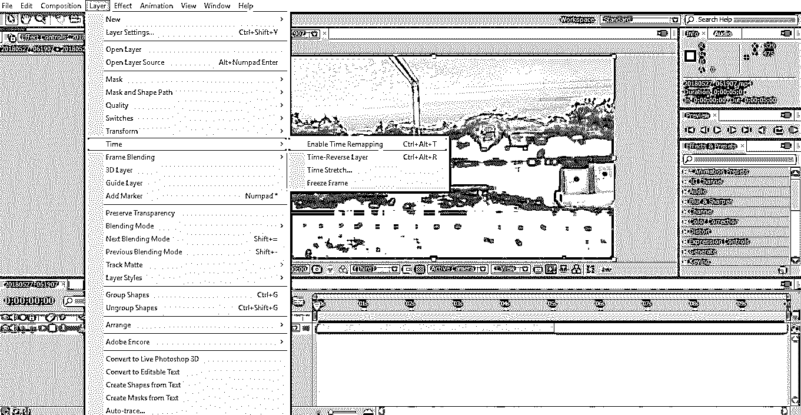

**第五步:**这里可以看到时间重映射的选项；它的关键帧秒表选项是默认的。

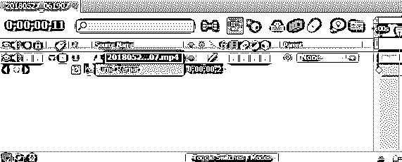

**步骤 6:** 当我们应用时间重映射时，默认应用两个关键帧，一个在剪辑的开始，另一个在剪辑的结束。

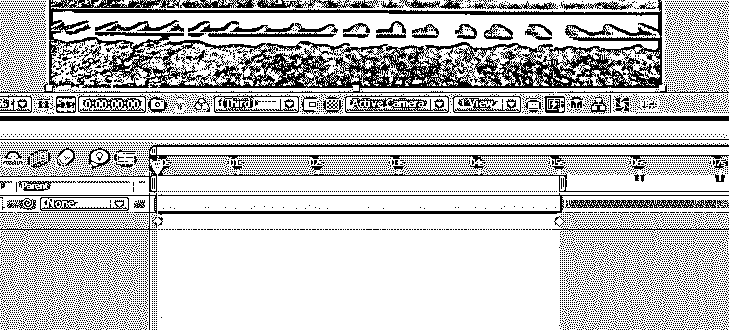

**第七步:**现在，我们需要选择需要减缓剪辑的地方，并应用两个关键帧。

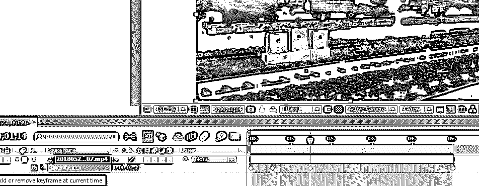

**步骤 8:** 选择我们应用的两个关键帧。

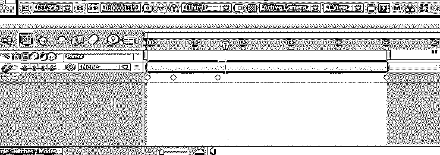

第 9 步:这里，我们有一个图形编辑器选项。

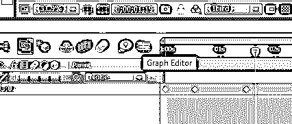

**第十步:**当我们选择图形编辑器选项时，时间线界面会发生变化，时间线看起来就像一个图形时间线。

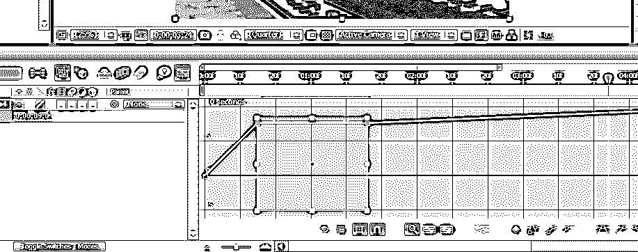

我们可以看到我们的两个选定的关键帧在这里的方框。

步骤 11: 我们需要按住 shift 键，将上面的线拖动到任何需要慢动作的地方。

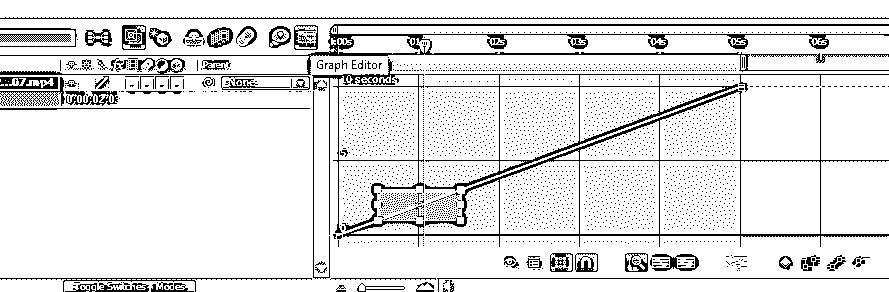

**第 12 步:**我们减少那个地方的点移动得慢，剩下的也一样快。

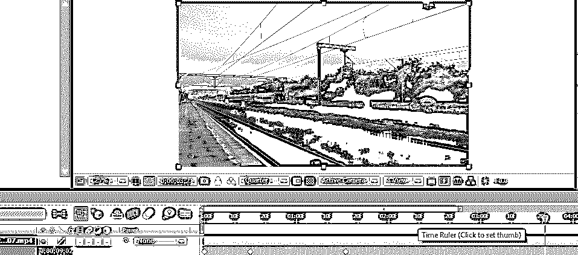

如果我们需要平滑慢动作，我们需要使用帧混合选项，在这里激活帧混合选项。

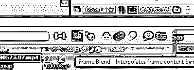

当我们在下面的框中激活帧混合时，我们可以发现一个小的虚线。

再次点击同一个小方框，然后虚线变成正常，并将方向转向左侧。

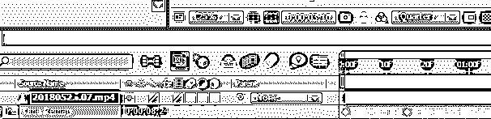

步骤 14: 这里，我们有另一个选项帧混合到所有层。

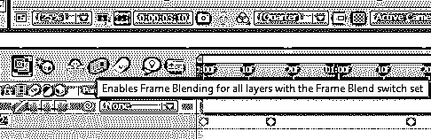

它看起来像 3 个电影图标；它会使慢动作变得平稳。

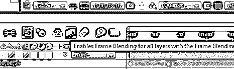

**步骤 15:** 我们可以找到一条表示渲染的绿线；现在，我们可以在剪辑中找到一个缓慢而流畅的瞬间。

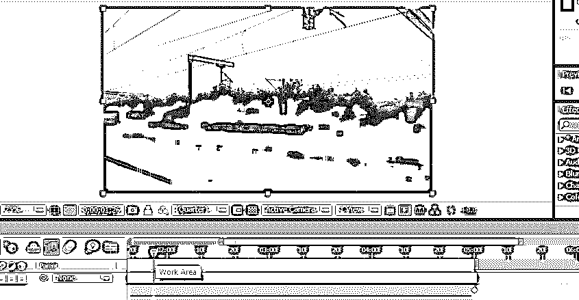

我们在这里尝试重新映射；这是一种方法，我们还有另一种方法让剪辑变得缓慢而流畅。让我们看看它是如何工作的。

**第十六步:**我要尝试的下一个方法是时间拉伸。转到层和时间，然后选择时间拉伸。

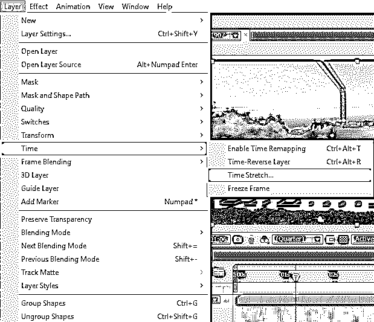

**第 17 步:**当我们选择时间拉伸时，可以得到一个对话框询问，如下图所示。

在这个方框中，我们可以找到拉伸系数%。这将是默认的 100，我们可以改变我们的要求，我们改变多少，它会变得很慢，所以，在这里我给 200 的拉伸系数%。

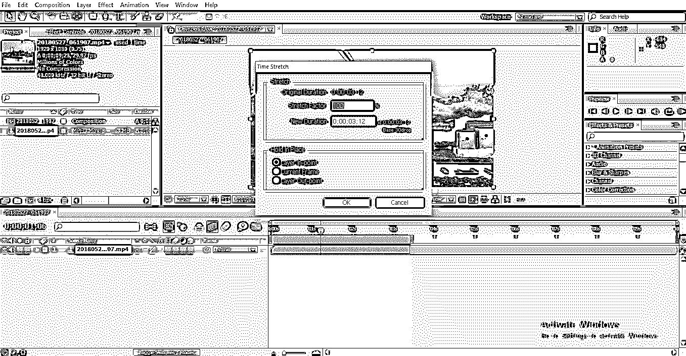

在下一个框中，我们可以找到新的持续时间，这意味着改变的持续时间；每当我们改变拉伸因子，新的持续时间就会改变，我们可以在顶部找到原来的持续时间；我们可以找到持续时间的差异。

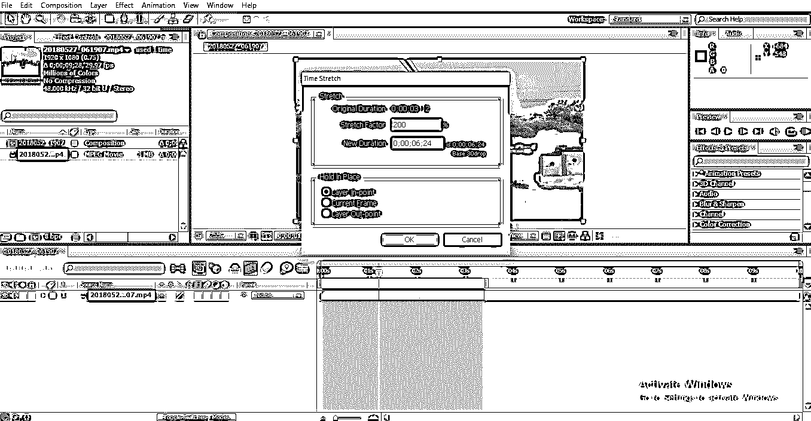

**步骤 18:** 在保持就位中有他们的选项，这意味着我们需要在哪个位置保持框架；如果我们按住该帧，该帧可以作为静止帧拖动。

如果我们需要在开始时保持帧，我们需要选择第一个选项。如果我们需要使用当前帧，我们需要选择第二个选项。如果我们需要保持结束帧，我们需要选择第三个选项。

为什么我们需要拿着一个相框？

在慢动作之后，如果我们需要静止帧，我们可以使用保持帧。

**步骤 19:** 在这里，我们可以看到剪辑的长度增加了。

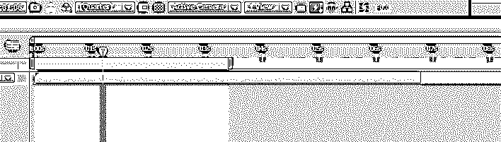

**步骤 20:** 我们在播放剪辑的时候可以找到一条绿线；这意味着它可以渲染。

步骤 21: 现在，这个剪辑以慢动作移动，如果我们需要给剪辑添加一些平滑度，就像我们在第一种方法中做的那样，进行活动帧混合和层混合。

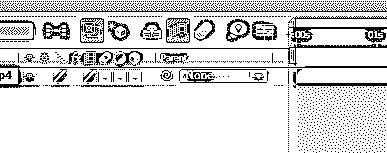

**步骤 22:** 现在，我们可以看到应用帧混合前后渲染的区别。

在应用混合选项之前，

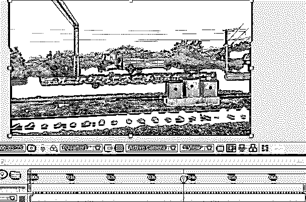

应用混合选项后，

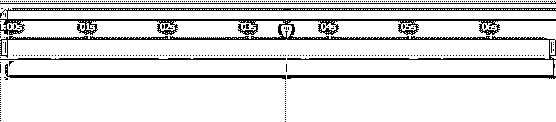

在应用帧混合之前，绿线看起来像虚线；这意味着慢动作的应用，它不平滑。应用混合后看起来正常的绿线，绿线表示慢动作移动平稳。

**第 23 步:**它移动得很慢，在这个慢动作剪辑中看起来很平滑。

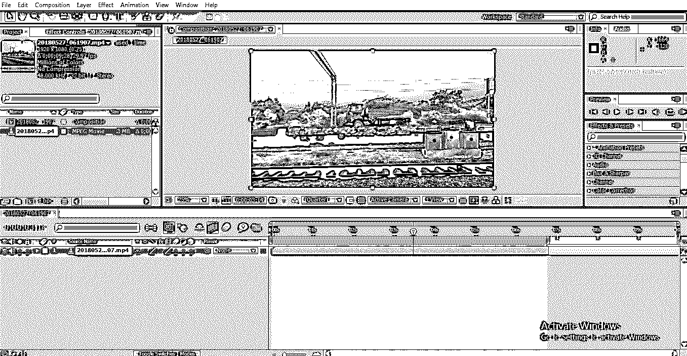

在第一种方法中，我们在两个关键帧之间使用慢动作，这意味着剪辑以正常速度开始移动，在两个关键帧之间开始慢动作，并以正常速度结束。

在第二种方法中，我们对整个剪辑使用它，这样整个剪辑将以慢动作移动。在这个过程中，我们导入一个视频剪辑，并对剪辑进行裁剪；然后我们在剪辑上尝试一些慢动作效果；我们尝试时间重映射和时间拉伸方法来减缓剪辑。

### 结论

所以， 从 所有的 这些的步骤中，我们已经学过了，什么是慢动作？它是如何工作的慢动作方法又是如何应用的？还有，如何使用图形编辑器，框架和图层混合？我希望我们讨论的是一个有趣的话题。

### 推荐文章

这是一个关于后期效果中慢动作的指南。在这里，我们讨论使用图形编辑器，帧和层混合创建后的效果慢动作。你也可以看看下面的文章来了解更多-

1.  [如何给动画添加声音或音乐？](https://www.educba.com/animation-in-flash/)
2.  [在 After Effects 中创建 2D 动画](https://www.educba.com/2d-after-effects-animation/)
3.  [动画的 12 大基本原则](https://www.educba.com/principles-of-animation/)
4.  [在 After Effects 中添加关键帧的步骤](https://www.educba.com/keyframes-in-after-effects/)
5.  [学习在特效中创造雨的方法](https://www.educba.com/rain-in-after-effects/)
6.  [后效中的毛刺效应指南](https://www.educba.com/glitch-effect-in-after-effects/)
7.  [特效转场后|如何制作？](https://www.educba.com/after-effects-transitions/)

