# 后期效果中的 3D 文本

> 原文：<https://www.educba.com/3d-text-in-after-effects/>

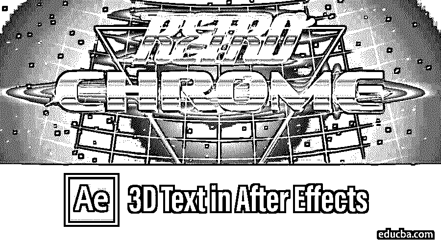

## After Effects 中的 3D 文本简介

After Effect 是视频和 VFX 行业使用的有效软件，该软件还具有为多种目的创建 3D 文本的功能，这将在本文的下文中讨论。这增强了电影、连续剧、YouTube 频道、广告和所有其他用于促销的媒体相关区域的标题的视觉外观。我们将讨论使用后效创建 3D 文本的多重属性。这增加了项目的信息，我们甚至可以配置标题滚动的主题，如旅游，犯罪等。，作为标题背景的主题。3D 文本还有很多其他的好处。我们将进一步看到它的更多细节。

### 如何在 After Effects 中创建 3D 文本？

今天，我们将看到不同的属性和选项用于三维文字创作和效果应用后的效果。

<small>3D 动画、建模、仿真、游戏开发&其他</small>

#### 第一步

打开 After effects，点击为新项目创建一个新的作品。

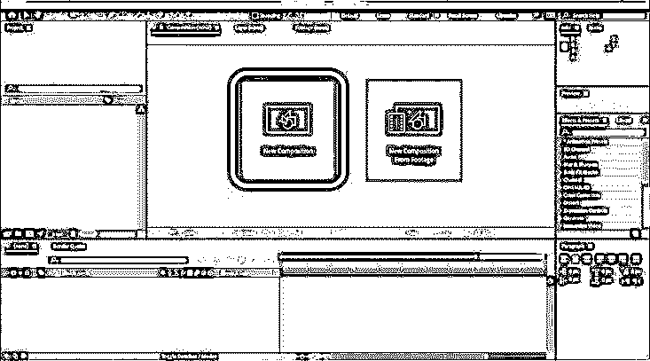

根据需要，使用宽度、高度、名称、预设和其他详细信息等参数配置新组合，然后单击确定。

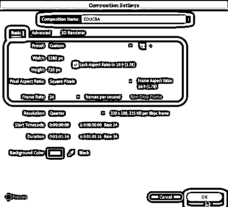

#### 第二步

我们可以看到在应用程序的左上角创建了新的合成，因为我们想要创建一个 3D 文本，所以右键单击左下角的“源名称”选项，然后右键单击图层窗格>选择新建>文本。

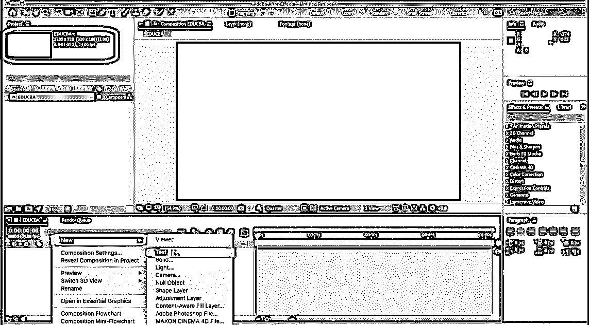

我们可以看到文本选项将出现在屏幕上，word 文件的所有属性，如粗体、前部、大小、下划线、段落、文本颜色以及其他一些个性化的文本都可以在我们创建的文本上进行。

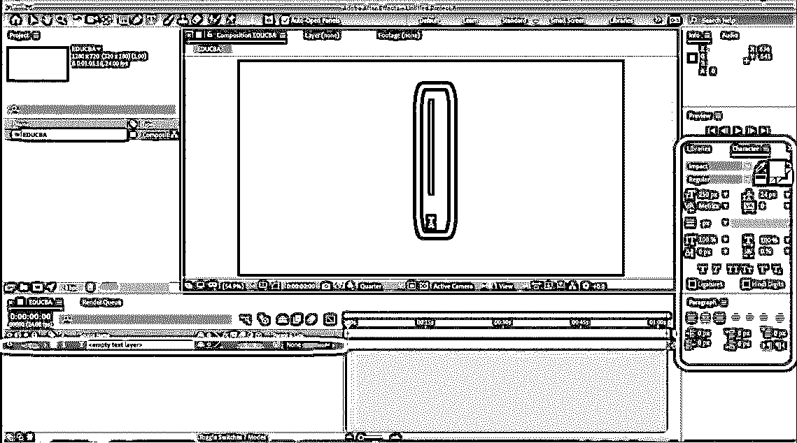

#### 第三步

添加文本后，我们需要添加深度(厚度)。我们需要使 2D 文本的三维立体。这给文本带来了 3D 的外观和感觉。

右键点击图层>新建>实体。

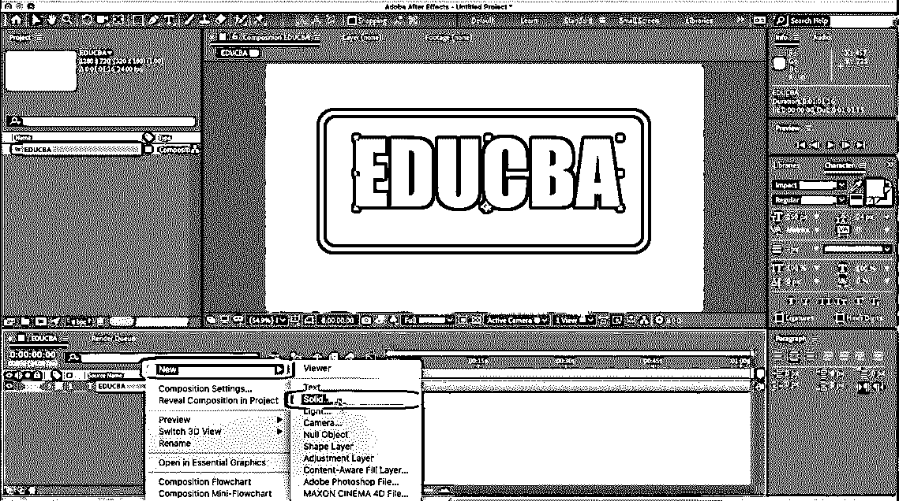

根据需要添加实体属性，完成后单击确定。这种属性增加了内容的深度。我们甚至可以在 z 轴上使用缩放来增加深度。

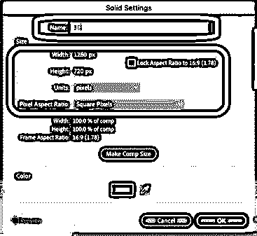

#### 第四步

从图层中选择 3D，为内容添加 z 轴深度，并从菜单栏中选择效果，将光标悬停在“视频副驾驶”上，然后单击元素。菜单栏包含向我们正在创建的数据添加值的效果。

菜单栏>效果>视频副驾驶>元素。

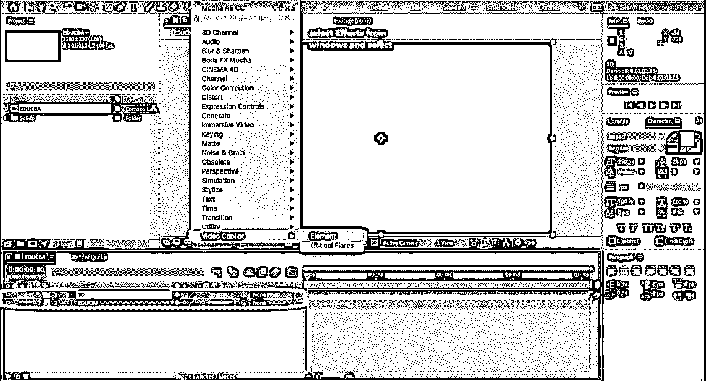

现在，我们可以看到左侧窗格中添加了 3D 元素属性。在疼痛底部层的旁边，我们还有一个计时器面板，我们可以在其中设定每个角度，并制作一个小的动画视频或广告镜头。

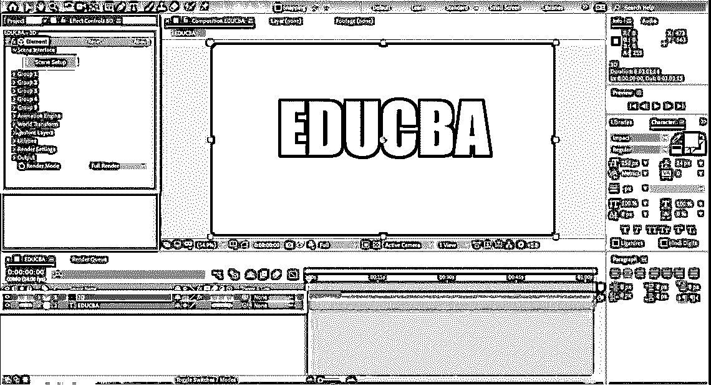

#### 第五步

选择自定义图层>自定义文本和遮罩>路径图层 1 旁边；没有下拉选择“Educba”层应用纹理的三维文本。

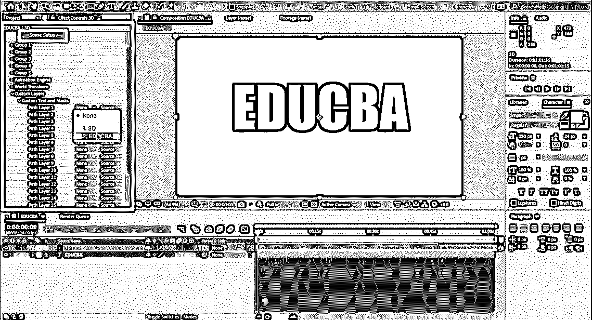

如下所示，场景设置窗口打开，选择挤出选项。正如我们所看到的，在同一个窗口中还有多个选项。实体文本 3D 对象的挤压选项的属性的预置，视觉外观，材料，场景，预览和编辑的挤压属性可以做。

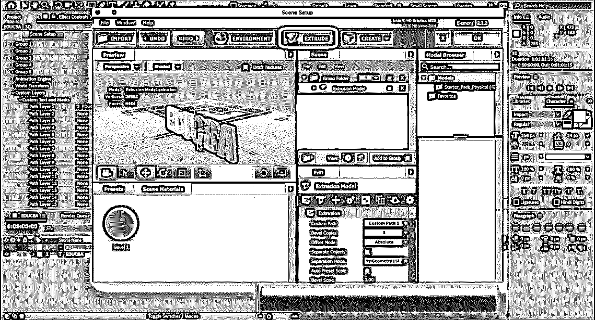

#### 第六步

根据要求旋转并目视检查文本的深度、高度和宽度。有固定颜色纹理兰伯特或纹理文件的预置。还有许多其他选项，如调整大小、旋转、移动、相机角度和投影等。

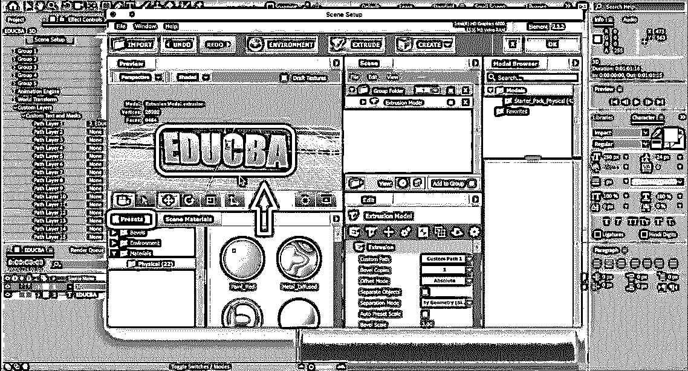

通过拖放颜色库中可用的颜色纹理，可以在同一个窗口中更改材料和文本的属性。我们可以执行一些属性，如斜角大小、挤压、挤压边缘、斜角曲线等等，以提高文本的视觉标准。

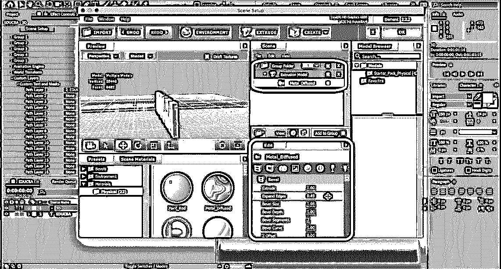

#### 第七步

学员可以探索这些选项。有多种预设和插件可用于修改火、水、火焰等多种视觉外观的文本。下面是几个相同的例子。探索应用程序可用的源代码在实践中很重要。默认情况下，应用程序的基本安装将提供多种材质差异和预设。

当使用输出文件或 MP4、GIF 和许多其他文件格式制作动画时，可以应用平滑文本边缘、笔触、预设、填充颜色来提高文本的视觉标准。

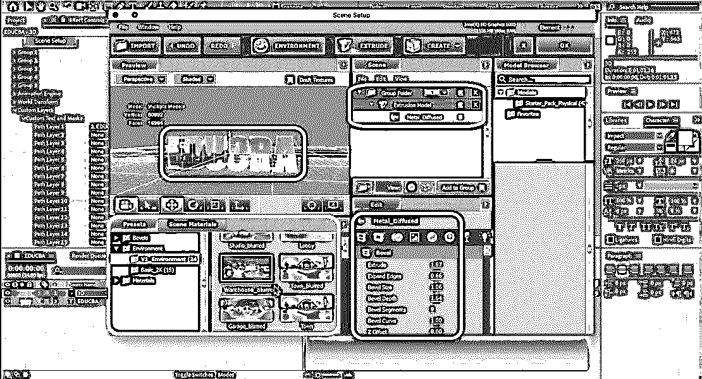

#### 第八步

下面是一个带有金色的 3D 文本的例子。我们甚至可以添加摄像机、灯光和帧视频来设置输出所需的持续时间长度。

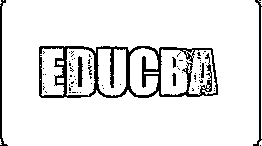

下面添加了银色的 3D 文本。我们可以根据需要添加素材、反思和其他属性。

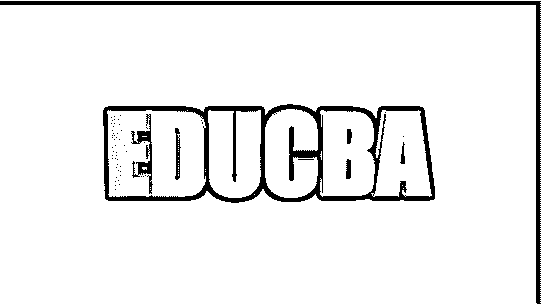

应用程序非常灵活，并且适用于内容。[文字的倒影](https://www.educba.com/reflection-in-illustrator/)，镜像文字，可以使用不同字体的文字标题制作。

我们可以改变层和层的属性。使用适当的动画预设。根据要投影的屏幕大小的需要，使用字符和比例制作源文本层的动画。出现在电影或短片之前的标题、图形标题和扫描都使用了这种技巧。

### 结论

利用这一点，我们可以为 YouTube 频道、电视节目、电影片头等的标题主题和效果创建 3D 文本。除此之外，我们还看到了内容的效果和音频轨道，使其对观众来说更加有趣和直观。这个完整的课程需要与理论一起实践，以便更好地理解和获得实践经验，以便在需要时以更明智的方式和更少的时间加以应用。系统兼容性也必须检查，因为一天结束时，我们需要渲染。商业私立大学、跨国广告公司和其他公司使用相同的技术来创建他们的广告片段。在国内和国际市场上，特效专业人员有很多机会在游戏、电视、VFX、电影后期制作和各种其他娱乐工作室找到工作。

### 推荐文章

这是一个关于 3D 文本的指南。在这里，我们讨论如何创建三维文字后，效果一步一步与给定的截图。您也可以看看以下文章，了解更多信息–

1.  [Illustrator 中的 3D 效果](https://www.educba.com/3d-effects-in-illustrator/)
2.  [搅拌机中的 3D 文本](https://www.educba.com/3d-text-in-blender/)
3.  [三维动画软件](https://www.educba.com/3d-animation-software/)
4.  [后期效果中的 3D 效果](https://www.educba.com/3d-effects-in-after-effects/)

