# 在后效中变形

> 原文：<https://www.educba.com/morphing-in-after-effects/>

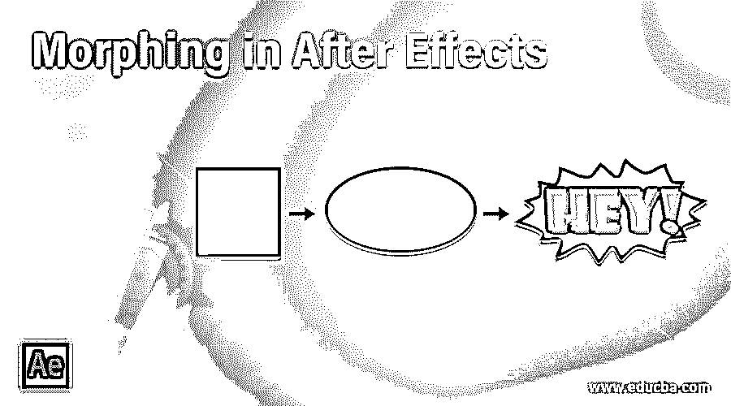

## After Effects 中的变形介绍

After Effects 中的变形用于实现从一个图像到另一个图像的无缝过渡。因此，它可以是任何图像或形状或矢量图形。变形的起源可以追溯到 16 世纪，当时一幅名为 Tabula scalata 的画有两幅图像，由于每幅图像只能从一个特定的角度看到，所以在有脊或有槽的表面上进行分割。当从一个角度改变到另一个角度时会发生变形。在 18 世纪的 T2，机械变形导致了变形，就像使用机械幻灯幻灯片来改变人物的外形。

在这篇文章中，我们将变形后的效果形状。我们将看两个例子，其中我们将把矩形变形为三角形，然后我们将把三角形变形为火箭。

<small>3D 动画、建模、仿真、游戏开发&其他</small>

### 在 After Effects 中创建变形的示例

以下是在 After Effects 中创建变形的两个不同示例:

#### 示例 1–将矩形变形为三角形

**第一步:**新建一个项目，会得到如下图的界面。如果您没有看到如下所示，那么进入窗口>工作区>默认，这将把我们带到同一个屏幕上。

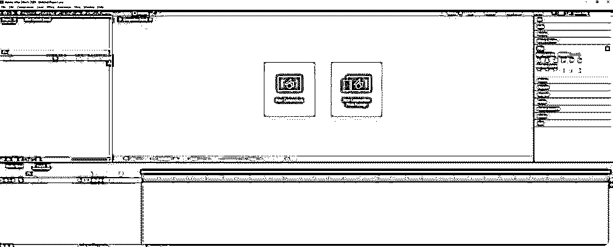

**第二步:**现在在项目窗口中右键单击创建一个新的组合，并给它起一个名字，其他的保持默认。

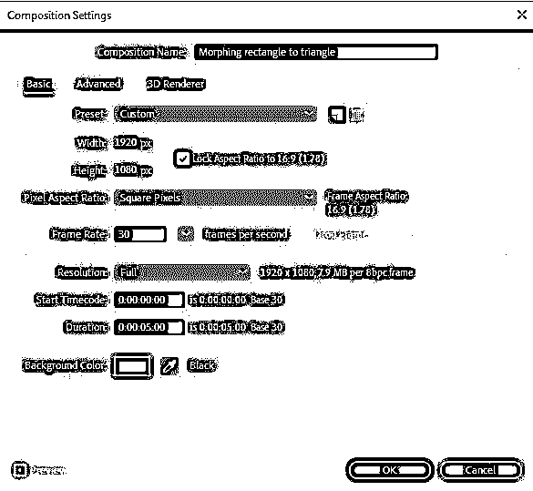

**第三步:**接下来在时间线窗口中，右击并创建一个新的>实体。

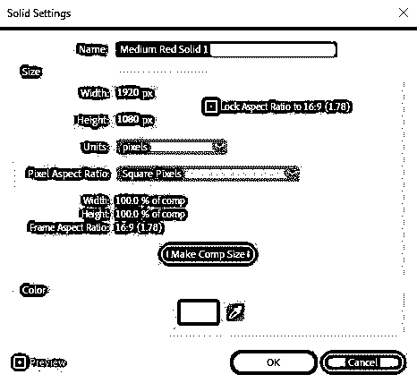

**步骤 4:** 创建纯色背景后，点击锁图标，将害羞开关设置为开，这样我们就不会意外选择背景。

**步骤 5:** 现在选择一个矩形工具或按 Q 键，并通过按 shift 键创建一个正方形，如果锚点不在中心，然后选择工具后面的平移，并将锚点调整到中心。可以按 ctrl 键捕捉到中心。所以当我们制作动画时，过渡是从中心开始计算的。

第六步:现在选择多边形工具，匹配它的大小为矩形，将正方形和三角形对齐到构图的中心。同样，设置 polystar 路径 1 指向 3，这样我们得到一个三角形。减少两个形状的不透明度，这样我们就可以看到修改的路径。按 T 键选择透明度，您可以从这里直接更改不透明度。

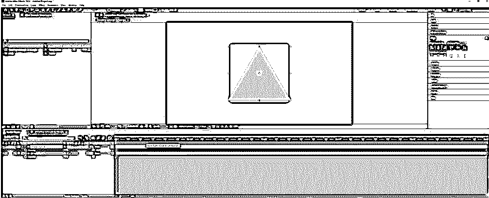

第七步:这是选择两层的路径并转换成贝塞尔路径的重要步骤。

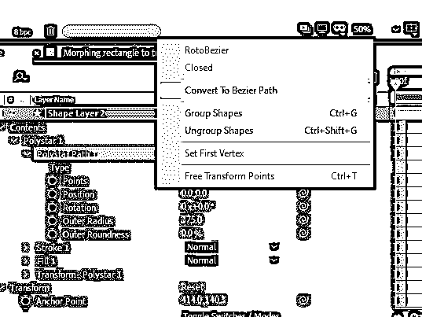

步骤 8: 现在将矩形解组，以获得动画路径，并将图层分别重命名为三角形和正方形。

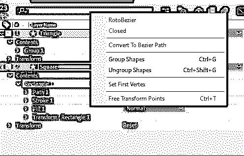

**第九步:**解组后，点击秒表图标，在时间轴上 15f 左右为 path 属性设置一个关键帧，变为蓝色，表示为时间轴中选中的帧设置了关键帧。然后将滑块移动到 20f，将矩形的形状调整为三角形。

**步骤 10:** 将矩形的路径调整为三角形后。将时间轴移动到 1 秒左右后，按 N，这样会缩小你的工作区域，不需要将时间轴点击到零就可以重复测试。

**步骤 11:** 为了查看最终的渲染，我们可以从 after-effects 中导出它，或者使用 adobe media encoder，这是一个用于编码和视频渲染的独立程序。

**步骤 12:** 现在，我们将使用媒体编码器来导出，因为我们可以继续处理项目，而编码和渲染将在后台进行。如果我们选择从 after effects 中导出，这在小项目中没有关系，但在大项目中可能需要很长时间，这取决于设置。

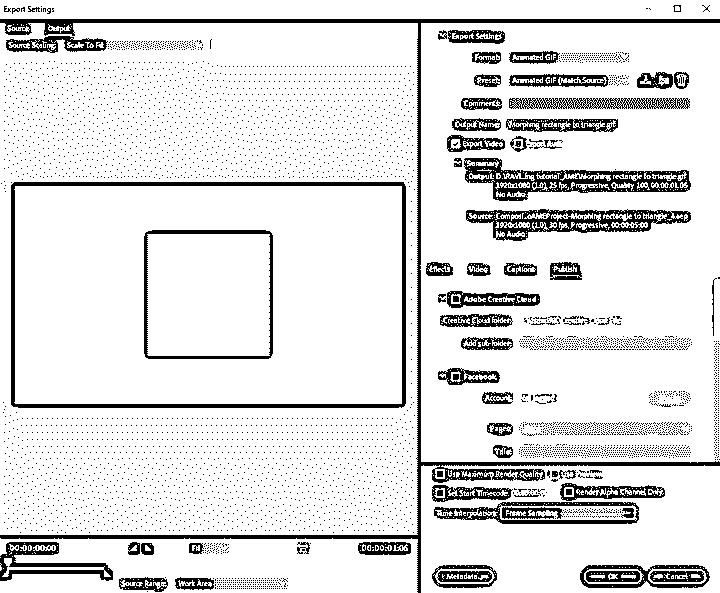

#### 示例 2–将三角形变形为火箭

现在你知道了变形的基础，你已经把矩形变成了三角形。我们现在将一个三角形变形为一个更高级的火箭形状。

第二步:在这一部分，我将使用 illustrator 矢量文件，它具有火箭的形状，并将其路径变形为三角形，以获得一个很酷的效果。

步骤 3: 我们将创建一个新的组合，因为一个项目中可以创建多个组合。

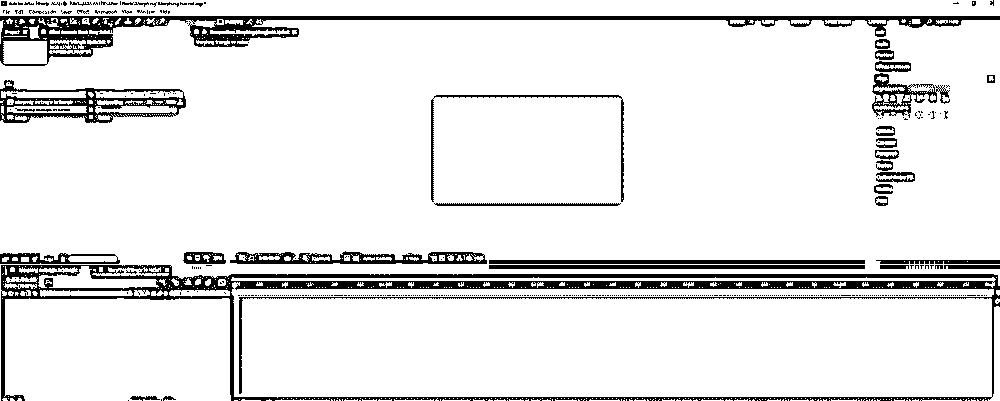

第四步:我们已经创建了一个深灰色背景的实体，并隐藏它，设置了害羞，所以我们不改变背景。

**第五步:**双击项目窗口，导入 rocket.ai 文件。你可以创建自己的文件或下载任何包含火箭演示形状的人工智能。

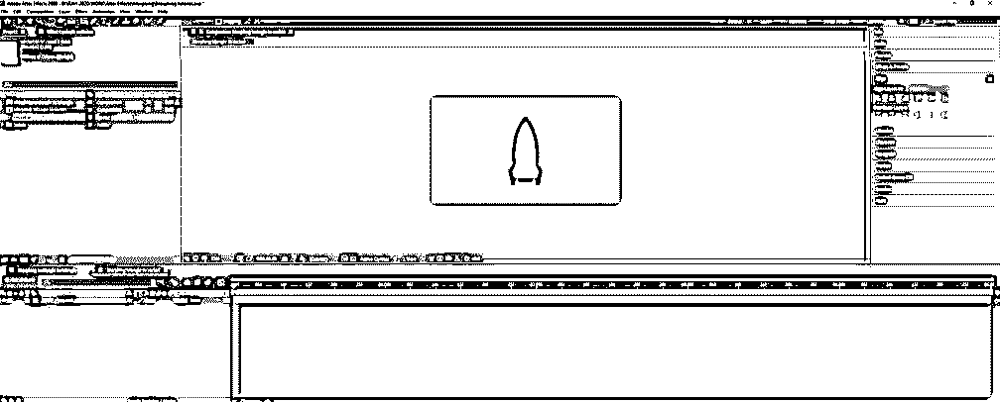

步骤 6: 使用多边形工具创建一个三角形，如前所述。然后转换。ai 文件添加到形状中。ai 文件和创建>从矢量层创建形状。我们可以删除原件。ai 文件。

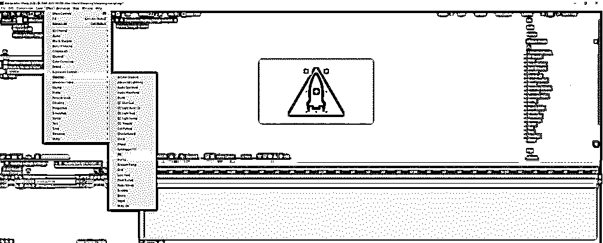

**第七步:**添加一个效果，进入效果>生成>填充，选择白色。

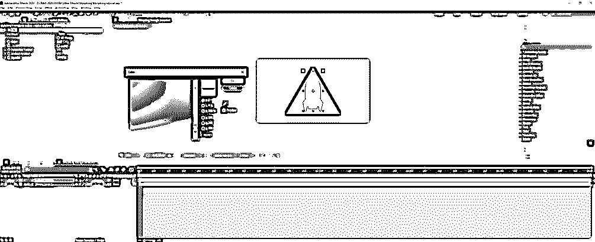

**步骤 8:** 为火箭的路径属性添加一个关键帧。现在我们必须将这些点转换成一个三角形。

**第九步:**调整火箭的路径到三角形，如下图。此外，减少不透明度，这样我们就可以看到路径的变化。

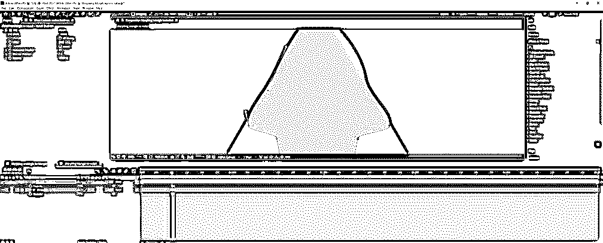

**第十步:**火箭的所有路径点都要对齐三角形，如下图。要正确对齐，您应该使用贝塞尔手柄，这将改变曲线的长度和角度。

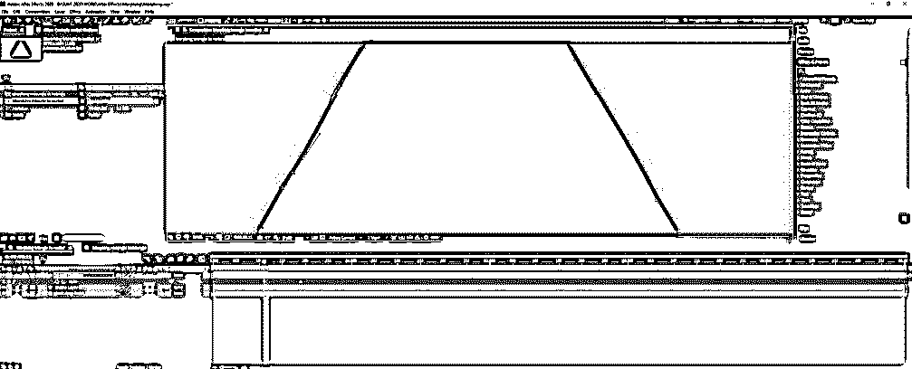

步骤 11: 现在隐藏或删除不再需要的三角形。播放时间轴上的动画后，现在可以看到火箭转化为三角形。所以，我们要做的是选择过渡到三角形的关键帧，并把它放在火箭的前面。

**步骤 12:** 播放完动画后，你看到三角形被变形为一部类似火箭的科幻电影，该电影通过变换角色的形状来实现变形效果。

最后，我们可以做一些增强，因为现在我们可以看到动画是线性的。我们可以添加一些缓和，这将给我们一个很好的效果。

**步骤 14:** 添加它，通过拖拽选择所有关键帧，点击右键，选择关键帧速度。在弹出窗口中，将传入速度和传出速度的影响设置为 75%。

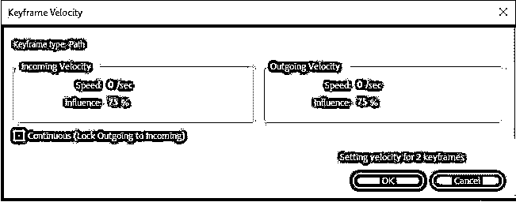

**第十五步:**一些有用的快捷方式。按住 ALT 并双击任何关键帧；这将带来关键帧速度弹出。按住 CTRL 并单击任何关键帧将删除轻松。

### 结论

我们已经成功地完成了变形后的效果，因为我们已经将形状从一种形式转换到另一种形式。类似的技术可以用来实现面部和图像的高级变形。

### 推荐文章

这是一个在特效中变形的指南。在这里，我们讨论一个介绍和两个不同的例子，以一步一步的方式创建变形效果。您也可以浏览我们的其他相关文章，了解更多信息——

1.  [在后效中遮蔽图层](https://www.educba.com/masking-layers-in-after-effects/)
2.  [在特效后将图层分组](https://www.educba.com/group-layers-in-after-effects/?source=leftnav)
3.  [后效中的毛刺效应](https://www.educba.com/glitch-effect-in-after-effects/?source=leftnav)
4.  [后效合成](https://www.educba.com/composition-in-after-effects/?source=leftnav)

