# 在效果后收缩

> 原文：<https://www.educba.com/twitch-in-after-effects/>

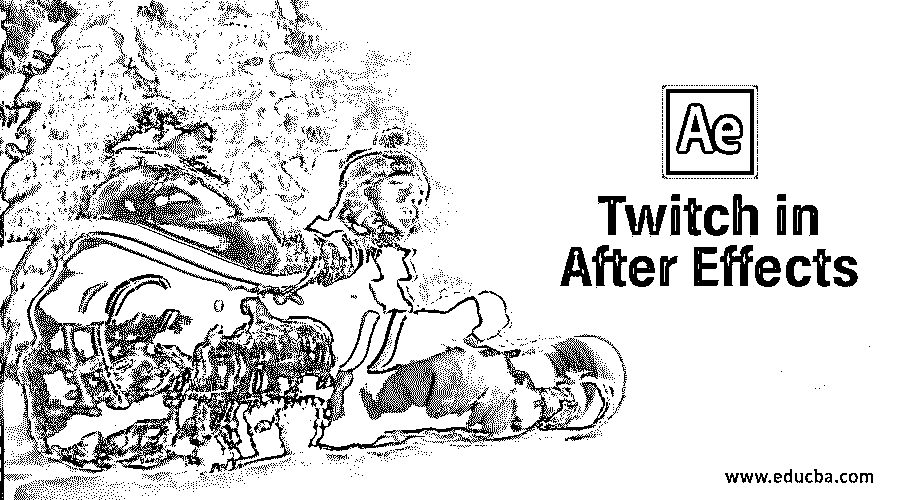

## 后效中的抽动介绍

Twitch 是一个 After Effects 插件，它使用随机操作符与运动图形同步来创建有风格的视频效果，从而创建一个视觉效果。

有 6 个操作员:

<small>3D 动画、建模、仿真、游戏开发&其他</small>

*   **模糊操作符:**该操作符功能使用纵横比控制、阈值滑块和转移模式来控制模糊。
*   **颜色操作符:**可以使用这个操作符给抽搐上色，创建随机的颜色，根据需要既有趣又有用。
*   **灯光操作符:**使用该操作符，可以添加亮度或暗度或者两者都添加，基本控制场景的曝光。
*   **缩放算子:**该算子使用随机锚点选择和运动模糊来实现缩放效果。
*   **幻灯片操作器:**对运动模糊、幻灯片、高级 RGB 分割有控制。
*   **时间操作器:**可以将素材的定时改为偏移，实现一次回放和第四次效果。

### 正在为 Windows 安装 Twitch 插件

从视频 copilot 的网站下载插件后，第一步是关闭 After Effects。然后进入“C:\ Program Files \ Adobe \ Adobe After Effects 2020 \ Support Files \ Presets”文件夹，复制“__-Twitch-__”文件夹。然后进入插件文件夹，创建一个名为“Twitch”的文件夹，根据 windows 的 32 位或 64 位 os 复制“twitch.aex”和“twitch_ae.key”。现在打开 After Effects，在效果和预设部分，会有一个 Video Copilot 的子文件夹，在里面，会有一个抽动的效果。此外，在动画预设部分，将有一个带有预建自定义效果的 twitch 文件夹。

#### 1.使用 Twitch

**步骤 1:** 在 After Effects 中新建一个项目，用默认设置新建一个构图。

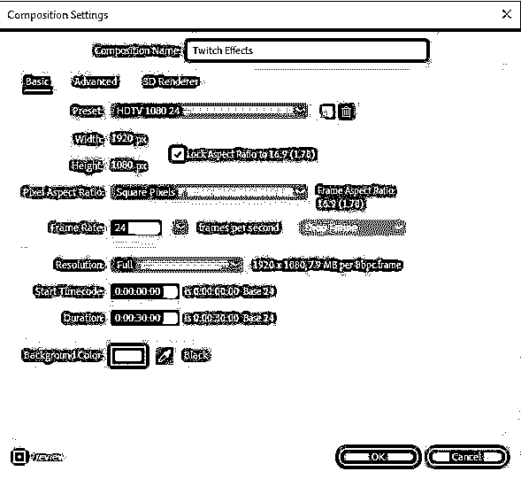

**第二步:**双击项目窗口导入视频。你可以从 pixels 等网站下载任何免费的股票视频。

**第三步:**现在在图层面板上拖动视频，如下图。

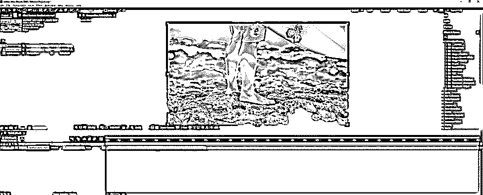

**第四步:**接下来，在图层面板中右键点击或者进入图层>新建>调整图层，创建一个调整图层。这是因为我们将我们的效果应用到这一层，而不是实际的视频。

**第五步:**进入效果和预设面板；在视频 Copilot 文件夹中，你会发现抽动效果。在选择了调整层的情况下，在效果控制面板中拖动它，现在如果您拖动时间轴，您将不会获得效果，因为操作符当前未启用。

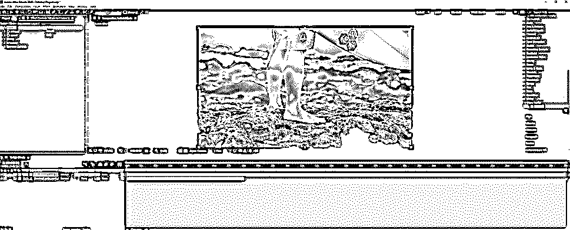

**第六步:**要启用效果，去启用>模糊，现在如果你播放，你会得到以下效果。

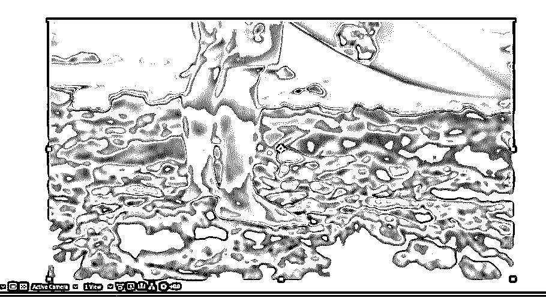

**第七步:**同样，我们也可以单独或与多个操作符组合使用其他操作符。当您启用某个操作员时，在“操作员控制”部分，将为该选定的操作员启用相应的控制。

**步骤 8:** 数量、速度和行为是全局调整，将应用于所有启用的操作符。

#### 2.全局调整

*   **数量:**该值控制来自抽动的输入强度；数量越多，效果越强烈
*   **速度:**该值控制抽搐发生的间隔。该值越小，抽搐会间歇性地发生，在设定的时间内越少，而该值越大，抽搐会更有规律地发生，抽搐之间的间隔会减小。
*   **行为:**缓入和缓出控制抽动的开始和结束以及平滑度。
*   **边框:**调整使用滑动操作符时边框的显示方式。
*   **仅显示抽动:**使用此选项将仅显示抽动，否则屏幕空白。要看到这一点，复制视频层，设置模式为经典差异，并隐藏调整层，并删除底部层的抽搐效果。

*   种子值用于随机化效果，这意味着如果您在另一个场景中应用相同的效果，则行为将根据种子随机化。

#### 3.单个控件

这些是特定于您选择的操作符的控件，如模糊，它将有自己的一组控件，并使用自己的一组操作符控件来着色，等等。这可以单独调整，非常直观。

*   **模糊:**可以控制模糊量和色调。转移模式可以改变，以实现不同的效果，随着模糊增强。模糊不透明度也可以设置一个独特的模糊种子。还有一个选项可以启用镜头模糊效果。模糊抽搐可以设置抽搐的间隔。
*   **颜色:**颜色毛刺效果可以用随机化颜色产生，颜色和随机化的数量可以设置。颜色抽搐可以设置抽搐的间隔。
*   **光:**光量可以根据光线如何影响更亮、更暗或两个区域来设置。轻抽搐可以设置抽搐的间隔。
*   **缩放:**这个操作符用金额和缩放发起者来缩放视频，起源甚至可以随机化。缩放抽搐可以设置抽搐的间隔。
*   **滑动:**滑动方向、扩散、运动模糊、量随趋势可控制。此外，RGB 分离允许创建彩色毛刺幻灯片效果。滑动抽搐可以设置抽搐的间隔。
*   **时间:**通过根据数量前后移动来控制剪辑的时间。时间抽搐可以设置抽搐的间隔。

#### 4.动画预设

在动画预设部分有一些现成的预设可用。您可以直接将单个预设或多个预设的组合拖到调整层上。

##### 以下是一些预设示例:

**1。失真效果差**

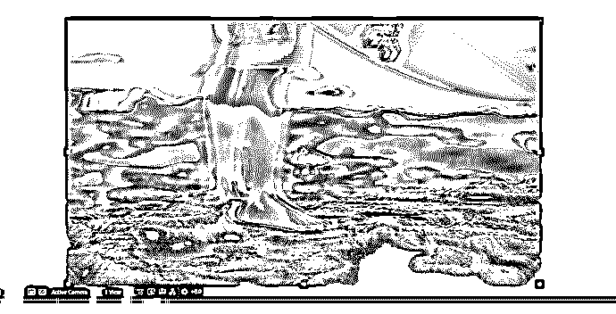

**2。不良电影门效应**

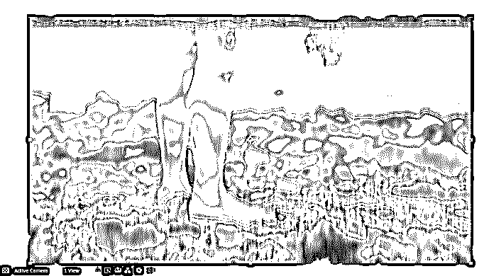

**3。蓝色发光效果**

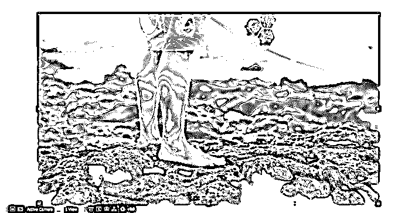

**4。无色闪光效果**

**5。时装表演效果**

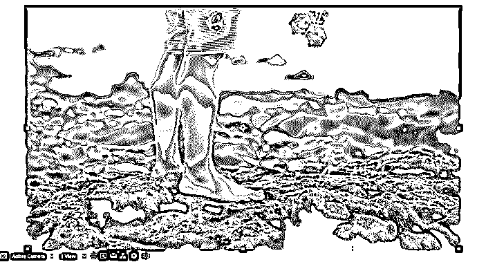

**6。绿色街道效应**

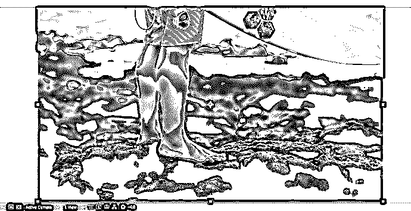

7 .**。夜总会效应**

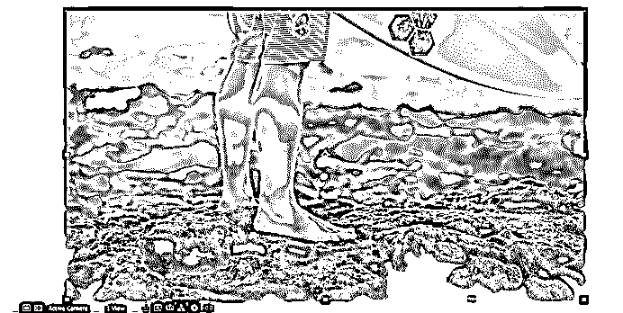

**8。橙色变色效果**

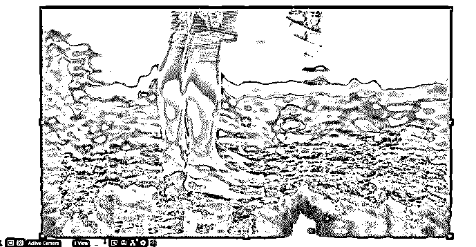

**9。随机彩色闪光效果**

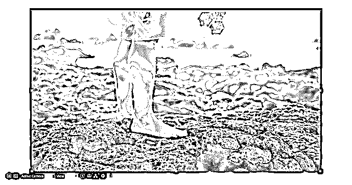

10。锐利的闪光效果

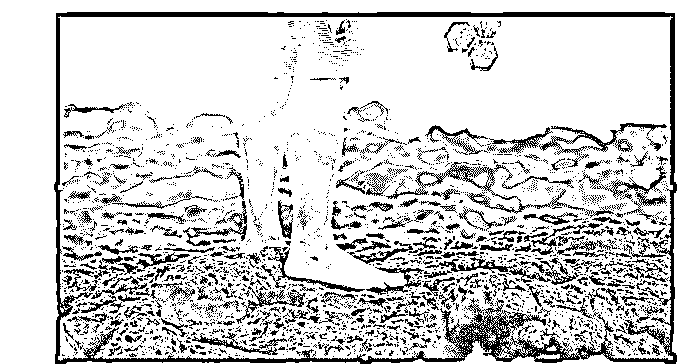

**11。过渡绽放效果**

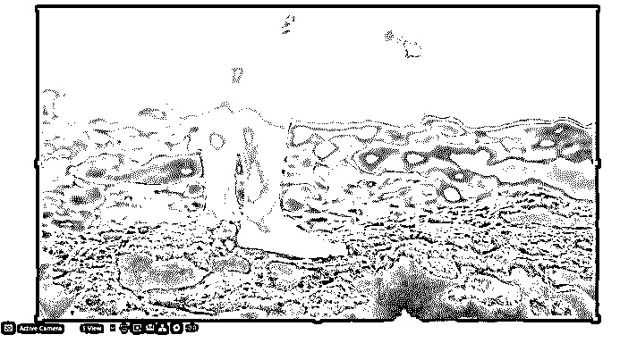

### 结论——在后效中抽动

我们已经看到了如何在 After Effects 中使用 Twitch 插件来实现所需的效果，有效地使用操作符和可用的预设来创建主类效果。

### 推荐文章

这是一个在效果后抽动的指南。在这里，我们通过下面的例子来讨论介绍以及如何使用抽动效果。您也可以浏览我们的其他相关文章，了解更多信息——

1.  [Logo 展示后效果](https://www.educba.com/logo-reveal-after-effects/)
2.  [后期效果中的混合模式](https://www.educba.com/blending-modes-in-after-effects/?source=leftnav)
3.  [After Effects 中的轨道遮罩](https://www.educba.com/track-matte-in-after-effects/?source=leftnav)
4.  [后效中的透明背景](https://www.educba.com/transparent-background-in-after-effects/?source=leftnav)

