# 后效降雪

> 原文：<https://www.educba.com/snowfall-in-after-effects/>

## 后效中的降雪介绍

现在一天的人已经开始创造自然的东西，像雨，雪等。在图形方面，图形软件开发对制作公司来说是一个很好的优势，因为一些不可能的事情将通过图形来创建，而一些有风险的事情将在图形中完成。

后效是视觉图形的最佳应用之一。大多数制作公司使用这个应用程序来创建图形。创造雪后的效果很容易；这和创造雨是一样的。在粒子的帮助下，我们可以在后期效果中创建降雪，并且，我们在后期效果中有默认的雪效果。

<small>3D 动画、建模、仿真、游戏开发&其他</small>

让我们尝试两种方法来创造雪。

### 创造降雪效果的方法

下面是在 Adobe 软件中创建降雪效果的方法和基本步骤。

#### 方法 1——带颗粒的雪

第一步:我们将用粒子创造雪；打开一个新项目。

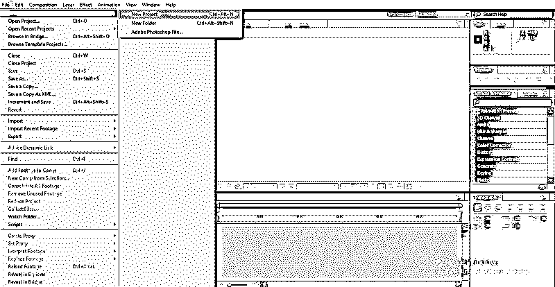

**第二步:**导入文件。

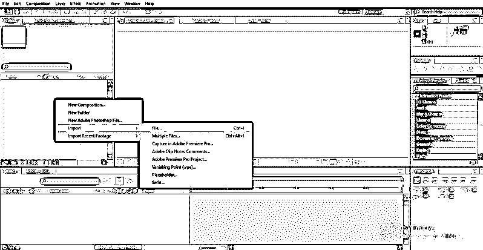

我们可以根据自己的要求导入图像或视频。在这里，我正在导入一个图像文件。

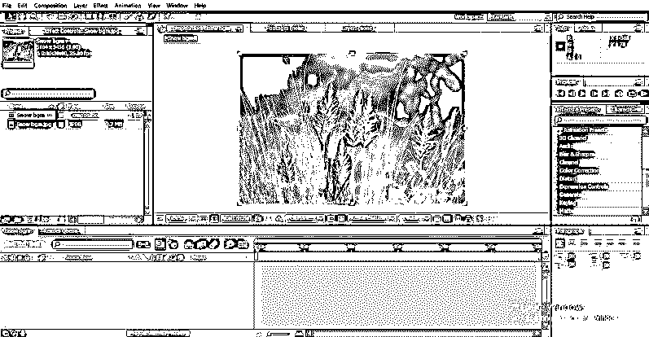

**第三步:**导入实体层。

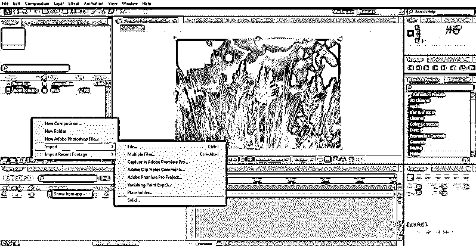

如下面窗口所示，对实体设置进行更改，并单击“确定”按钮。

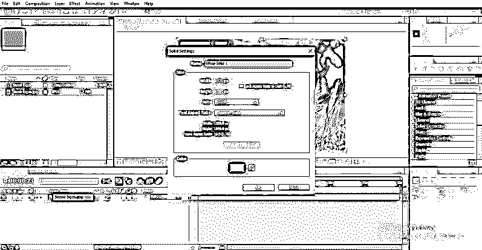

选择白色填充颜色。

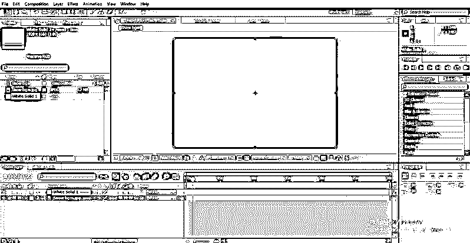

**第四步:**我们需要给图层应用一些粒子效果，也就是说我们要把实体层改成雪，因为我们需要给实体层应用 CC 粒子世界。转到效果和模拟，然后选择 CC 粒子世界。

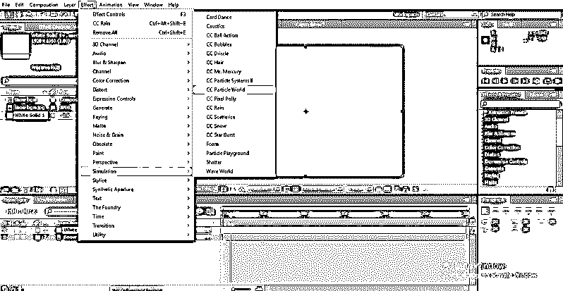

我们也有不同的选择来获得效果。转到“效果和预设”窗口，搜索效果。

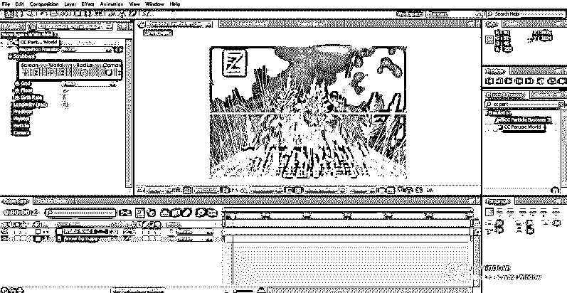

**第五步:**一旦我们应用了效果，图层就完全变成了粒子。

我们在屏幕上看不到任何东西；如果我们想看到效果，只需移动光标，然后我们就可以看到粒子。

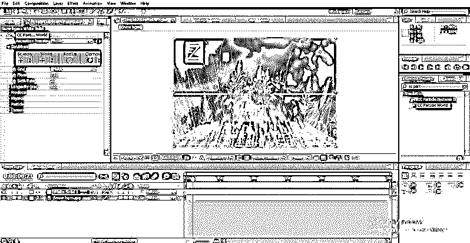

第六步:现在，我们要把粒子变成雪，进入配置窗口，取消选中网格。

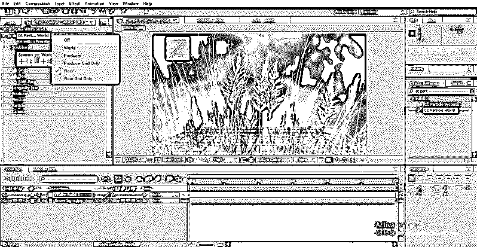

一旦在可视窗口中取消选中网格线并禁用轴，输出也将显示出来。

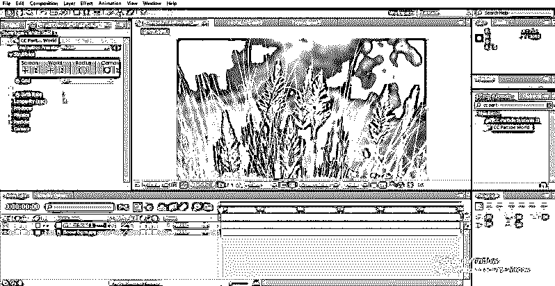

步骤 7: 在这个配置窗口中，我们将主要使用制作人、物理和粒子。如果我们很好地扩展这个选项，我们将有完美的雪效果。

**第八步:**先说粒子；当我们看到线中的粒子类型时，这就是为什么它看起来像火花，所以我们需要让粒子看起来像降雪。

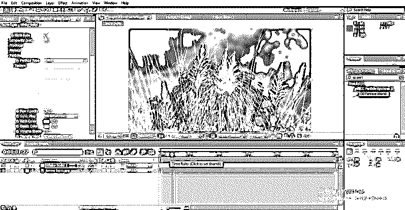

第九步:现在我们需要改变粒子类型；怎么换类型？雪是什么样子的？像球体一样的小水滴。将粒子类型更改为褪色球体。

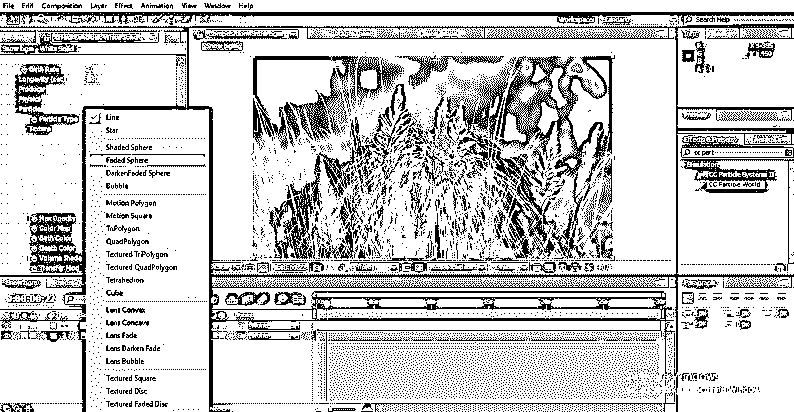

一旦我们改变粒子的类型，我们可以发现粒子的形状变化像一个圆形和模糊看起来像雪一样柔软。

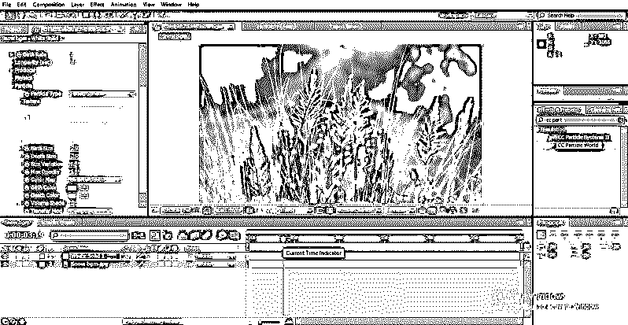

步骤 10: 现在我们需要改变这些粒子的颜色，因此，我们需要改变出生和死亡的颜色。

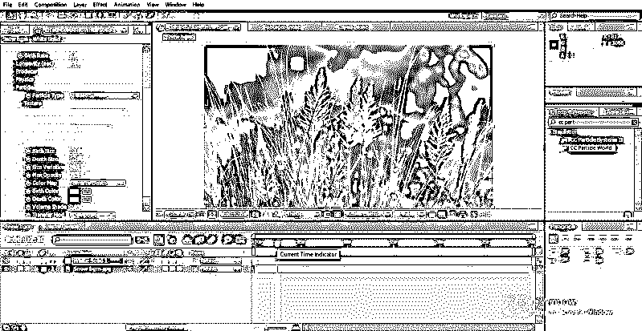

该表演也会出现在下面的窗口中。

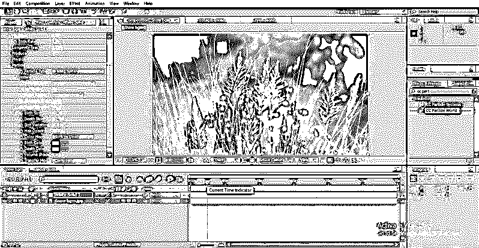

我们把出生和死亡的颜色命名为白色，因为出生的颜色意味着它是开始，而死亡的颜色意味着雪在开始和结束时必须是白色的，所以我们命名为白色。

**第十一步:**我们来展开物理值。物理学最重要的选择是改变重力和速度等。;只要改变重力，我们就能制造降雪。将重力更改为 0.300，速度更改为 1.50

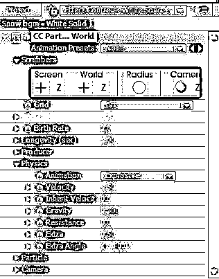

**第 12 步:**现在，让我们扩展生产者选项。在生产者选项中，我们可以找到半径 X，半径 Y 和半径 z。只需点击半径并向右拖动，直到你得到完美的长度和高度。对所有三个 XYZ 半径都这样做。

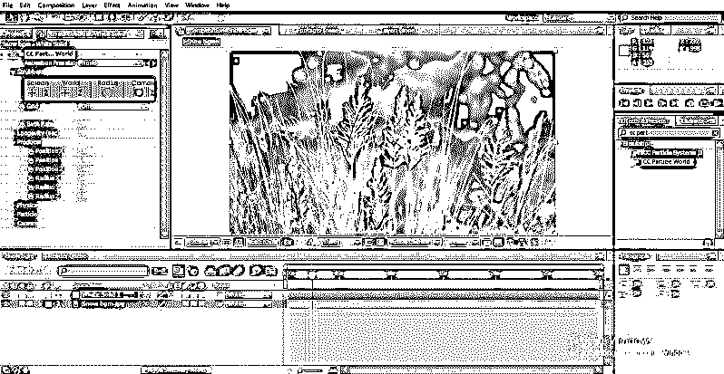

扩大半径值后，雪的高度和宽度发生了变化。x 半径表示宽度；如果我们增加 X 半径，粒子会水平膨胀。y 半径表示高度；如果我们增加 Y 半径，粒子会垂直膨胀。通过扩大 Z 半径，我们可以前后推动分力。

**第 13 步:**此处，颗粒呈散状且量少；为了增加粒子的数量，我们需要增加出生率。

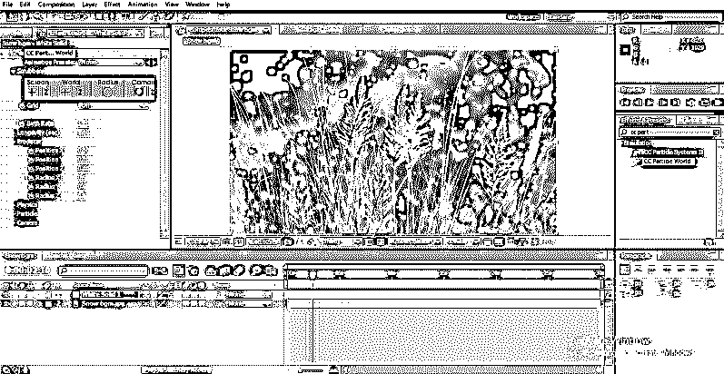

出生率增加后，我们可以看到粒子的数量在增加；现在我们能感觉到它像雪一样。

步骤 14: 用简单的方法，我们创造了雪花飘落；现在，如果我们渲染，我们可以感觉到雪正在落下。

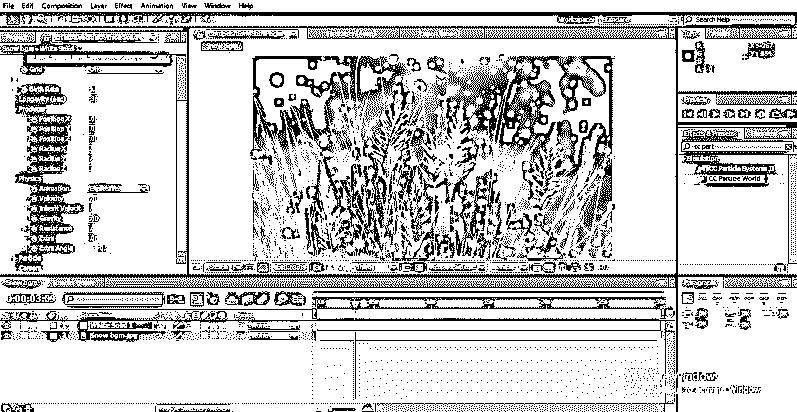

**第 15 步:**我们创造了降雪，在降雪的周围，我们需要创造一种雪效果的氛围。我们有一个容易做这项工作的选择。去效果和预设，并搜索主灯，然后我们可以找到主灯 1.2

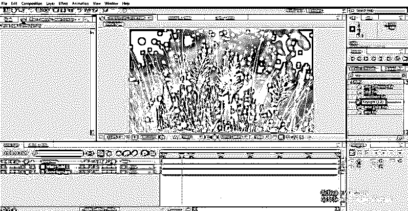

**步骤 16:** 将效果应用于背景图像或视频，无论我们使用什么。

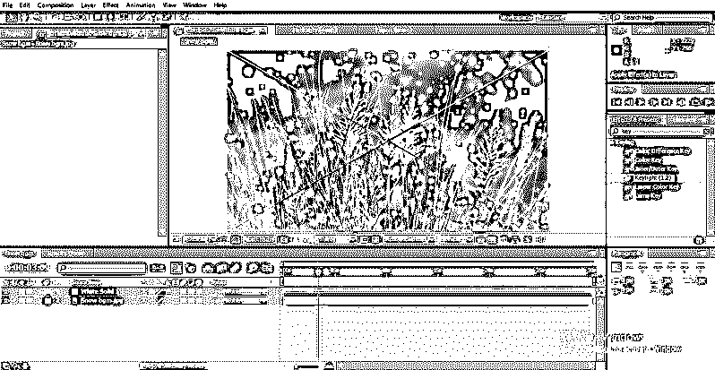

**第十七步:**我们可以得到这样一个配置菜单。按键灯的工作原理类似键控。

第 18 步:选择屏幕颜色，点击图像的背景色或任何我们喜欢的地方，获得雪的感觉。我正在点击绿色。

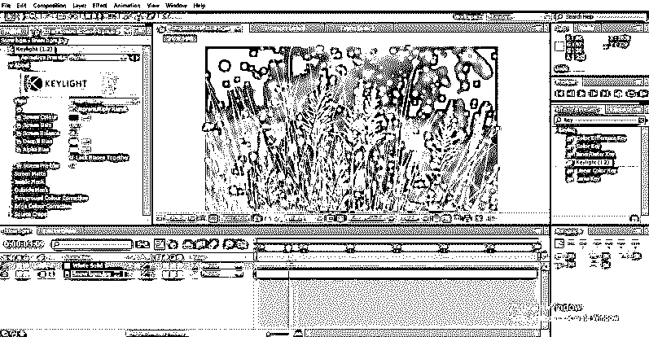

一旦我们点击颜色，那么我们选择的颜色将被禁用，现在雪看起来很自然，我们需要添加一些背景，使这更有效。

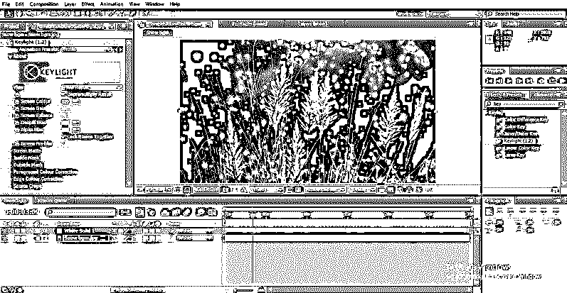

步骤 19: 新建一个纯色图层，颜色为白色。

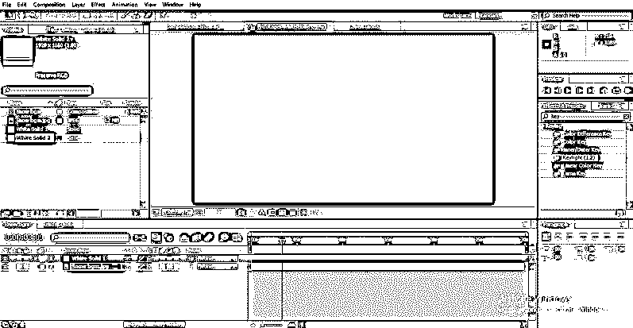

**步骤 20:** 将实体层排列在背景图像后面。

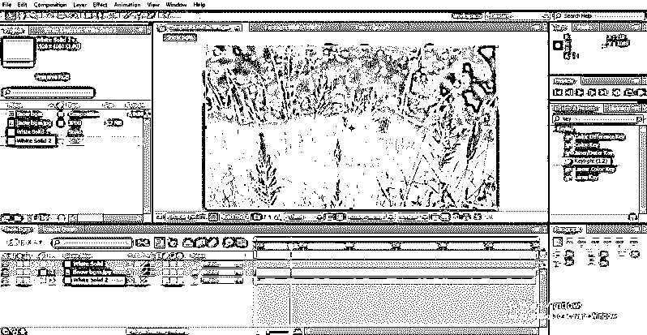

一旦我们应用这个，我们可以感觉到背景充满了雪，使这更有效地调整固体层的颜色校正。

**步骤 21:** 如果我们喜欢调整颜色，我们需要创建一个调整层。转到层，并选择调整层。

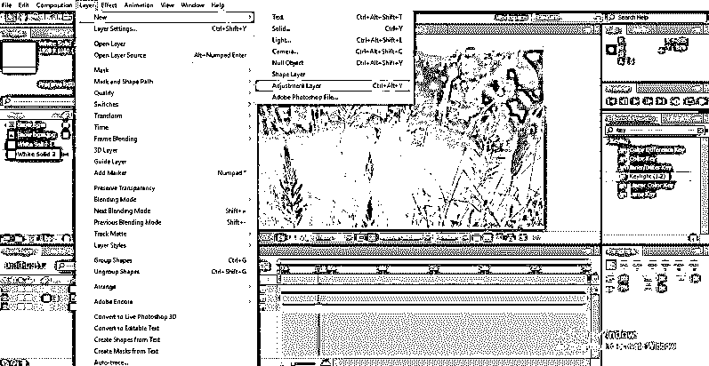

**步骤 22:** 进入效果，展开色彩校正，选择曲线调整背景颜色。

**步骤 23:** 通过调整曲线，我们可以在项目渲染完成后进行良好的输出。

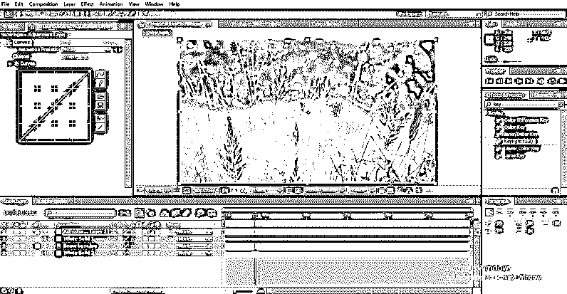

#### 方法 2——涂抹黑色固体层

我们有另一个默认和简单的方法来创造雪；让我们看看。

**第一步:**导入一个黑色实体图层到新项目中。我们只需要采取一个黑暗的固体层，因为雪将是白色的。

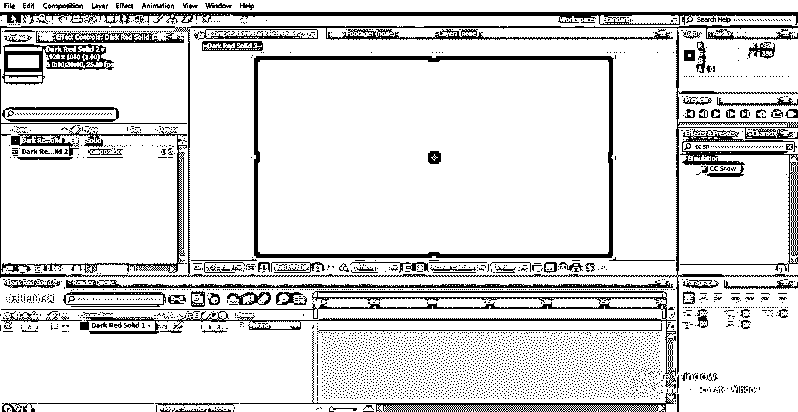

第二步:去效果和预设我们可以找到 CC 雪，应用效果到固体层。

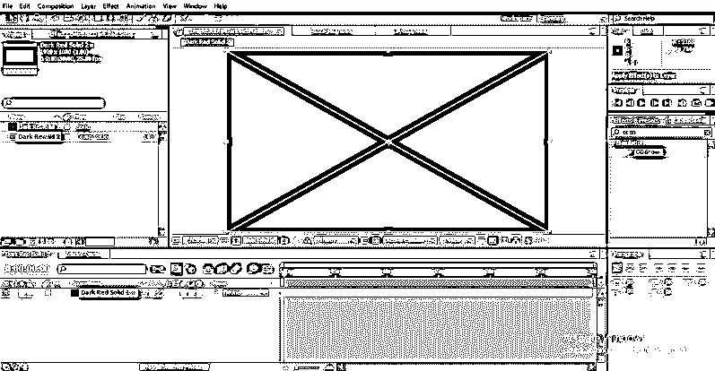

一旦我们申请，我们可以在默认屏幕上看到雪。

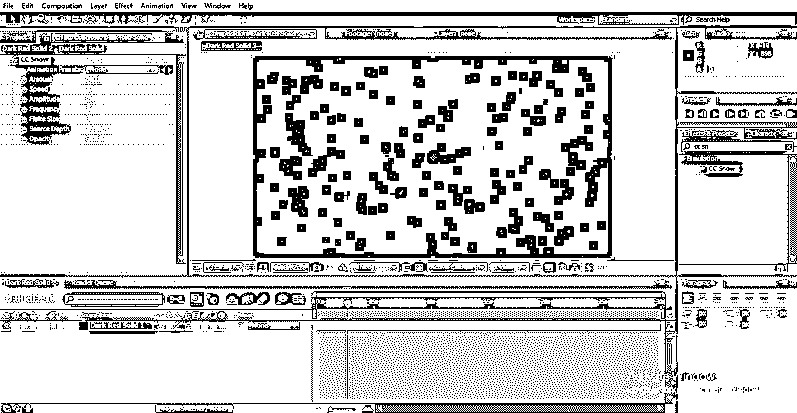

**第三步:**在这里，我们可以找到雪；如果我们想扩大规模，提高速度等。，我们可以在配置窗口中找到选项。我可以用 10 的雪花大小来保持雪的大小稍微大一点。

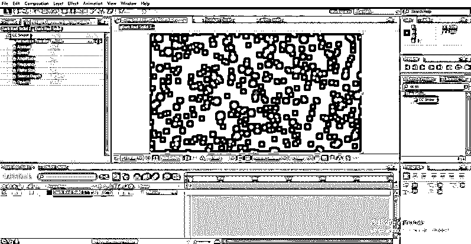

现在我们可以渲染文件了。

### 结论

在这个过程中，我们看到了如何使用 CC 粒子世界来创建雪；我们导入了一个固体层，并用它创造了雪。我们学到了什么？我们学会了如何造雪。如何使用键光，如何使用默认的雪效果，如何扩展值。

### 推荐文章

这是一个关于降雪后效应的指南。在这里，我们讨论了两种方法来创建降雪后的效果，即雪与粒子和应用黑色固体层。您也可以阅读以下文章，了解更多信息——

1.  [在 Maya 软件中渲染的步骤](https://www.educba.com/rendering-in-maya/)
2.  [在 After Effects 中创建文本动画](https://www.educba.com/text-in-after-effects/)
3.  [Photoshop 中排名前 13 的插件](https://www.educba.com/plugins-in-photoshop/)
4.  [如何在 Illustrator 中使用网格工具？](https://www.educba.com/illustrator-grid-tool/)

