# 在 After Effects 中对层进行分组

> 原文：<https://www.educba.com/group-layers-in-after-effects/>

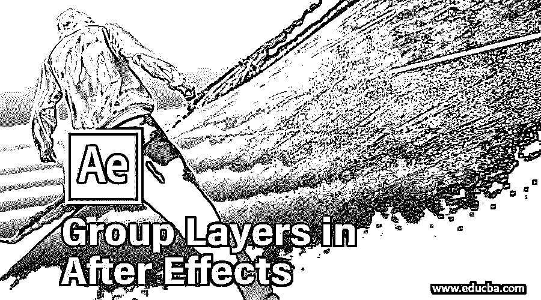

## 后效软件概述

开发 After Effects 软件最初是在 1993 年由罗德岛的科学与艺术公司发起的。他们开发了 1.0 和 1.1 版本。首次启动时，它只能在基于 Mac 的电脑中打开。之后，Aldus 公司增加了新的功能，如运动模糊、多机渲染和时间布局窗口，并推出了新的版本 2.0。1997 年 11 月，动画 GIF 输出和路径文本效果功能免费向用户发布。4.0 版于 1999 年 1 月发布，增加了许多改进。5.0 发布时引入了 Photoshop 6 矢量蒙版导入、PDF 导入、3D 图层和灯光、动态预览等功能。2002 年 1 月，它的 5.5 版本发布了导入相机数据和多个 3D 视图。在引入[创意云后，](https://www.educba.com/what-is-adobe-creative-cloud/)该软件在市场上发布，增加了马辰电影院 4D Lite & Cinewar3e 集成的功能。最新版本是 CC 2020。

Adobe After Effects 软件是 Adobe Systems 开发的最受欢迎的应用软件。它有助于在电影后期制作中创造特殊效果。该软件还用于合成应用程序[的运动图形，该图形由该软件](https://www.educba.com/motion-graphics-in-after-effects/)制作，看起来像实时运动。Adobe [After Effects 软件帮助](https://www.educba.com/after-effects-versions/)艺术家创造出美妙的物体运动轨迹。

<small>3D 动画、建模、仿真、游戏开发&其他</small>

### 如何在 After Effects 中对图层进行分组？

在这里，我们关注的领域是告诉如何使用 Adobe After Effects 软件对图层进行分组。Adobe After Effects 提供了一个预合成系统，用户可以通过该系统创建多个音频和视频剪辑，并将它们混合在一起以创作精彩的剪辑。我们可以添加和编辑我们的图形图像和对象到剪辑中，使它更有趣。为了展示如何在这个软件中对多个层进行分组，我们需要制作或导入多个层，然后我们可以将它们分组或混合在一个文件中。为此，请遵循以下步骤:

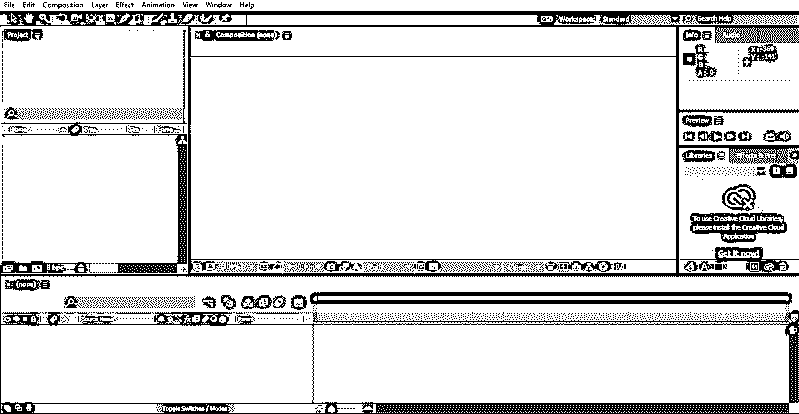

**步骤 1:** 首先，我们需要通过点击屏幕左上角工具栏上的新建图标来创建一个新文件。

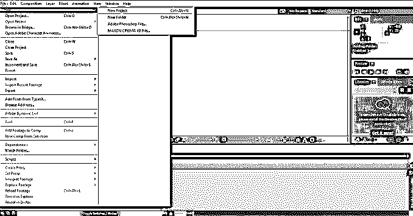

**步骤 2:** 现在转到屏幕左侧的项目面板。右键点击它，然后点击一个新的组成。

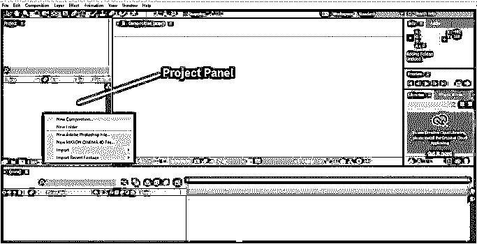

**第三步:**会出现一个弹出框，表示我们构图的一些基本设置，比如预置、宽度和高度(以像素为单位)、帧率、图像的分辨率等。填写所有必需的设置，然后单击 enter 开始构图。

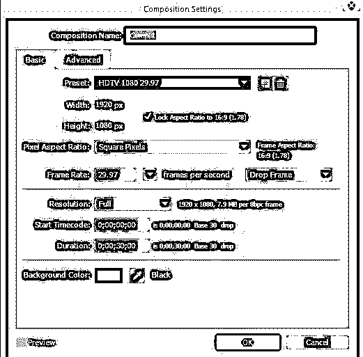

按下 OK 后，下面的窗口将会打开。

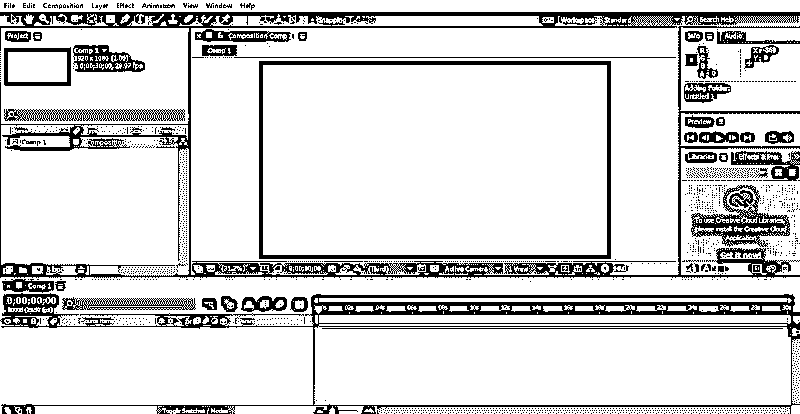

**步骤 4:** 现在从您的系统中导入我们需要在合成中使用的文件。为此，右键单击项目面板并浏览文件的位置。该文件将出现在项目面板中。通过点击激活它。

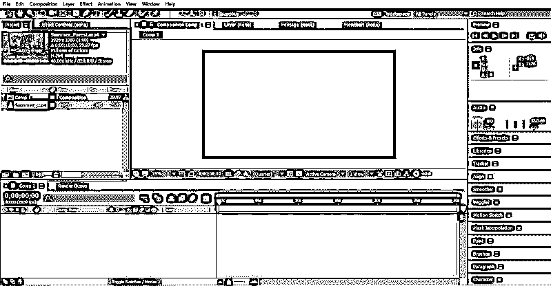

**步骤 5:** 现在，要将该文件添加到您的组合中，请将该文件拖到您的组合文件夹中。这将成为你项目的一部分。它也将开始出现在您的时间线和作曲窗口中。

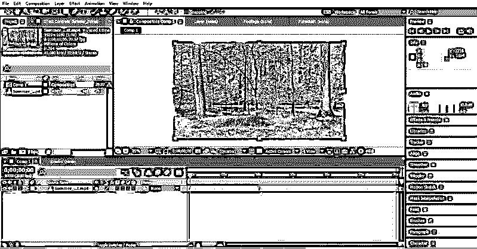

**第 6 步:**您现在可以向我们的作品添加另一个文件或徽标。对于这个导入，通过右键单击项目面板并浏览其位置，已经创建了徽标或文件。

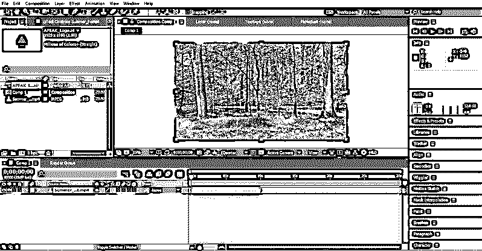

步骤 7: 现在，将这个标志作为我们作品的一部分，遵循与步骤 5 相同的步骤。该标志将开始出现在我们的组成和时间线。

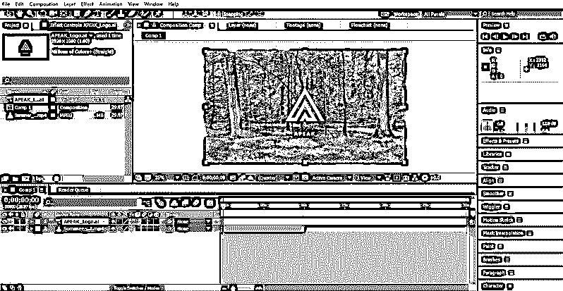

第八步:通过这种方式，我们可以将多个音频、视频文件添加到您的作品中，并根据我们的要求更改它们的时间框架。

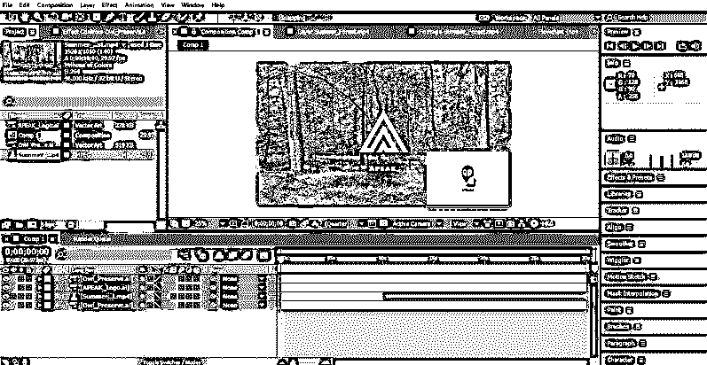

步骤 9: 现在，我们的下一个任务是将时间轴中的所有图层组合成一个图层。为此，通过单击每个层并按下 Ctrl 键来选择时间轴中出现的所有层。

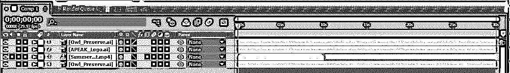

步骤 10: 现在点击图层，从出现的面板中选择“预合成”。

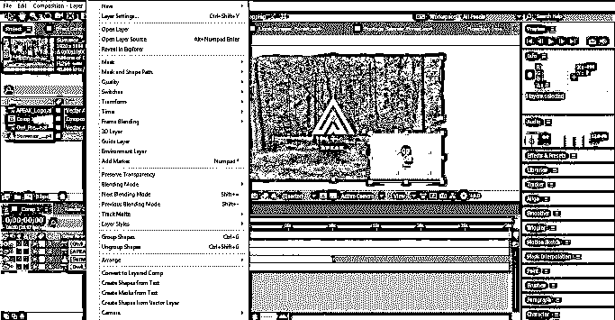

步骤 11: 一个弹出窗口会出现，根据你的要求命名所有图层的新组合。在这里，我们将其命名为“Group 1 ”,然后单击“ok”。

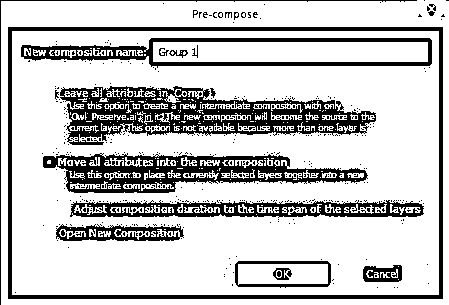

作为组 1 的单个层的名称出现在时间轴中。

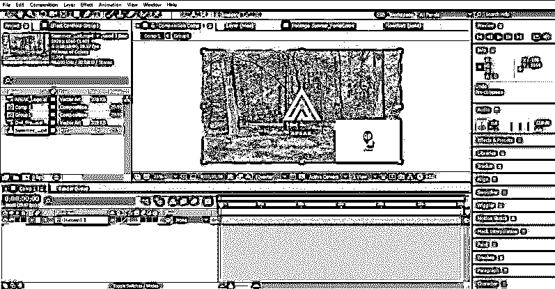

### 结论–在 After Effects 中对层进行分组

上面，我们已经解释了如何在 Adobe After Effects 软件中对图层进行分组。我们还可以使用音频和视频剪辑创建完整的动画，方法是控制帧速度以及音频和视频剪辑应该同步的时间，以生成所需的剪辑。这个软件支持许多视频和音频格式文件。这有助于导入以各种软件格式保存的任何文件，并制作您的作品。

### 推荐文章

这是在 After Effects 中对层进行分组的指南。在这里，我们讨论了一个概述，并研究了如何在 after effects 层分组的各个步骤。您也可以阅读以下文章，了解更多信息——

1.  [了解 After Effects 中使用的 9 大插件](https://www.educba.com/adobe-after-effects-plugins/)
2.  [VFX 软件优势介绍](https://www.educba.com/vfx-softwares/)
3.  [如何在 After Effects 中添加关键帧？](https://www.educba.com/keyframes-in-after-effects/)
4.  [Photoshop 中的油彩滤镜](https://www.educba.com/oil-paint-filter-in-photoshop/)
5.  [在后效中产生毛刺效果](https://www.educba.com/glitch-effect-in-after-effects/)
6.  如何在 After Effects 中创建构图？
7.  [后效过渡指南](https://www.educba.com/after-effects-transitions/)
8.  [特效后的滑块控制|示例](https://www.educba.com/slider-control-after-effects/)

