# 特效转换后

> 原文：<https://www.educba.com/after-effects-transitions/>

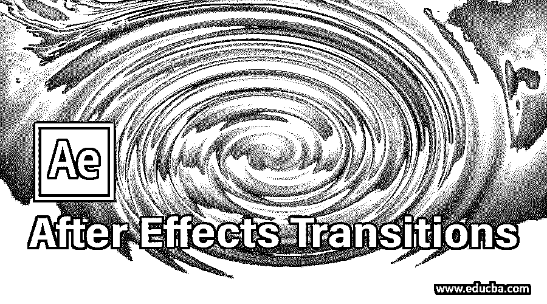

## After Effects 过渡简介

After Effect 中的转场是指通过使用不同类型的技术制作专业的素材或图像系列来处理图像和视频素材的效果组合。通过使用你自己的想法，转场也给了你广泛的操作技巧。在这里，我们将看看 After Effect 软件中的过渡选项，并学习如何在任何图像或视频素材上使用它。

### 如何在后效中过渡？

在这里，我们将通过一个简单的步骤来学习 After Effect 软件的过渡选项。所以让我们在这样的背景下开始学习吧。

<small>3D 动画、建模、仿真、游戏开发&其他</small>

**第一步:**在开始之前，让我们先了解一下这个软件的用户界面，这样我们就可以很容易地理解这篇文章中这个软件的不同部分。在顶部，我们有两个功能区，菜单栏和工具面板，用于对该软件进行一些调整；在左侧，我们有项目部分，它显示了任何项目的一些组件，在右上角，我们有这个软件的一些其他参数，如预览标签，音频标签，效果&预设标签和许多其他的，在工作屏幕的底部，我们有时间轴部分，用于调整动画或过渡的参数。

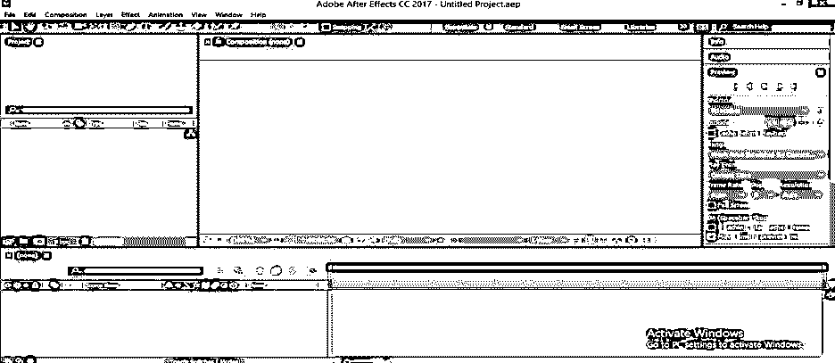

第二步:现在拿新作文开始我们的学习。我们有两个选择来进行新的组合:首先是去菜单栏，点击组合菜单。将打开一个下拉列表；点击此列表的“新组合”选项。

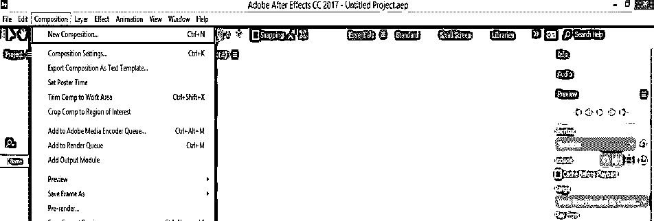

第三步:第二个是项目面板，点击项目面板底端的“新建构图”图标。

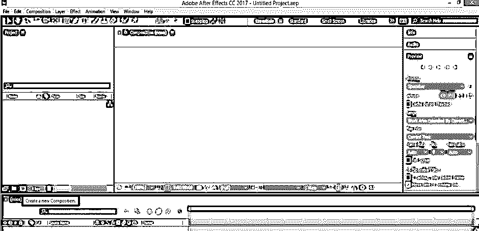

**第四步:**构图设置框打开。根据您的需要进行所需构图的设置，然后单击此框中的“确定”按钮应用设置。

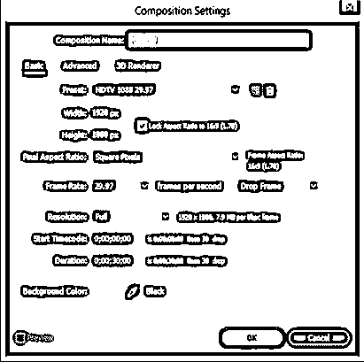

**第五步:**现在，给你想要的视频或图像应用转场选项。我将打开保存我的图像的文件夹，从文件夹中选择它们，&将它们一个一个地放到 After Effect 软件的项目面板中。

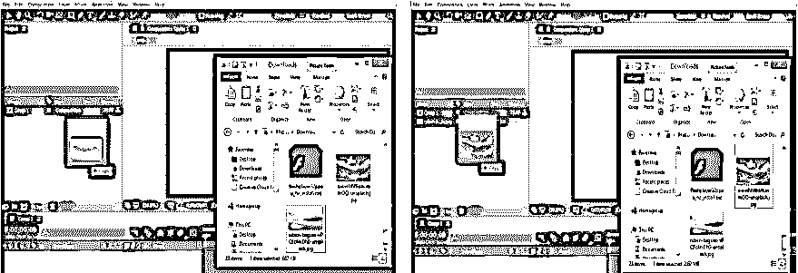

**步骤 6:** 现在选择两幅图像，用鼠标按钮拖动它们，将其放入时间轴部分。

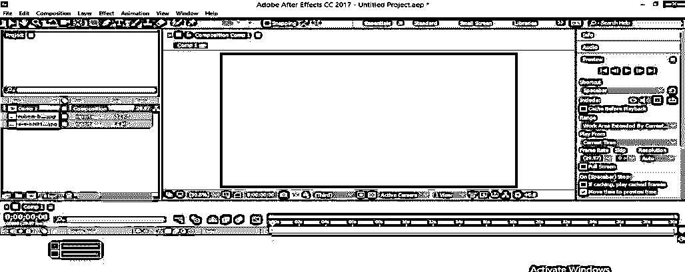

**第七步:**现在，将播放头放在时间线帧区域的 4 秒处，并将两幅图像的播放比例调整为 4 秒。

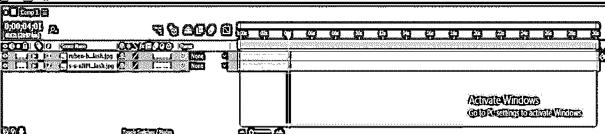

**第八步:**现在，像我一样放置第二张图片的播放比例。我这样做是为了展示当它从一个图像切换到另一个图像时过渡的变化。

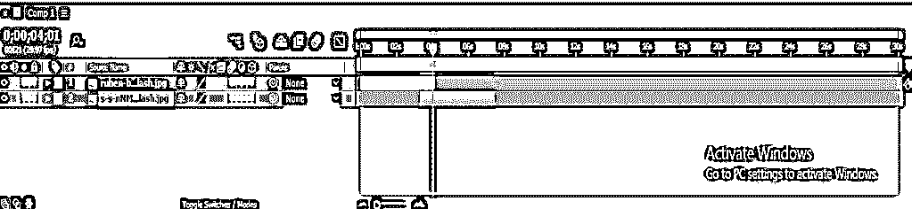

第九步:在效果&预设部分，我们有一些效果的预设。过渡也是一种预先设计好的过渡形式。

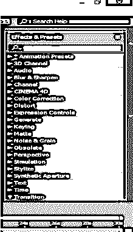

**第十步:**点击过渡选项的小箭头按钮。将打开一个过渡预设列表。你可以从这个列表中使用任何一个预置的过渡。

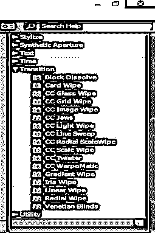

**步骤 11:** 要应用列表中的过渡预设，你只需选择其中任何一个，然后将其放在你想要应用的图像层上。

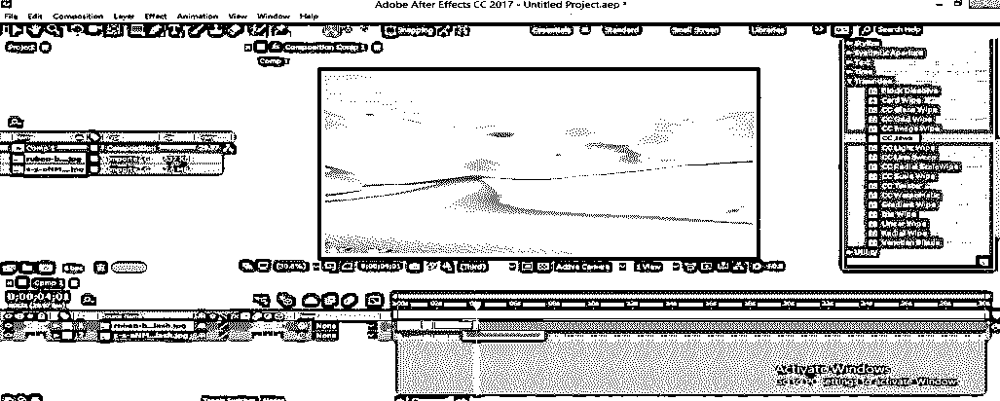

**步骤 12:** 当你应用这些预置时，它们的参数会在项目面板中打开。现在当你播放过渡的时候，那么预先设计的过渡就会这样播放。

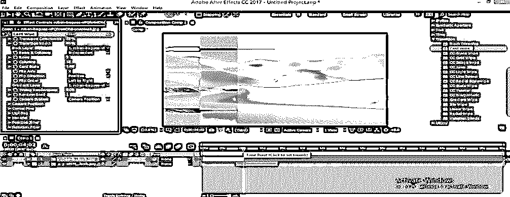

**步骤 13:** 您可以更改转场预置的参数。要进行更改，请单击应用的预设属性的参数的时钟图标，然后进入时间线部分，按键盘上的 U 按钮打开关键帧。

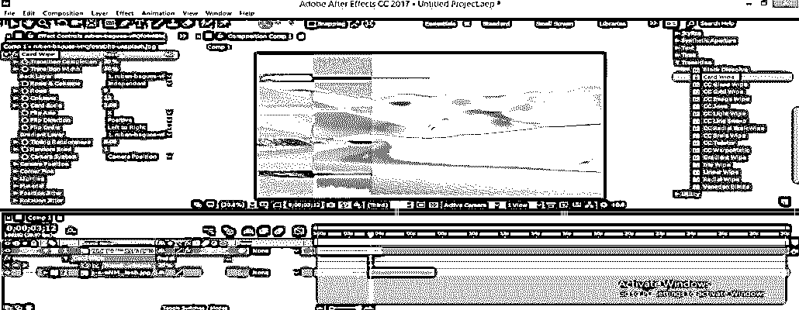

**步骤 14:** 现在，放置播放头 4 秒钟，通过点击该图像层左上角的钥匙图标添加钥匙，然后更改该属性的参数值。

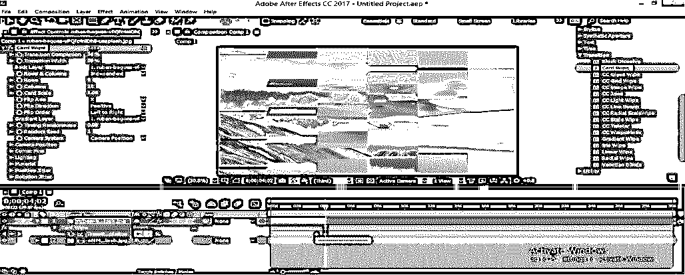

**第十五步:**现在你通过这个软件的预览标签播放这个过渡(或者你可以按键盘的空格键播放过渡)，那么它就会是这个样子。

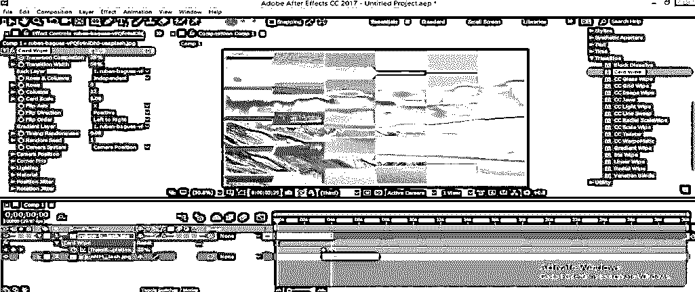

**第 16 步:**现在选择两个键，点击右键。将打开一个下拉列表，转到该列表的“关键帧助手”选项，并单击新下拉列表的“轻松”选项，以便平滑过渡，或者在选择两个键后，您可以按键盘上的 F9 按钮来制作“轻松”键。

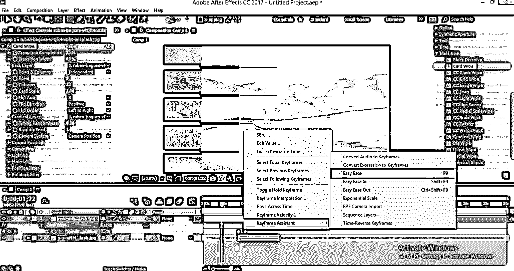

**步骤 17:** 您可以增加或减少该过渡的行数或列数，以赋予该过渡新的外观。你也可以根据你的需要改变这个过渡的其他参数。

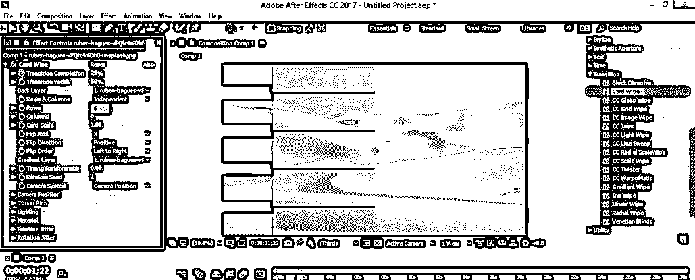

**第 18 步:**你可以在 After Effect 中使用不同的过渡选项进行自己的过渡。要制作你自己的过渡，去菜单栏点击效果菜单。将打开一个下拉列表；转到过渡选项。当你转到过渡选项列表时，不同类型的过渡效果将被打开。

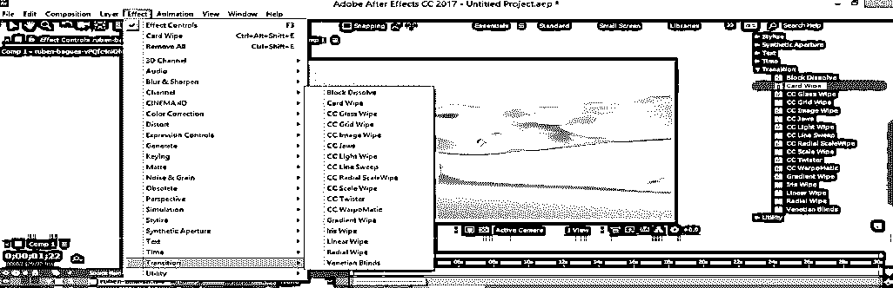

**步骤 19:** 选择这个列表中的任意一个效果。

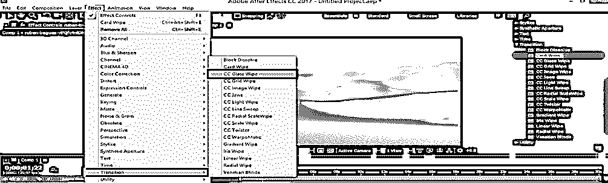

**步骤 20:** 现在点击这个效果的完成属性的时钟图标；关键帧中将添加一个关键点。

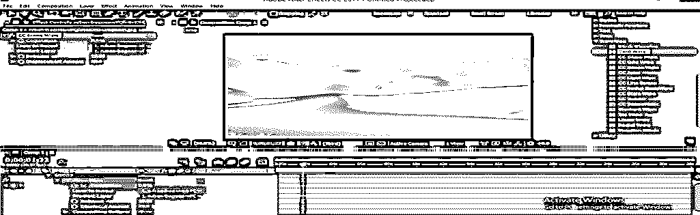

**步骤 21:** 现在，将播放头放在 4 秒处，并通过点击该图像的钥匙图标在其中添加新的钥匙。现在使完成值达到 100%。

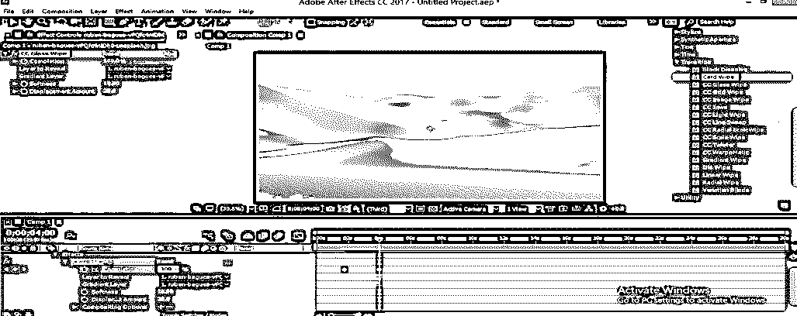

**第 22 步:**你可以根据你的情况用同样的方法动画这个效果的其他属性。

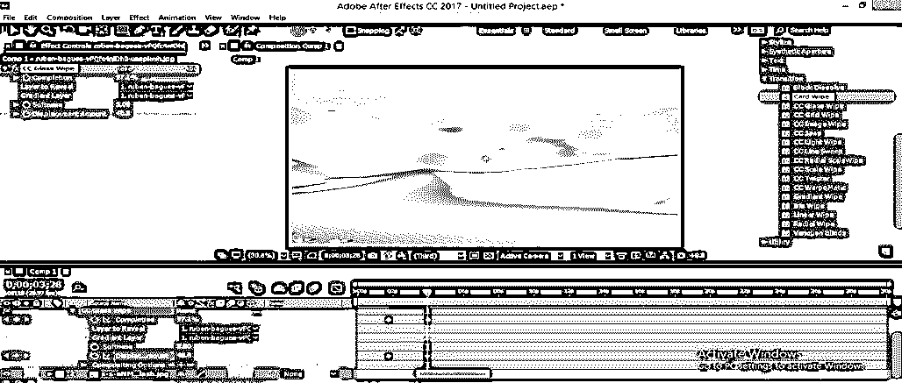

**步骤 23:** 现在，当你播放转场的时候，它会在图像上看起来像玻璃效果。

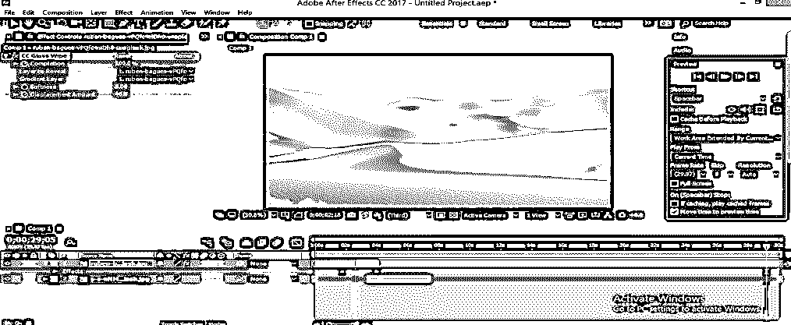

*   这样，您可以在 Adobe After Effect 中使用不同类型的过渡效果选项进行过渡。您可以使用效果组合来获得任何图像或素材过渡的最佳效果。

### 结论

现在，读完这篇文章，你可以很容易理解“什么是后效转换？”以及如何使用其参数对图像或镜头进行高度专业的过渡。你可以用你自己的想法通过使用这个选项的令人兴奋的特性来进行转换。

### 推荐文章

这是一个关于特效转换的指南。在这里，我们讨论一个介绍和一个简单的例子，以一步一步的方式在 After Effect 中创建一个过渡。您也可以浏览我们的其他相关文章，了解更多信息——

1.  [后效中的毛刺效应](https://www.educba.com/glitch-effect-in-after-effects/)
2.  [后效中的慢动作](https://www.educba.com/slow-motion-in-after-effects/)
3.  [后期效果模糊](https://www.educba.com/blur-in-after-effects/)
4.  [效果后滑块控制指南](https://www.educba.com/slider-control-after-effects/)

