# 后效中的摆动表达式

> 原文：<https://www.educba.com/wiggle-expression-in-after-effects/>

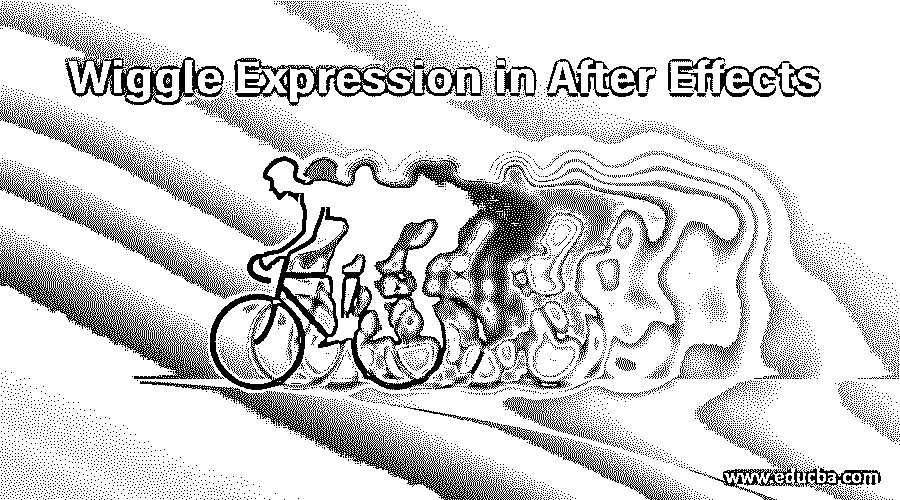

## 在 After Effects 中介绍摆动表达式

在 After Effects 中的 Wiggle Expression 是一种使对象随机移动的好方法，Wiggle Expression 的一个好特性是在运动图形期间对任何对象应用类似振动的效果，它还可以帮助您增强速度对任何对象的影响。在本文中，我们将讨论后效应中的摆动表达式，并了解摆动表达式的不同参数。

### 如何在 After Effect 中应用 Wiggle 表达式？

我们可以对不同类型的对象应用 wiggle 表达式。在这里，我们将应用这种效果的文字层与背景层。让我们来看看这个软件的不同部分。

<small>3D 动画、建模、仿真、游戏开发&其他</small>

**步骤 1:** 该软件最上面的功能区是菜单栏，帮助管理该软件的功能；就在菜单栏下面，我们有工具面板部分，它有该软件的不同类型的工具，还显示激活工具的属性，工具面板的下面部分分为三个部分，即项目面板，它显示任何项目的合成数量，合成部分，它显示您当前的合成，右侧部分有一些参数，帮助管理任何动画的参数。 在这个软件的底部，我们有两个部分，一个是图层部分，显示任意构图的层数，另一个是时间线部分，为你设置动画参数提供不同的处理点。

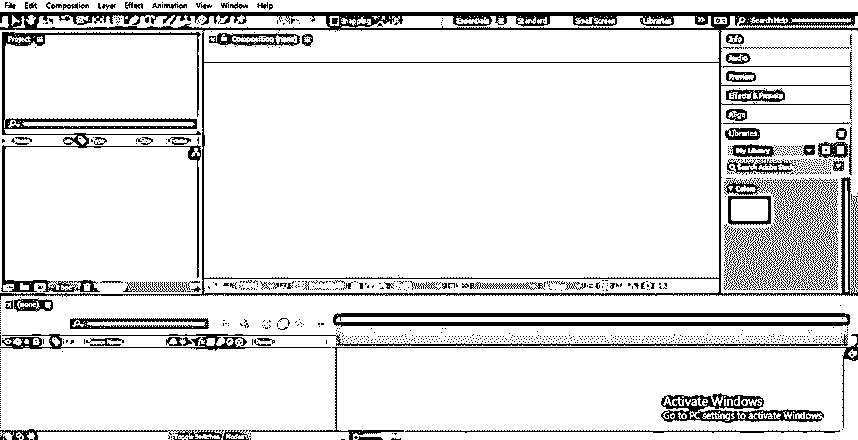

**第二步:**首先，我们会为我们的作品取一个新的构图。转到菜单栏的文件菜单，并从文件菜单的下拉列表中选择“新建组合”选项。

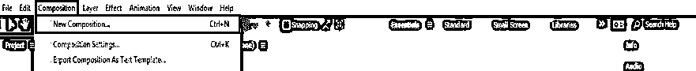

第三步:或者你也可以从这个软件的项目面板里取一个新的构图。只需点击项目面板底部的“新建作品”图标。

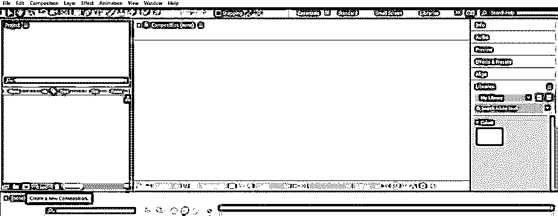

**第四步:**构图设置对话框打开。根据项目工作的要求，在此处设置新组合的参数，并单击此对话框的“确定”按钮。

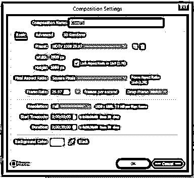

第五步:现在，从工具面板里拿出一个矩形工具，在这个构图里做一个背景层。

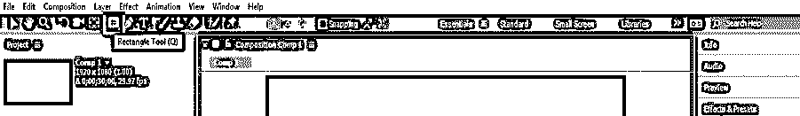

第六步:画一个长方形，让它覆盖整个构图。

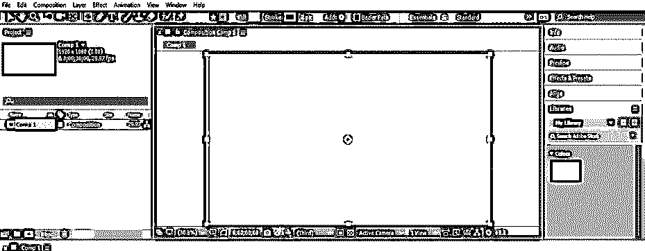

**第 7 步:**现在点击工具面板功能区的这个形状的填充选项。

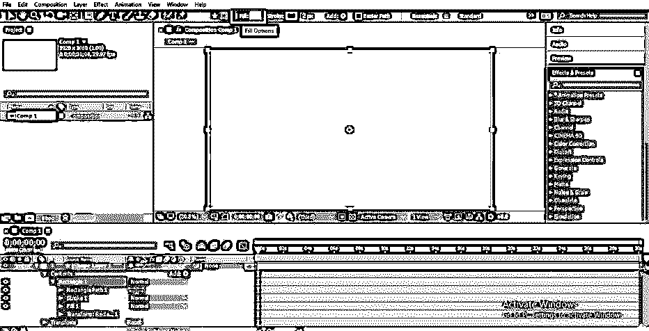

**步骤 8:** 一个填充选项框将打开，选择径向渐变选项，点击该框的确定按钮。

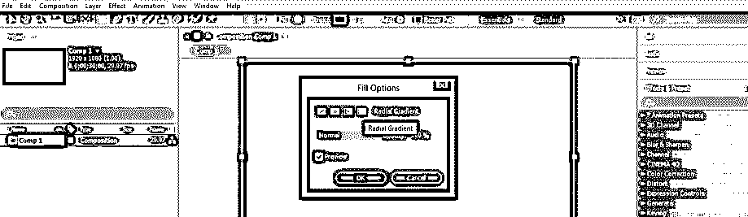

**第九步:**现在通过向外拖动指针来增加内部渐变颜色的大小。

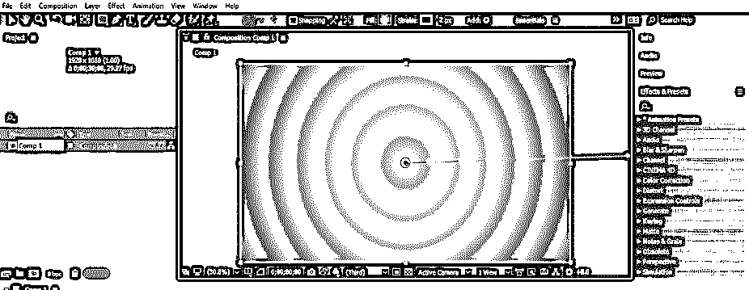

**步骤 10:** 现在点击填充选项的颜色框，改变背景层的颜色。将会打开一个渐变编辑框。从这里选择你想要的颜色。

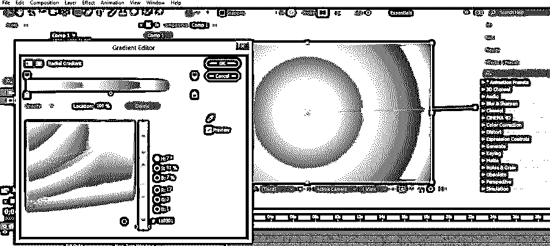

**步骤 11:** 现在，从这个软件顶部的工具面板里拿出一个文字工具。

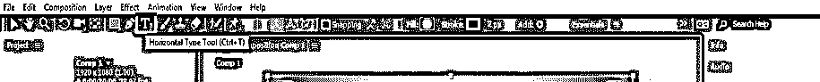

第 12 步:在文本工具的帮助下输入你想要的文本。通过使用合成区域右侧的该软件的对齐选项，在背景层的中心对齐该文本。您可以使用对齐工具的快捷方式将文本层与背景层对齐。

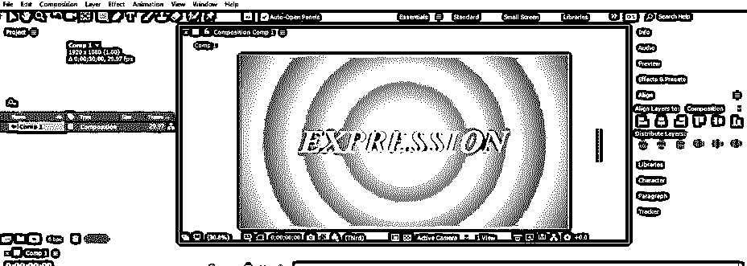

**步骤 13:** 根据自己的要求调整文字的字体、大小、形状。

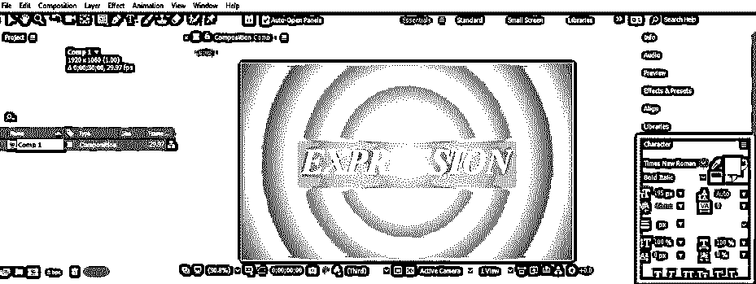

**步骤 14:** 现在点击文本层的小箭头按钮，打开该层的属性。现在，通过按住键盘的 Alt 键单击 Position 属性的小时钟图标，以便在该属性上添加 wiggle 表达式。

**第十五步:**当你点击 Position 属性的小时钟图标时，wiggle expression 命令会在这个属性前面的 Timeline 部分的关键帧区域打开。

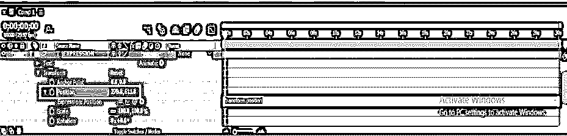

**步骤 16:** 我们可以通过点击位置属性的表达式图标来启用摆动表达式。

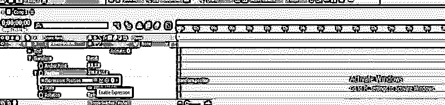

**步骤 17:** 我们在 wiggle expression 中也有一个图形图标，用于显示 wiggle expression 参数的图形。

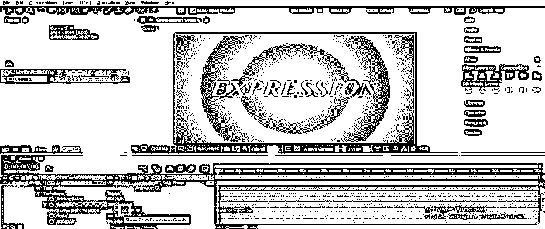

**步骤 18:**wiggle 表达式的下一个选项是 Pick Whip，用于连接该层的 wiggle 表达式和其他层的属性。

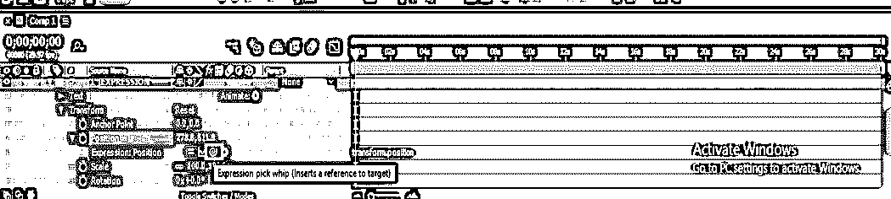

**步骤 19:**wiggle expression 的下一个选项是语言菜单，其中预置了不同语言的 wiggle expression 命令。

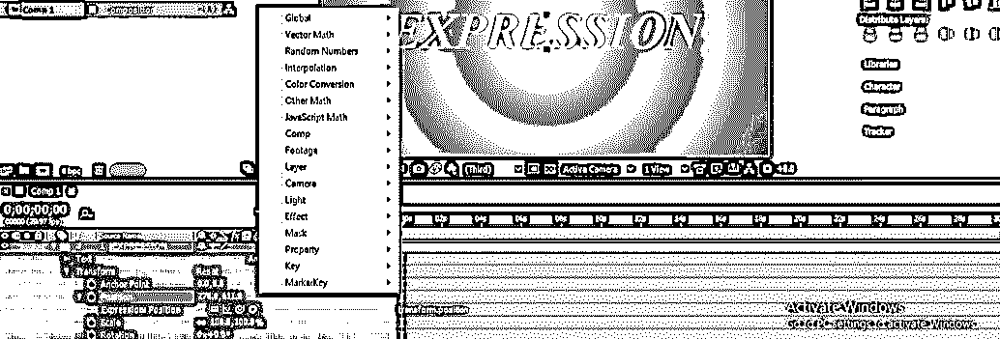

**步骤 20:** 现在在关键帧区域的 wiggle expression 部分输入 wiggle (5，50)作为命令。这里 5 表示振动的次数，50 表示文本摆动的像素数。

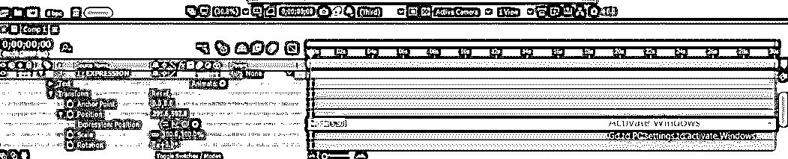

**步骤 21:** 现在按键盘上的空格键来播放 wiggle 表情，或者你可以从这个软件的预览标签中播放，这个标签在作曲区的右侧。当你播放它的时候，文字会在它的位置上给你一个震动的效果。

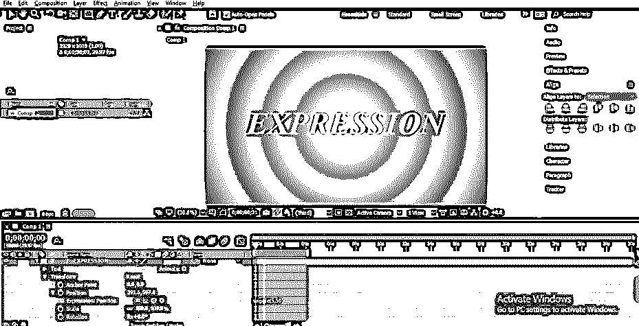

第 22 步:你也可以在这个文本的其他属性上应用 wiggle。转到文本层的不透明度属性，按照我们在位置属性上摆动的相同步骤。

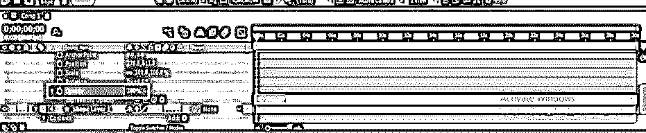

**步骤 23:** 现在你播放表情的时候，文字会这样闪烁。

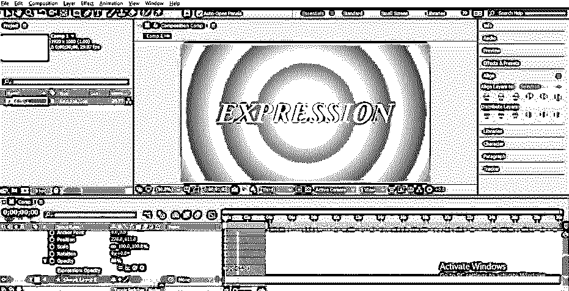

**步骤 24:** 可以将不透明度属性的 wiggle 表达式与背景层的属性连接起来。要将其与背景层的缩放属性连接，只需单击不透明度属性的摆动表达式的拾取鞭选项，并将其拖动到背景层的缩放属性的小时钟图标。

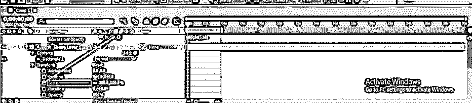

**步骤 25:** 这样连接，在不透明度属性的摆动表达式的关键帧区域会产生连接命令。

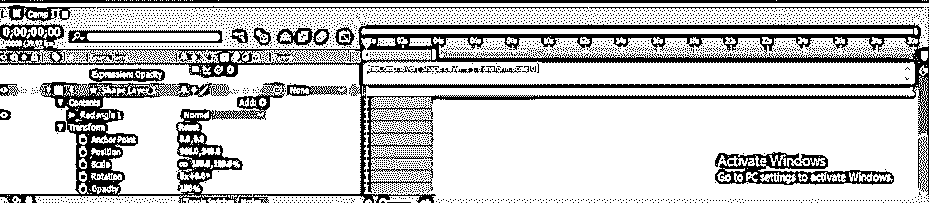

**步骤 26:** 现在，当你增加或减少背景层的 Scale 属性的值时，文字层的不透明度会随着背景层的 Scale 属性的变化而变化。

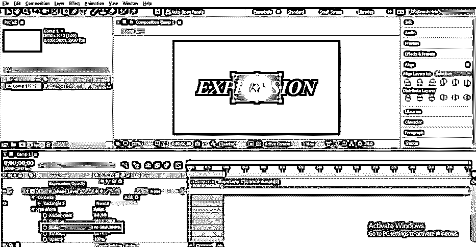

这样就可以在 After Effect 软件中使用 Wiggle 表达式了。

### 结论

通读本文后，您现在可以理解 After Effect 软件的 Wiggle 表达式，并轻松地在您的项目工作中使用它作为良好的效果。你可以通过练习这个表达式的参数来控制这个表达式。

### 推荐文章

这是一个在效果后摆动表达的指南。在这里，我们讨论了一种简单易行的方法来一步一步地在 After Effects 中应用 Wiggle 表达式。您也可以浏览我们的其他相关文章，了解更多信息——

1.  [After Effects 中的排版|示例](https://www.educba.com/typography-in-after-effects/)
2.  [在后效中创造降雪的方法](https://www.educba.com/snowfall-in-after-effects/)
3.  [什么是 After Effects 中的遮罩层？](https://www.educba.com/masking-layers-in-after-effects/)

