# After Effects 中的按键灯

> 原文：<https://www.educba.com/keylight-in-after-effects/>

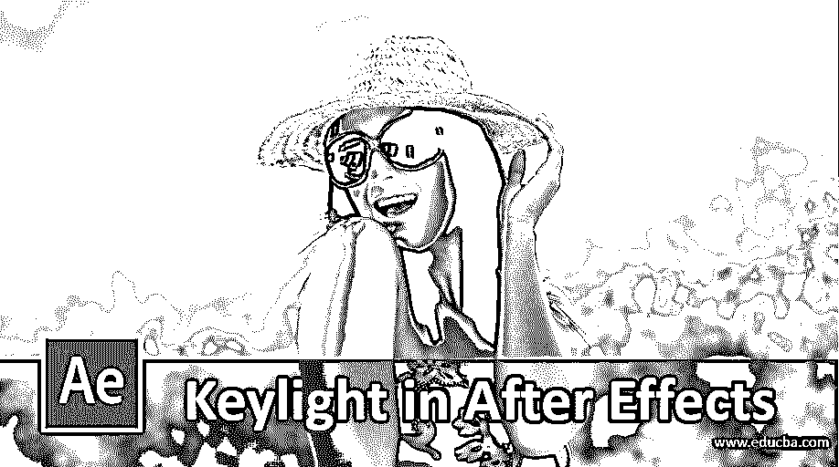

## After Effects 中的 Keylight 简介

After Effect 是一款视频编辑软件，视频编辑专业人员广泛使用它来完成高度专业化的工作。我们在 After Effect 软件中提供了不同类型的功能，有助于创建独特的图形设计。Keylight 是它的一个好特性，我们可以将其定义为一种方法，通过设置 Keylight 的参数，您可以从任何视频素材中删除绿色背景，并用任何背景替换它。在本文中，我们将了解关键光，并分析其不同的参数，以更好地理解后效软件的这一特点。

### 如何在 After Effects 中使用 Keylight？

在开始我们的讨论之前，让我们看一下这个软件的用户界面，这样我们就可以很容易地理解贯穿本文的这个软件的技术术语。在工作屏幕的顶部，我们有两个丝带，第一个是菜单栏，第二个是工具栏，用于管理和设计软件中不同类型的东西；我们在工作屏幕的左侧有项目面板，在项目面板旁边有效果控制面板，在屏幕的中心我们有合成窗口，向您显示任何项目工作的当前合成，在工作屏幕的右侧我们有一些参数，如效果和预设标签，预览标签，对齐标签等。在底端，我们有两个部分，一个是图层部分，显示任意构图的多个图层；另一个是时间线部分，包含所有用于在 After Effect 中制作任何项目动画的处理点。

<small>3D 动画、建模、仿真、游戏开发&其他</small>

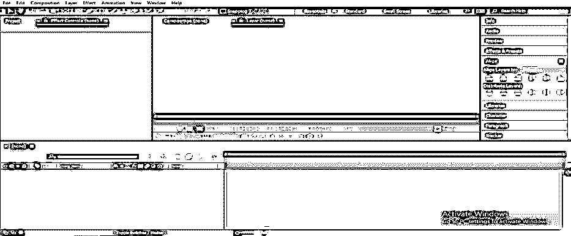

**第一步:**首先，让我们从网上取一段绿色的背景素材或者任何素材的片段，供我们学习。你可以从 hollywoodcamerawork.com[下载，或者你也可以自己拍下来给我们学习。](https://www.hollywoodcamerawork.com/)

**第二步:**现在，将这段视频放入 After Effect 软件。要放置这段视频，请转到保存它的文件夹，在鼠标按钮的帮助下选择它，然后将其放在 After Effect 软件的项目面板中。

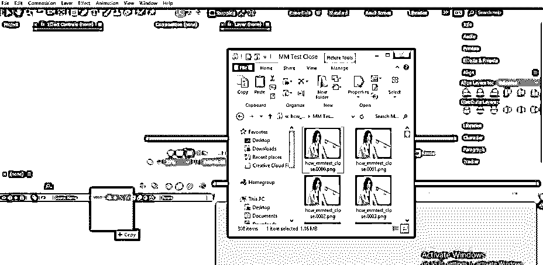

**第三步:**现在把这个素材从这个软件的项目面板拖到图层部分，放到那里。

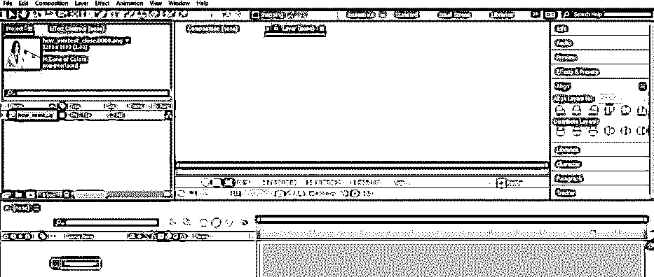

**步骤 4:** 现在转到该软件的效果&预设选项卡，它位于工作屏幕的右侧。

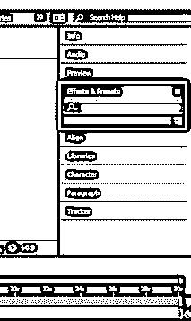

**第五步:**现在在效果&预设标签的搜索框中搜索“Keylight”。

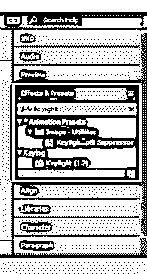

**步骤 6:** 现在从效果&预设列表中选择“键盘光溢出抑制器”选项，并将其放在合成区域的素材上。

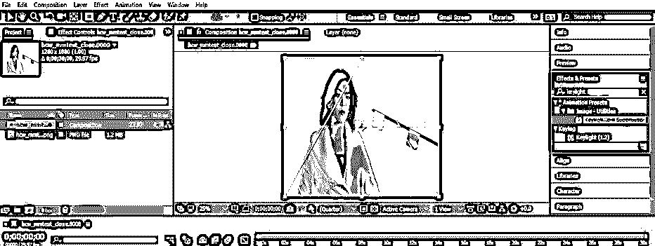

**第 7 步:**一旦你把它放在素材上，一个 Keylight 参数框将在效果控制部分打开，它位于工作屏幕的左侧，项目面板的旁边。

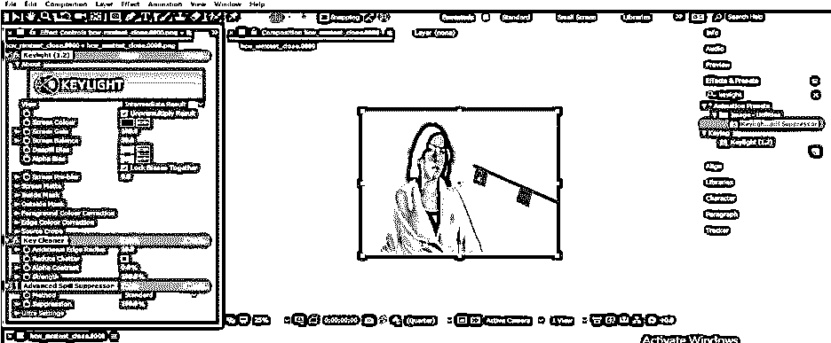

**步骤 8:** 现在，在 keylight 参数的屏幕颜色选项的颜色框中设置绿色。现在，点击屏幕颜色选择器，然后点击绿色的镜头，将其替换为黑色背景。

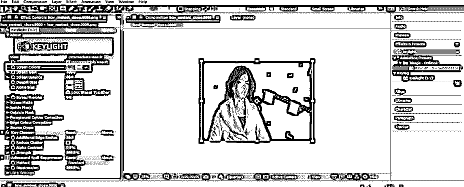

**第九步:**当你缩小这个素材的时候，你可以看到在我们的素材的角色和另一个物体的边缘上有一些绿色残留。

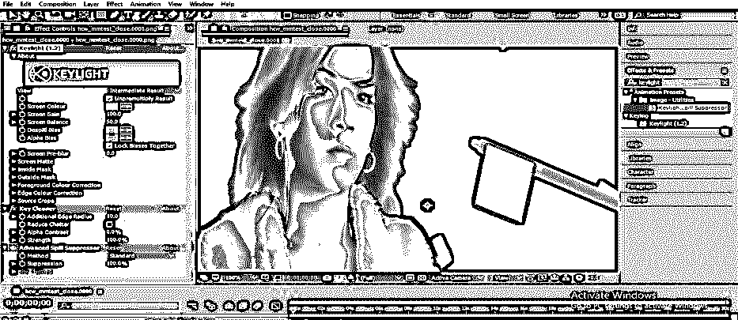

**步骤 10:** 为了从我们的角色和镜头对象的边缘移除这一点，请转到 Keylight 参数的“高级溢出抑制器”选项。

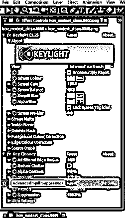

**步骤 11:** 点击该选项的“fx”按钮，启用该选项。一旦你启用它，你会注意到在角色的边缘是绿色的，物体会被移除。

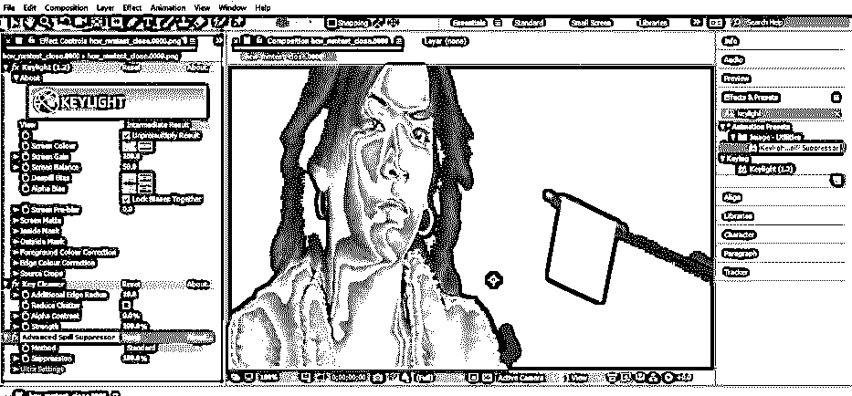

**步骤 12:** 有一点你要记住，千万不要在 Keylight 的视图参数中选择“最终结果”选项。

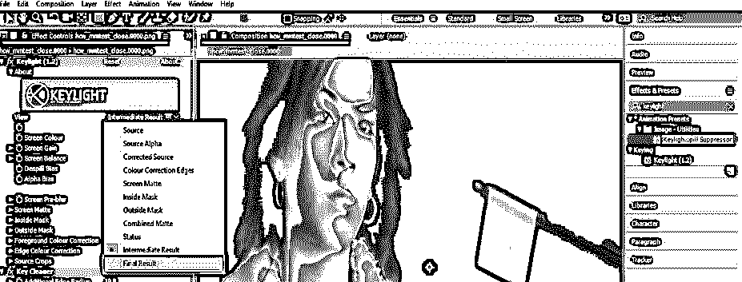

**步骤 13:** 因为当您选择此选项时，模糊边缘会出现在素材的对象上。

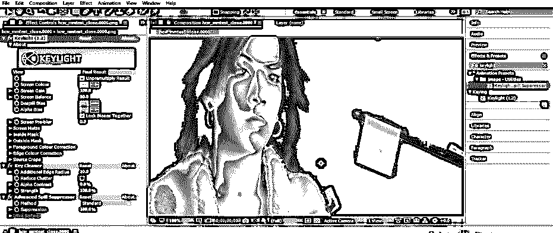

**第 14 步:**在透明背景下可以清楚的看到这个效果。对于透明背景，启用“切换透明网格”选项，它位于合成窗口的底部。

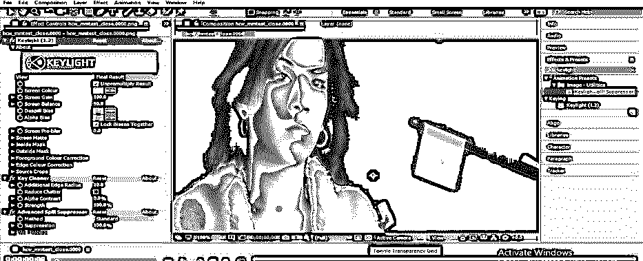

**步骤 15:** 你可以看到镜头中人物和物体边缘附近的模糊部分。

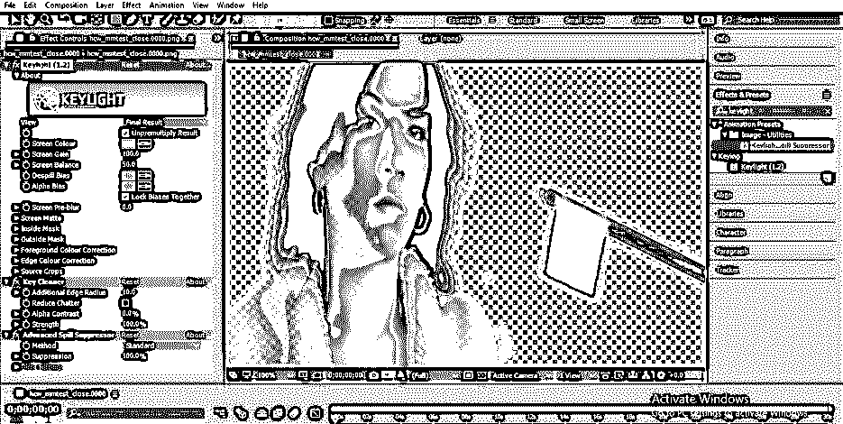

**步骤 16:** 所以取 Keylight 参数的查看选项中的‘中间结果’选项。

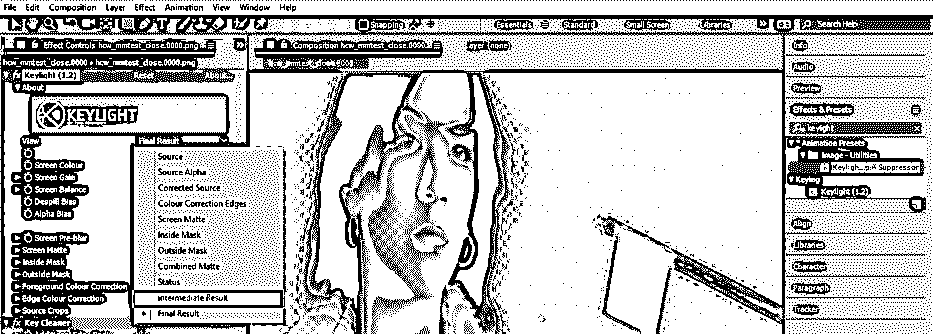

**第 17 步:**一旦选择中间结果选项，镜头中人物和物体附近的边缘就会变细。

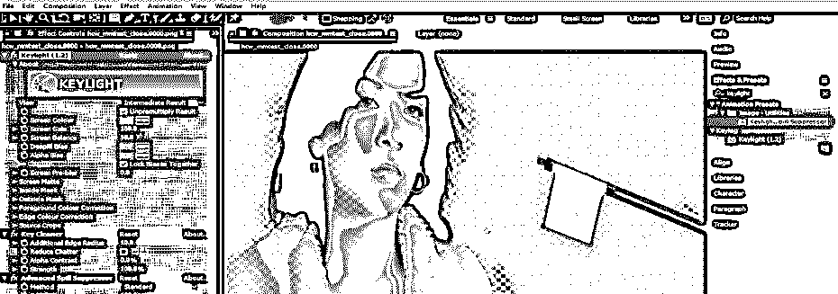

**第 18 步:**现在，让我们改变素材的背景。更改背景会从保存背景的文件夹中取出所需的背景。从那个文件夹中选择背景，用鼠标键把它放到这个软件的项目面板中。

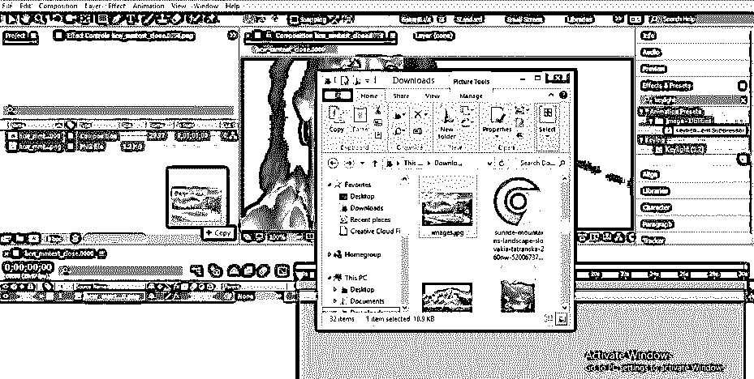

**步骤 19:** 现在把这个背景图片从项目面板拖到这个软件的图层部分。

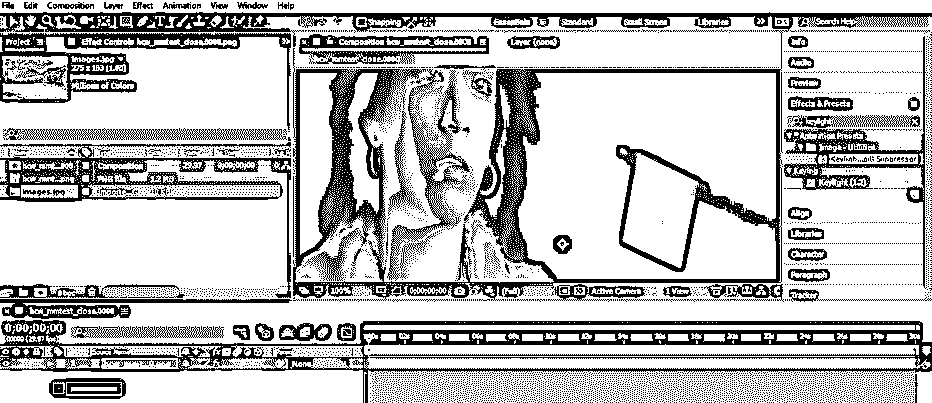

**第 20 步:**根据您的素材或您想要放置的位置调整背景的大小。

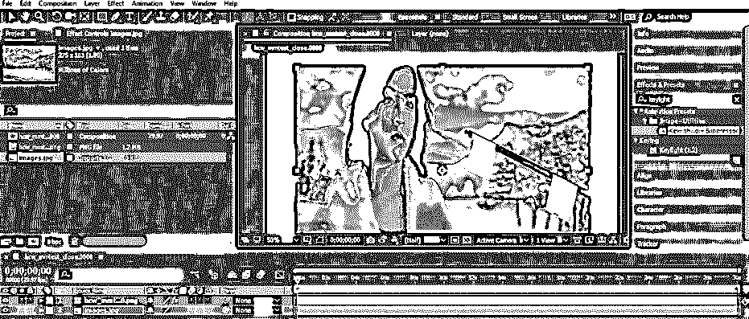

**步骤 21:** 现在，当您将“高级溢出抑制器”的方法从标准选项更改为 Ultra 选项时。

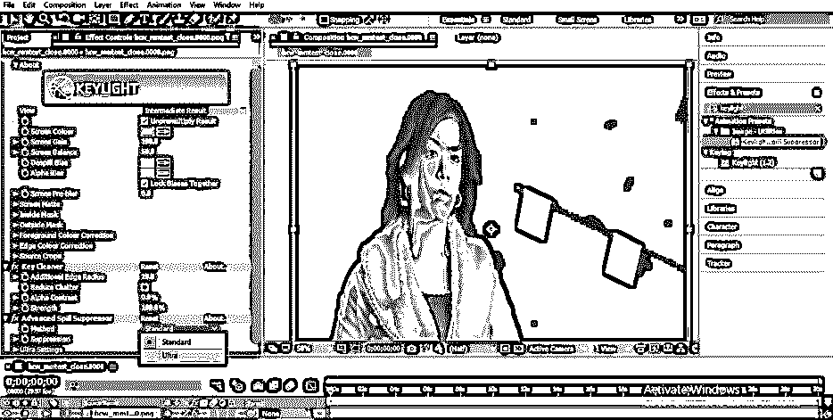

**步骤 22:** 在镜头的人物和物体的边缘会出现一种发白的颜色。

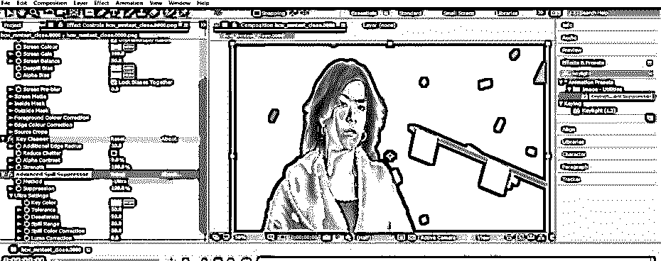

**步骤 23:** 一旦选择了 Ultra 方法，Ultra 方法的属性就会打开。转到该方法的溢出范围选项，并增加溢出范围的值。一旦增加溢出范围的值，发白的颜色将从素材中移除。

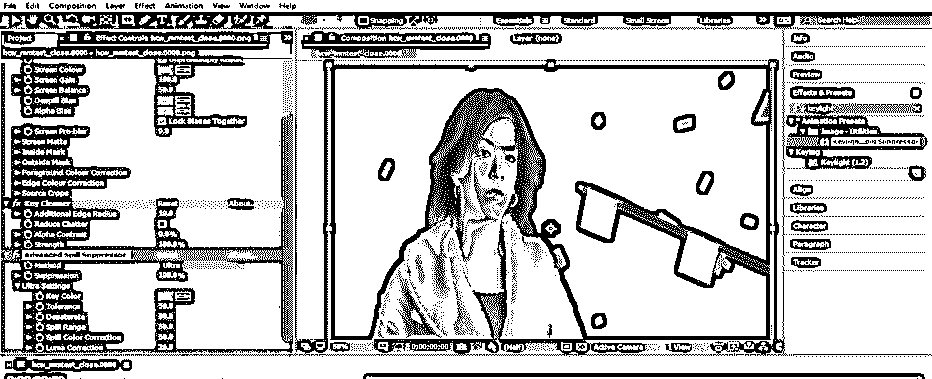

步骤 24: 现在点击图层部分的眼睛按钮，启用背景图层。

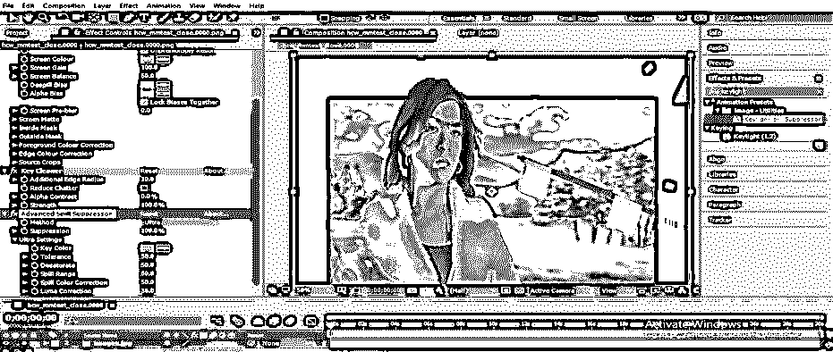

**第 25 步:**如果角色的皮肤上有绿色，那么转到超高级溢出抑制方法的“亮度校正”选项，增加它的值。一旦增加亮度校正的值，角色的肤色将在每个地方都相等。

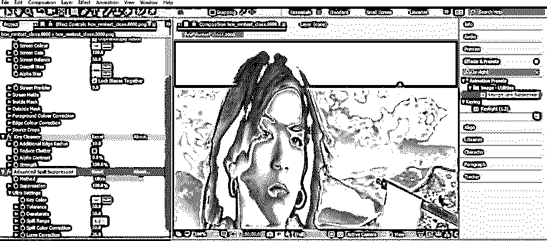

通过这种方式，您可以使用 After Effect 软件的 Keylight 功能从任何视频素材或图像中移除绿色背景，并处理其参数以获得最佳效果。

### 结论

现在，看完这篇文章后，你可以很容易地理解“什么是 Keylight”和“你如何在 After Effect 软件中使用它”？通过练习 After Effect 软件的这一功能，你可以在你的图形设计技能中加分，并可以在你的工作中给出高度专业的结果。

### 推荐文章

这是一个关于后期效果中的按键照明的指南。在这里，我们讨论了入门，如何一步一步地在 After Effects 中使用 Keylight。您也可以浏览我们的其他相关文章，了解更多信息——

1.  [后效中的运动图形](https://www.educba.com/motion-graphics-in-after-effects/)
2.  [在特效后将图层分组](https://www.educba.com/group-layers-in-after-effects/)
3.  [后效合成](https://www.educba.com/composition-in-after-effects/)
4.  [降雪后的影响](https://www.educba.com/snowfall-in-after-effects/)

