# After Effects 中的旋转观测

> 原文：<https://www.educba.com/rotoscoping-in-after-effects/>

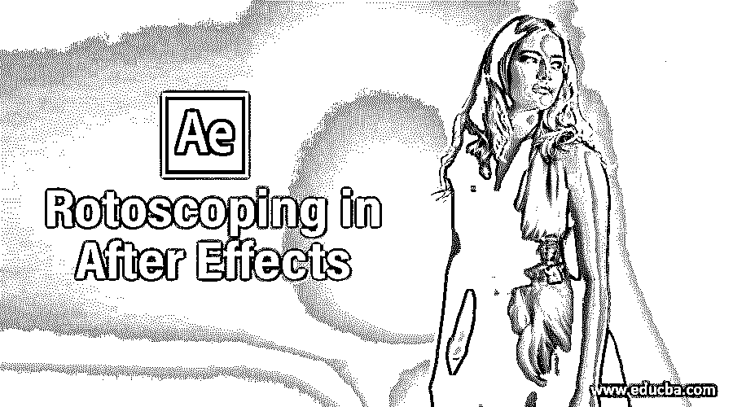

## After Effects 中的旋转观测简介

Rotoscoping 是一种方法，通过这种方法，我们可以从视频镜头或任何图像中分离出任何对象，并通过使用 After Effect 软件的不同工具来调整具有不同背景的分离对象。根据你的说法，rotoscoping 是一种非常有用的方法，可以改变任何视频镜头或特定图像的任何对象。所以在本文中，我们将通过例子来理解 Rotoscoping，并学习如何处理它的参数。

### 如何在 After Effects 中使用 Rotoscoping？

我们将通过非常简单的步骤来理解术语旋转观测，并分析不同的旋转观测参数，以便在 After Effect 软件中工作时不会出现问题。在开始本文的学习之前，让我们先了解一下该软件用户界面的所有部分，这样我们就可以很容易地理解本文中的所有术语。

<small>3D 动画、建模、仿真、游戏开发&其他</small>

在工作屏幕的顶部，我们有菜单栏部分，用于管理该软件的不同设置，就在这个功能区的下面，我们有工具面板，它有许多不同的工具，用于处理该软件中的视频编辑，就在这个工具栏功能区的下面，我们有三个部分，它们是项目部分，向您显示您的项目中使用的许多组件。 在这个部分的中心，我们有一个组合窗口，它向您显示任何项目的活动组合，或者它的工作方式类似于在这个软件上工作的视觉显示单元，这个部分的右上角有一些参数，用于在您的项目工作中进行不同类型的设置，在这个软件的底端，我们有两个部分，一个是层部分，显示任何项目工作中使用的层的数量，另一个是时间线部分，用于设置我们在其中制作的任何动画的参数。

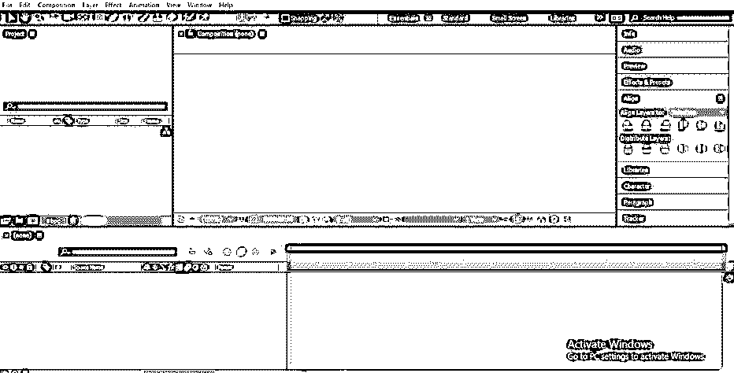

这是这个软件的一个小介绍。现在让我们转到学习 After Effect 软件中的旋转观察的例子。您可以旋转示波器任何对象的视频镜头或图像。

**步骤 1:** 现在，从保存视频的文件夹中取出视频。为了将它放在 After Effect 软件上，选择这个视频素材并将其放在项目区域部分。

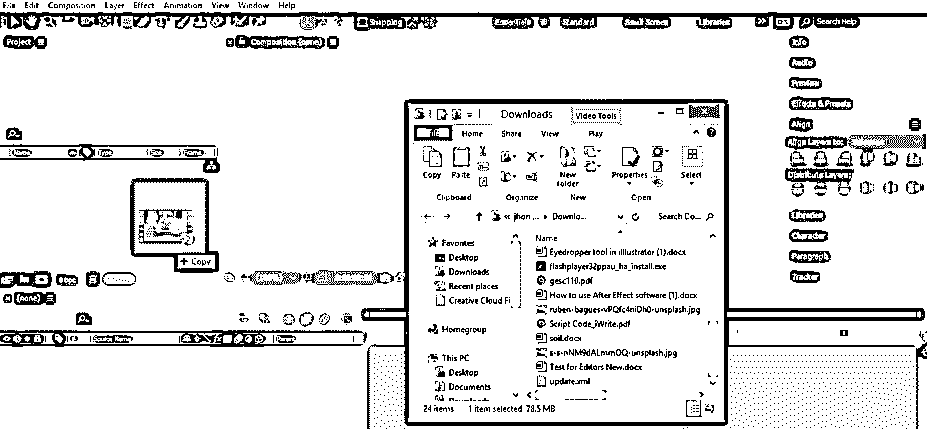

**第二步:**或者我在这里拍个图，供大家学习。将图像放入 After Effect 中，进入保存图像的文件夹，从那里选择图像，然后将其放在 After Effect 软件的图层部分。您可以将任何视频素材或图像同时放入该软件的三个部分中的任何一个，即项目部分、合成窗口和图层部分。

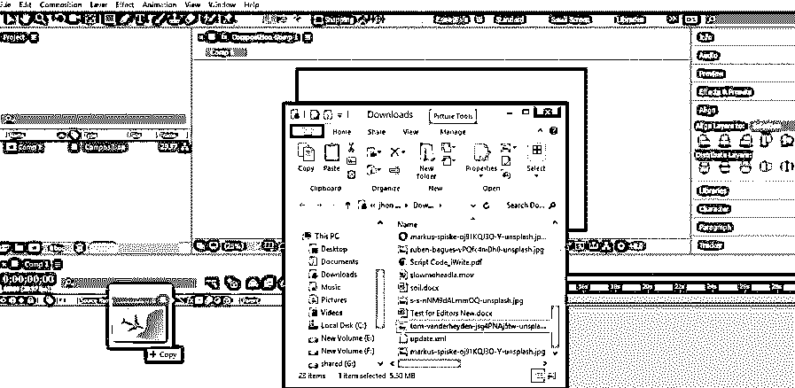

**第三步:**根据您的需要对该图像的位置进行动画处理，以便在该图像上应用旋转观察，或者您可以拍摄任何视频片段的任何对象。

**第四步:**现在从这个软件的工具面板中取出钢笔工具，这个工具面板位于工作屏幕的顶部。

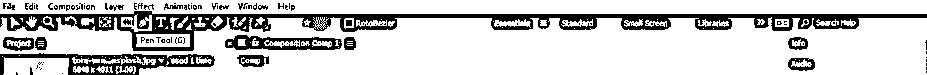

**步骤 5:** 现在启用旋转贝塞尔选项，使用钢笔工具在任何视频镜头或图像的目标上进行选择。

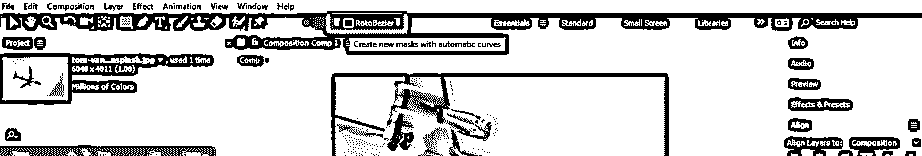

第六步:现在，用这样的钢笔工具在这张图片上选择一个想要的物体，也就是一架飞机。

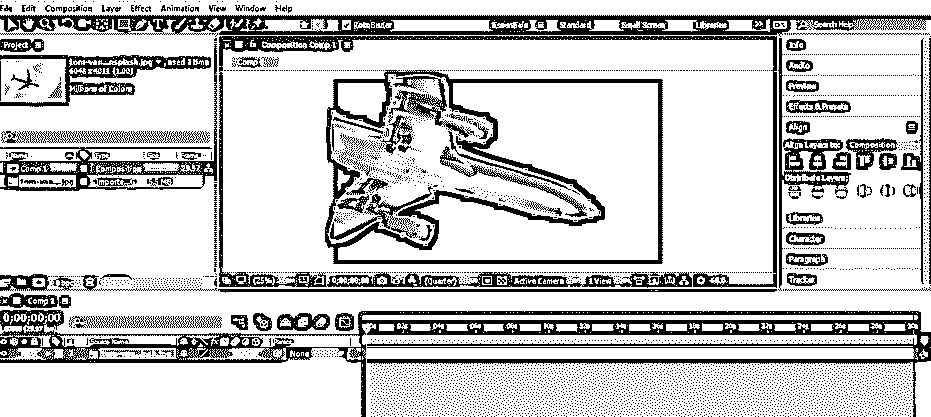

**步骤 7:** 现在点击这一层的小箭头按钮，再次点击这一层的蒙版属性的小箭头按钮。现在点击蒙版的下拉列表，并从这里选择“无”选项，这样我们就可以调整这个图像的其他位置。

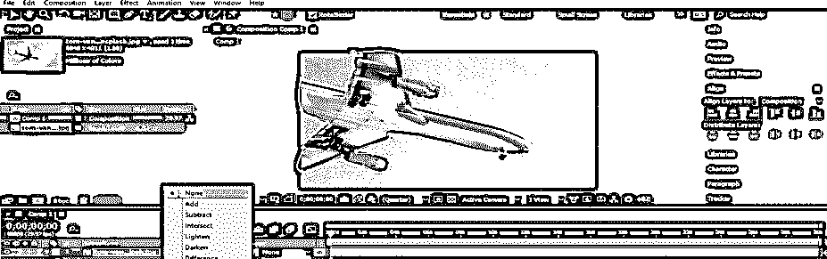

**步骤 8:** 现在点击 Mask 1 属性的小箭头按钮，点击 Mask Path 属性的小时钟图标，在飞机层的这个属性上添加一个新的键。

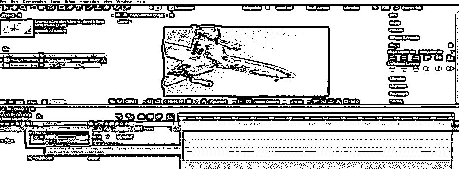

**第九步:**现在，在时间轴的关键帧段上，将关键帧头设置为 2 秒。你可以根据你拍任何帧差。

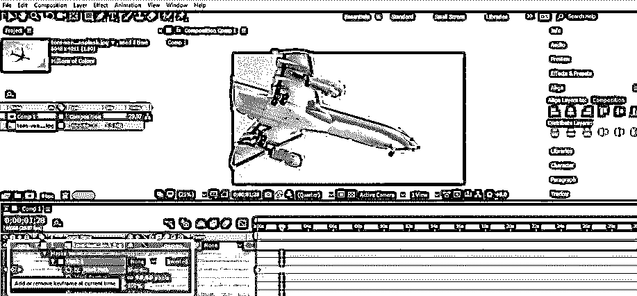

**步骤 10:** 现在点击时间线部分 2 秒处的遮罩路径的小关键图标，添加一个新的关键点，并调整我们在选择工具的帮助下围绕这个飞机形状所做的选择。

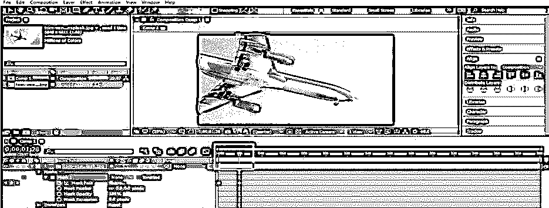

**步骤 11:** 再次重复设置按键和调整选择的过程。将关键帧头设置为 4 秒差。

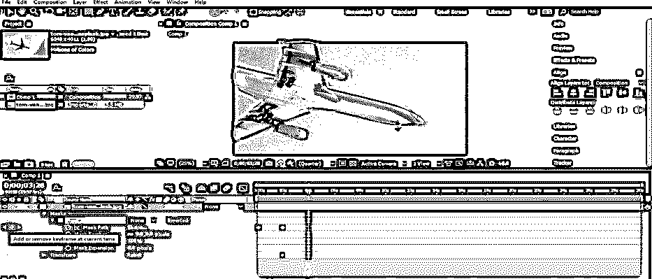

**步骤 12:** 点击该属性关键帧的小图标，在蒙版路径中添加一个新键。

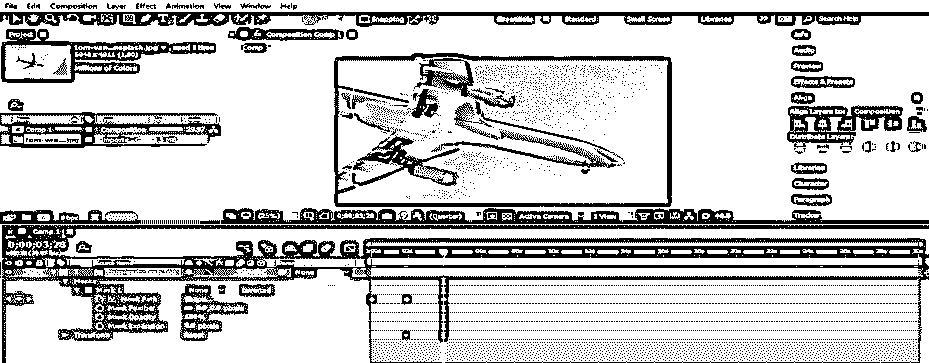

**步骤 13:** 现在转到 Mask 1 选项的下拉列表，从这里选择添加选项，用于分离该图像的选定动画对象。

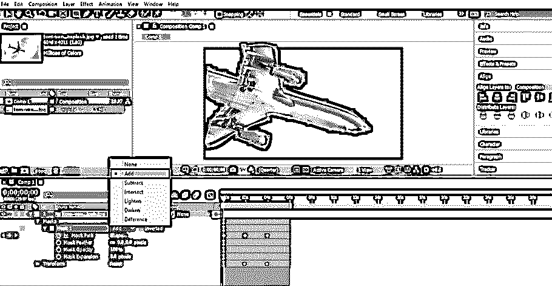

**步骤 14:** 现在，将羽化选项设置为 21 像素，用于在每个关键帧处添加 Roscoping 对象的平滑度。你可以根据你自己取特征值，适合你的动画。

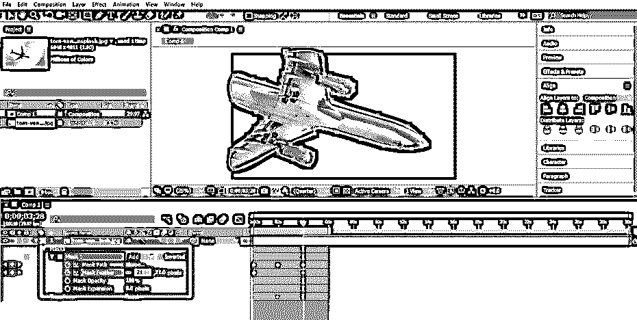

步骤 15: 现在，你可以通过播放这个图像的动画来观看一架飞机的旋转观测。播放动画时，在 After Effect 软件中，按键盘上的空格键作为播放动画的快捷键，或者可以进入该软件的预览选项卡，该选项卡位于工作区的右侧。

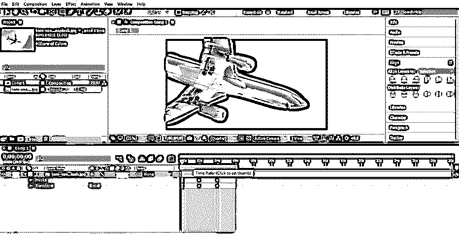

*   您也可以使用旋转画笔工具进行旋转观察。从这个软件的工具面板中选择 Roto Brush Tool，它位于工作屏幕的顶部，作为一个选择工具，用它进行选择。选择之后，你必须按照我们之前做的相同步骤。
*   这样，您可以在 After Effect 软件中使用 Rotoscoping，并维护 rotoscoping 参数，以使高级专业项目在该软件中工作。

### 结论

现在，在这篇有意义的文章之后，你可以理解 After Effect 软件中的术语 Rotoscoping，并且可以很容易地处理 Rotoscoping 的参数，以便在图形编辑工作中获得最佳结果。你可以通过练习旋转瞄准镜来为你的图形设计加分。

### 推荐文章

这是一个在 After Effects 中的 Rotoscoping 指南。在这里，我们讨论了简介以及如何在 After Effects 中使用 Rotoscoping 进行图形编辑。您也可以浏览我们的其他相关文章，了解更多信息——

1.  [后效背景](https://www.educba.com/background-in-after-effects/)
2.  [特效后的滑块控制](https://www.educba.com/slider-control-after-effects/)
3.  [在后效中遮蔽图层](https://www.educba.com/masking-layers-in-after-effects/)
4.  [雨后效果](https://www.educba.com/rain-in-after-effects/)

