# 特效渲染后

> 原文：<https://www.educba.com/after-effects-render/>

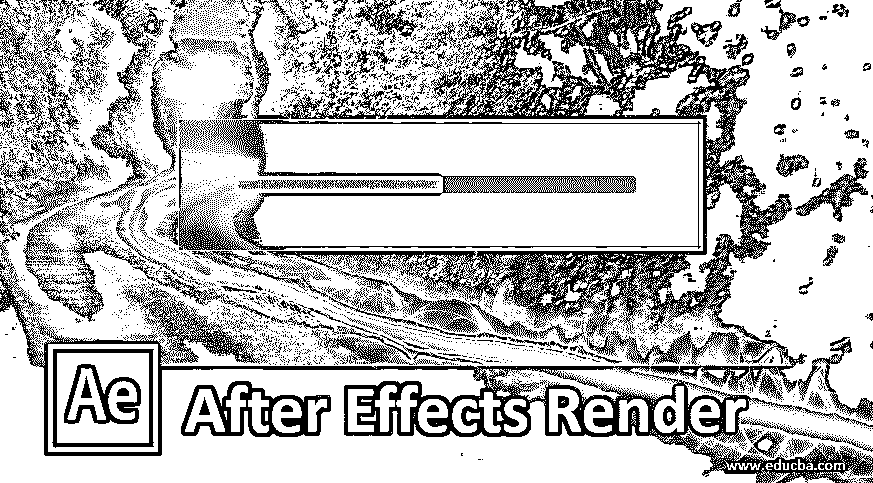

## After Effects 渲染简介

渲染是 After Effects 的功能之一。渲染是指一种方法，通过这种方法，我们可以准备好在数字平台上的任何地方使用我们的动画，它还可以为您提供动画的最终输出。在本文中，我们将通过一个例子来理解 Render，并分析它的参数，学习如何处理这些参数。

### 效果渲染后如何使用？

让我们看一下该软件的不同类型的部分，它们构成了该软件的用户屏幕，这样在我们学习本文的过程中就不会出现问题。

<small>3D 动画、建模、仿真、游戏开发&其他</small>

**步骤 1:** 该软件的用户屏幕首先是菜单栏和工具栏，它们位于工作屏幕的顶部，下面是该软件的三个主要部分，左侧是项目面板和效果控件，中间是显示项目当前合成的合成窗口，右侧是参数部分，其中有一些不同的参数，如预览选项卡、效果&预设选项卡、对齐选项卡等。在这一部分下面，我们有两个主要部分，它们是图层部分，向您显示您的作品中使用的图层数量，在右侧，我们有时间轴部分，用于处理动画的参数。

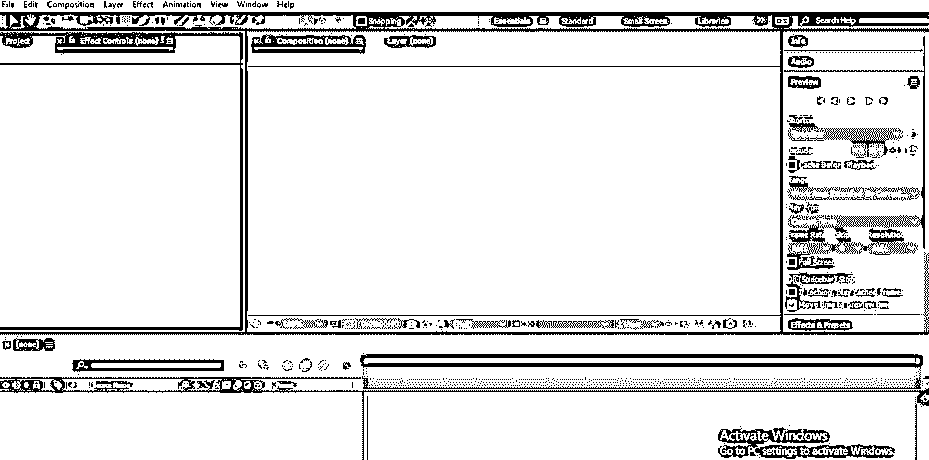

第二步:不，我们来学习一篇新的作文。对于新组合，转到菜单栏的组合菜单，点击下拉列表中的“新组合”选项，或者您可以按键盘上的 Ctrl + N 按钮进行新组合。

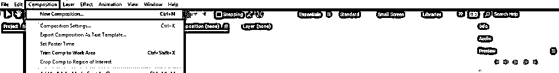

**步骤 3:** 或者您可以点击项目面板的“创建新作品”按钮来创建新作品。

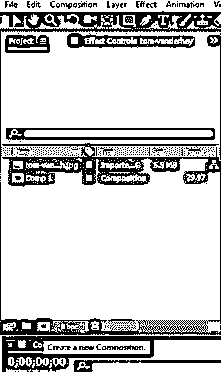

**第四步:**现在会打开构图的设置对话框。在此框中为您想要的构图进行所需的设置。

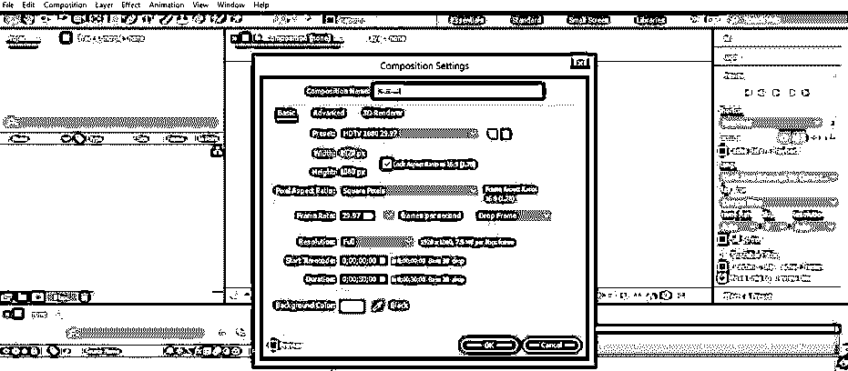

**第五步:**现在，让我们为我们的学习拍一张图片。要将图像放入该软件，请转到保存图像的文件夹。从那里选择它，并把它放在这个软件的项目面板部分。

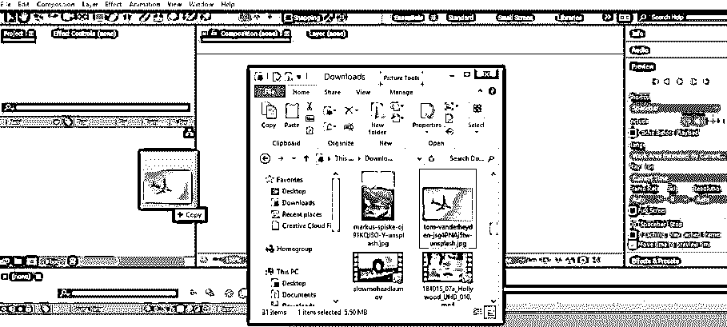

**第六步:**现在将此图像从项目面板部分拖动到该软件的图层部分，该部分位于工作屏幕的底端。

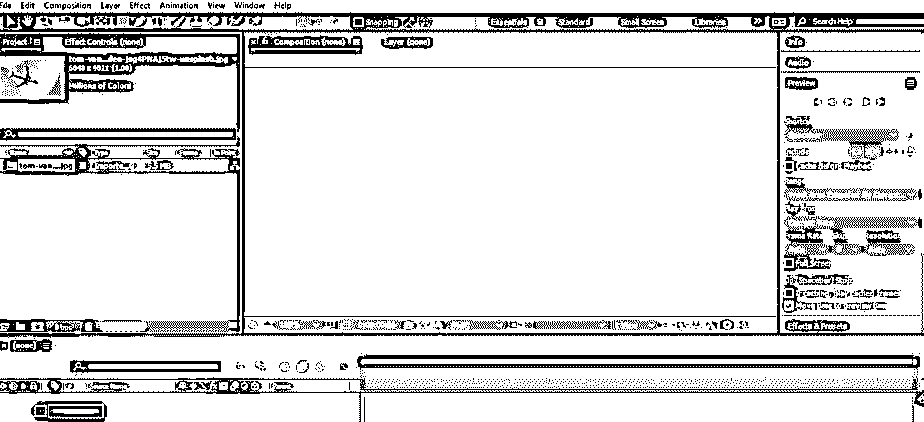

**第七步:**现在点击这一层的小箭头图标。将打开该层的变换属性列表。我将动画这个层的位置属性。单击位置属性的小秒表图标，在时间线的关键帧部分添加关键帧，并将关键帧播放头放在几秒钟后，然后在该点添加新的关键点，并更改位置的值。根据你重复这个动作来制作这个图像的动画。

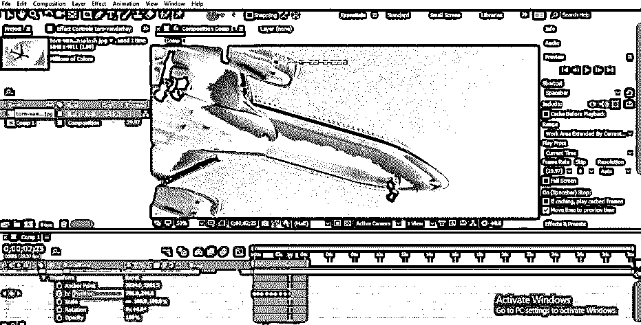

第 8 步:你可以为这个图像的多个变换属性制作动画。我还将制作这个图像的 Scale 属性的动画，如下所示。你可以根据自己的情况制作动画，或者使用任何其他动画来学习 After Effect 软件的渲染功能。

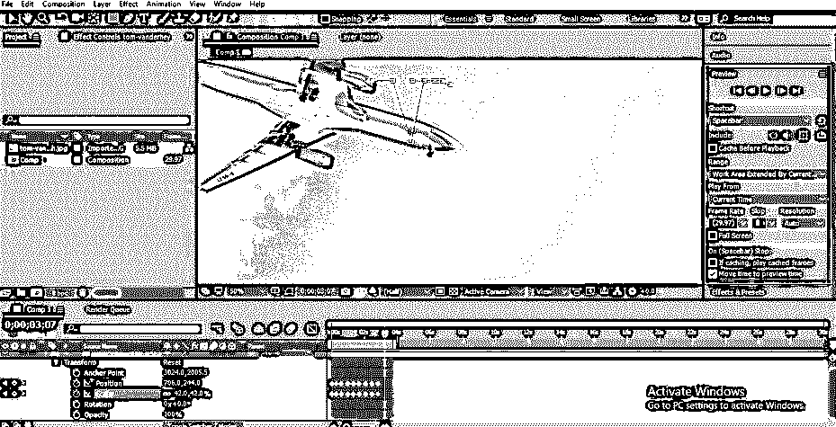

步骤 9: 现在让我们渲染这张图片，这样我们就可以在其他地方使用它。对于渲染，转到工作屏幕顶部菜单栏的合成菜单，并单击合成菜单下拉列表中的“添加到渲染队列”选项，或按 Ctrl + M 键打开渲染面板。

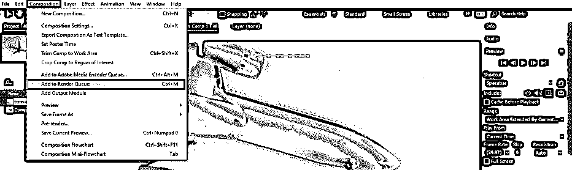

第十步:一旦你点击这个选项，一个渲染面板将在工作区的底端打开。

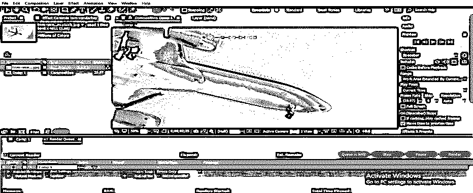

**步骤 11:** 现在点击该面板渲染设置的最佳设置选项。一旦你点击这个选项，一个渲染设置框将被打开。在此框中进行一些设置，如在质量选项卡中选择最佳，为了获得最佳的视频质量，分辨率应该为“最高”，并按此对话框中的“确定”按钮来应用设置。

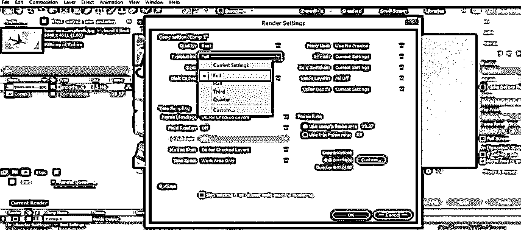

**第十二步:**现在点击输出方法的无损选项。

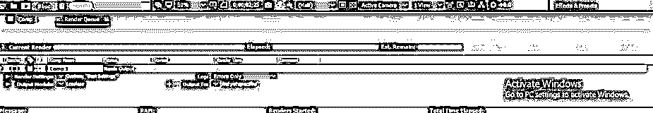

**步骤 13:** 一个输出方法设置框将被打开。选择您想要保存动画视频的文件格式，然后按对话框中的 Ok 按钮应用设置。

**步骤 14:** 现在点击“输出到”选项前，保存该文件。将会打开一个保存对话框。选择您想要保存动画视频的位置，并根据您的喜好为其命名。

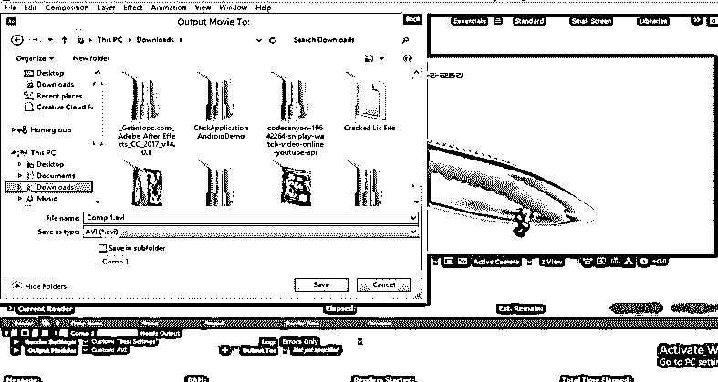

步骤 15: 现在点击渲染按钮，它在渲染面板的右边。

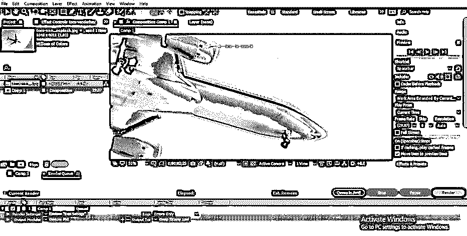

第 16 步:一旦你点击渲染按钮，你的动画就会开始渲染。渲染时间将取决于动画合成中使用的功能数量。

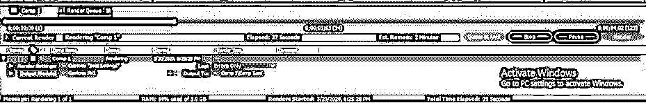

**步骤 17:** 一旦动画渲染完成。您可以在任何视频媒体播放器上播放它来查看结果。

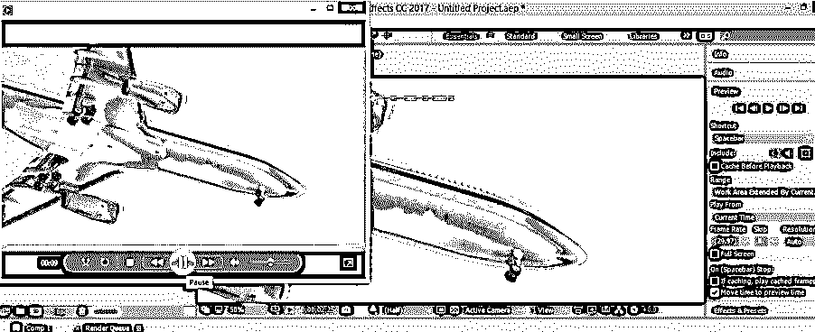

**第十八步:**可以查看文件的大小。对于几秒钟的动画来说，这是一个非常大的文件，这并不好。

步骤 19: 所以你可以做一件事来压缩这个文件的大小。压缩此动画的文件大小进入菜单栏的“合成”菜单，然后单击“添加到 Adobe Media Encoder 队列”选项。一旦你点击它，Adobe systems 的媒体编码器软件将会打开，如果你的计算机上有它，然后你可以在该软件中进行设置以获得该动画的压缩文件。

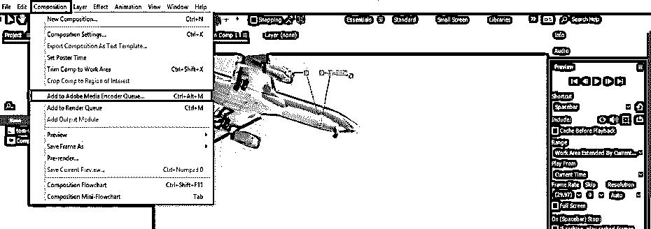

这样，您可以使用该软件中的渲染功能，为您的项目制作高度专业的视频素材。

### 结论

在这篇文章之后，你可以很容易地理解 After Effect 软件的渲染特性，也可以在任何动画视频的渲染过程中处理不同类型的渲染特性参数。通过练习，你可以熟练渲染过程。

### 推荐文章

这是一个关于后期效果渲染的指南。在这里，我们讨论介绍，渲染的特点，和不同的参数。您也可以浏览我们的其他相关文章，了解更多信息——

1.  [后效中的运动图形](https://www.educba.com/motion-graphics-in-after-effects/)
2.  [特效后的滑块控制](https://www.educba.com/slider-control-after-effects/)
3.  [2D 特效动画后](https://www.educba.com/2d-after-effects-animation/)
4.  [后效中的毛刺效应](https://www.educba.com/glitch-effect-in-after-effects/)

