# 后效表达式

> 原文：<https://www.educba.com/after-effects-expressions/>

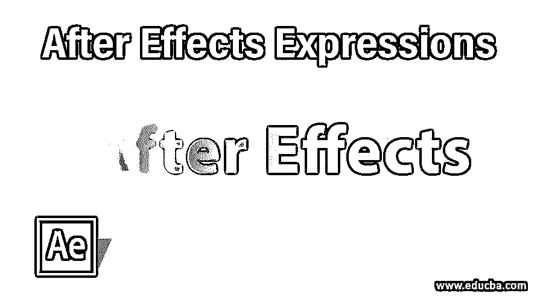

## 后效表达式介绍

After Effect 是用于视频编辑工作的图形设计软件，在视频编辑图形专业人员中很流行，我们可以通过使用表达式在这个软件中制作任何对象的动画。表达式意味着一个代码，通过它你可以在任何对象上定义任何效果，并节省你在每一帧中为该效果给出命令的时间。如果你懂 Javascript，你可以很容易地使用这个软件中的表达式来制作任何对象的最佳动画。如果你没有计算机背景，你可以通过练习来学习表情编码。因此，让我们分析一下本文中的术语表达式，并看看如何处理它的参数？

### 如何在 After Effects 中使用表情？

我们将通过任何例子以一种非常有趣的方式理解 After Effect 中的表达式。在开始我们的文章之前，让我们简单地看一下这个软件的工作屏幕，这样我们就可以很容易地理解贯穿本文的这个软件的工作环境。

<small>3D 动画、建模、仿真、游戏开发&其他</small>

**第一步:**在工作屏幕的顶部，我们有两个丝带，分别是菜单栏和工具栏；第二个最上面的部分有三个主要区域，左边是项目面板，中间是合成窗口，右边是一些重要的参数部分，在这些部分下面我们有两个另外的重要部分，左边是图层部分，右边是时间轴部分。在整篇文章中，您将会理解所有这些部分的工作原理，所以为了您的更好理解，请从头到尾关注我们。

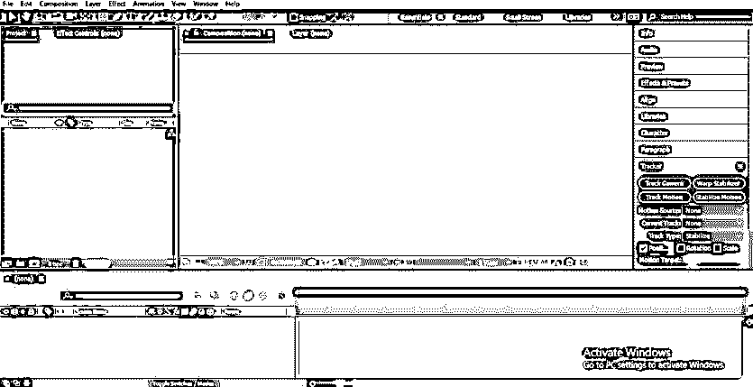

**第二步:**我们先来一个新的构图。对于新组合，进入菜单栏的文件菜单，点击下拉列表中的“新组合”选项，或者您可以按 Ctrl + N 键进行新组合。

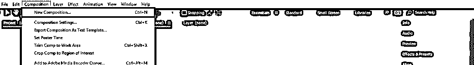

**第三步:**新构图的对话框将打开。在此框中进行所需的设置，然后按此对话框中的“确定”按钮应用设置。

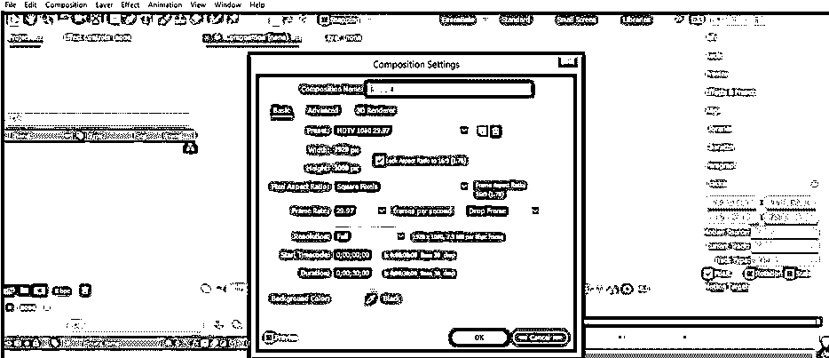

**第四步:**现在，从这个软件的工具面板里拿出文字工具，它在工作屏幕的顶部。

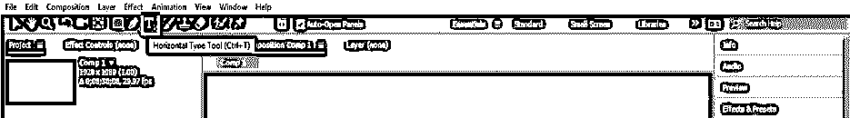

**第五步:**现在，用文本工具在写作窗口区域输入你想要的文本。

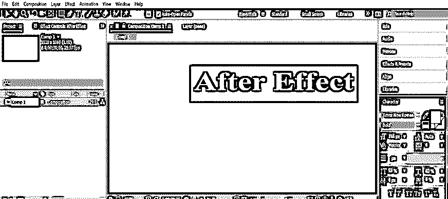

**第六步:**在参数部分工作区右侧的对齐选项卡的帮助下，将其对齐到合成窗口的中央。

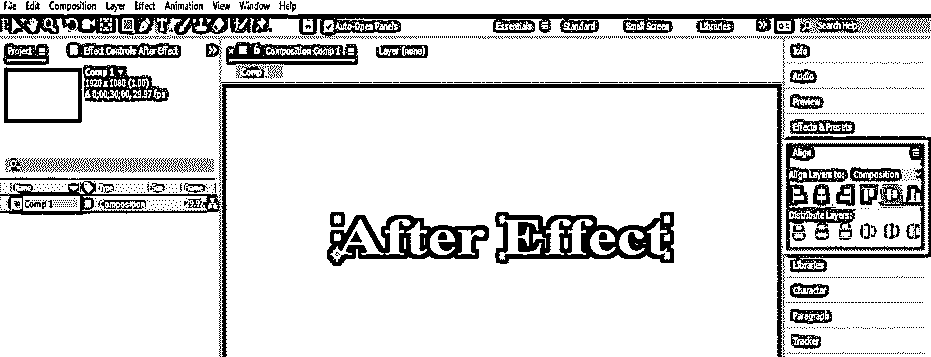

**第七步:**现在进入这个软件的图层部分，点击文字图层的小箭头图标。文本层的属性将被打开。点击文本的动画选项。

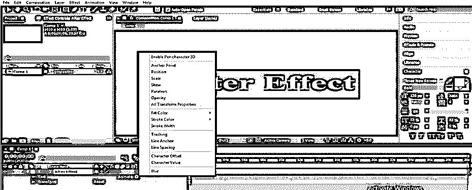

**步骤 8:** 从属性下拉列表中选择您想要应用表达式的文本属性。我将选择文本的位置属性。

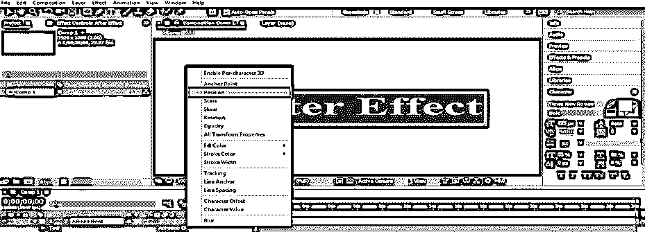

**步骤 9:** 现在点击 Animator 1 的小箭头图标，从这里删除范围选择器 1，因为我们希望表达式选择器在这里。要删除范围选择器 1，单击它并按键盘上的“删除”按钮。

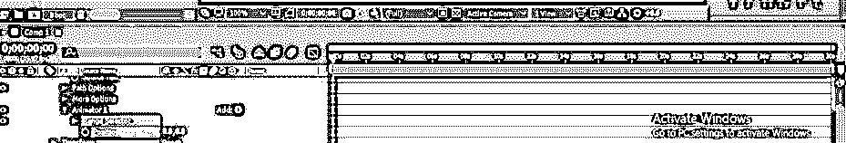

**步骤 10:** 现在点击 Animator 的添加按钮，进入下拉列表中的选择器，从新的下拉列表中选择表达式选项。

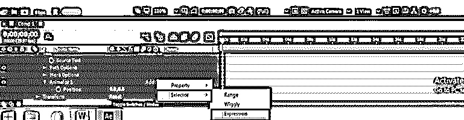

**步骤 11:** 现在点击表达式选择器 1 的小箭头图标，选择要应用表达式的；例如，如果选择字符，则表达式将仅对文本字符有效。所以根据你从下拉列表中选择任何人。

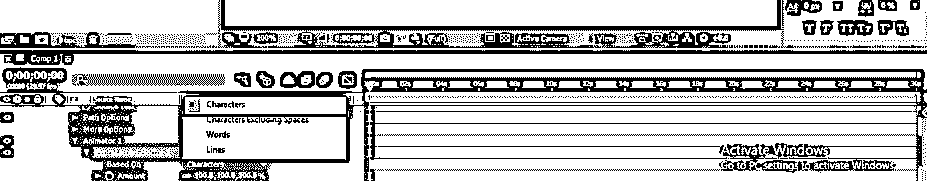

**第十二步:**现在点击金额的小箭头图标，打开表达式代码。您可以在时间轴的帧部分看到表达式代码。

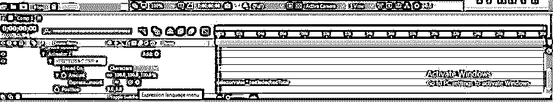

步骤 13: 现在通过点击来选择这个表达式。

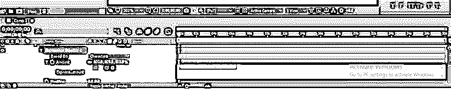

第 14 步:像这样输入一个表达式。通过练习，你会成为一名专家。

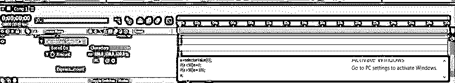

**步骤 15:** 该表达式将作用于表达式选择器 1 之上的任何其他表达式。所以让我们来看看扭动的表情。对于 Wiggly 表达式，单击 Animator 1 的添加按钮；将打开一个下拉列表；转到选择器，并从新建下拉列表中选择摆动。

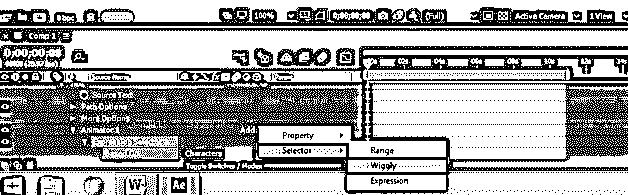

**步骤 16:** 将 Wiggly 选择器 1 放在表达式选择器 1 上面。

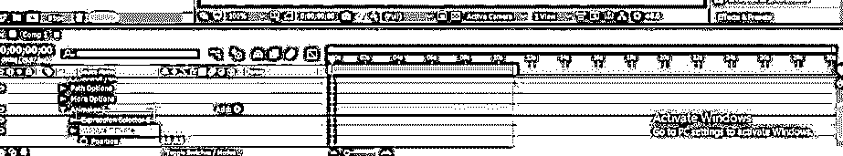

步骤 17: 现在禁用表达式选择器 1 层，以查看扭动选择器对文本的效果。现在增加位置的值。根据我们的表达式，如果 position 的值小于 50，那么字符将保持在它的位置，如果 position 的值大于 50，那么字符的位置将发生变化。

**步骤 18:** 现在，当您启用表达式选择器 1 层时，表达式的代码将显示结果。

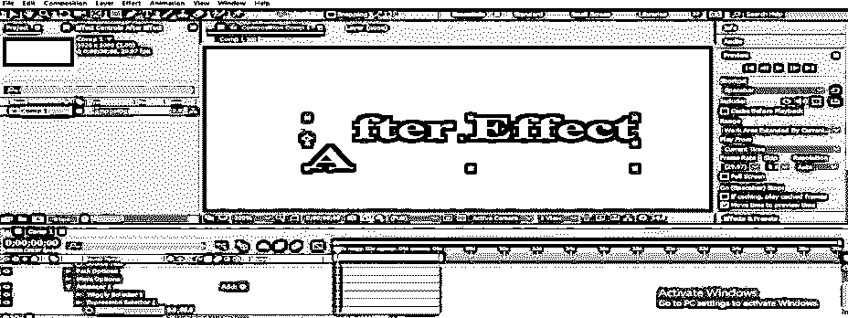

**第 19 步:**你可以取文本的任意属性，在该属性上添加表达式。只需点击 Animator 1 的“添加”按钮，在你的作品中选择你想要的属性。

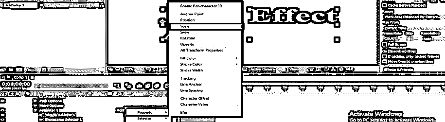

**步骤 20:** 你也可以在文本层的源文本选项添加表达式。

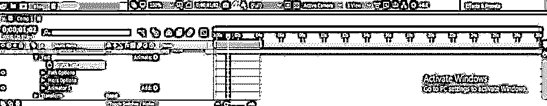

**第 21 步:**按住键盘的 Alt 键点击源文本选项的小时钟图标即可。表达式将在时间轴的关键帧区域打开。

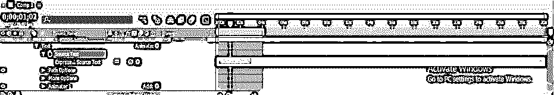

**第 22 步:**假设我将在表达式中键入时间。

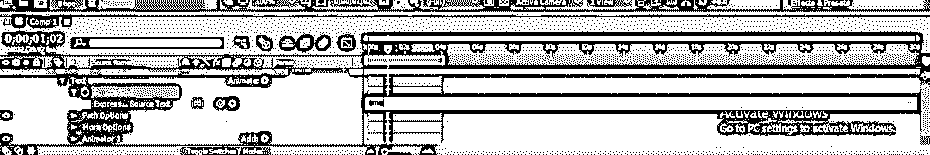

**步骤 23:** 然后会在构图区计时。

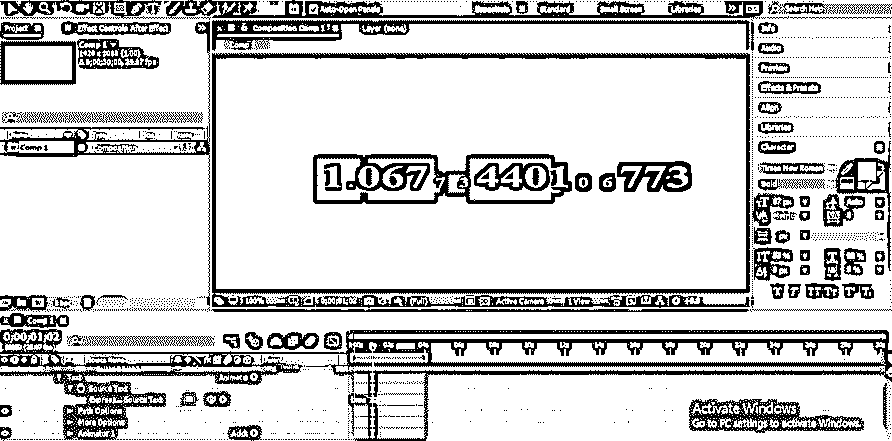

**第 24 步:**如果你对 Javascript 一无所知，并且在制作表达式代码时遇到困难，那么还有一个选项可以让你使用 After Effect 软件预先设计好的表达式。对于预先设计的表达，请转到工作区右侧的该软件的效果&预设选项卡。

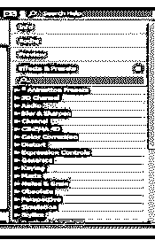

**步骤 25:** 现在点击动画师预置的小箭头图标。将会打开一个预置列表。

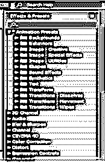

**步骤 26:** 现在点击文本预置的小箭头图标。预置数表达式将在这里打开。

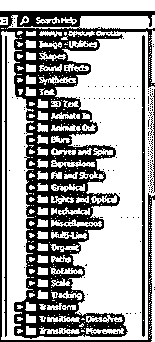

第 27 步:在这里选择你想要的表情，然后把它放到写作窗口区域的文本上。

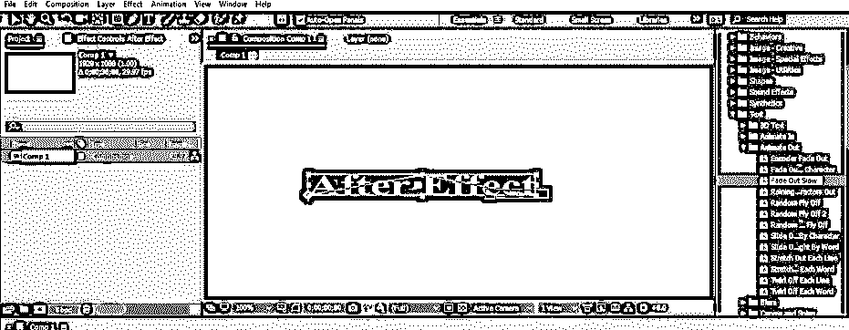

**步骤 28:** 预置的表达式会像这样应用到你的文字层。

这样，你可以在 After Effect 中使用 Expression 并处理它的参数。

### 结论–后效表达式

现在看完这篇文章，你就能理解“什么是后效表达”和“你如何在你的图形设计工作中毫无困难地处理它以获得最佳效果”。可以通过练习 Javascript 代码编写来增加使用 expression 的面积。

### 推荐文章

这是一个关于后效表达的指南。这里我们一步一步地讨论如何在 After Effect 中创建表情。您也可以浏览我们的其他相关文章，了解更多信息——

1.  [后效中的运动图形](https://www.educba.com/motion-graphics-in-after-effects/)
2.  [特效后摆动](https://www.educba.com/wiggle-in-after-effects/)
3.  [在后效中投射阴影](https://www.educba.com/drop-shadow-in-after-effects/)
4.  [特效转换后](https://www.educba.com/after-effects-transitions/)

