# 后期效果预设

> 原文：<https://www.educba.com/after-effects-presets/>

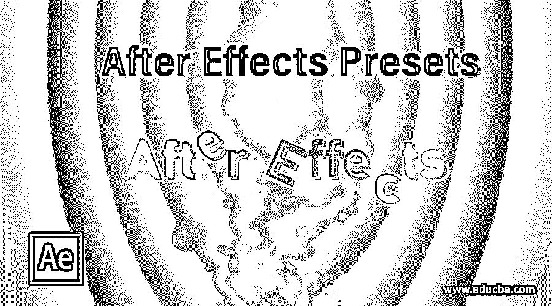

## 后期效果预设简介

After Effect 是 Adobe Systems 最受欢迎的软件，用于视频编辑，并被图形编辑广泛用于他们的工作中。After Effect 有许多类型的令人兴奋的特性，这使它与众不同。在这个软件中，我们有一些预设，这意味着一个预定义的效果与该效果的预设参数。通过使用“预置”,您可以在构图上应用效果，而无需对该效果的参数进行任何设置。在这个软件中，我们有不同类型的预置用于不同的目的。我会给你看一些预设，教你如何在作文中使用预设。因此，让我们开始我们的文章，学习预置后的效果软件。

### 如何使用 After Effects 预设？

预设是这个软件非常有用的术语，通过它你可以在这个软件中制作任何构图时节省你的时间。在这里，我们将分析不同类型的预设，并通过示例了解它们。在开始我们的文章之前，让我们先了解一下这个软件的用户界面，以便更好地理解这个软件的工作原理。

<small>3D 动画、建模、仿真、游戏开发&其他</small>

**步骤 1:** 在该软件的工作屏幕中，我们有不同类型的部分用于不同类型的目的。让我们一个一个地看一下每一部分。在工作屏幕的顶部，有菜单栏和工具栏，用于在该软件中进行不同类型的调整；接下来的部分是项目面板，效果控制面板在工作屏幕的左侧，在中间，有一个组成窗口，显示您的项目的当前组成，在工作屏幕的右侧，我们有一些重要的参数标签，如效果&预设标签，预览标签，对齐标签等。在这个软件的底端，我们在左端有图层部分，它向你显示任何构图的层数，在右端有时间轴部分，用于处理任何动画的参数。这些部分使得这个软件对用户非常友好。

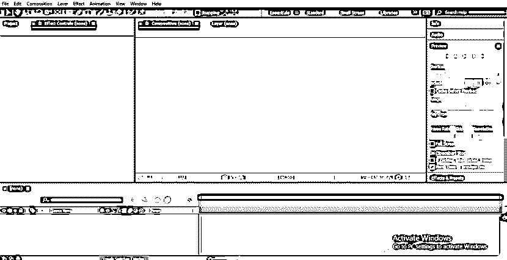

第二步:让我们先来一篇新的作文进行学习。对于新的组成，点击这个小图标按钮“创建新的组成”在项目面板部分。

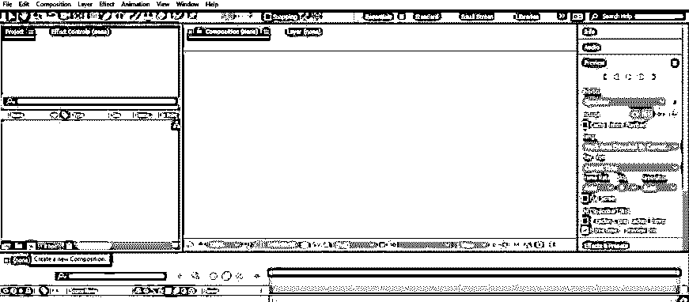

**第三步:**点击新建构图按钮，构图设置对话框打开。在此框中为您的新作品进行所需的设置。

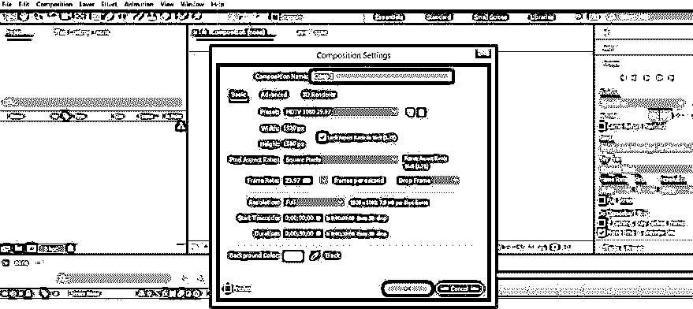

**第四步:**现在，从这个软件的工具面板里拿出文字工具，它在工作屏幕的顶部。

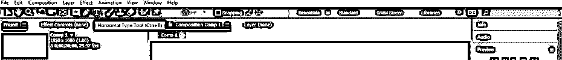

**步骤 5:** 在撰写窗口部分区域输入您想要的文本。我将输入“动画”作为我的文本。

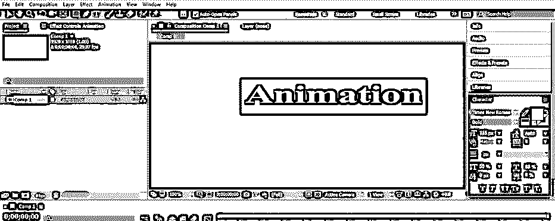

**第六步:**使用工作区右侧的对齐选项卡的设置，将其对齐到合成窗口的中央。

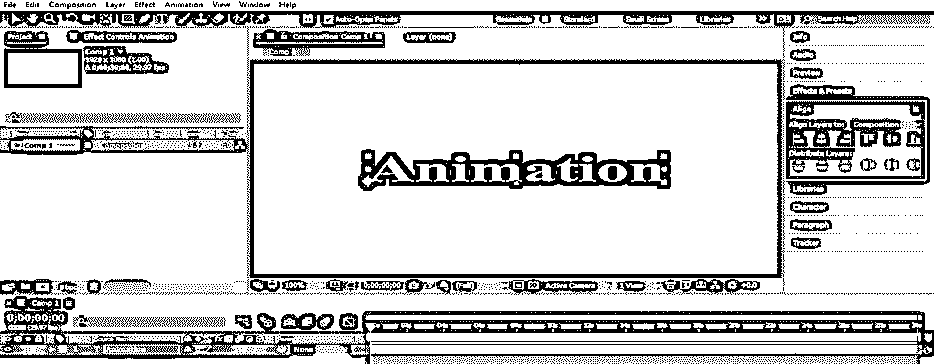

第七步:现在打开效果&预设标签。要启用效果&预设选项卡，请转到菜单栏的窗口菜单，在效果&预设选项上打勾，或者您可以按 Ctrl + 5 启用效果&预设选项卡。

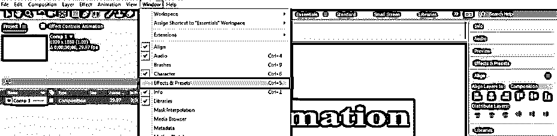

**第八步:**效果&预设选项卡将在工作屏幕右侧的不同参数部分打开。

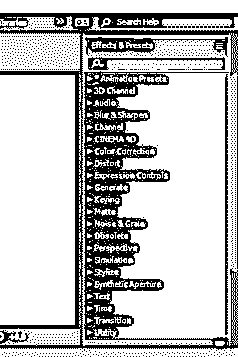

**第 9 步:**有一种不同类型的预设。我们将通过动画预设选项来理解预设。单击动画预设选项的小箭头图标。预设下拉列表将会打开。

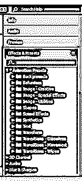

第十步:让我们在文本层应用文本预设。单击预设列表中文本预设的小箭头图标。

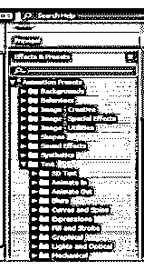

**步骤 11:** 从这里选择任何一个文本预置，用鼠标键从那里拾取，然后放在组合窗口区域的文本层上。

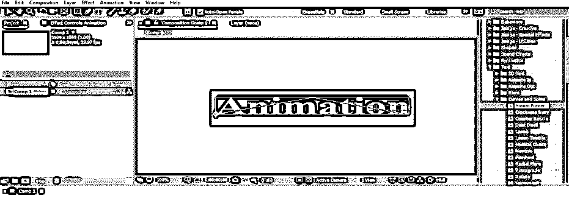

**步骤 12:** 现在进入这个软件的图层部分，在这个软件的底端，选择文字图层。现在，按下键盘上的 U 按钮，在关键帧部分查看此预设效果的应用键。

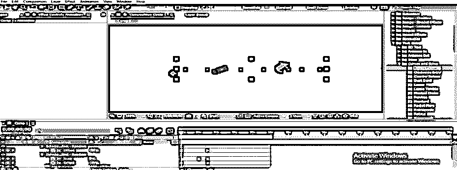

**步骤 13:** 现在通过按键盘的空格键或者从参数部分的预览选项卡播放应用的效果。

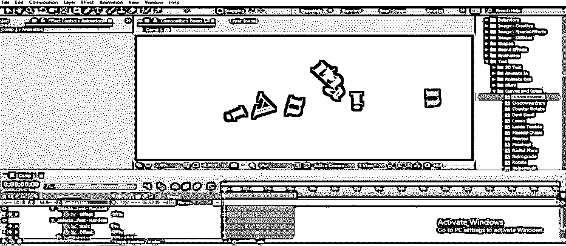

**步骤 14:** 你可以在一个构图的不同图层上使用多个预置。让我们在文本工具的帮助下在不同的图层上输入新的文本。我将在此输入“预设”作为我的文本。

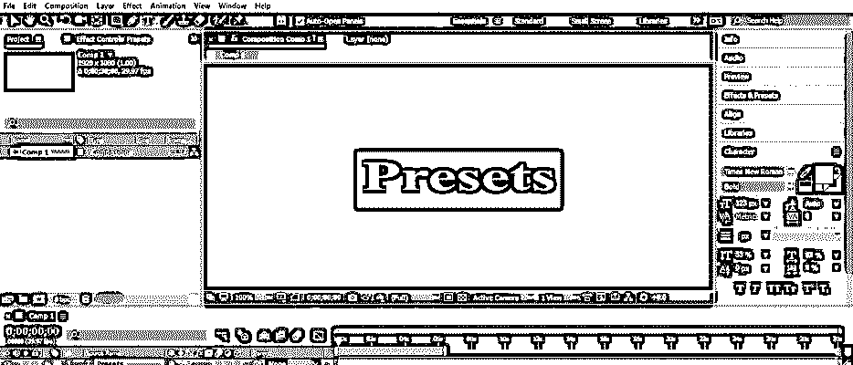

**步骤 15:** 现在在第一个文字层之后调整这个文字层的框架。

步骤 16: 现在，再次进入效果&预设部分，从文本预设列表中选择另一个效果预设。

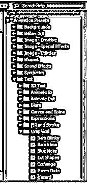

**步骤 17:** 现在，在鼠标键的帮助下，从列表中选择效果并放到新文本上。

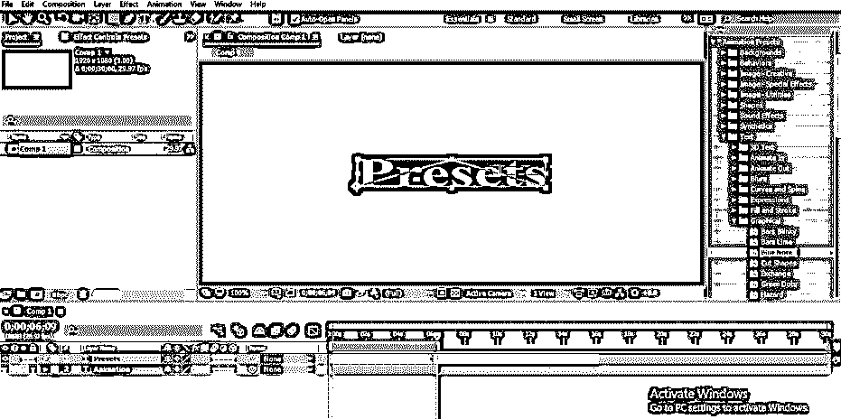

**步骤 18:** 现在以这种方式调整时间轴帧部分中两个文本层的帧，使得第二个文本的第二个动画在第一个动画结束后立即开始。

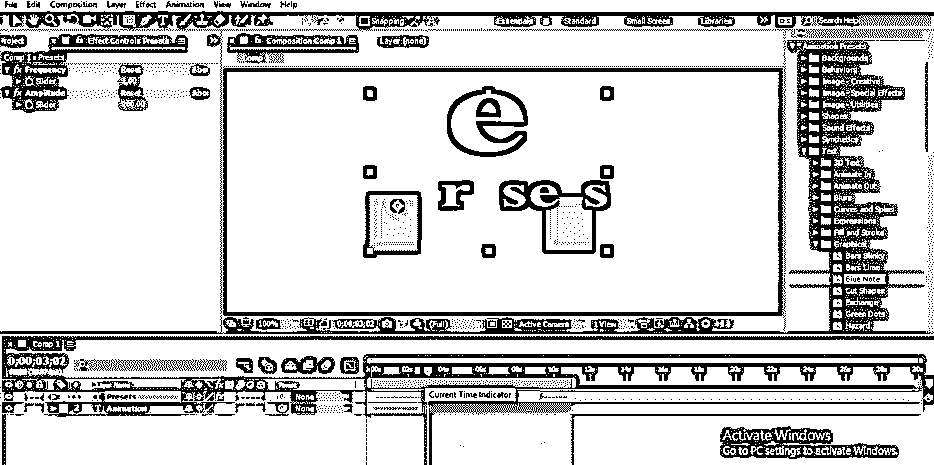

**步骤 19:** 你也可以对任何图像应用预设。因此，让我们在 After Effect 软件中拍摄一张图像。要放置图像，请转到保存 I 的文件夹，从那里选择它，然后将其放在该软件的项目面板部分。

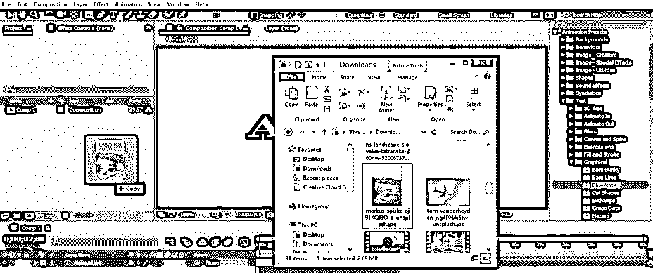

**步骤 20:** 现在，在鼠标按钮的帮助下，从项目面板部分拖动这个图像到图层部分。

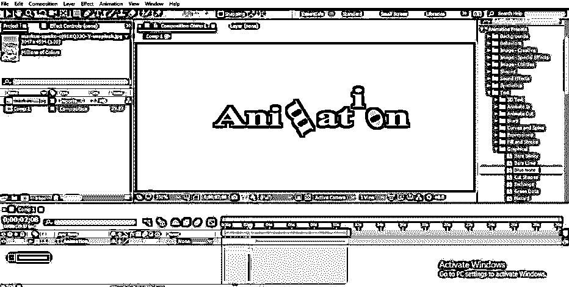

**步骤 21:** 现在在文字图层的帧结束后，立即在关键帧部分调整该图像的帧。

**步骤 22:** 现在点击预设列表中图像预设的小箭头图标。从下拉列表中选择任何一个图像预设，从列表中选取该预设，然后将其放在时间轴帧部分中的图像帧上。

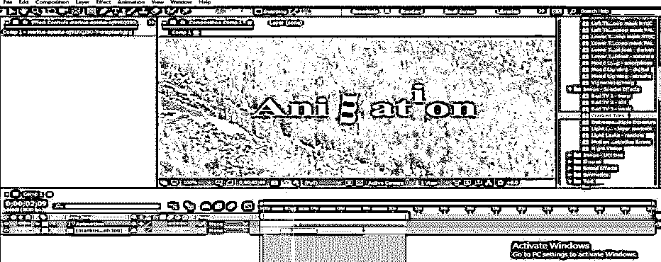

**步骤 23:** 现在，当你按下键盘的空格键播放动画时，它会是这样的。

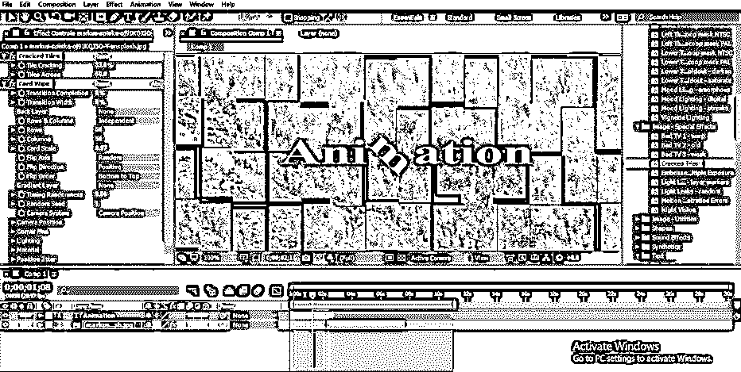

通过这种方式，您可以在 After Effects 软件中使用预设，并处理其参数以制作出色的作品。

### 结论

分析完本文后，您可以了解 After Effects 软件中的预设，并在您的项目工作中使用它来获得最佳效果。您也可以通过将预设应用到您的作品来节省时间。您也可以从预设中获得灵感，用自己的想法制作自己的效果。

### 推荐文章

这是一个关于后期效果预设的指南。在这里，我们讨论如何创建不同的步骤，以获得更好的效果后的效果预设。您也可以浏览我们的其他相关文章，了解更多信息——

1.  [后效中的遮罩](https://www.educba.com/mask-in-after-effects/)
2.  [2D 特效动画后](https://www.educba.com/2d-after-effects-animation/)
3.  [降雪后的影响](https://www.educba.com/snowfall-in-after-effects/)
4.  [雨后效果](https://www.educba.com/rain-in-after-effects/)
5.  [后效时间线指南](https://www.educba.com/after-effects-timeline/)

