# Duik 后效

> 原文：<https://www.educba.com/duik-after-effects/>

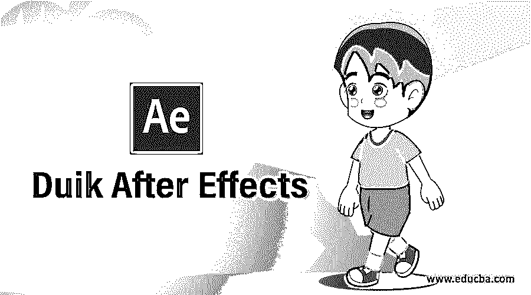

## Duik After Effects 简介

众所周知，After Effects 既是视频编辑软件，也是动画制作软件。在这个软件中，我们可以借助一些插件制作一些有效的动画。Duik 是一个插件，可以帮助操纵任何角色设计的部件，以制作该角色的最佳动画，并为您提供部件的预先设计的运动部件。在这里，我们将使用 Duik 插件制作一个动画，并分析 Duik 插件的参数，以便更好地理解这个主题。

### 如何在 After Effects 中使用 Duik？

Duik 只不过是一个插件软件，它使得后期效果软件的工作变得简单。我们将逐步了解 Duik 插件。在开始我们的学习之前，让我们看一下这个软件的工作屏幕，这样在我们学习整篇文章的过程中就不会出现问题。

<small>3D 动画、建模、仿真、游戏开发&其他</small>

**步骤 1:** 在工作屏幕的顶部，有两个主功能区，分别是菜单栏和带有活动工具属性栏的工具栏，在这两个功能区的下面，有三个主要部分，分别是左侧的项目面板和效果控制面板，中间是合成窗口，右侧是一些重要的参数面板。 在这三个部分下面还有另外两个重要的部分，它们是工作屏幕底端左侧的图层部分，在底端的右侧是时间轴面板。

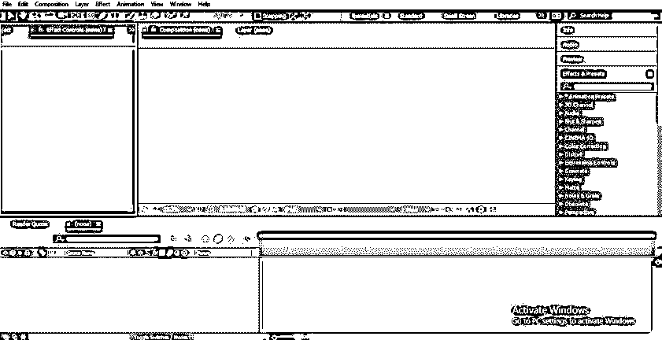

**第二步:**现在，在了解了该软件的工作屏幕后，让我们开始学习。首先，拿一篇新作文来说。对于新组合，您可以使用工作屏幕顶部的三个选项中的任何一个，单击菜单栏的组合菜单，然后从下拉列表中选择新组合选项或按键盘上的 Ctrl+ N 按钮作为新组合的快捷键。

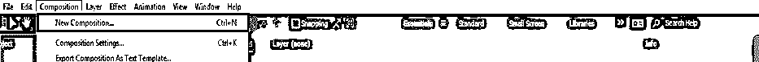

**第三步:**第二个选项是转到该软件的项目面板，并点击该选项卡，名称为“创建一个新的组成”的新组成。

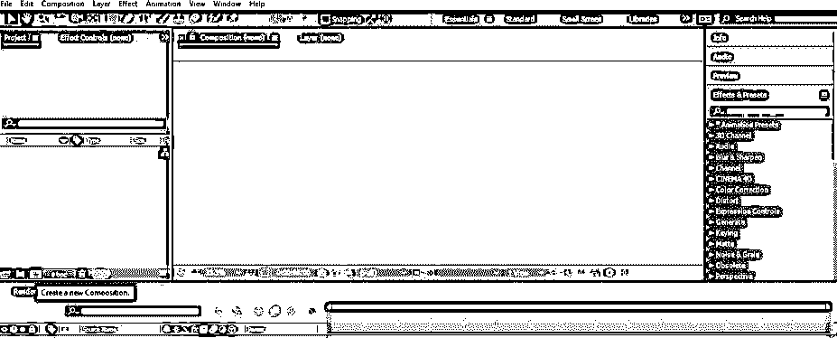

**第四步:**或者第三个选项是在该软件的项目面板部分的任意位置单击鼠标右键，然后单击下拉列表中的“新建构图”选项来新建构图。

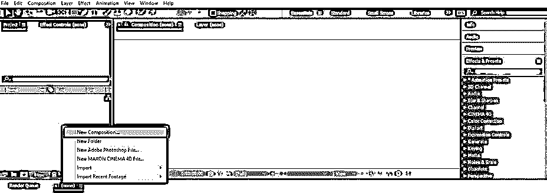

**第五步:**打开构图设置框，进行新构图的设置。在这里你可以为你的新作品做你想要的设置。完成设置后，点击该对话框的“确定”按钮应用设置。

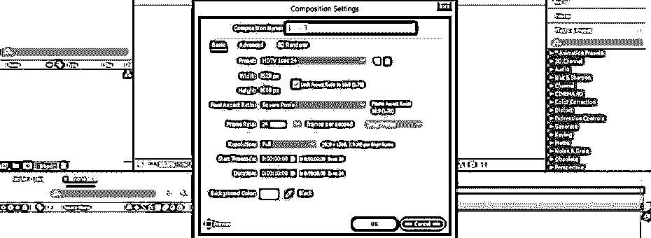

**步骤 6:** 现在，让我们从 adobe Illustrator 中获得一个字符手的矢量文件。现在在这个软件中导入一个手形的矢量文件。要导入文件，只需右键单击该软件的项目面板部分，转到下拉列表中的导入选项，然后单击新下拉列表中的文件选项。

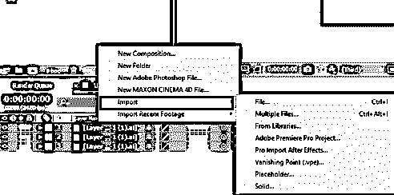

**第七步:**或者你也可以进入该软件菜单栏的文件菜单，该菜单位于顶部，然后进入下拉列表中的导入选项。现在点击新建下拉列表中的文件选项。

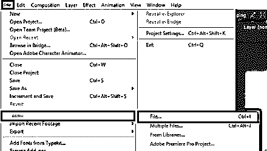

第八步:或者你可以简单地从你个人电脑的文件夹中选择一个文件，放到这个软件的项目面板部分。

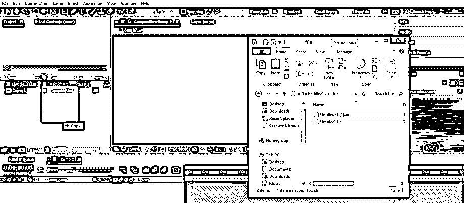

**步骤 9:** 如果你的矢量工作是在不同的层，将询问你是否想要合并你的所有层或单独放置它们，一个接一个。我将选择合并层选项，并按下这个对话框的确定按钮。

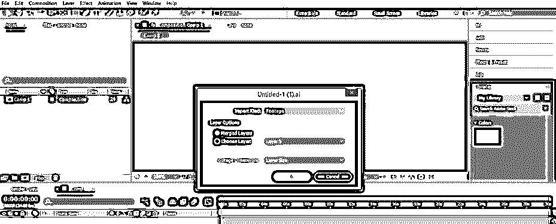

步骤 10: 现在把这个矢量图层从项目面板拖到这个软件的图层部分，在工作屏幕的底端。

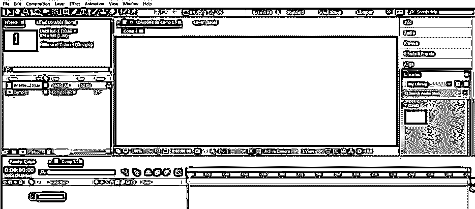

**步骤 11:** 现在使用这个软件的 align 标签调整角色的手，使它们在中心对齐，这个标签在作曲窗口右侧的参数部分。

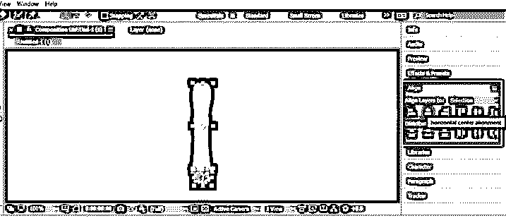

**步骤 12:** 现在，让我们打开 Duik 插件面板。对于 Duik 插件面板，请转到该软件菜单栏的窗口菜单，然后单击下拉列表中的 Duik Bassel 选项。如果你的个人电脑上没有 Duik 插件，那就从网上下载。因为它是一个开源程序，所以对所有人都是免费的。

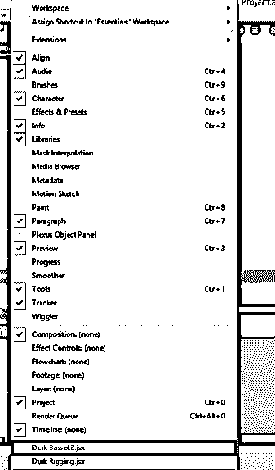

**步骤 13:** 一个 Duik 设置框将被打开。单击此框中的“打开首选项”选项卡。

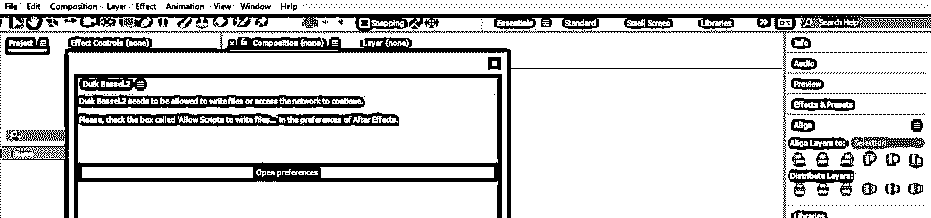

**第 14 步:**偏好设置框将打开。启用“允许脚本变白…”选项，然后按此对话框的“确定”按钮。

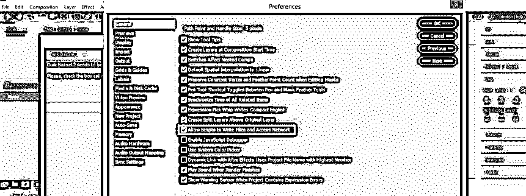

**步骤 15:** 现在选择您想要继续 duik 插件的语言，并按下 Duik Bassel 2 对话框的 Ok 按钮。

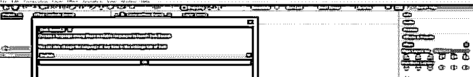

**步骤 16:** 现在，duik 面板窗口已准备就绪，可供您使用。

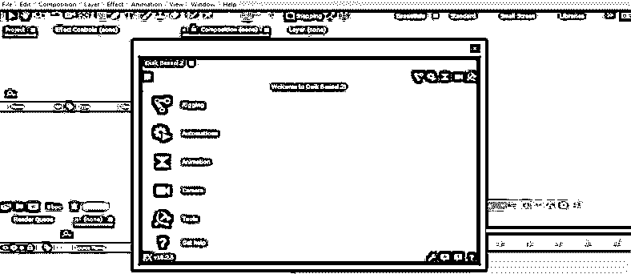

**第十七步:**根据您的适合程度，将该窗口放置在该软件工作屏幕的某个位置。我将把它放在参数区。

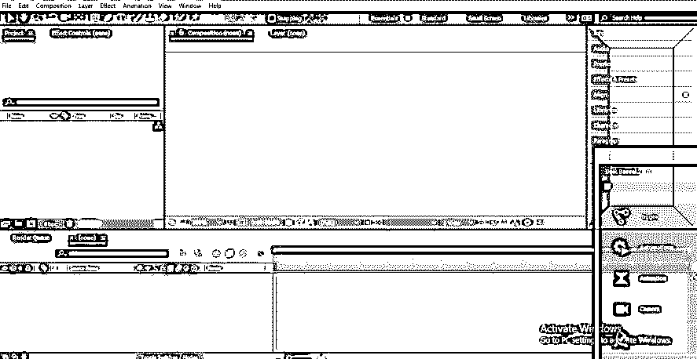

**步骤 18:** 现在，从这个软件的工具面板里拿出木偶针工具。

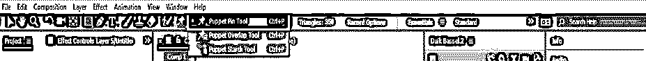

**步骤 19:** 在手上做一个针尖，就像骨头的关节。

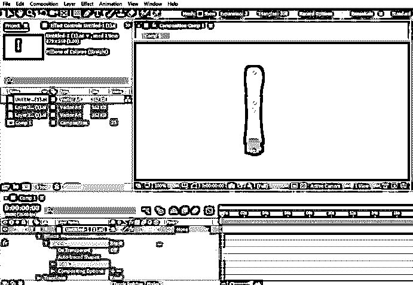

**第 20 步:**现在点击链接的添加骨骼选项&在 Duik 面板中的绑定约束选项。

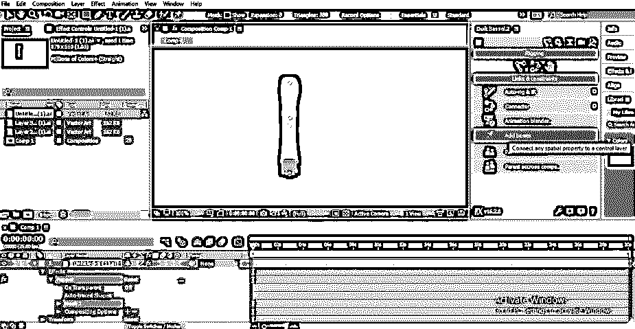

**第 21 步:**点击添加骨骼选项后，手的末端会出现一个大头针。

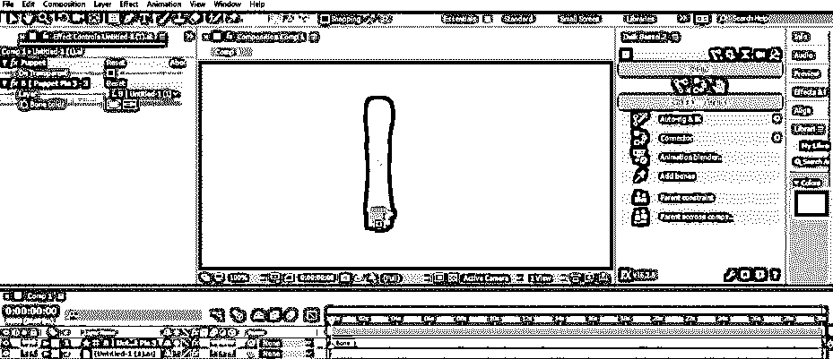

步骤 22: 现在来到图层部分，选择手部图层，然后点击自动装配& IK 选项。

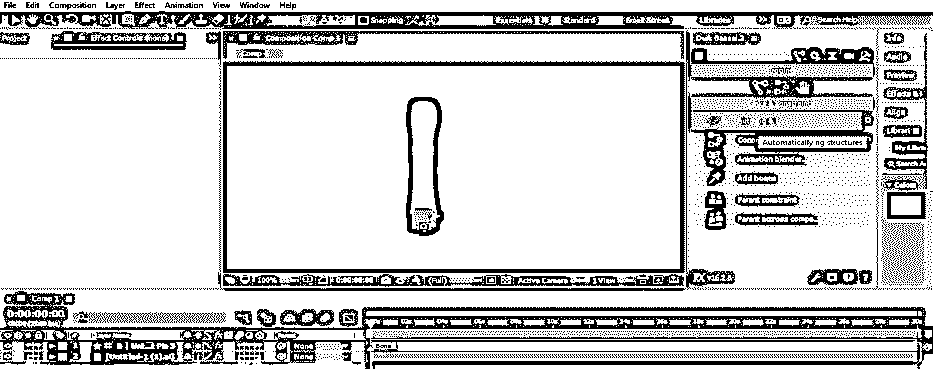

**第 23 步:**现在握住别针，朝你想要的方向移动它，来控制这只手的动作。

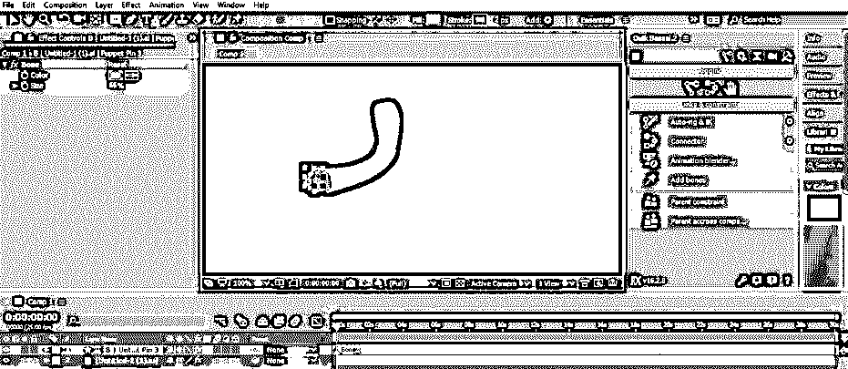

*   现在你可以在 Duik 插件的帮助下给这只手赋予动作并制作动画。这样，你就可以使用这个软件中的 Duik 插件，在它的帮助下制作一个有效的运动角色。

### 结论

现在，看完这篇文章后，您已经了解了关于 Duik 软件的一切，并且可以轻松地处理这个插件的参数。通过分析 Duik 插件的不同特性，你可以为你的角色设计不同类型的装备。一旦你掌握了这个插件的特性，你将会在你的图形设计技能上加分。

### 推荐文章

这是一个关于 Duik 后效的指南。这里我们讨论一个介绍，如何一步一步地创建 Duik After 效果。您也可以浏览我们的其他相关文章，了解更多信息——

1.  [特效后的滑块控制](https://www.educba.com/slider-control-after-effects/)
2.  [后效合成](https://www.educba.com/composition-in-after-effects/)
3.  [特效转换后](https://www.educba.com/after-effects-transitions/)
4.  [后效快捷键](https://www.educba.com/after-effects-shortcuts/)

