# 特效分割剪辑后

> 原文：<https://www.educba.com/after-effects-split-clip/>

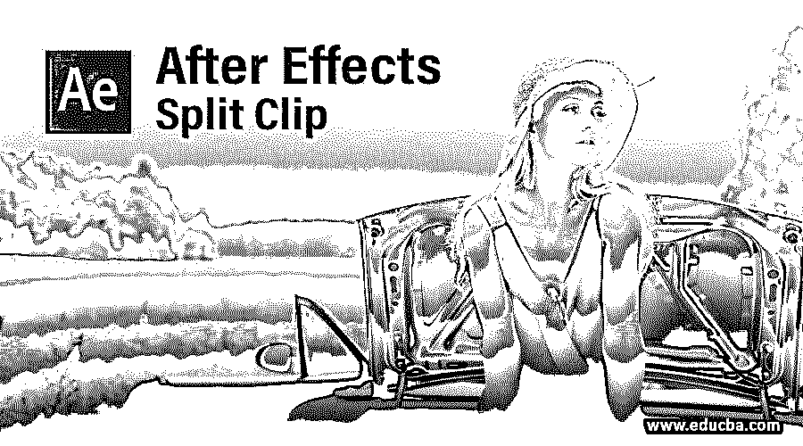

## 后效分割剪辑简介

After Effects 是由 Adobe systems 开发的视频图形编辑软件，目前它是 Adobe Systems 的 Creative cloud 应用程序的一部分。我们可以用这个软件做不同类型的视频编辑工作。从任何视频片段中分割剪辑是编辑工作之一。您可以通过一种方法来理解分割剪辑，在这种方法中，我们剪切任何视频镜头的任何特定片段，并根据我们的要求将它们与其他视频剪辑一起使用。在这里，我们将通过一个视频片段的例子来理解这个主题，我们还将把我们的分割剪辑合并到一个视频中。那么让我们从这个软件开始学习吧。

### 如何分割剪辑后的效果？

我们将通过几个简单而激动人心的步骤毫无问题地理解 After Effects 的这一特性，但在继续学习之前，我们应该浏览一下该软件的工作屏幕，并了解屏幕的所有部分，以便更好地理解。所以让我们来讨论一下。

<small>3D 动画、建模、仿真、游戏开发&其他</small>

**步骤 1:** 在工作屏幕的顶部有两个功能区，分别是菜单栏和工具栏，在这两个功能区的下方，屏幕被分成三个部分，分别是左侧的项目面板、该部分中间的合成窗口和该部分右侧的参数部分，在这些部分的下方，我们还有两个其他部分，分别是该部分左侧的层面板和该部分右侧的时间线面板。您可以根据自己的要求调整这些部分，制作自己的工作屏幕。

现在让我们有一篇新的作文来学习。对于新的构图，进入菜单栏的构图菜单，该菜单位于该软件工作屏幕的顶部，并点击它。现在点击下拉列表中的“新合成”选项。

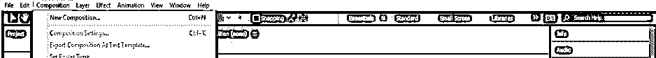

**第三步:**或者你可以到这个软件的项目面板，在这个部分的任何地方用鼠标右键点击。一旦您在此部分点击此处，将会打开一个下拉列表。从下拉列表中选择“新组合”选项。

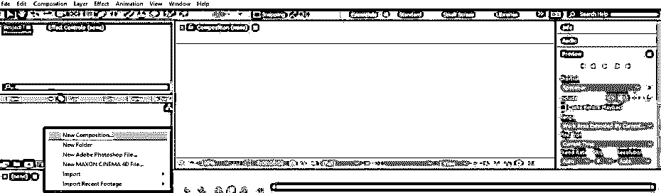

第四步:或者你可以点击项目面板底端的“创建新作品”标签。

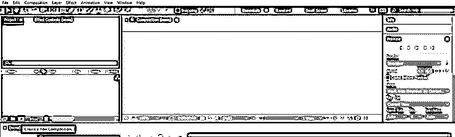

**第五步:**点击以上任意一个新建构图选项，构图设置对话框打开。现在，在该框中进行所需的设置，并按下该对话框的确定按钮，应用该框的设置。

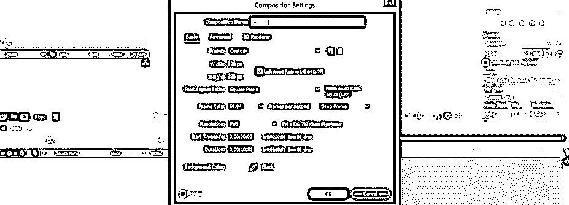

第六步:现在，让我们为我们的工作录像。你可以从网上下载视频或者自己制作。我将从 https://www.pexels.com 网站[下载视频片段。你可以从其他地方下载。要将此视频素材放入 After Effects 软件中，请转到您个人计算机中保存它的文件夹，从那里选择它，然后在鼠标按钮的帮助下将其放入该软件的项目面板部分。](https://www.pexels.com)

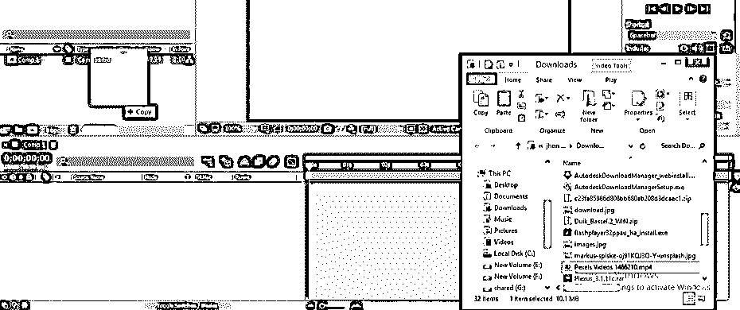

**第七步:**现在用鼠标键把这个视频素材从项目面板部分拖到这个软件的图层面板。

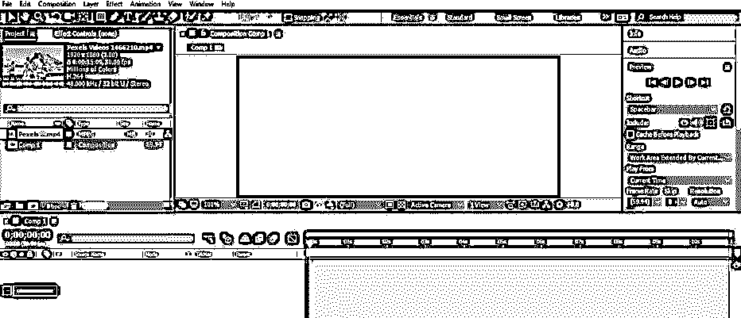

**步骤 8:** 现在，从项目面板的顶部或视频素材的属性中检查视频素材的分辨率。它是 1920 X 1080。所以我会把我的构图尺寸和这个视频片段一样。

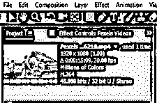

**第九步** **:** 现在在项目面板中选择你的合成图层，进入工作屏幕顶部菜单栏的合成菜单，点击下拉列表中的合成设置选项，或者你可以在键盘上的合成设置框中按 Ctrl + K 键。

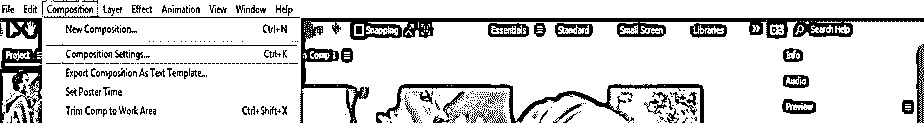

**步骤 10:** 现在点击该框预设选项的下拉箭头，从该框的预设列表中选择 HDTV 1018 25 分辨率选项，其分辨率与我们的视频素材的分辨率相同，然后点击该对话框的确定按钮。

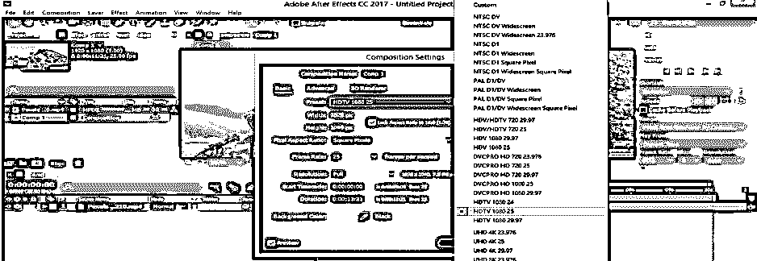

**步骤 11:** 现在转到图层面板中的视频素材图层，该图层面板位于该软件工作屏幕的底部，通过单击选中它。现在，将关键帧播放头放在您想要分割视频剪辑的帧速率处。

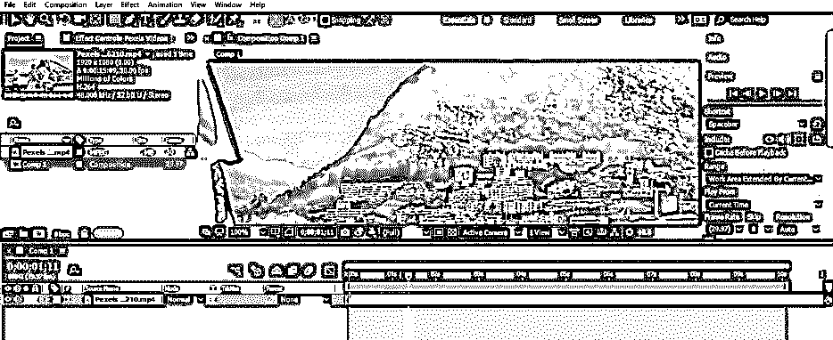

**步骤 12:** 现在按下键盘上的 Ctrl + Shift + D 按钮，将剪辑从这一点分割成一个新的图层。一旦你按下这些按钮，一个新的分离层将会像这样出现在图层部分。

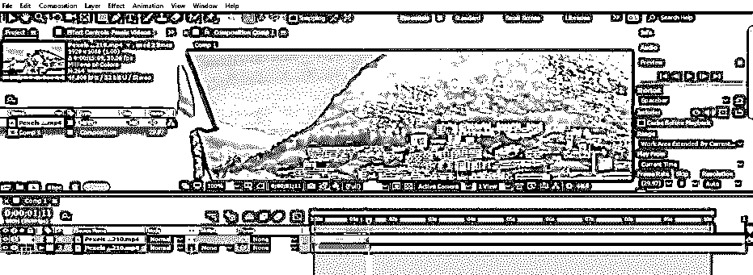

**第 13 步:**如果你不想要这段视频，那么就选择它。

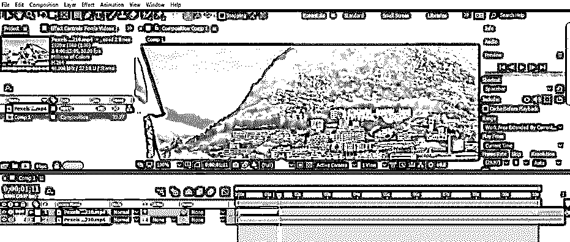

**步骤 14:** 按下键盘上的删除按钮，将其从录像中删除。

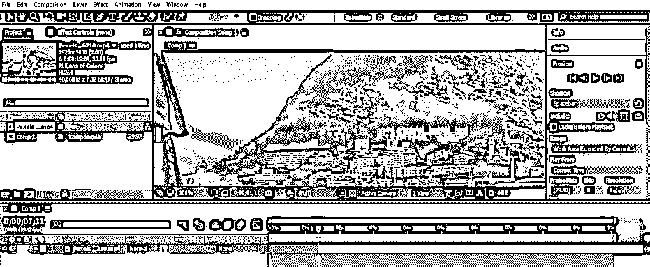

**步骤 15:** 现在再次将关键帧头以你想要的帧速率放置在视频素材层的时间轴部分，就像这样。

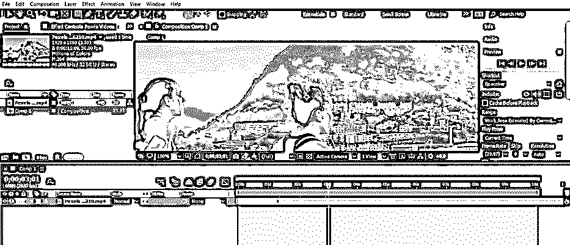

**步骤 16:** 再次按下键盘的 Ctrl + shift + D 键，将其从视频素材中分割出来。

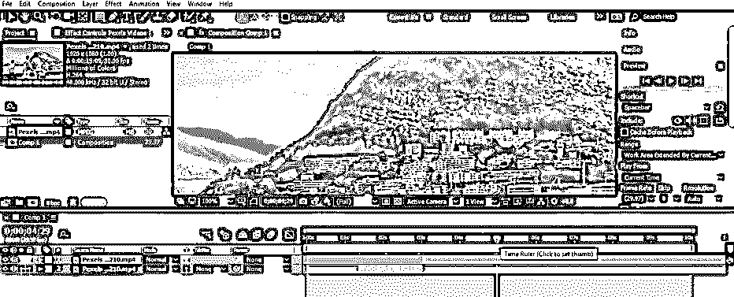

**步骤 17:** 按照一些步骤，你可以像这样在我的剪辑中分割这个视频片段。

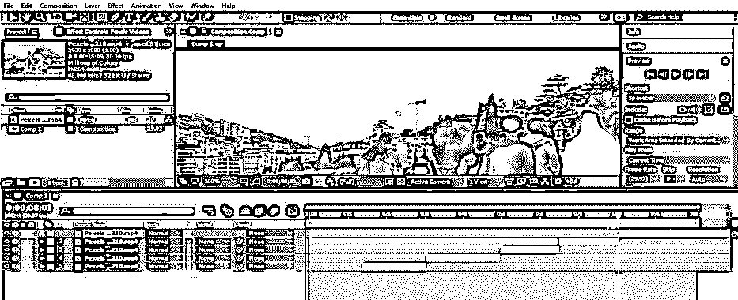

**步骤 18:** 现在通过逐个点击剪辑来从视频镜头分割剪辑中选择不想要的剪辑部分。

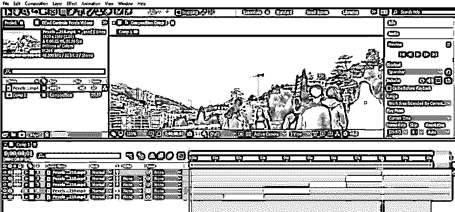

**第 19 步:**按键盘的删除键删除。您可以删除视频素材的多个分割部分。

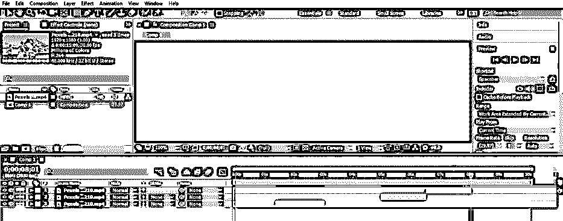

**第 20 步:**现在像这样在时间线部分拖动它们来合并它们。您可以根据自己的需要管理分割片段序列。

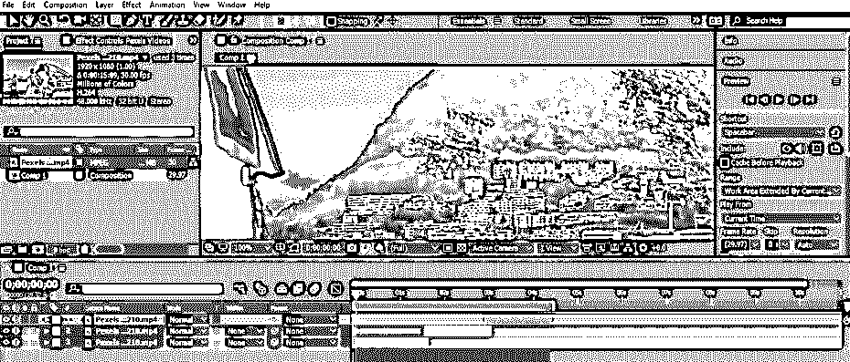

**第 21 步:**现在，当您播放此视频素材时，您所选剪辑的溢出剪辑将按照您安排的序列保留在您的视频素材中。

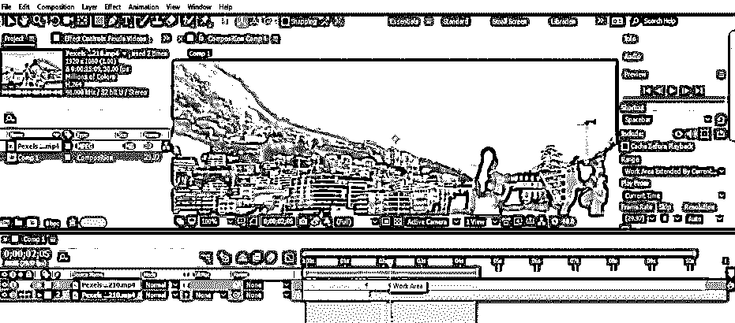

这样，您可以从任何视频素材中分割出一个片段，并与另一个片段一起使用，以使您的项目正常工作。

### 结论

现在，在这篇文章之后，你可以理解 After Effects 软件中的“什么是分割剪辑”,以及“如何通过处理该功能的参数来从视频素材中滑移视频剪辑”。通过练习，你可以了解 After Effects 软件的这种分割剪辑功能的其他重要子功能，并可以轻松制作出你想要的视频镜头。

### 推荐文章

这是一个指南后，效果分裂剪辑。在这里，我们讨论如何一步一步地分割剪辑的后期效果。您也可以浏览我们的其他相关文章，了解更多信息——

1.  [后效中的旋转观测](https://www.educba.com/rotoscoping-in-after-effects/)
2.  [特效渲染后](https://www.educba.com/after-effects-render/)
3.  [丛后效应](https://www.educba.com/plexus-after-effects/)
4.  [特效后按键灯](https://www.educba.com/keylight-in-after-effects/)

