# 徽标显示后的效果

> 原文：<https://www.educba.com/logo-reveal-after-effects/>

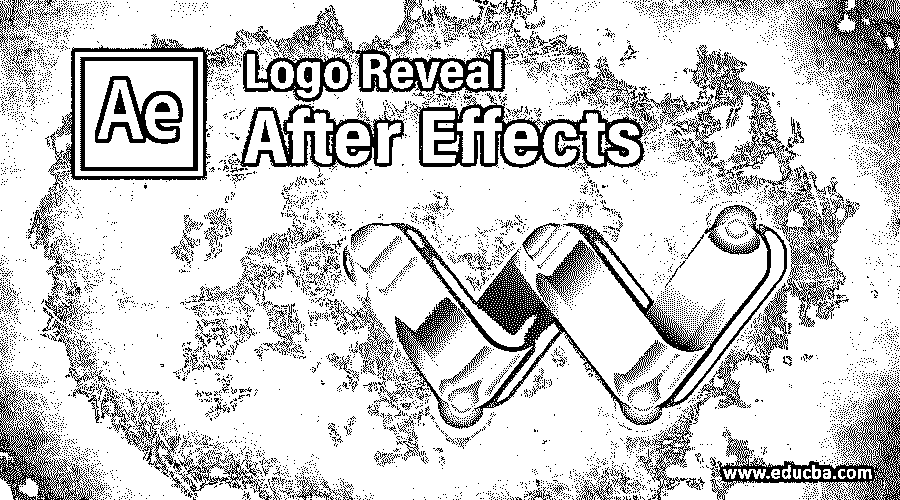

## 徽标展示后效果介绍

After Effects 是住所系统公司提供的图形编辑软件中最重要的软件，我们也在这个软件中制作徽标动画。Logo Reveal 是本软件的 Logo 动画技术之一。我们可以把 Logo Reveal 动画理解为一种方法，在这种方法中，我们通过使用该软件的效果和预设选项中的一些不同类型的效果来制作 Logo 动画。我们将通过一个例子来理解 Logo Reveal，并理解如何处理它的参数，以便更好地了解 After Effects 软件的这一特性。Logo Reveal 对于其他 Logo 效果方法来说非常简单，所以让我们开始学习这个软件。

### 在后期效果中创建徽标展示

在这里，我们将在非常简单的学习步骤中学习 Logo Reveal，但在开始之前，您应该已经了解了该软件的工作屏幕，以便更好地理解该软件的 Logo Reveal。

<small>3D 动画、建模、仿真、游戏开发&其他</small>

**步骤 1:** 在工作屏幕的顶部，我们有两个功能区，一个是菜单栏，另一个是工具面板以及这些工具的属性栏，下面我们有三个部分，首先是左侧的项目面板，中间的合成窗口和右侧的参数选项卡，在这些部分下面，工作屏幕底部有两个部分，首先是左侧的层部分和右侧的时间轴部分。也可以根据你来制作你的工作空间。这是该软件的默认工作屏幕。

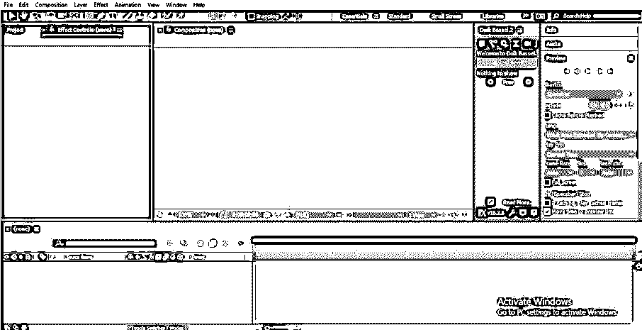

现在，让我们有一篇新的作文来学习。对于新合成，请转到菜单栏“合成菜单”的顶部功能区。将打开一个下拉列表；单击此下拉列表中的新合成选项。

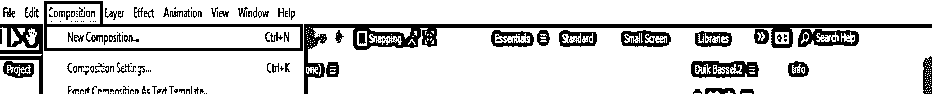

**第三步:**或者转到该软件的项目面板，在该区域的任意位置单击鼠标右键。转到下拉列表中的新合成选项。

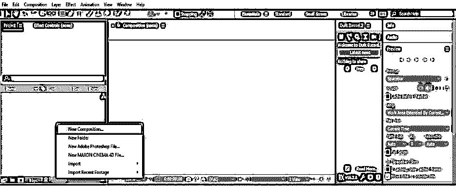

第四步:或者你可以在这个软件的项目面板点击“创建一个新的组合”标签。

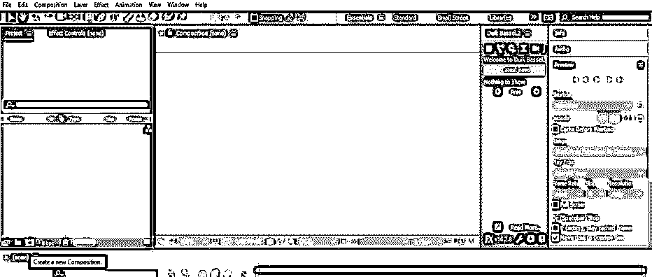

**步骤 5:** 构图设置对话框打开。根据您的要求，在此进行新构图的设置，然后单击此对话框的“确定”按钮。

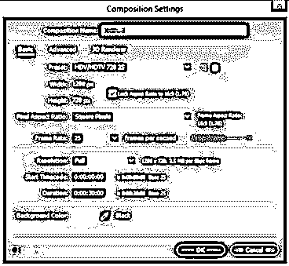

**第六步:**现在，让我们有一个 logo。我会从这个软件的工具面板中选择文字工具来写信。我将用这个词作为我作品的标志。你可以使用任何类型的标志从互联网上为我们的学习，或者你可以使用你的。

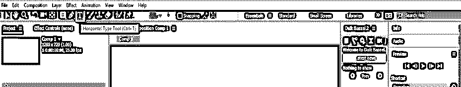

**步骤 7:** 写完一个文本后，在该软件参数部分的对齐选项卡的帮助下，将其对齐到工作屏幕的中央。

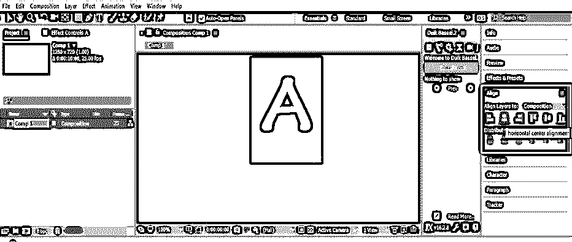

**第八步:**现在到这个软件的效果&预设标签的参数部分。

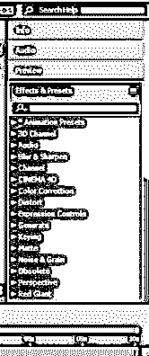

**第九步:**现在在效果&预设标签的搜索框中搜索 CC 光扫选项，为这个 logo 赋予效果。

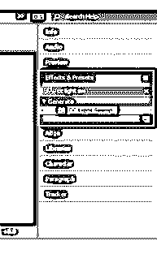

**第十步:**现在，用鼠标键从参数区中选取这个效果，放到这个软件的图层面板中这个 logo 的图层上。

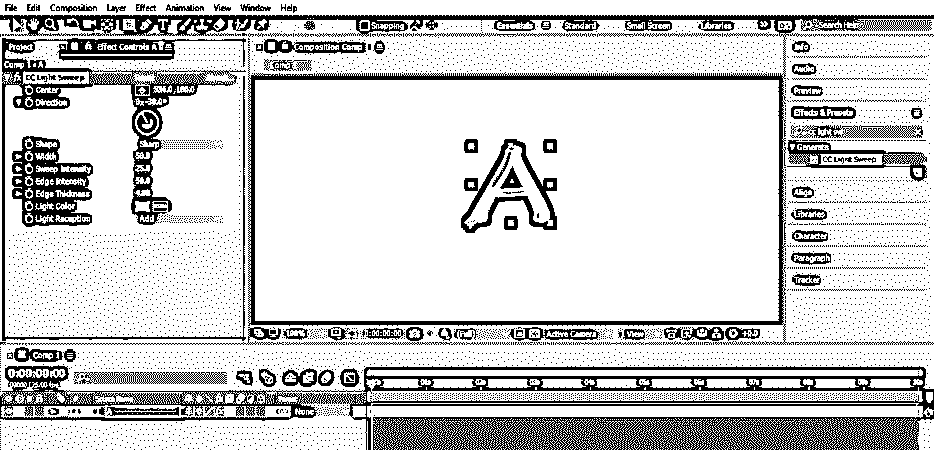

**步骤 11:** 现在点击 CC 轻扫效果中心选项的加号，在 logo 屏幕上获得该扫动的移动处理。扫掠的移动处理由圆圈中的加号表示。

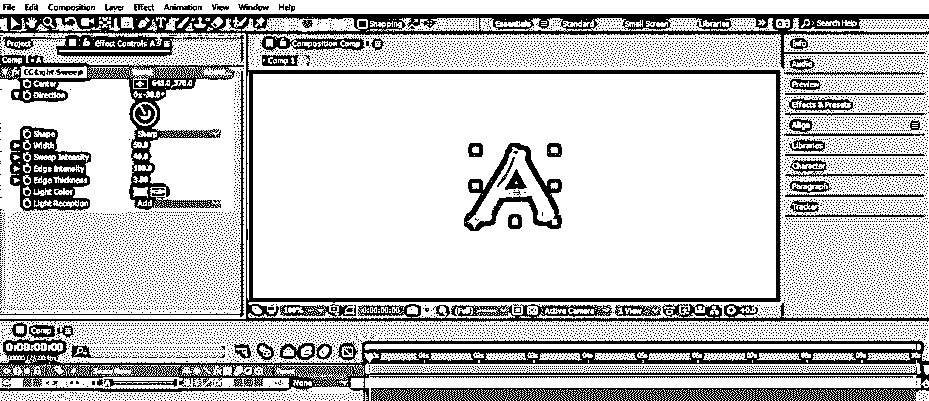

**步骤 12:** 现在点击 CC 光扫效果的光接收选项的下拉箭头，从下拉列表中选择抠图选项。

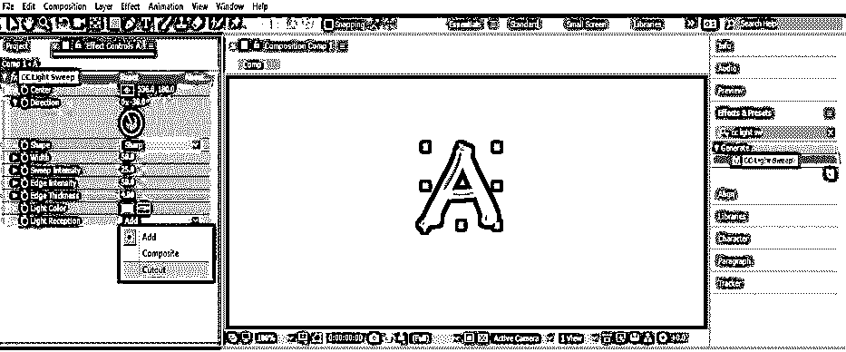

**第十三步:**一旦你选择了这个选项，你的 logo 就会是这个样子。

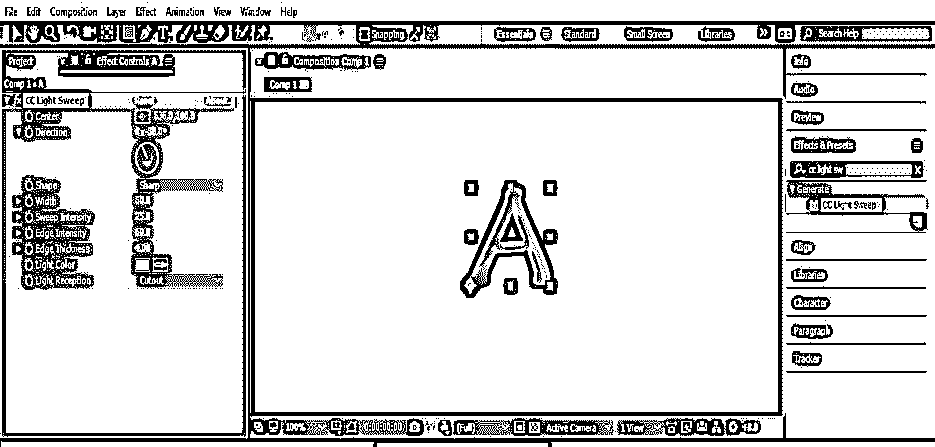

**步骤 14:** 现在，让我们对 CC 光扫效果参数进行一些调整，以获得该软件的徽标显示效果的最佳结果。

**步骤 15:** 这里，增加或减少扫描灯的边缘厚度，以获得扫描线的最佳外观。你可以根据你的需要选择任意的边缘厚度值。

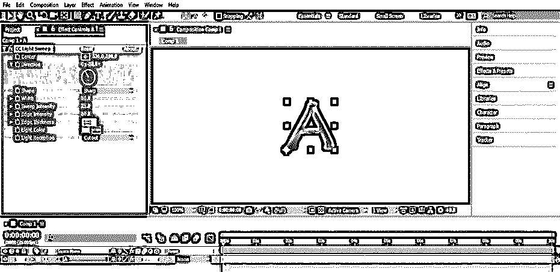

**第十六步:**我将 3 作为边缘厚度的值。

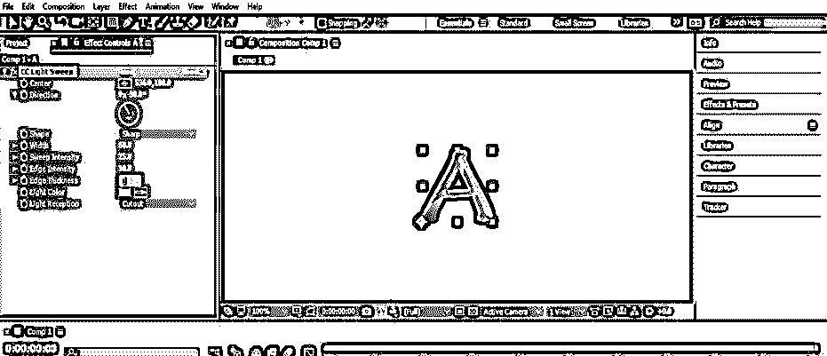

**第十七步:**现在，设置适合你 logo 的边缘强度值。我会让它 100，因为它适合我的标志，给我的标志好看。

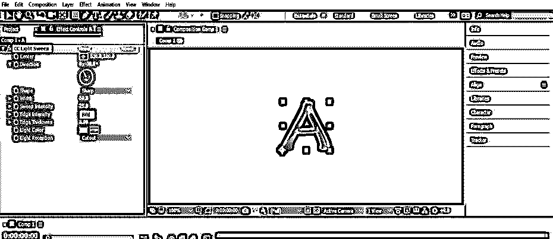

**步骤 18:** 现在调整扫描强度值。我就当它是 40。您可以通过反复更改扫描强度的值来检查扫描强度的效果。

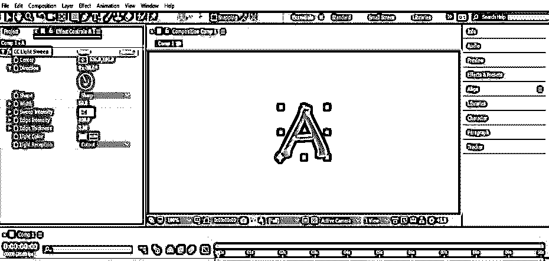

**步骤 19:** 你也可以通过改变 CC 光扫效果的方向选项的值来改变扫掠的方向。

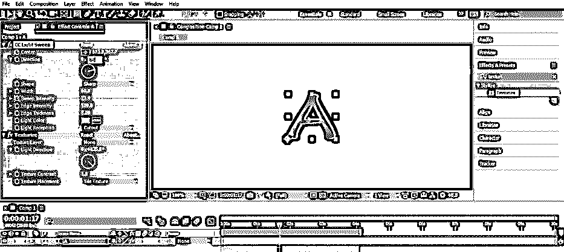

**步骤 20:** 现在，让我们为我们的徽标设置显示效果的扫描值动画。将扫描手柄从您的徽标屏幕中取出，并单击扫描效果中心选项的小时钟图标，以便在关键帧部分添加一个键。

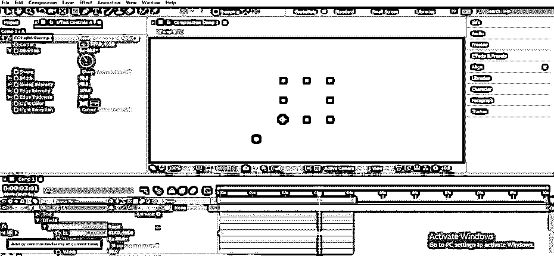

**步骤 21:** 现在，将扫动手柄放在徽标屏幕外，与徽标的对角线方向相反，并将关键帧的播放头放在关键帧时间线部分的 3 秒处。

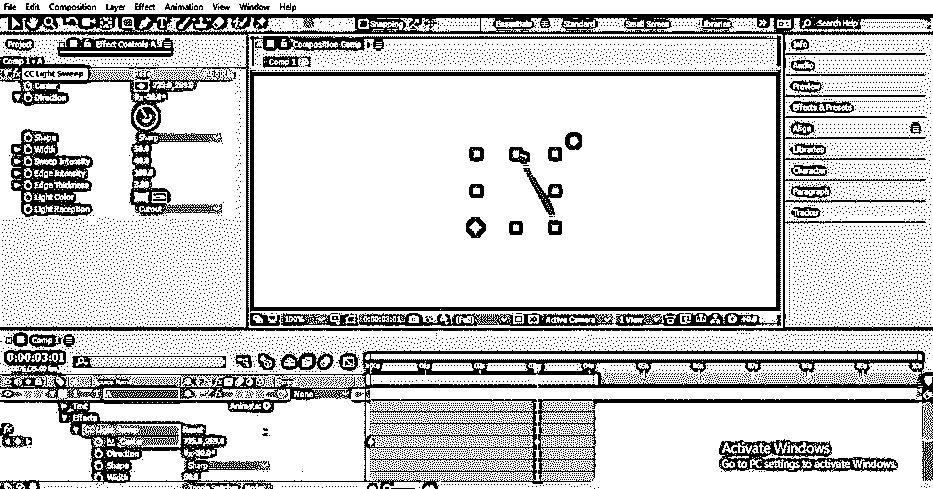

**步骤 22:** 按键盘空格键播放扫一扫的动画。你的动画会是这样的。

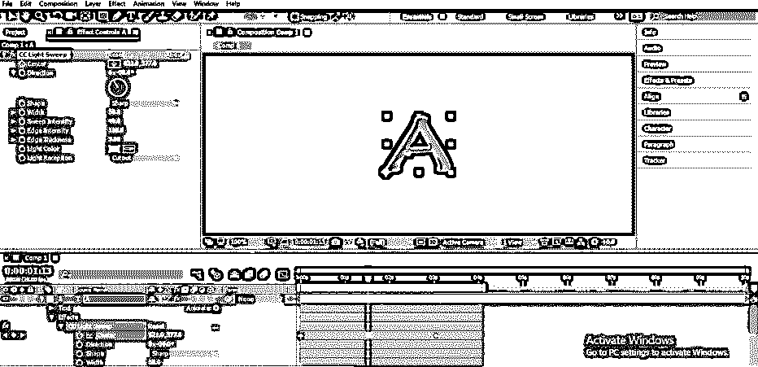

步骤 23: 现在，让我们也为扫掠的方向制作动画。将扫描手柄放在此处，并将关键帧头放在关键帧时间线部分的大约 2 秒处，然后通过单击 CC 灯光扫描的方向选项的小时钟图标，在该选项添加一个关键点。

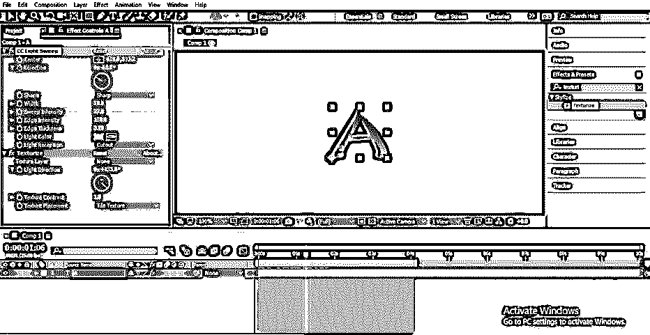

**步骤 24:** 现在，将关键帧播放头放在关键帧时间线部分的 3 秒之前，并在关键帧部分添加另一个关键点。现在，通过更改此效果的方向选项的值来更改扫掠的方向。

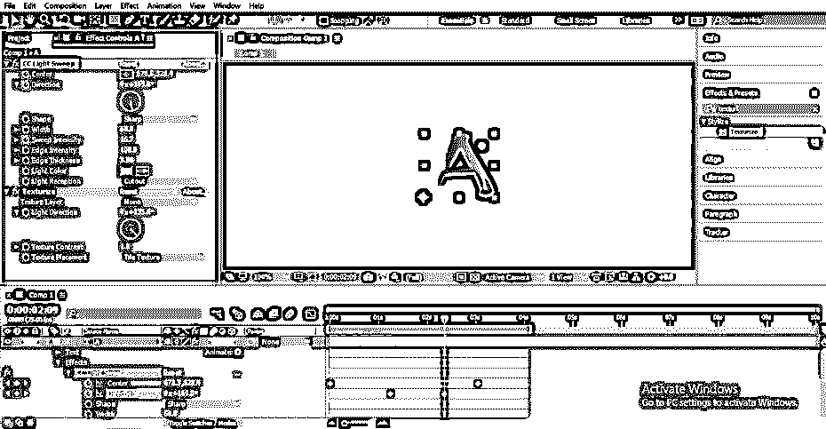

**第 25 步:**现在，播放动画就可以看到了。您也可以从“参数”部分的“预览”标签中播放它。

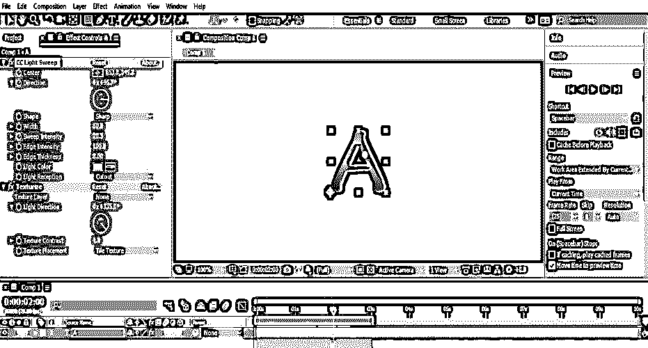

这样，你就可以在 After Effects 软件中制作一个 Logo 揭示效果。你只需要在这个软件的不同类型效果的参数上做一些调整。

### 结论

现在，看完这篇文章后，你可以理解 After Effects 的“Logo Reveal”功能，并通过练习不同类型选项的参数来熟练使用它。您可以使用该软件的不同效果来制作不同类型的徽标显示效果。

### 推荐文章

这是一个标志揭示后的效果指南。在这里，我们讨论一个介绍，如何创建一个标志揭示在一步一步的方式后效。您也可以浏览我们的其他相关文章，了解更多信息——

1.  [后效中的毛刺效应](https://www.educba.com/glitch-effect-in-after-effects/)
2.  [在后效中遮蔽图层](https://www.educba.com/masking-layers-in-after-effects/)
3.  [后效中的运动图形](https://www.educba.com/motion-graphics-in-after-effects/)
4.  [特效后按键灯](https://www.educba.com/keylight-in-after-effects/)
5.  [后效时间线](https://www.educba.com/after-effects-timeline/)

