# 摩卡在后效

> 原文：<https://www.educba.com/mocha-in-after-effects/>

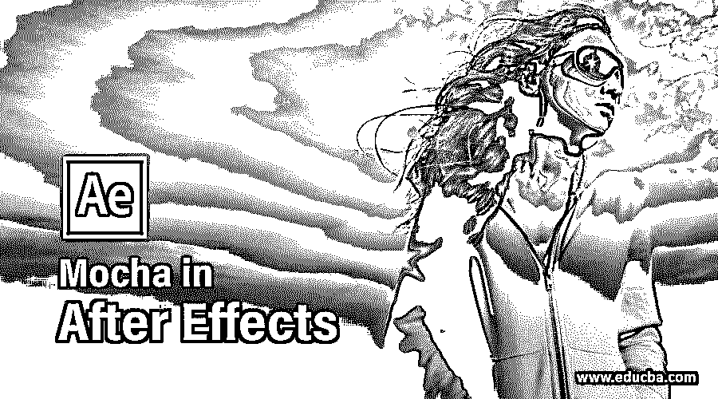

## 后效摩卡简介

After Effects 是 Adobe systems 开发的视频编辑软件，作为其图形编辑软件，我们在该软件中有许多不同类型的插件，使我们的工作变得简单。摩卡是 After Effects 的插件软件之一。摩卡是追踪软件，可以追踪任何追踪对象的三维点，而在 After Effects 软件中，你只能追踪任何对象的二维。摩卡可以让你非常精确地跟踪任何视频片段中任何物体的任何特定部分。在本文中，我们将了解 After effects 软件的 mocha 插件，并通过一个例子学习如何通过 After Effects 软件跟踪 mocha 中视频片段的任何特定部分。所以让我们开始学习吧。

### 如何使用摩卡进行后期效果跟踪？

我们将通过本文中一个很好的视频片段的例子，用几个简单的步骤来理解 After Effects 软件的 Mocha 插件。所以在开始之前，让我们看看 After Effects 软件的工作界面，以便更好地理解这篇文章中的主题。

<small>3D 动画、建模、仿真、游戏开发&其他</small>

**第一步:**在工作屏幕的顶部，我们有菜单栏和工具栏的丝带；在此之下，三个部分是工作屏幕左侧的项目面板，工作屏幕中心的合成窗口和工作屏幕右侧的参数面板，在此之下，我们有两个部分是底端左侧的层面板和底端右侧的时间轴面板。您可以根据需要调整这些部分。

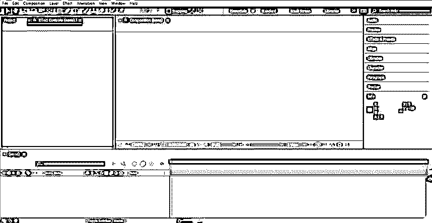

**第二步:**现在，让我们来看看学习用的视频。你可以从网上下载，也可以把自己制作的视频片段放在这个软件里学习。将这段视频放在 After Effects 中，会转到你个人电脑中保存它的文件夹中，并从那里选取它，然后将其放在该软件的项目面板部分。

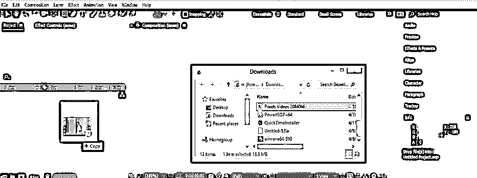

**步骤 3:** 现在把这个视频素材从这个软件的项目面板部分拖到鼠标按钮的图层面板。

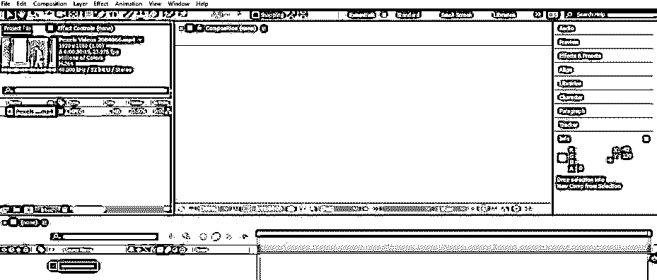

**步骤 4:** 现在转到该软件菜单栏的动画菜单，它位于工作屏幕的顶部。将会打开一个下拉列表。点击列表中的“摩卡 AE 中的曲目”选项。

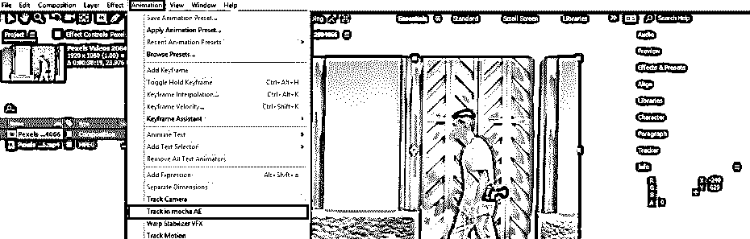

**第五步:**点击此选项后，Mocha AE CC 插件软件将打开“新建项目”对话框。摩卡将自动在这个框中输入该视频片段的数据。如果您没有在此框中显示此设置，那么您应该从互联网上下载 QuickTime 安装程序并将其安装在您的电脑上。现在，按下该对话框的“确定”按钮。

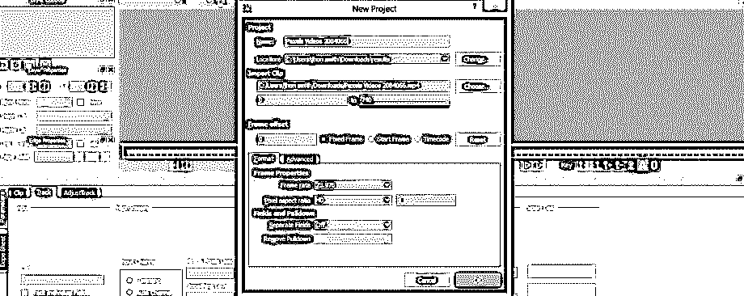

**第六步:**现在，素材将在摩卡 AE CC 工作窗口中打开。在摩卡 AE 的工作窗口中打开视频素材需要一些时间。

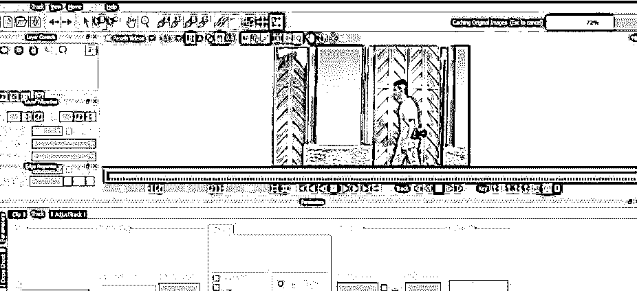

第七步:现在，为了跟踪，从 mocha 软件的工具面板中选择“创建 X 样条图层工具”。

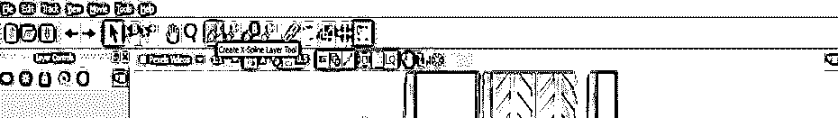

第八步:现在，用这个工具在你想要追踪的物体部分周围制作一个蒙版。

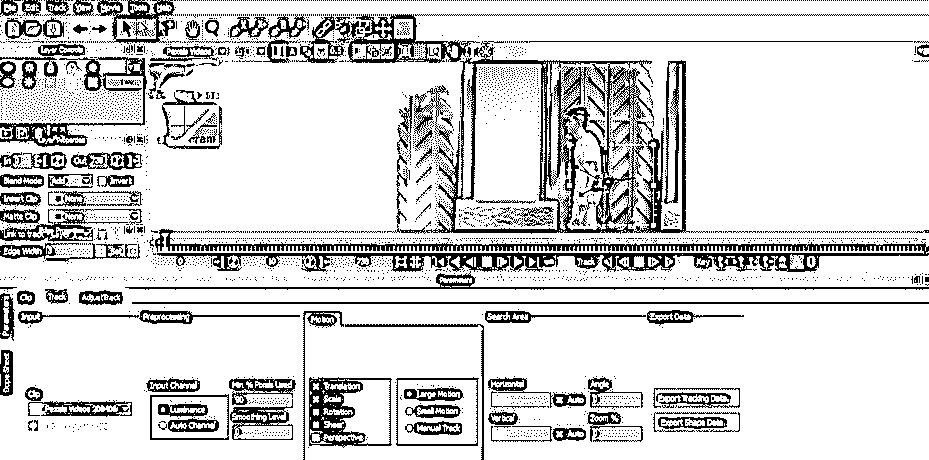

**第九步:**从键盘上按下 Z 键，然后拖动鼠标左键进行放大或缩小，即可放大。

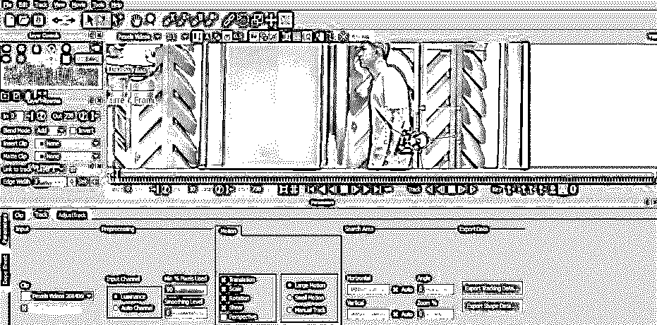

**第十步:**按下鼠标的 X 键或滚动键，然后移动鼠标即可平移。

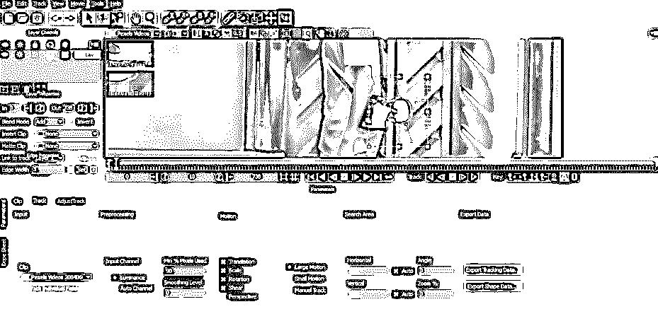

**步骤 11:** 一旦您在视频素材中想要跟踪的对象周围选择了合适的遮罩，请转到该软件工作窗口下方的“跟踪选项”部分的“运动”选项卡。在这里你可以在运动选项列表中选择跟踪选项，你可以根据自己的需要选择跟踪对象的平移、缩放、旋转、剪切或透视属性。我会选择平移、缩放和旋转，因为我想根据这三个属性来跟踪我的对象。

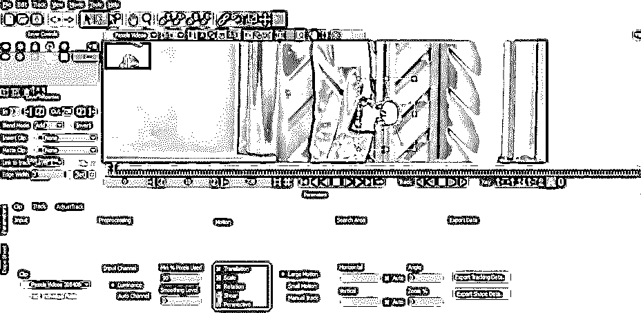

**第 12 步:**现在点击该软件的向前跟踪按钮，跟踪我们选择的视频素材对象。

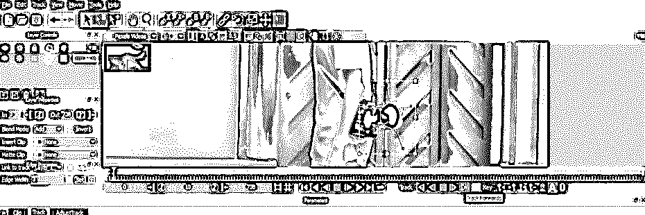

**第 13 步:**在本软件中，跟踪需要一段时间才能完成。

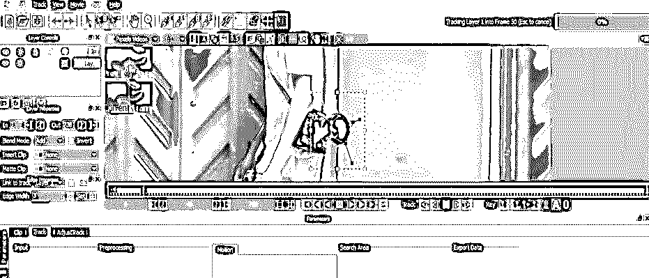

**第 14 步:**跟踪完成后，转到该软件的“导出数据”选项卡的“导出跟踪数据”选项，并点击它以在 After Effects 软件中导出该数据。

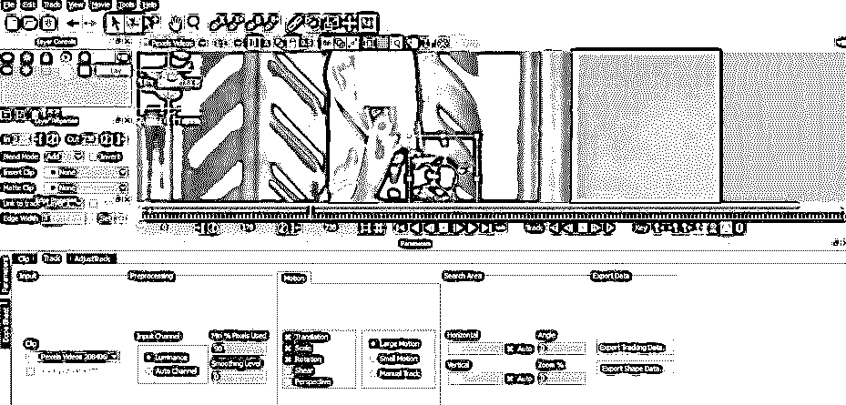

**步骤 15:** 点击此选项后，将会打开一个出口跟踪数据对话框。

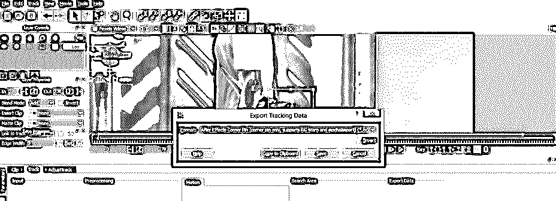

**第 16 步:**您可以从列表中选择您想要导出该数据的任何一种格式。我将选择第二个选项，然后单击此对话框中的“复制到剪贴板”选项卡来复制这些数据。

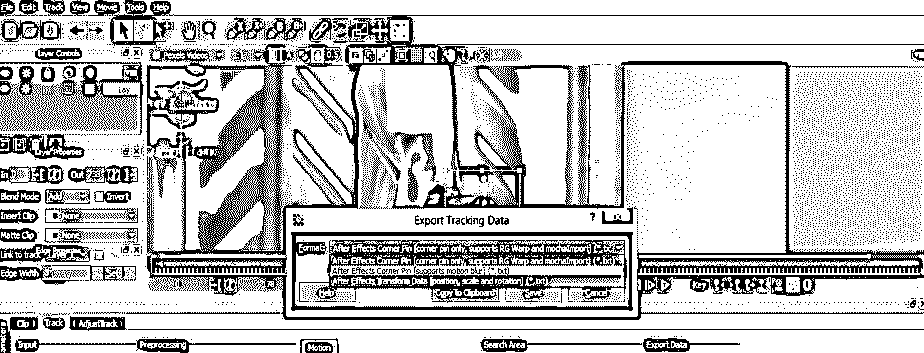

**第十七步:**现在我切换到 After Effect，在空对象层做一个粘贴跟踪数据的空对象。对于空对象，用鼠标右键单击 After Effects 软件图层部分的任意位置。将打开一个下拉列表，单击该列表的“新建”选项，并从新的下拉列表中选择空对象。

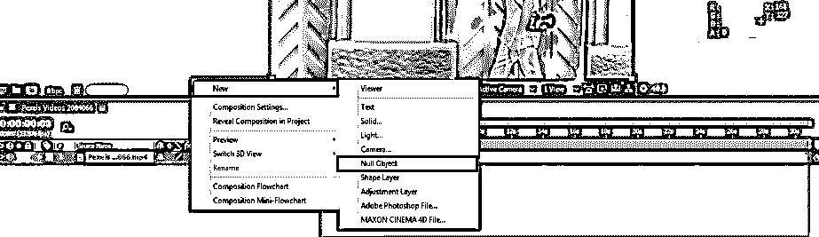

**第 18 步:**现在点击选择这个空对象层，并转到工作屏幕顶部该软件菜单栏的“编辑菜单”，然后点击编辑菜单下拉列表中的粘贴选项。

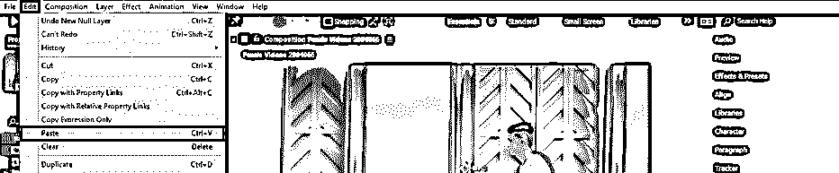

**步骤 19:** 摩卡 AE CC 插件软件的所有追踪数据都会粘贴到 After Effects 软件的素材中。

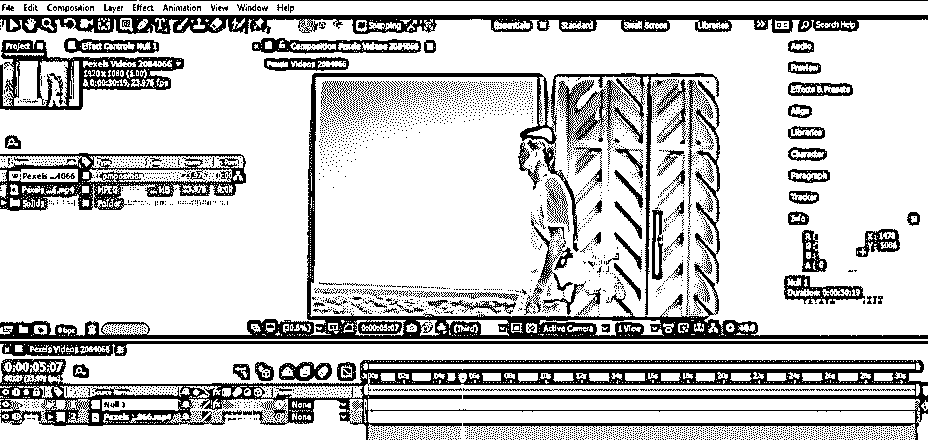

*   现在，您可以使用这个跟踪路径为这个视频素材添加任何效果。
*   通过这种方式，你可以在 After Effects 中使用 mocha 插件软件来获得任何视频镜头中的最佳跟踪结果，并且你可以毫无问题地处理 Mocha 插件的参数。

### 结论

阅读完本文后，您可以在 After Effects 软件的背景下理解 Mocha，并使用 mocha AE 跟踪视频镜头中的任何对象，并获得更精确的跟踪数据。您可以使用此跟踪工具对任何视频素材制作高度专业的效果，并产生高度的影响效果。

### 推荐文章

这是一个后效摩卡的指南。在这里，我们将一步步地介绍如何在后期特效中使用摩卡。您也可以浏览我们的其他相关文章，了解更多信息——

1.  [2D 特效动画后](https://www.educba.com/2d-after-effects-animation/)
2.  [后效中的旋转观测](https://www.educba.com/rotoscoping-in-after-effects/)
3.  [特效后按键灯](https://www.educba.com/keylight-in-after-effects/)
4.  [后效中的运动图形](https://www.educba.com/motion-graphics-in-after-effects/)
5.  [后效时间轴|步骤](https://www.educba.com/after-effects-timeline/)

