# 后效中的扭曲

> 原文：<https://www.educba.com/twixtor-in-after-effects/>

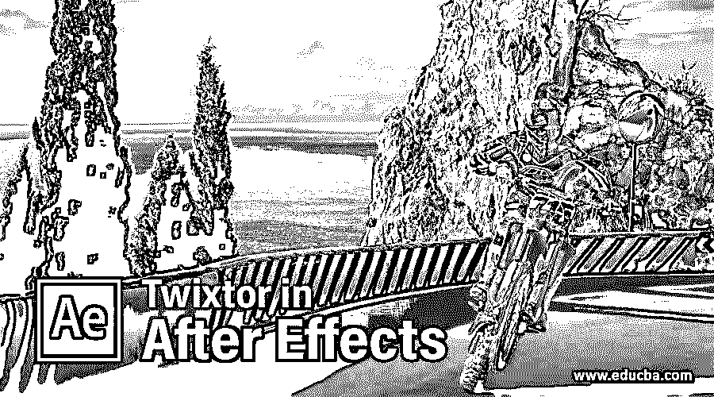

## After Effects 中的 Twixtor 简介

Twixtor 是 After Effects 软件的插件软件之一，用于通过使用其激动人心的参数来制作任何视频镜头的慢动作效果。在这篇文章中，我们将了解“什么是特效软件中的 Twixtor”和“为什么在这个软件中使用它”。我们还学习如何处理它的参数，以便在 After Effects 软件中获得最佳的工作合成效果。

### 如何在 After Effects 中使用 Twixtor？

Twixtor 是一个非常有用的特效软件插件，可以帮助我们制作任何视频片段的慢动作效果。我们将通过本文中的一个例子来了解它。在开始学习之前，让我们先了解一下这个软件的工作界面，这样我们在学习 Twixtor 插件的过程中就可以很容易地理解这篇文章。

<small>3D 动画、建模、仿真、游戏开发&其他</small>

**第一步:**在工作屏幕的顶部，两个条带是菜单栏和工具面板以及活动工具的属性面板；在工作屏幕的中间，有三个部分，即该部分左侧的项目面板、该部分中心的合成窗口和该部分右侧的参数面板，在工作屏幕的末端，有两个部分是该部分左侧的图层面板和该部分右侧的时间轴面板。您可以通过在该软件的工作屏幕上调整所需位置的面板来制作工作屏幕。

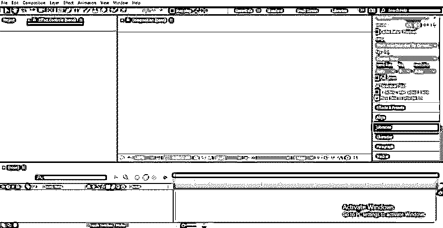

**步骤 2:** 现在，让我们在这个软件中导入视频片段，使用 Twixtor 插件制作视频片段的慢动作。你可以使用你的视频片段或者从网上下载来学习。我会从网上下载视频片段。要将此视频素材放入 After Effects 软件，请转到您个人计算机中保存它的文件夹，并使用该文件夹中的拖放方法将其放入该软件的项目面板部分。

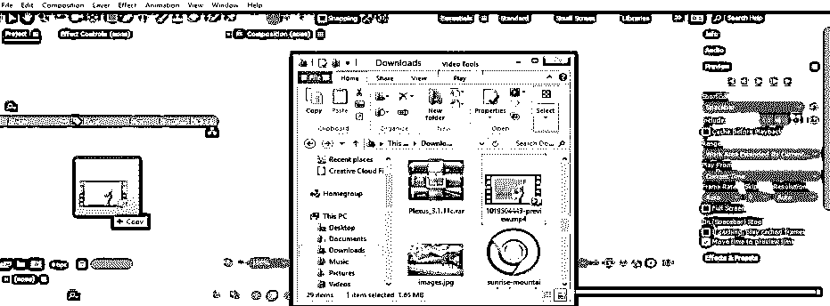

**第三步:**现在双击视频素材；画面帧设置窗口将在合成窗口部分打开。

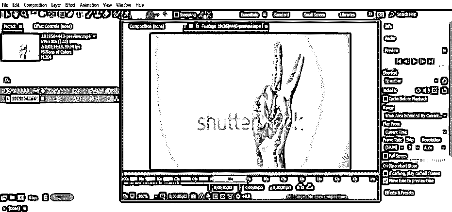

**步骤 4:** 现在调整视频素材的大小，从您想要在视频素材上应用慢动作的位置开始调整。现在，通过鼠标左键拖动，将这个视频片段从项目面板部分移动到该软件的图层部分。

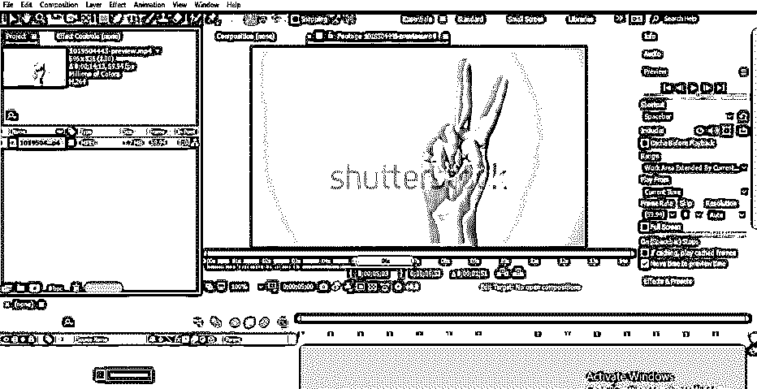

**第五步:**现在进入工作屏幕顶部菜单栏的效果菜单。然后转到下拉列表中的 RE: Vision Plug-ins 选项，然后单击新下拉列表中的 Twixtor 选项。如果你的电脑上没有 Twixtor 插件，你可以从网上下载。

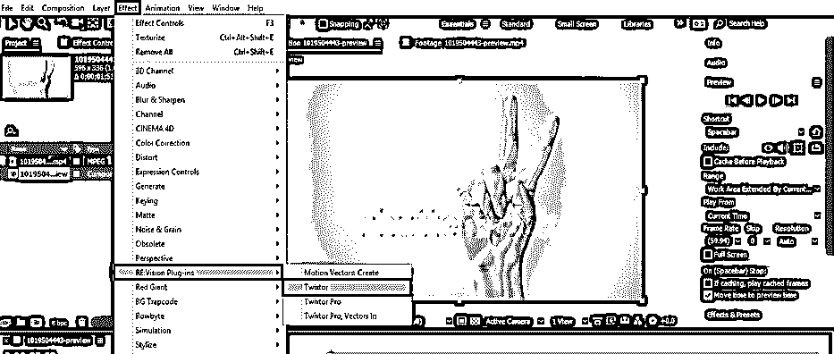

**步骤 6:** 现在，让我们检查一下视频素材的帧速率。要检查我们的视频画面的帧速率，请转到您保存视频画面的个人计算机文件夹，用鼠标右键单击该视频画面的图标。将打开一个下拉框；单击此框的详细信息选项卡。细节方面，可以查看帧率。

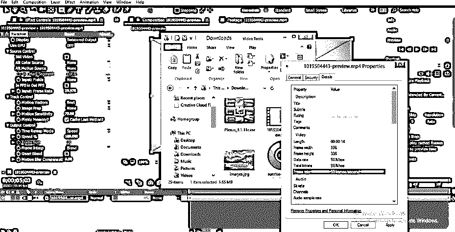

**第七步:**或者您可以从该软件的项目面板顶部的该视频片段的图标中检查帧速率。

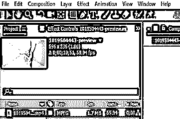

**步骤 8:** 现在，在 twixtor 选项参数的输入帧速率选项中，将帧速率设置为与我们的视频素材的帧速率相同，该选项位于效果控制面板，该面板位于该软件的项目面板部分。

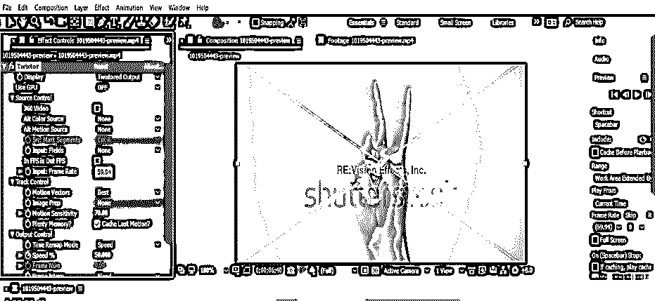

第九步:现在点击这层的小箭头图标。将打开该层的属性列表，现在单击该层效果选项的小箭头图标，再次单击效果选项的 Tiwxtor 选项的小箭头图标。

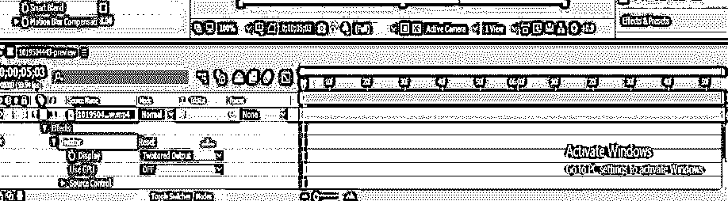

**步骤 10:** 现在，让我们动画化这一层的 Twixtor 选项的速度选项；要制作动画，请单击该速度属性的小时钟图标，并将关键帧播放头放在时间轴部分的开始处。

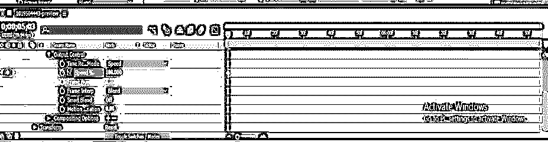

**步骤 11:** 现在，将关键帧头部放在关键帧时间轴面板中的某个距离处，并通过单击 tiwxtor 选项的速度属性选项的关键点图标，在关键帧部分添加一个新的关键点。

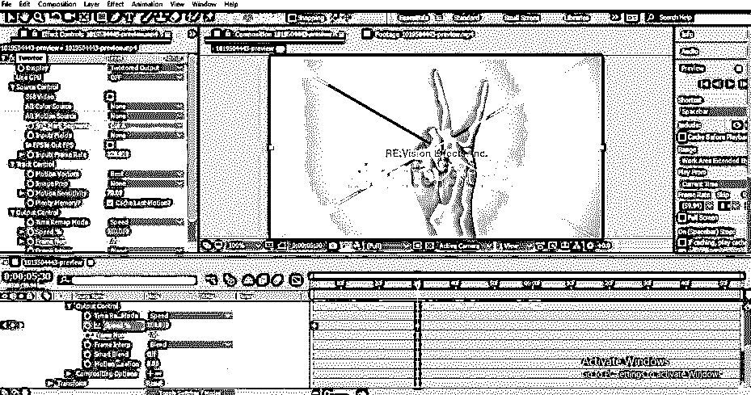

**步骤 12:** 现在将关键帧头部向前放置在关键帧时间轴部分的某个距离处，并在此处添加另一个关键点，并通过更改该软件图层部分中 Twixtor 的速度选项的值来降低视频镜头的速度。

**步骤 13:** 现在从构图设置中增加视频素材的时长。对于合成，设置转到菜单栏的合成菜单，该菜单位于该软件工作屏幕顶部的顶部功能区。现在点击下拉列表中的构图设置，或者您可以简单地按下键盘上的 Ctrl + K 按钮作为打开构图设置框的快捷键。

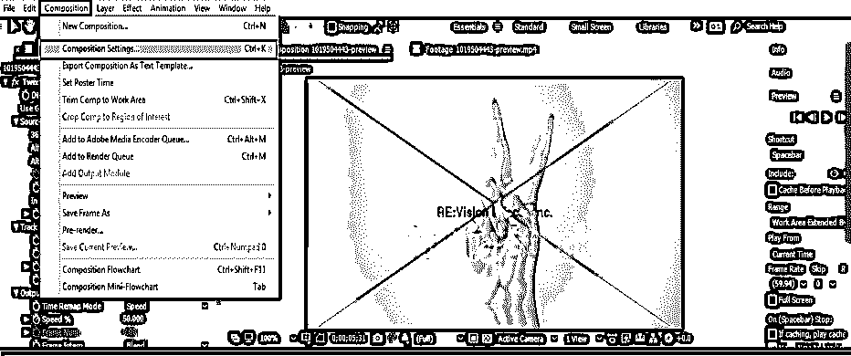

**步骤 14:** 一个构图设置框将被打开，从该对话框的持续时间选项中更改动画持续时间的值，现在用鼠标左键按下该对话框的确定按钮以应用该设置。

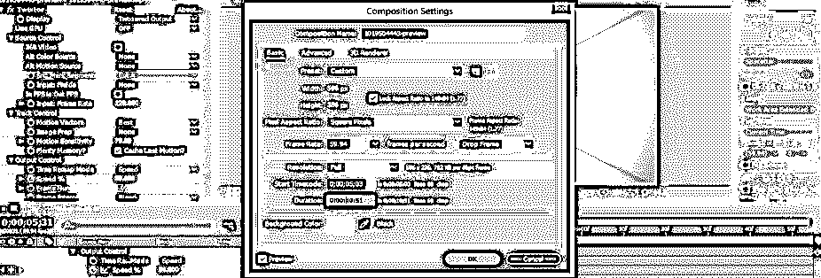

*   现在，您可以在该素材层的速度选项中添加一个新的关键点，并在每个关键点中减少您想要制作慢动作的速度值。
*   这样，你可以毫无问题地使用 After Effects 中的 Twitter 插件，并且可以在工作中享受它。

### 结论

通读这篇文章后，你就可以理解“在 After Effects 软件的背景下 Twxitor 是什么”以及“你如何使用它来制作任何视频镜头的高度专业的慢动作效果”。你可以使用这个插件软件制作不同类型的视频片段。

### 推荐文章

这是一个指南，以 Twixtor 在后效。这里我们讨论一个介绍，如何一步一步地在 After Effects 中使用 Twixtor。您也可以浏览我们的其他相关文章，了解更多信息——

1.  [后效中的慢动作](https://www.educba.com/slow-motion-in-after-effects/)
2.  [在特效后将图层分组](https://www.educba.com/group-layers-in-after-effects/)
3.  [后效中的旋转观测](https://www.educba.com/rotoscoping-in-after-effects/)
4.  [特效后摆动](https://www.educba.com/wiggle-in-after-effects/)
5.  [创建后效时间线的步骤](https://www.educba.com/after-effects-timeline/)

