# 后效中的镜头眩光

> 原文：<https://www.educba.com/lens-flare-in-after-effects/>

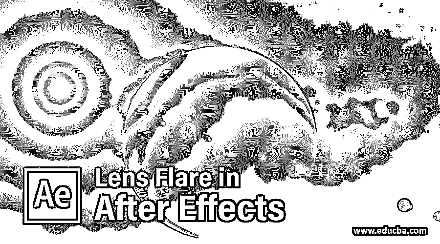

## After Effects 中的镜头眩光介绍

After Effects 是一款视频编辑软件，我们可以使用该软件的一些重要功能制作不同类型的动画，镜头眩光是该软件的一个重要功能。我们可以给出光线通过任何镜头对任何构图的影响。我们有一些镜头眩光的参数列表，通过它们我们可以对任何构图进行非常有效的镜头眩光效果组合。因此，让我们开始在这个软件中学习，并了解 After Effects 软件的镜头眩光功能的参数。

### 如何在后期特效中使用镜头光晕？

我们将通过本文中的一个例子来理解镜头眩光，并了解如何定制镜头眩光。在开始关于这一背景的文章之前，让我们快速浏览一下这个软件的用户界面，以便更好地理解。

<small>3D 动画、建模、仿真、游戏开发&其他</small>

**第一步:**在顶部，我们有两个主丝带首先是菜单栏，第二个是工具栏；在这下面，我们有三个部分，即项目面板、合成窗口和参数选项卡；在工作界面的最后，我们有两个部分，即图层面板和时间轴面板。您可以通过在用户屏幕上所需的位置调整面板来制作工作屏幕。

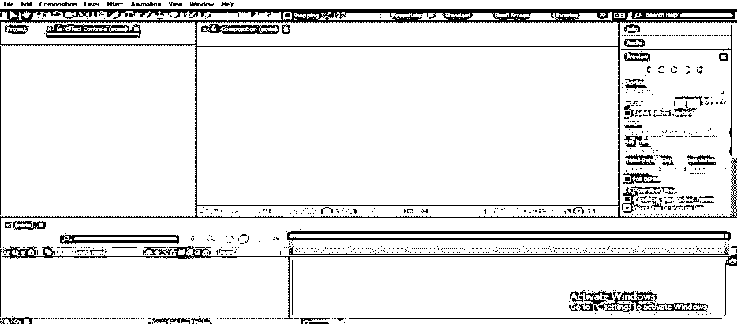

现在，让我们有一个新的组成。对于新组合，请转到工作屏幕顶部，点击菜单栏的“组合菜单”。将打开一个下拉列表，单击该下拉列表中的“新组合”选项或按键盘上的 Ctrl + N 按钮。

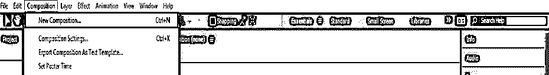

第三步:或者你可以点击这个软件的项目面板的“创建一个新的组成”标签。

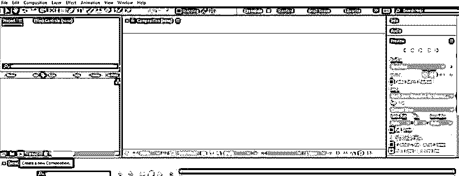

**第四步:**或者你可以右击项目面板区域的任何地方。将打开一个下拉列表；点击此下拉列表中的“新建组合”。

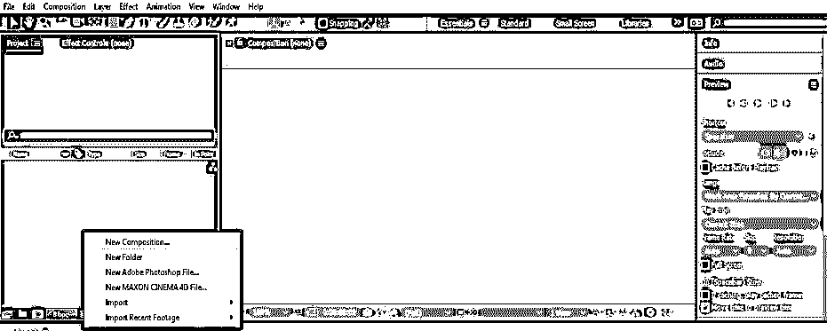

**第五步:**构图设置框打开。在此构图设置框中进行所需的设置，然后按此对话框的确定按钮。

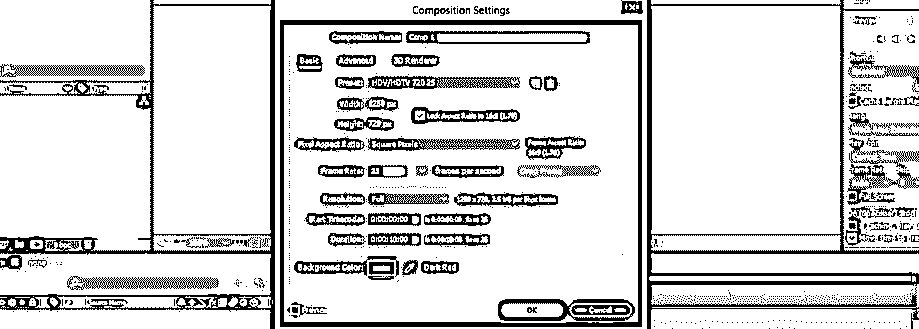

**第六步:**现在，让我们做一个固体层。对于实体层，转到菜单栏的层菜单，将打开一个下拉列表，单击新选项，然后单击新下拉列表的实体选项或按键盘上的 Ctrl + Y 按钮。

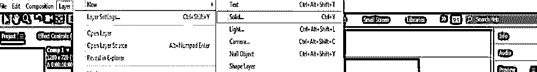

**第七步:**或者你可以在软件的图层部分右键。转到“新建”下拉列表选项，然后从“新建”下拉列表中选择“实体”选项。

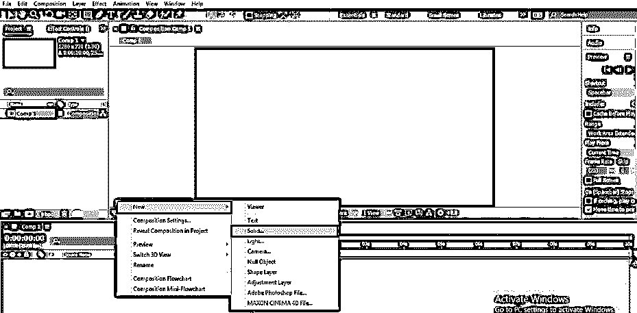

**第 8 步:**现在立体设置框将打开，在此对话框中进行您想要的设置，命名为“镜头光晕”，并按下此框的确定按钮。

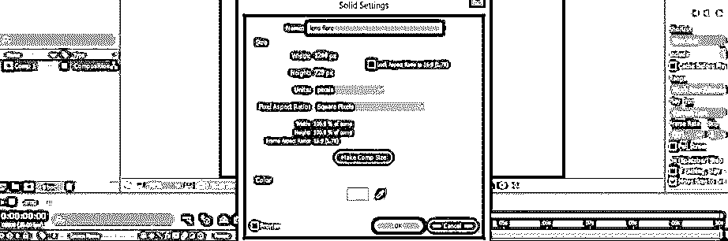

**第九步:**现在进入菜单栏的效果菜单。转到下拉列表中的生成选项，并单击新下拉列表中的镜头眩光选项。

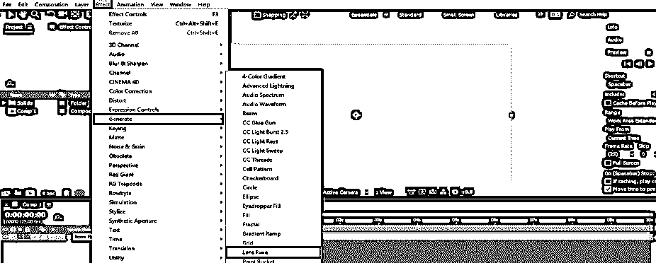

**第十步:**镜头光晕的参数部分会在这个软件的项目面板旁边的效果控制面板中打开。

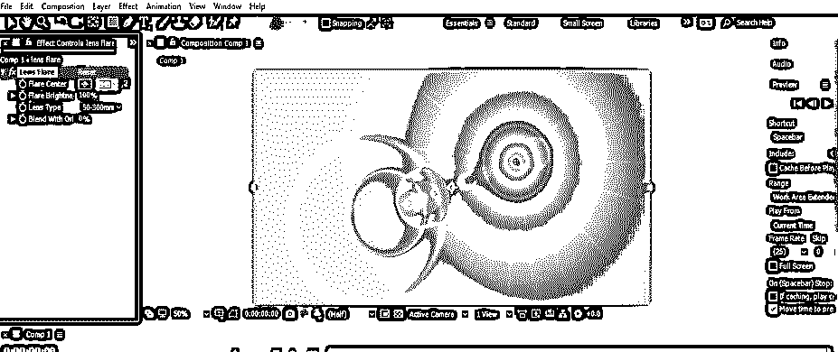

**第十一步:**这里，我们有三个镜头类型的选项。你可以根据自己选择其中任何一个。

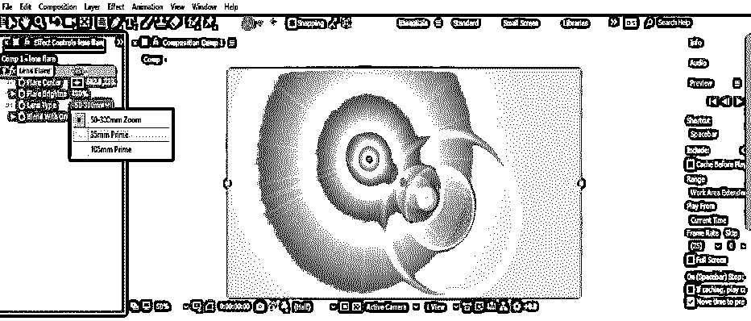

**第十二步:**我们可以从镜头光斑的光斑中心选项来调整这个镜头的中心。点击此选项的加号图标，一个中心设置手柄将以加号的形式出现在合成窗口屏幕上。

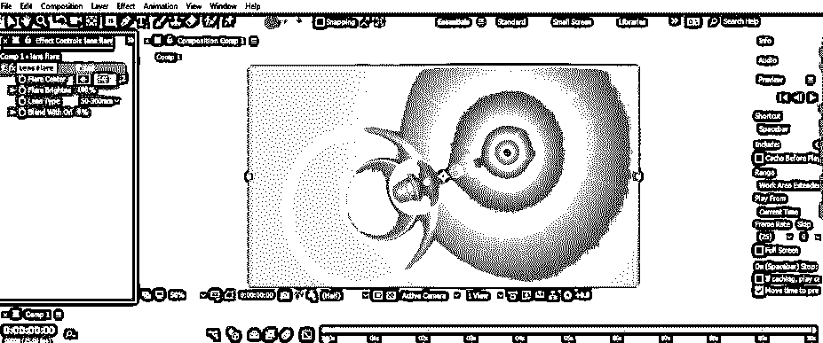

**第十三步:**您还可以通过减少和增加镜头光晕的光晕亮度选项的值来设置镜头的亮度。

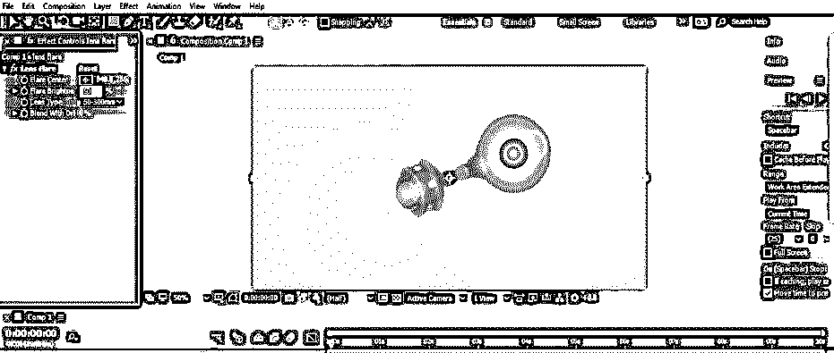

**步骤 14:** 您可以将光斑亮度值增加到 300%。

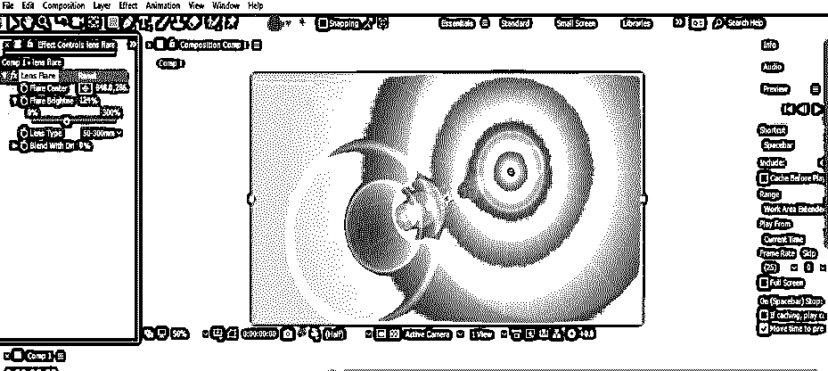

**步骤 15:** 你可以通过改变镜头光晕的“与 Ori 融合”选项的值，将镜头效果与实体层融合。

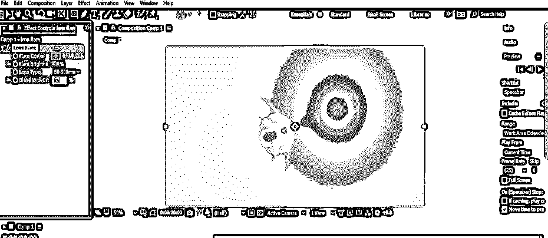

**步骤 16:** 现在，让我们通过电影加上镜头光晕的光晕中心选项的演唱，将镜头光晕的所有焦点都放在中心。

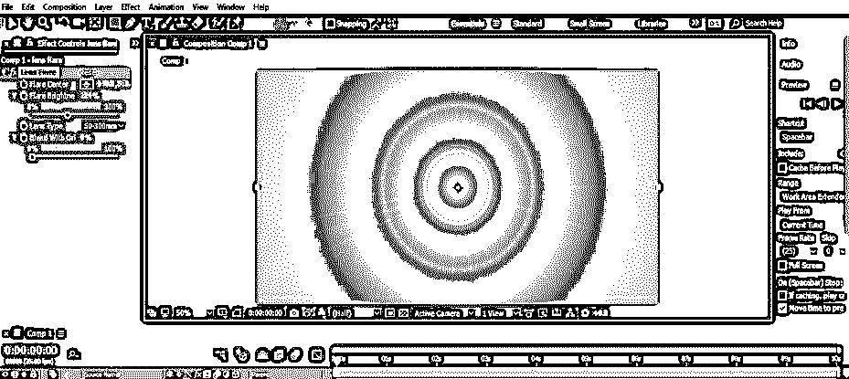

**步骤 17:** 现在，点击列表中的“标题/动作安全”选项，激活窗口部分，使我们的工作变得简单。

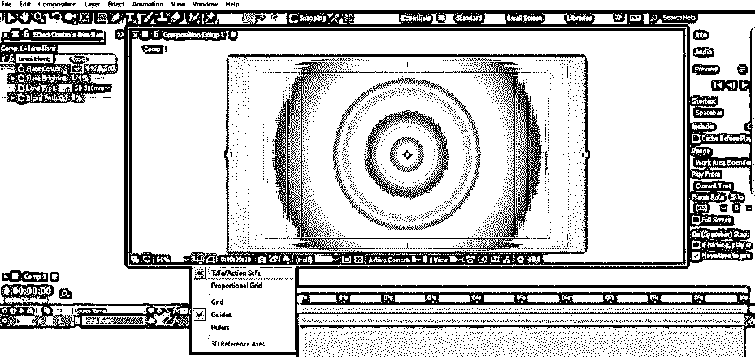

**步骤 18:** 现在，让我们对这个镜头效果的颜色进行调整。要进行颜色校正，请转到菜单栏的效果菜单，单击下拉列表中的颜色校正选项，然后单击新下拉列表中的曲线选项。

**步骤 19:** 在这里，我们可以从列表中调整镜头部分的任何颜色。让我们点击列表中的绿色选项。

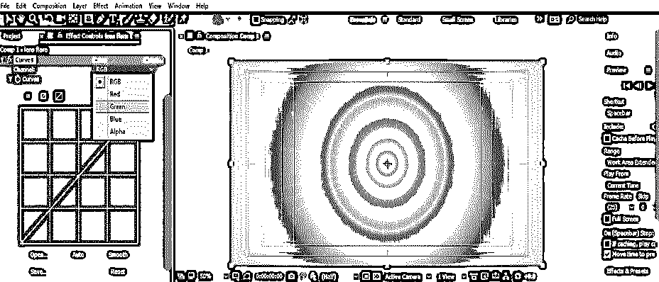

**步骤 20:** 现在，你可以根据自己的需要移动曲线，以改变图层部分的颜色。

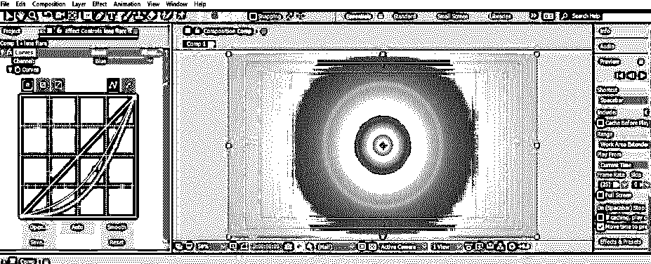

**步骤 21** :现在可以从列表中调整多种颜色，或者可以选择 RGB 颜色模式在镜头部分进行颜色校正。

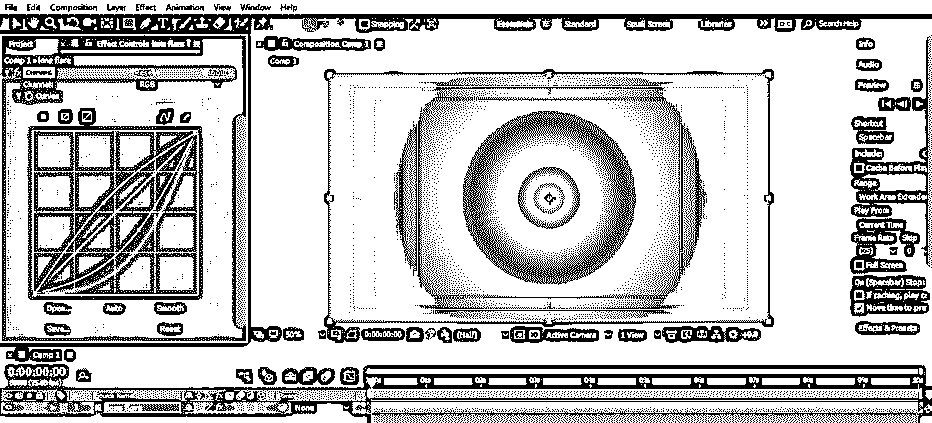

现在，让我们制作另一个固体层。进入图层菜单，点击“新建”选项，然后点击实体图层的实体选项。

**步骤 23:** 现在，在实体设置框中进行设置，命名为‘Strikes’。现在，按下该对话框的“确定”按钮。

步骤 24: 现在，从这个软件的工具面板中选择椭圆工具，制作一个这样的椭圆，作为蒙版图层。

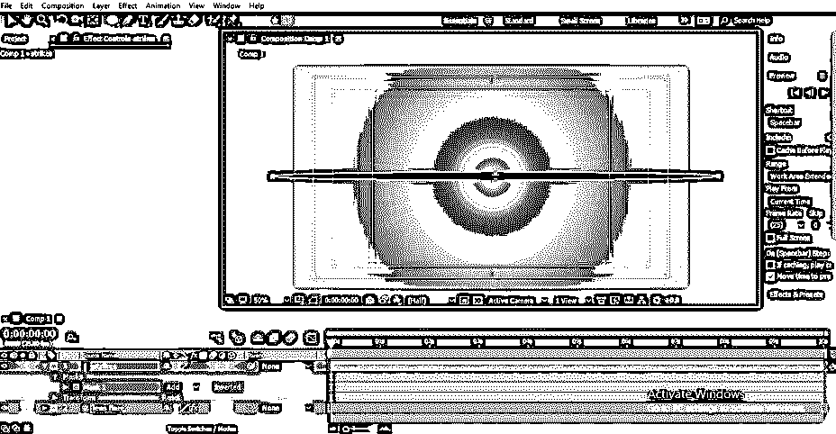

**步骤 25:** 现在进入图层菜单，点击实体设置选项。

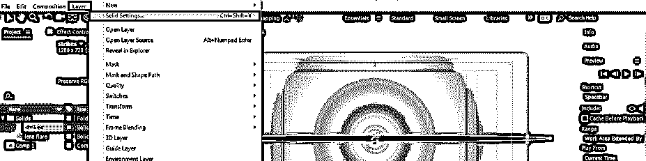

**第 26 步:**现在，根据哪个适合你的镜头来改变这个椭圆图层蒙版的颜色。

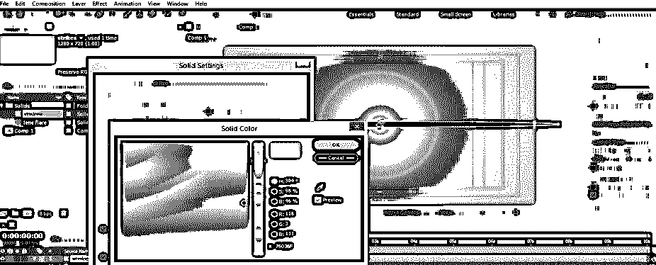

步骤 27: 现在点击这个实体层的添加选项。

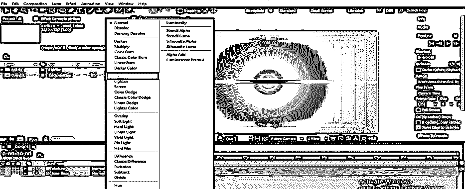

步骤 28: 现在，设置这个蒙版的蒙版羽化选项的值，这样它会给你一个类似透镜的效果。

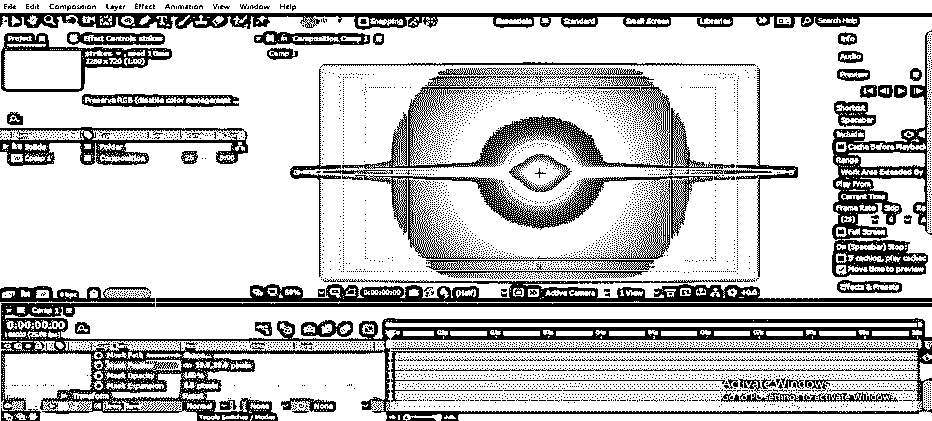

再次进入效果菜单，然后进入风格化选项，从新的下拉列表中选择发光选项。

**步骤 30:** 这样，你就可以做出这样的定制镜头效果了。

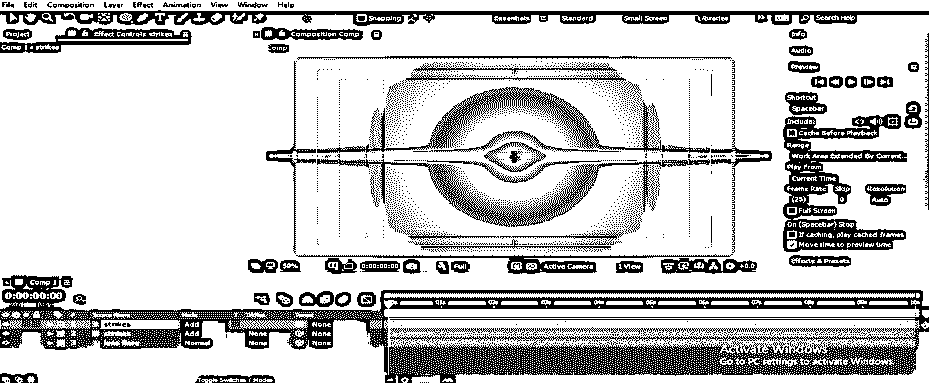

现在，让我们通过按 Ctrl + D 键并减小这些蒙版的尺寸来复制这个罢工层。

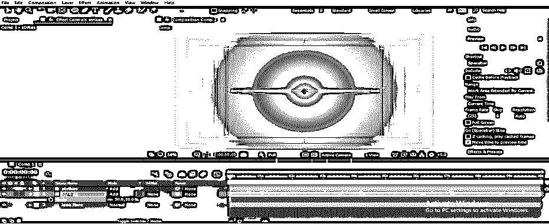

步骤 32: 现在像这样调整这些光线，给这个镜头光晕效果一个灯光效果。

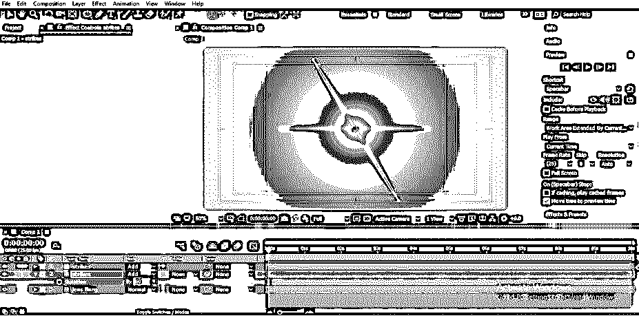

这样，您就可以在 After Effects 软件中使用镜头光晕，并获得最佳的构图效果。

### 结论

现在，看完这篇文章后，你可以理解“什么是镜头光晕”,并在你的 After Effects 软件项目工作中利用这个特性。您可以通过练习此功能的参数来获得此软件的镜头眩光功能的专业知识。

### 推荐文章

这是一个镜头光晕后的效果指南。这里我们讨论在 after effects 中创建镜头效果的介绍和步骤。您也可以浏览我们的其他相关文章，了解更多信息——

1.  [特效渲染后](https://www.educba.com/after-effects-render/)
2.  [降雪后的影响](https://www.educba.com/snowfall-in-after-effects/)
3.  [后效工具](https://www.educba.com/after-effects-tools/)
4.  [后效时间线](https://www.educba.com/after-effects-timeline/)

