# 后效粒子

> 原文：<https://www.educba.com/after-effects-particles/>

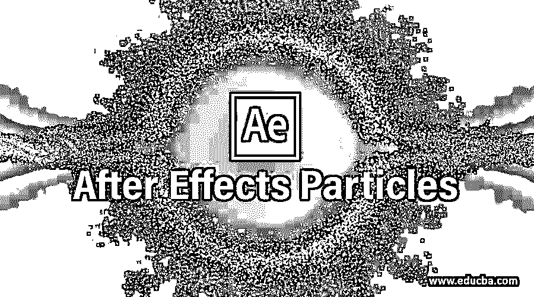

## 后效粒子介绍

After Effects 因 Adobe Systems 开发的视频编辑软件而闻名；为了使我们的图形设计更有效，我们在这个软件中有不同的效果。粒子也是该软件中效果功能的一部分。我们可以将粒子理解为一种效果，在这种效果中，我们通过使用粒子形状来为该软件中任何项目工作的任何组成制作动画效果。在这篇文章中，你将通过一个例子彻底了解粒子，并学习如何处理粒子的参数以获得最佳效果。

### 如何在 After Effects 软件中使用粒子？

我们将通过一些例子来理解 After Effects 软件中的粒子，但在开始讨论之前，让我们先了解一下 After Effects 软件的用户界面，以便更好地理解整篇文章。

<small>3D 动画、建模、仿真、游戏开发&其他</small>

**步骤 1:** 让我们从工作屏幕开始。在工作屏幕的顶部，两个部分是菜单栏和工具面板，在这下面，三个部分是左侧的项目面板以及效果控制面板，中间的作曲窗口，右侧的参数面板，在工作屏幕的底部有两个部分，左侧的层面板和右侧的时间轴面板。

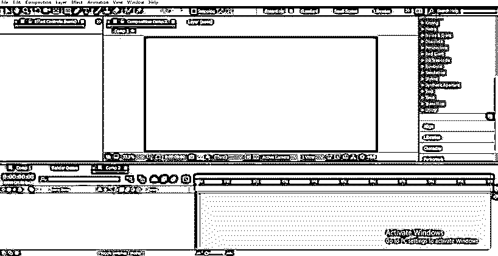

**第二步:**现在，首先让我们为自己的作品取一个新的构图。对于新的组合，进入菜单栏，点击文件菜单，然后点击下拉列表中的新组合选项。

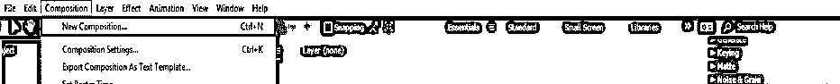

**第三步:**或者，你可以进入该软件的项目面板，点击“创建新作品”标签的小图标，创建新作品。

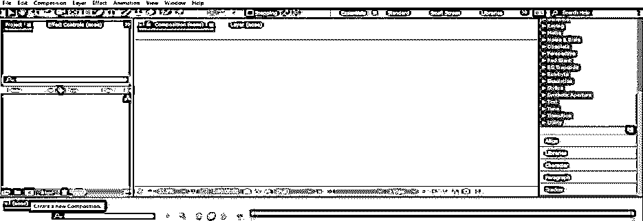

**第四步:**或者你可以用鼠标右键在项目面板的任何地方点击右键。将会打开一个下拉列表。从该列表中选择新的合成选项。

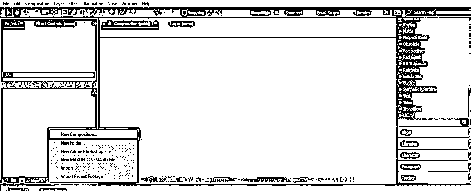

**第五步:**现在会打开一个构图设置框。在此进行所需的构图设置，并按下此对话框的“确定”按钮以应用设置。

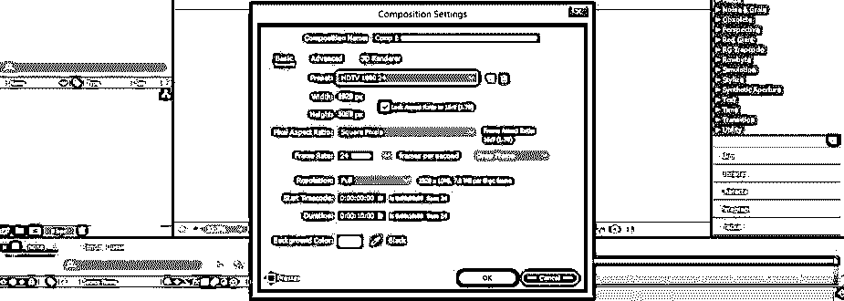

**第六步:**现在进入菜单栏的图层菜单，这是工作屏幕的顶部。将打开一个下拉列表，转到“新建”选项，并从新的下拉列表中选择空对象选项。

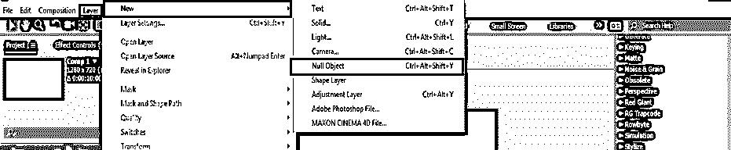

**第七步:**现在去菜单栏下面这个软件的工具栏，点击选择钢笔工具。

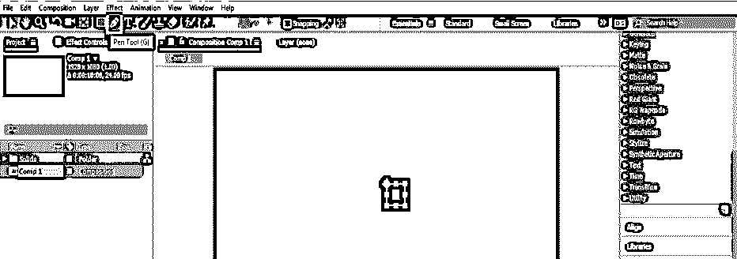

**第八步:**现在，在构图窗口区域借助钢笔工具按照你的样子做一个路径。

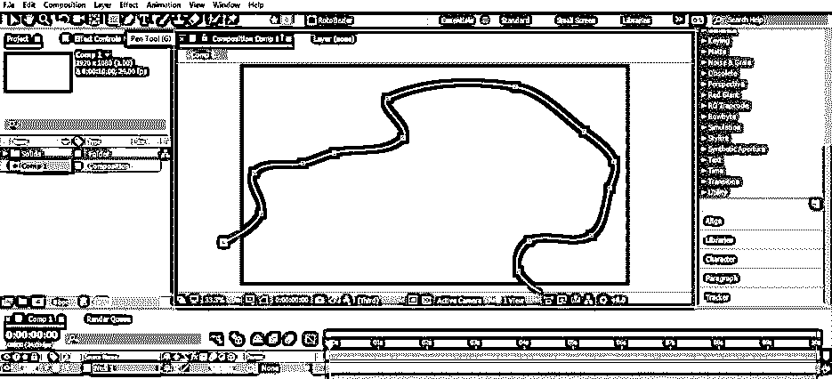

**第九步:**现在进入这个软件的图层面板，点击 Null 1 图层的小箭头图标。该层的属性列表将被打开，现在点击蒙版的小箭头图标，再次点击蒙版 1 的小箭头图标。蒙版 1 属性将被打开，点击蒙版路径属性并按 Ctrl + C 键复制蒙版的路径。

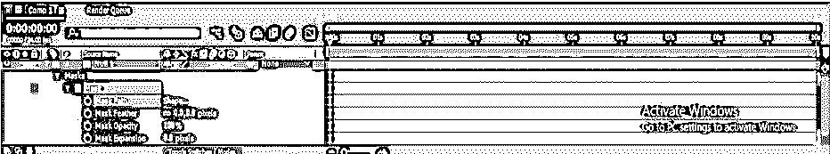

**步骤 10:** 现在展开 Null 1 图层上的小箭头图标，从键盘上按下 P 键，获得 Null 对象的位置属性。

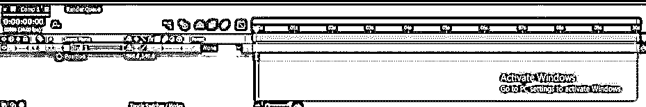

**步骤 11:** 现在通过按下键盘上的 Ctrl + V 按钮将遮罩路径粘贴到 Null 1 的位置属性上。

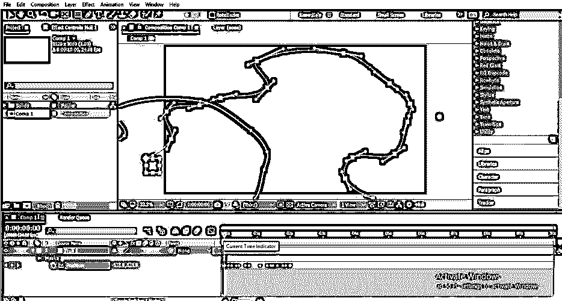

**步骤 12:** 在 Null 1 对象的位置上生成遮罩路径的关键字。您可以通过调整关键帧部分中的关键点来调整 Null 1 对象的路径。

**步骤 13:** 现在转到菜单栏的图层菜单，为实体图层。将打开一个下拉列表，转到“新建”选项，并选择“实心”作为新的下拉列表。

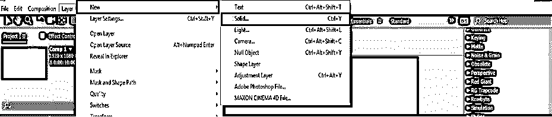

**第 14 步:**点击实体后，会打开一个实体层设置框。在这里进行你想要的设置，并将它们命名为粒子。

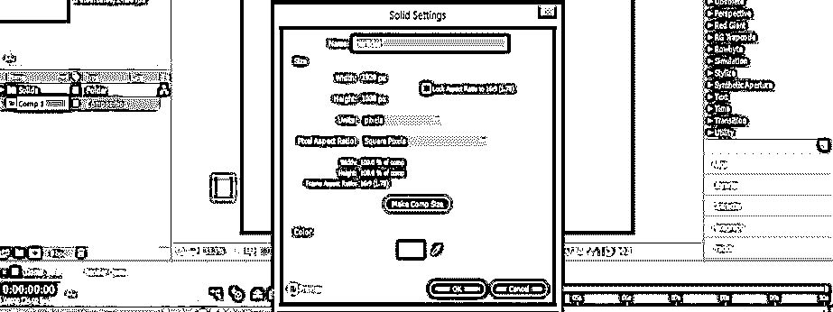

**第十五步:**现在进入菜单栏的效果菜单。将打开一个下拉列表，转到该列表的模拟选项，并单击新下拉列表的 CC 粒子世界选项。

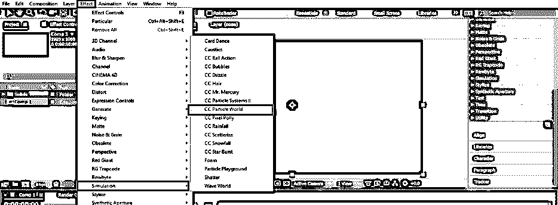

**第十六步:**粒子效果的参数会在这个软件的项目面板旁边的效果控制面板中打开。

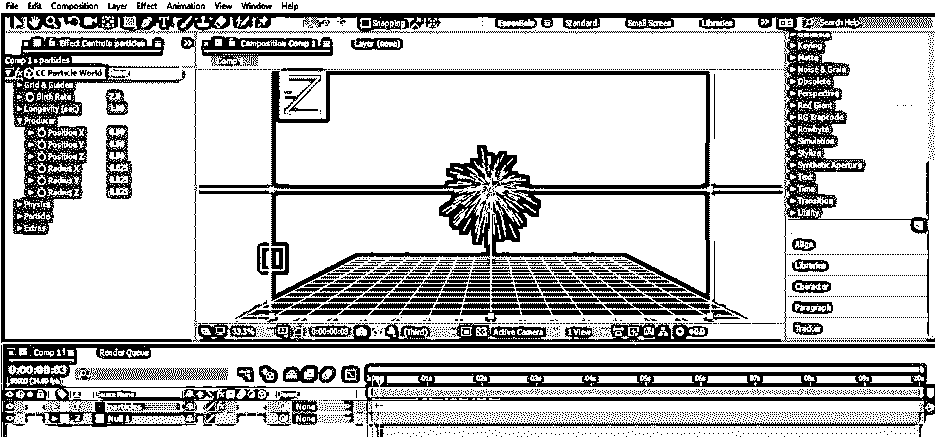

现在，我们将制作这些粒子位置的动画。按住键盘上的 Alt 键，点击位置 X 选项的小时钟图标，打开表达式框。现在，在该属性的表达式框中键入该表达式，以决定粒子在 X 方向的位置。

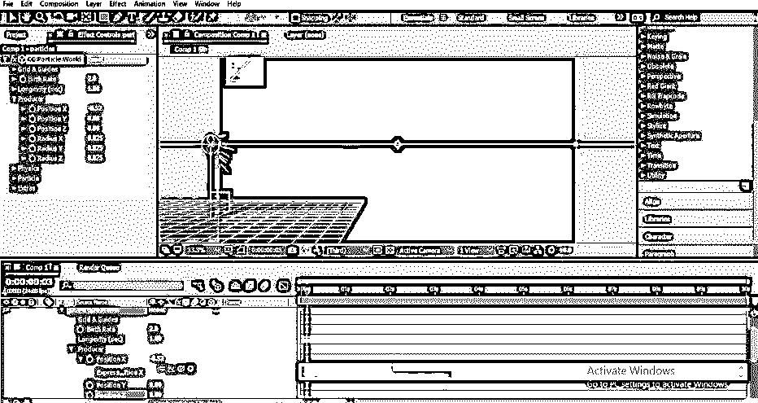

**步骤 18:** 现在按住键盘的 Alt 键，点击 Y 位置选项的小时钟图标，进入表达式框。现在，在该属性的表达式框中键入该表达式，以决定粒子在 Y 方向上的位置。

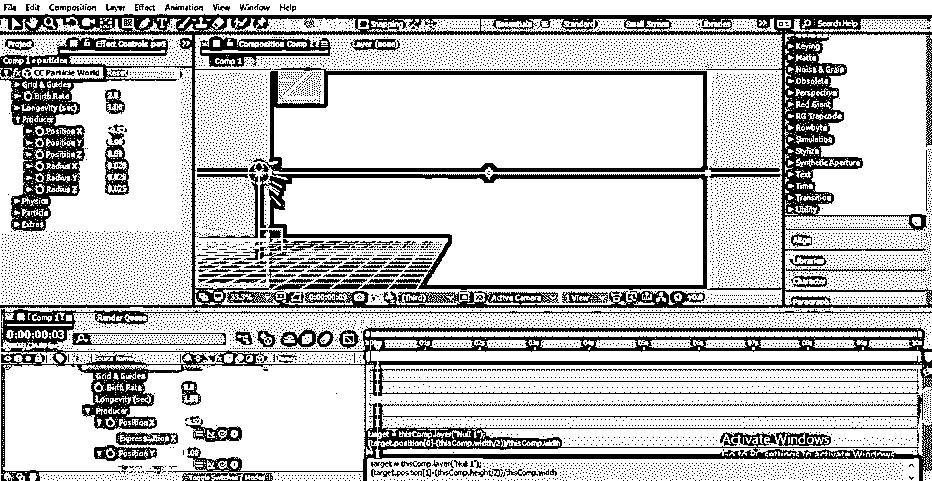

**步骤 19:** 现在按住键盘的 Alt 键，点击 Z 位置选项的小时钟图标，进入表达式框。现在，在该属性的表达式框中键入该表达式，以决定粒子在 Z 方向上的位置。

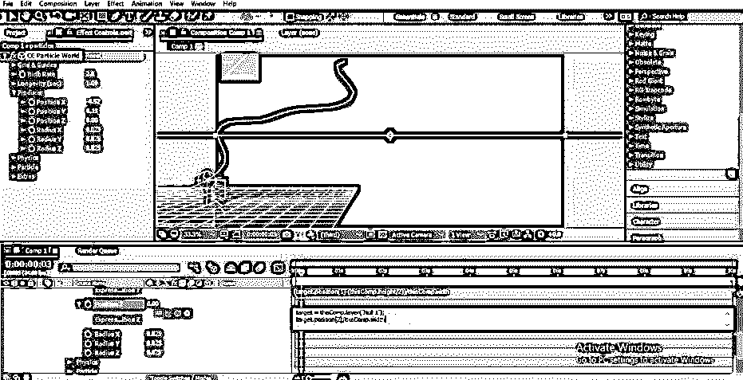

**步骤 20:** 现在，当你按下键盘的空格键播放动画时，你的粒子的动画会是这样的。

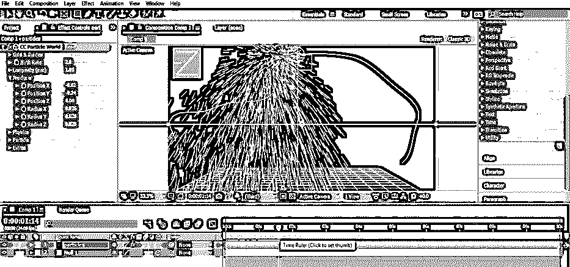

**步骤 21:** 现在点击效果控制面板中粒子效果的粒子选项的小箭头图标。

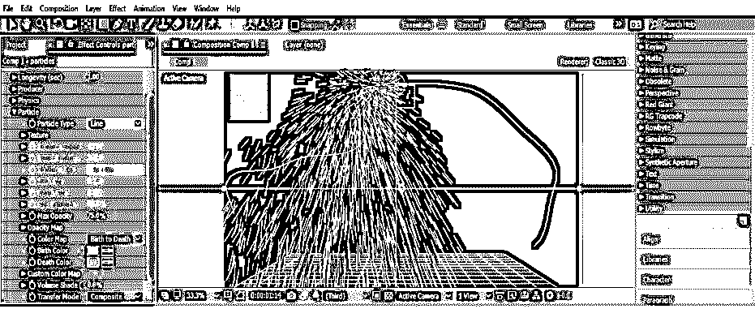

第 22 步:在这里，你可以从这个列表中选择不同类型的粒子形状。

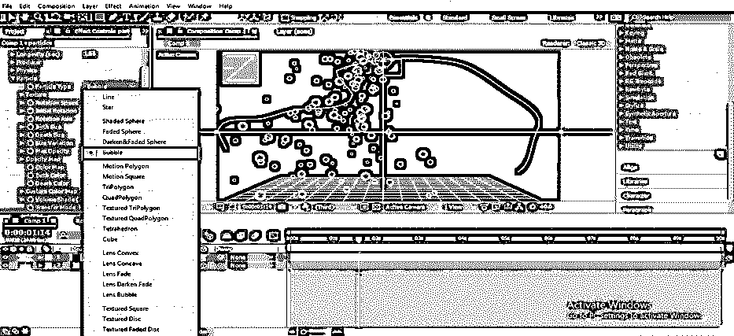

**步骤 23:** 你也可以从出生尺寸和死亡尺寸选项中增加和减少粒子的尺寸

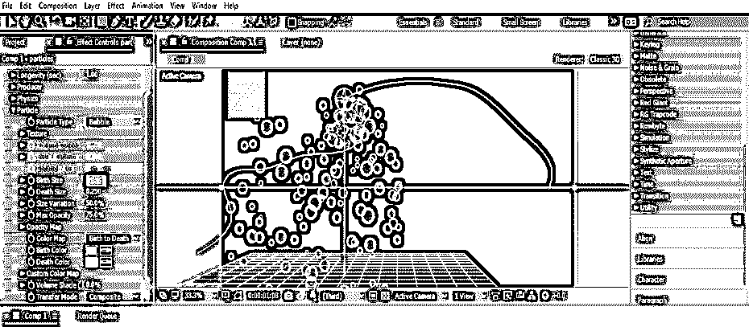

步骤 24: 你也可以在出生尺寸和死亡尺寸的基础上改变粒子的颜色。要改变颜色，只需点击这个选项的小颜色框。将会打开一个颜色面板对话框，从这里选择您想要的颜色，然后按下对话框中的“确定”按钮。

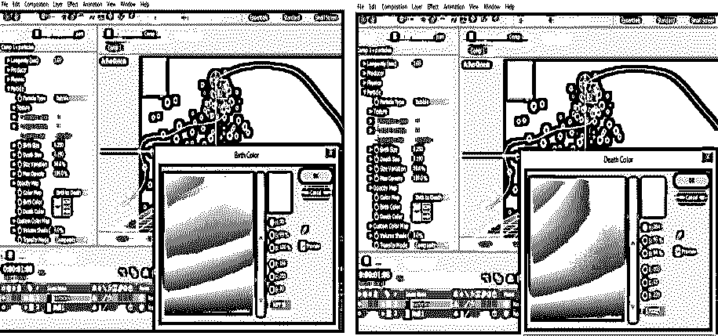

**第 25 步:**你也可以通过出生率选项来调整粒子的数量。如果你增加出生率的值，粒子的数量就会增加。

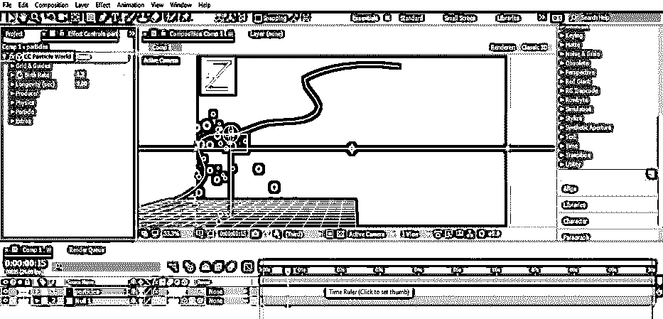

通过使用这个软件的粒子效果选项，你可以有更多的选项来制作一个好的动画效果，这样，你可以在后期效果中使用粒子。

### 结论

现在你可以在 After Effects 的上下文中理解粒子，并轻松处理这个特性的参数。通过练习粒子效果参数并在项目工作中使用它们，您可以获得不同类型的粒子效果，没有任何问题。

### 推荐文章

这是一个关于后效粒子的指南。这里我们讨论一下入门，如何一步一步的在后期效果中创建粒子效果。您也可以浏览我们的其他相关文章，了解更多信息——

1.  [特效后摆动](https://www.educba.com/wiggle-in-after-effects/)
2.  [特效后按键灯](https://www.educba.com/keylight-in-after-effects/)
3.  [后效合成](https://www.educba.com/composition-in-after-effects/)
4.  [后效中的毛刺效应](https://www.educba.com/glitch-effect-in-after-effects/)
5.  [后效时间轴|创建步骤](https://www.educba.com/after-effects-timeline/)

