# 后续效果跟踪

> 原文：<https://www.educba.com/after-effects-tracking/>

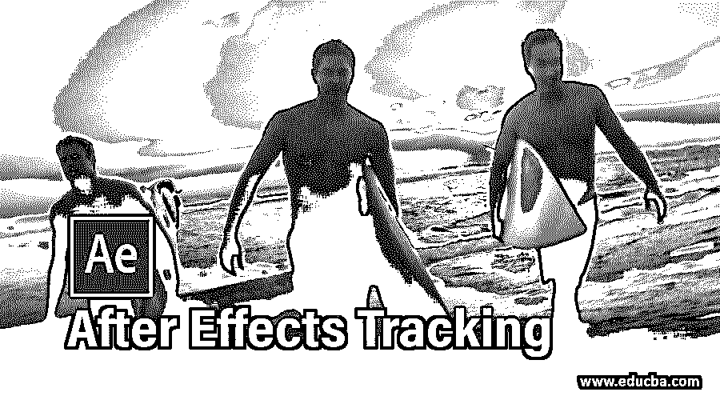

## 后效跟踪简介

After Effect 是最受欢迎的视频编辑软件，被视频编辑图形专业人员广泛用于他们的编辑工作；在这篇文章中，我们将看看“跟踪”功能后的效果软件。您可以将跟踪理解为一种方法，通过这种方法，您可以将此软件的任何对象或层与任何视频素材的任何特定点相连接，并且该对象填充跟踪视频素材的每一帧中该特定点的运动。跟踪为您提供了广泛的编辑方法，以便在工作中获得最佳效果。因此，让我们通过一个例子来理解后效跟踪，并分析其参数。

### 如何在 After Effect 中使用追踪？

我们将通过几个简单的步骤来理解这个特性。

<small>3D 动画、建模、仿真、游戏开发&其他</small>

**步骤 1:** 在开始学习该功能之前，让我们先来看看该软件的用户界面，以便更好地理解。在工作屏幕的顶部，我们有一个带有不同子菜单的菜单栏，在它下面，我们有工具面板和它们的属性栏，接下来我们在工作屏幕的左侧有项目面板和效果控制面板，用于处理任何效果参数，在中间，我们有合成窗口，在右侧我们有一些参数，如预览选项卡，效果&预设，跟踪器等。在底端，我们有层部分和时间轴部分。

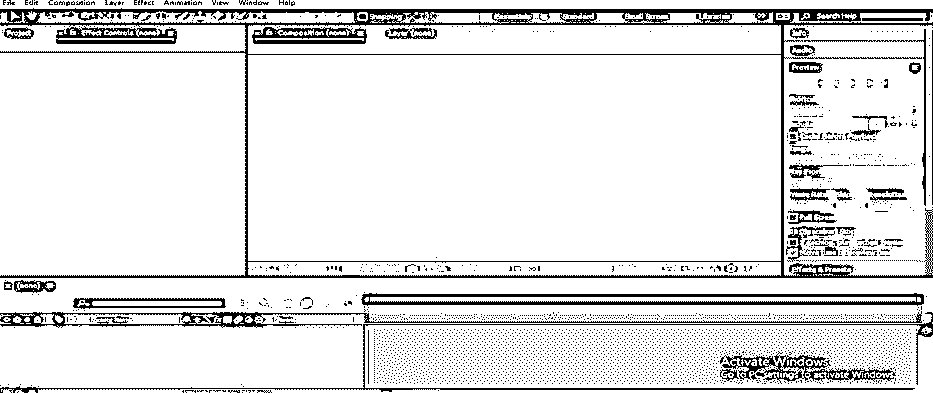

**第二步:**首先让我们有学习的视频素材。要将视频素材放入 After Effect 软件，请转到保存它的文件夹。从那里选择它，并把它放在这个软件的项目面板区域。

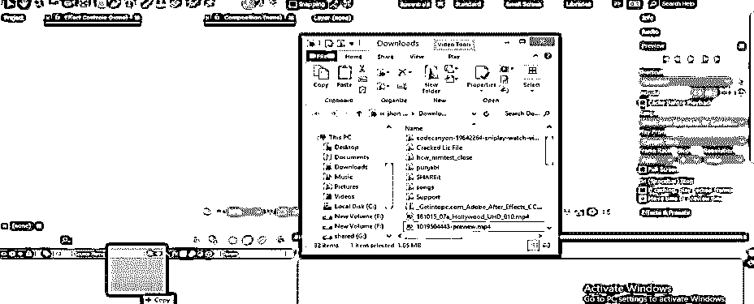

**第三步:**现在把这个素材拖到这个软件的图层部分，在工作屏幕的底端。我已经从 https://www.shutterstock.com/的[网站下载了这段视频。你可以拍摄自己的视频片段，也可以从任何其他网站下载来学习。](https://www.shutterstock.com/)

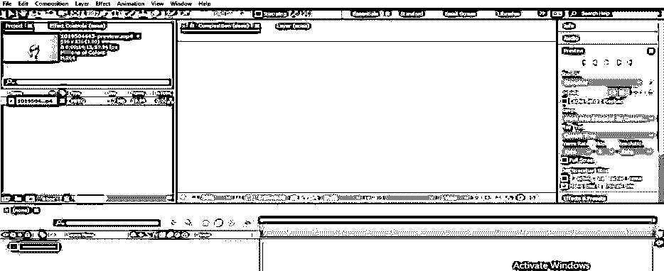

**第四步:**现在进入菜单栏的窗口菜单，在工作屏幕的顶部。如果禁用，从下拉列表中启用跟踪器选项。

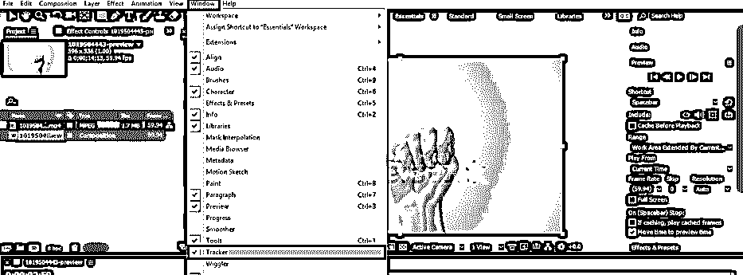

**步骤 5:** 跟踪器选项选项卡将在工作屏幕的右侧参数部分打开。

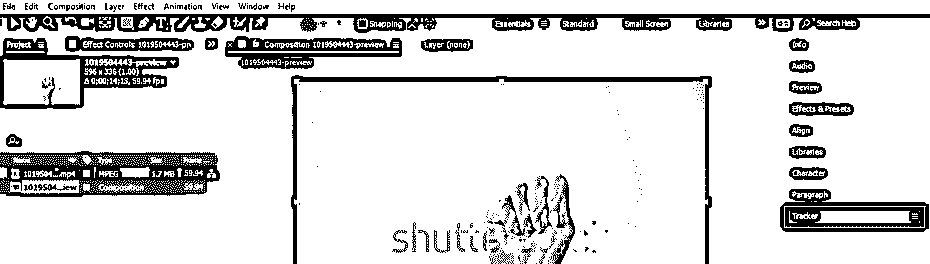

**步骤 6:** 现在点击跟踪器选项选项卡。在此选项卡中，我们有一个不同类型的“跟踪”选项。在这里，我们将了解“按轨迹运动跟踪”选项。

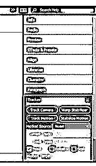

**第 7 步:**现在点击“跟踪运动”选项卡。

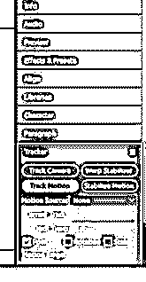

**第 8 步:**在合成窗口区域将会打开一个新图层，用于更改该视频素材。一旦你点击跟踪运动选项，跟踪点框将在视频画面上打开。

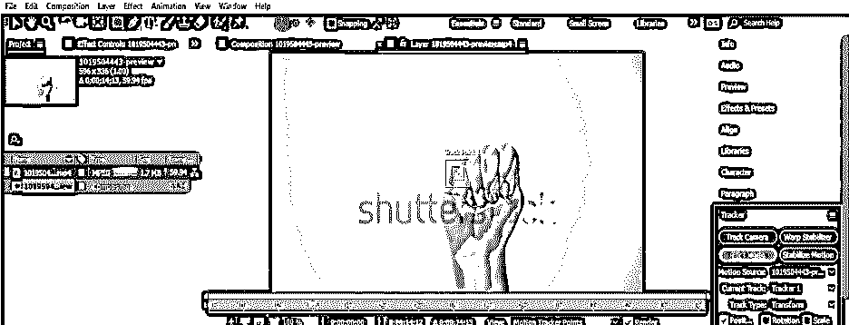

**第九步:**带加号的内部方框帮助您选择您想要跟踪运动的特定点，外部方框将帮助您在每一帧视频中搜索跟踪点。

**第十步:**您可以根据自己的需要增加和减少跟踪方框的大小。

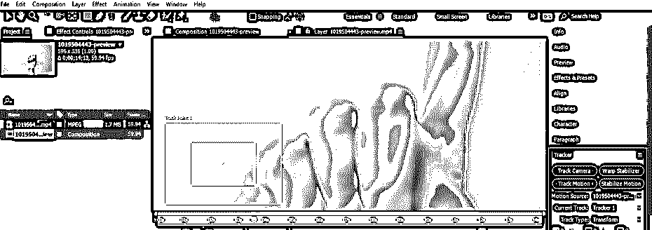

**步骤 11:** 你可以在视频屏幕上的任何地方移动这些追踪方框。

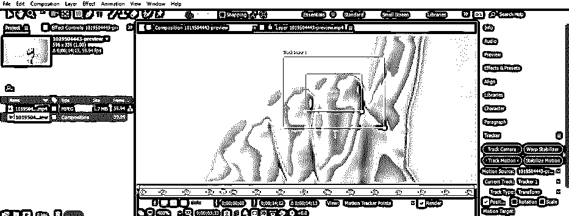

**第十二步:**现在，我将选择手指的这个点作为我工作的跟踪点。

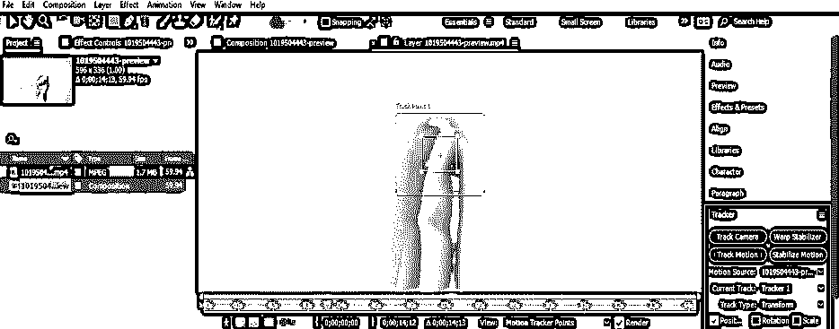

**第十三步:**现在，让我们来看看轨道运动的参数。有一个运动源选项，我们将在其中选择我们想要应用到轨道的视频镜头。

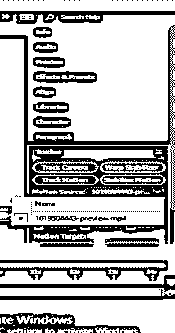

**第 14 步:**在当前轨道选项中，您会在视频素材中使用许多跟踪器。

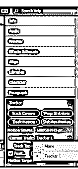

**步骤 15:** 您可以通过启用这些选项来跟踪视频素材中任何一点的位置、旋转或缩放。

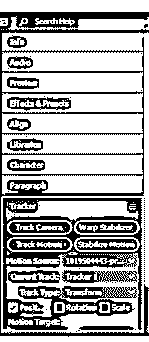

**第 16 步:**这里是“向前分析 1 帧”选项，通过该选项，您可以向前跟踪每帧素材中跟踪器的点。

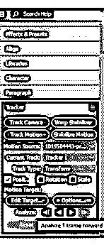

**第 17 步:**通过“向后分析 1 帧”，可以到 1 帧背景编辑任意跟踪点。

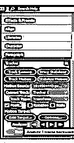

**步骤 18:** 使用“向前分析”按钮，您可以连续跟踪帧中的点。

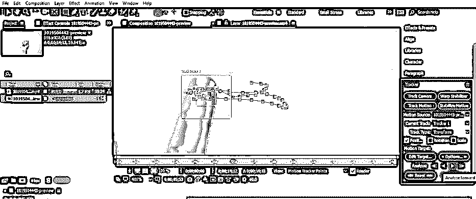

**步骤 19:** 现在对每一帧的跟踪点反复按下“向前分析 1 帧”按钮。确保加号在整个轨迹中不会离开它的原始位置。

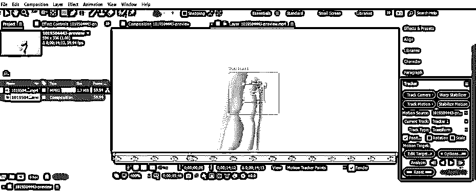

**第 20 步:**或者您可以按“向前分析”按钮继续跟踪。

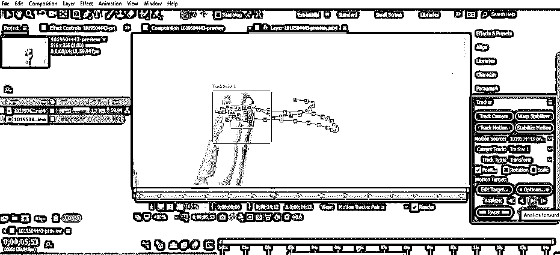

**步骤 21:** 现在，让我们把文本层与跟踪器连接起来。对于文本层，用鼠标右键单击层部分。将打开一个下拉列表，转到该列表中的“新建”选项，并从新的下拉列表中选择“文本”选项。

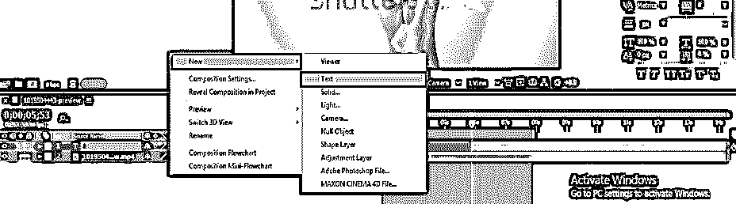

**第 22 步:**输入你想用手指在视频画面中追踪的文本。

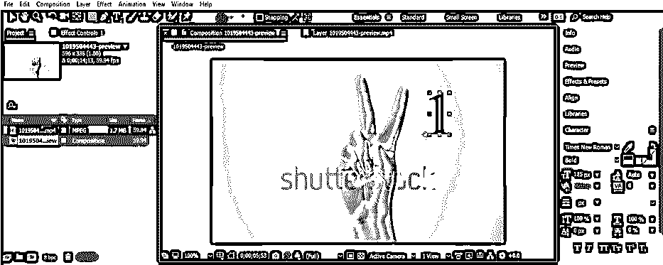

**步骤 23:** 现在转到构图窗口的跟踪层，在工作画面右侧的跟踪器参数的运动源中选择这个视频。

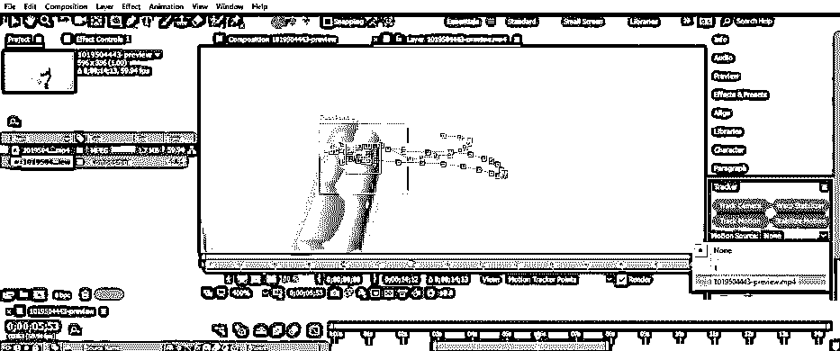

**步骤 24:** 现在，如果您的视频素材中有多个跟踪器，请在“跟踪器”选项卡的“当前跟踪器”选项中选择“跟踪器 1”。现在，单击该选项卡的“编辑目标”选项卡。

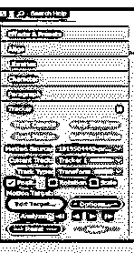

**第 25 步:**会打开一个对话框。从这里选择文字图层，并按下此对话框的确定按钮。

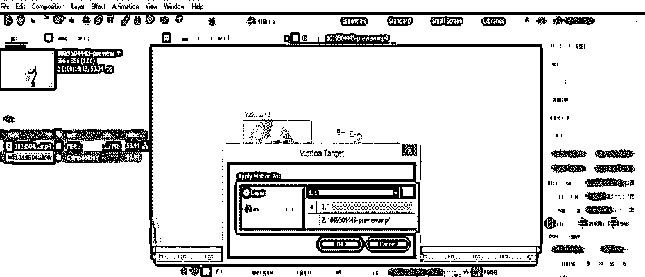

**第 26 步:**现在点击追踪器标签框的应用按钮来应用它。

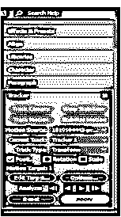

**第 27 步:**现在‘申请’框会打开，询问你想如何申请追踪。您可以选择这些列表中的任何一个。我将选择 X 和 Y 方向选项，然后单击此对话框的确定按钮。

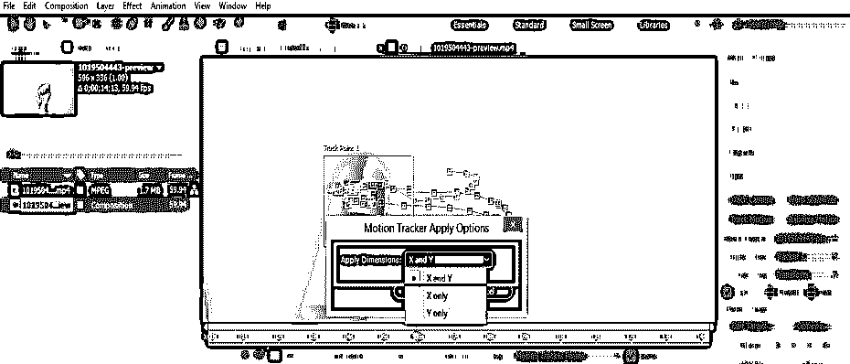

**步骤 28:** 现在通过按键盘的空格键来播放音轨，或者你可以进入预览选项卡，它在播放音轨的工作屏幕的右侧。当你播放它的时候，我们的文字会随着视频片段手指的运动而移动。

**第 29 步:**您可以在视频素材中添加多个跟踪点，方法是点击“跟踪器”选项卡的“新跟踪点”选项。

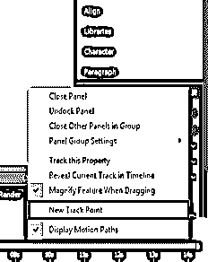

**第三十步:**并根据你来调整。

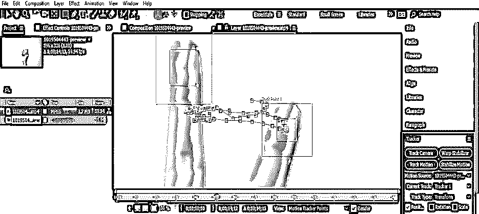

### 结论

读完这篇文章，你就能理解“After Effect 软件中的跟踪是什么？”以及“如何处理这个特性的参数？”你可以在实践后熟练掌握这一特性，并在工作中受益。

### 推荐文章

这是一个跟踪效果的指南。在这里，我们讨论的介绍，以及如何应用跟踪效果，在一步一步的方式。您也可以浏览我们的其他相关文章，了解更多信息——

1.  [后效粒子](https://www.educba.com/after-effects-particles/)
2.  [特效预置后](https://www.educba.com/after-effects-presets/)
3.  [后效表情](https://www.educba.com/after-effects-expressions/)
4.  [后效便携](https://www.educba.com/after-effects-portable/)

