# 后效中的摄像机跟踪

> 原文：<https://www.educba.com/camera-tracking-in-after-effects/>

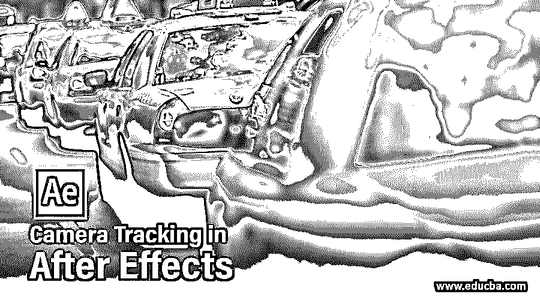

## After Effects 中的相机跟踪简介

世界著名公司 Adobe Systems 为您提供最受欢迎的视频编辑软件 After Effect。我们在这个软件中有不同类型的技术和功能，使我们的工作变得容易。相机跟踪是其重要特征之一，用于随着背景物体的运动给任何物体以跟踪效果。我们可以对任何类型的视频镜头或动画对象使用相机跟踪。在这篇文章中，我们将以一种非常简单的方式来理解相机跟踪，并分析它的重要参数，以方便我们的图形设计。

### 如何在 After Effect 中使用相机追踪？

在开始学习之前，让我们快速浏览一下 Adobe After Effect 软件的用户界面，以便更好地理解这篇文章中的软件。

<small>3D 动画、建模、仿真、游戏开发&其他</small>

**步骤 1:** 该软件的用户屏幕被分成许多部分，例如用于在该软件中进行不同调整的菜单栏、提供用于设计工作的不同类型的工具的工具栏、显示任何项目的多个组成的项目面板、显示当前组成中使用的任何效果或预设的效果控制的参数，在该屏幕的按钮处，我们有显示任何项目的层的参数的层部分，接下来是用于处理动画参数的时间线部分。

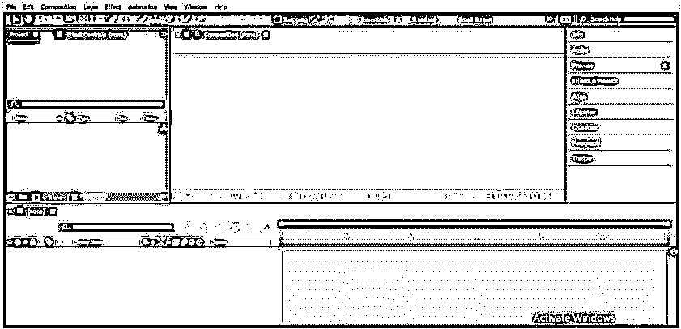

**第二步:**为了学习 After Effect 中的相机追踪，我们必须拍摄一段视频。你可以自己拍摄视频，也可以从网上下载。要将该视频放入 After Effect 软件，请转到您个人电脑中保存视频的文件夹。在鼠标按钮的帮助下从那里选择这个视频，并将其放在 After Effect 软件的项目面板部分。

**第三步:**现在用拖放的方法把这个视频拖到图层部分。

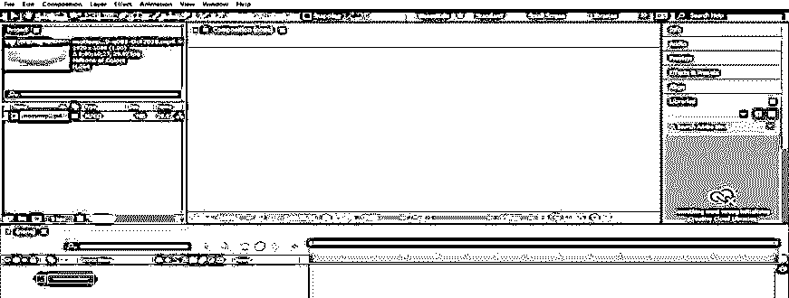

**第四步:**现在从时间线部分根据你的要求调整这段视频动画的时间。

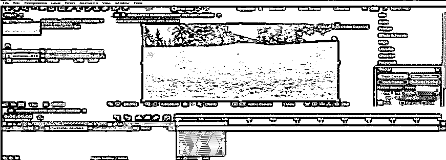

**第五步:**现在转到 After Effect 软件的右侧，点击追踪器选项的标签。从这里选择跟踪摄像机选项。

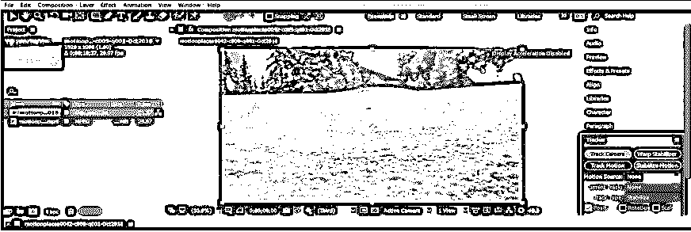

**第六步:**或者你可以从菜单栏的动画菜单中选择一个相机追踪选项。将打开一个下拉列表，从这里选择“跟踪摄像机”选项。

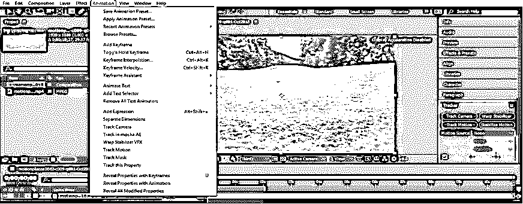

**步骤 7:** 一旦你点击了摄像机跟踪选项，摄像机跟踪的初始化标签将在项目面板部分旁边的效果控制面板中打开。相机初始化需要几分钟时间。相机的初始化时间将取决于您个人电脑的 RAM 容量。

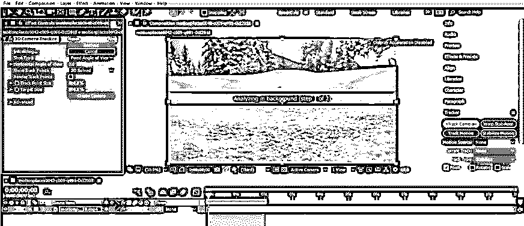

**步骤 8:** 一旦相机初始化，这种类型的屏幕将被打开。

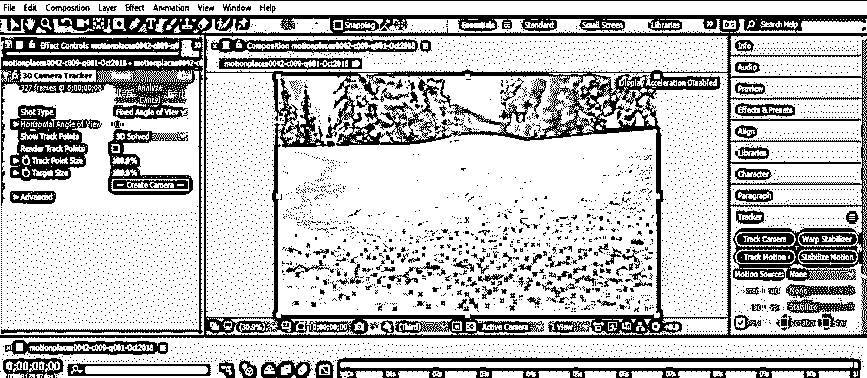

**第九步:**现在，根据您的需要在视频屏幕上选择一个位置，在此视频中添加一个物体，以便进行摄像机跟踪。现在，在鼠标右键的帮助下，在这个位置单击右键。将会打开一个下拉列表。从这里选择“创建文本和照相机”选项。

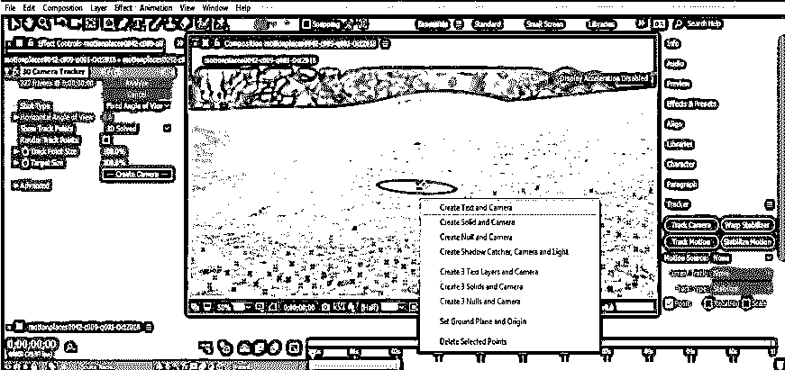

**第十步:**这里会生成白色的文本区域。借助鼠标光标选择该区域。在工作屏幕的右侧会打开一个字符参数框。

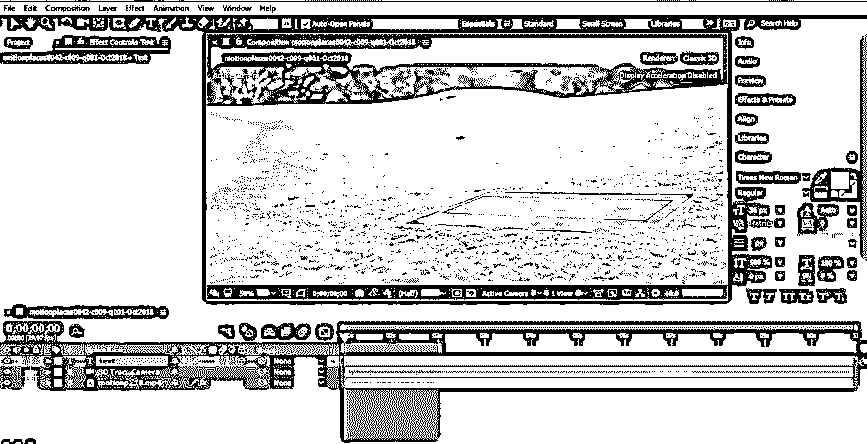

**步骤 11:** 点击字符面板上文字的小颜色框，改变文字的颜色。你可以根据自己选择文字的颜色。

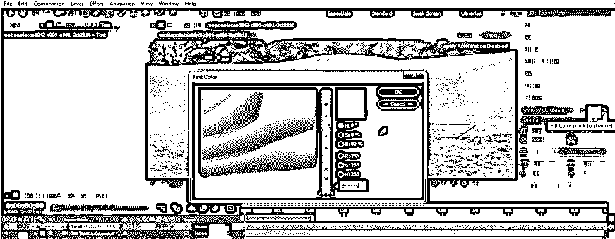

第 12 步:现在，在相机追踪器的帮助下，根据你的需要输入你想要制作动画的文本。

**步骤 13:** 现在，借助“移动和选择”工具，调整你想要放置的文本。

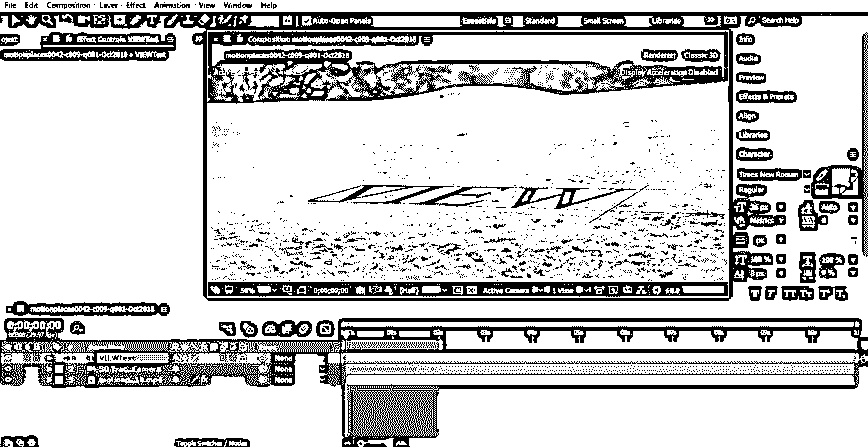

**步骤 14:** 现在选择这个文本，从这个文本的字符面板中选择你想要的字体样式和大小。

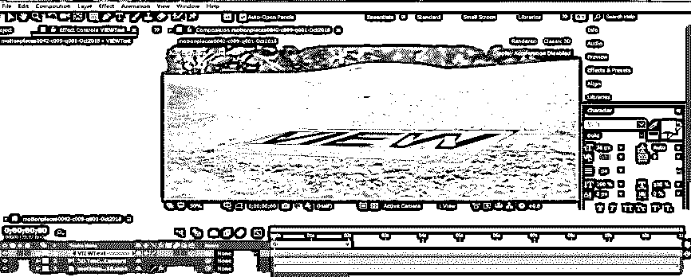

**步骤 15:** 现在转到图层部分，点击文字图层的小箭头按钮。文本层的属性将被打开。

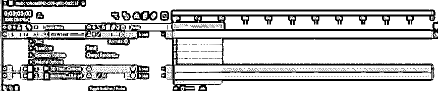

**步骤 16:** 现在点击这个文本层的 Transform 属性的小箭头图标。将打开一个转换属性列表。以这种方式设置 X 旋转的值，以便文本在垂直位置可视化。

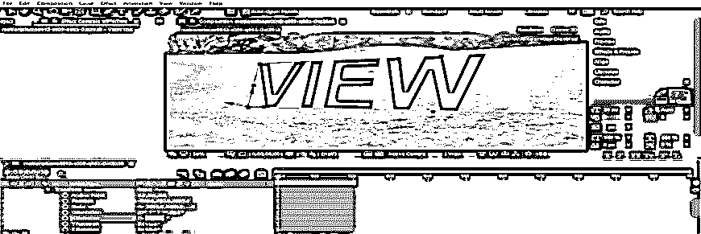

**步骤 17:** 现在调整方向值，这样调整文字。您可以根据您的需要设置文本属性的参数。

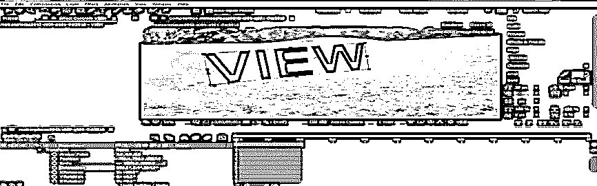

**步骤 18:** 现在点击文本层，按下键盘上的 Ctrl + D 键，复制文本层。

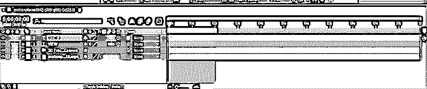

步骤 19: 我们将使用这个复制层作为这个文本层的阴影。为了我们更好的理解，让我们重命名这一层为'阴影'。右键单击此复制层；将会打开一个下拉列表。从这里选择重命名选项。

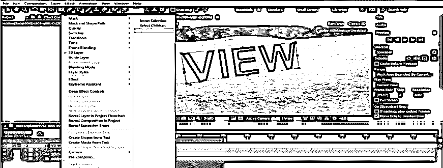

现在，在这里输入你想要的名字。我将键入“阴影”作为这个复制层的名称。

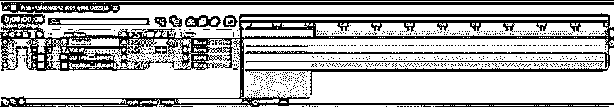

**步骤 21:** 现在点击该层的小箭头图标，打开该层的属性列表。

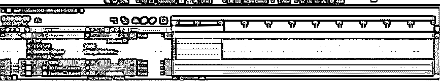

**步骤 22:** 现在点击该层变换属性的小箭头图标，打开变换属性列表。现在让 X 旋转的值为‘0’。

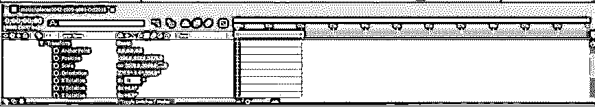

步骤 23: 现在到这一层的角色面板来改变阴影的颜色。点击此面板的小颜色框。

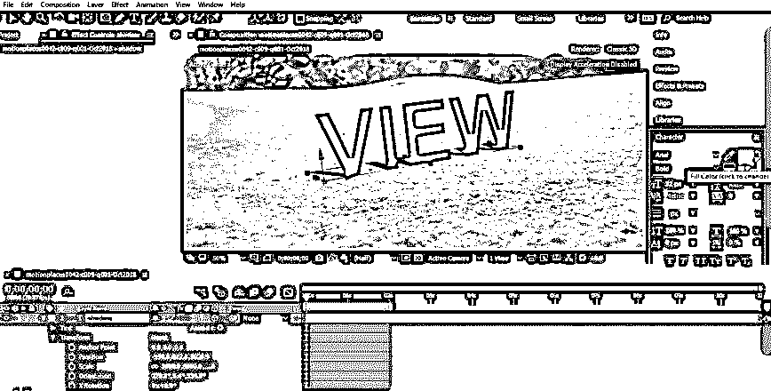

**步骤 24:** 选择黑色作为这一层的阴影颜色，按下这个颜色框的 Ok 按钮。

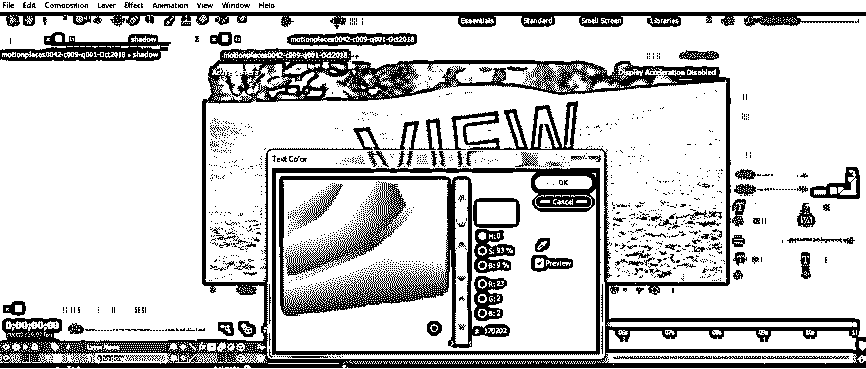

步骤 25: 进入这个阴影层的不透明度属性，将不透明度的值降低到 60%或者你可以根据自己的需要设置这个值。

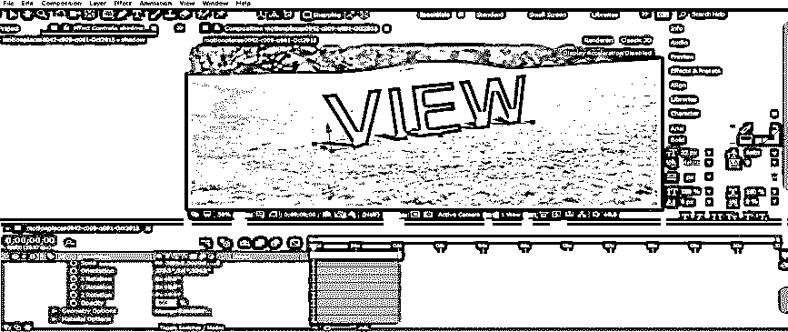

**步骤 26:** 现在进入播放相机追踪的预览选项卡，在工作屏幕的右侧，也可以按键盘的空格键作为播放动画的快捷键。

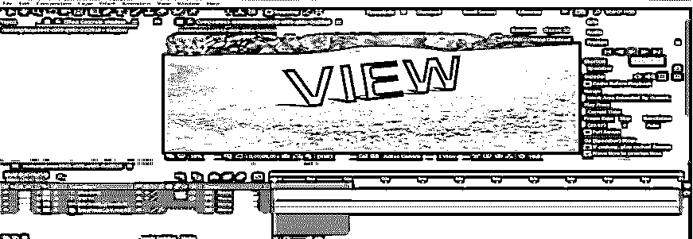

**第 27 步:**你的动画会是这样的。

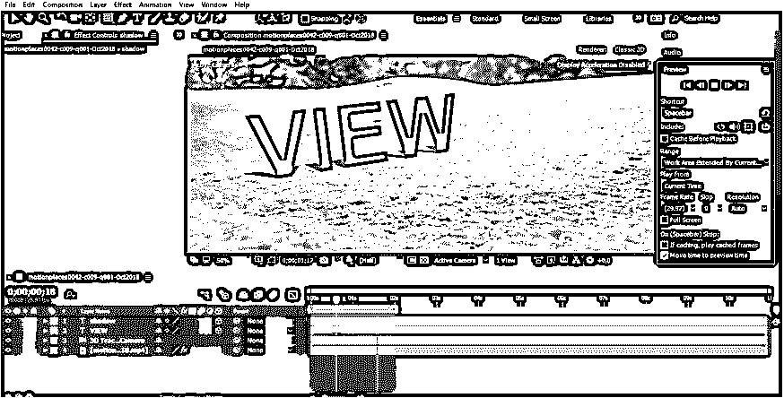

这样，您可以在 After Effect 软件中使用相机跟踪，并处理相机跟踪的参数，以便从 After Effect 软件的这一功能中获得最佳效果。

### 结论

现在，看完这篇文章后，你可以更好地理解'什么是相机跟踪'以及如何在 After Effect 软件中使用它。您还可以了解 After Effect 的相机跟踪功能的基本参数，以便轻松处理该功能，在视频编辑领域制作高度专业的项目。

### 推荐文章

这是一个在 After Effect 中跟踪相机的指南。在这里，我们讨论一个介绍，并在一步一步的方式跟踪一个相机的后期效果。您也可以浏览我们的其他相关文章，了解更多信息——

1.  [特效后按键灯](https://www.educba.com/keylight-in-after-effects/)
2.  [后效中的旋转观测](https://www.educba.com/rotoscoping-in-after-effects/)
3.  [输出后效](https://www.educba.com/export-in-after-effects/)
4.  [后效中的遮罩](https://www.educba.com/mask-in-after-effects/)

