# 特效卡通

> 原文：<https://www.educba.com/after-effects-cartoon/>

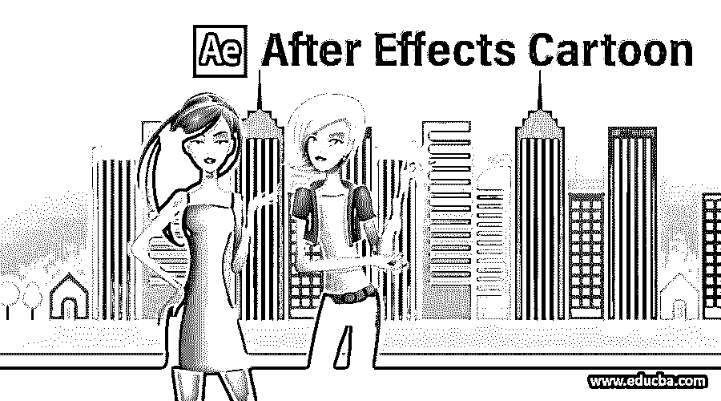

## 后效动画简介

我们可以通过使用该软件的一些功能并从一些插件中获得帮助来制作卡通人物的动画效果。为了在这个软件中创建和制作动画，我们有一个矢量文件或 png 文件。我们可以从两个文件中制作不同的动画。我们将通过一个例子来理解这两种方法，并学习如何处理它们的参数。对于这个主题，我们将在不同的图层中使用 illustrator 文件，并在我们的卡通人物上使用木偶工具和其他一些重要的工具。所以让我们开始讨论动画的后期效果。

### 如何在 After Effect 中创建动画？

通过使用和管理该软件的一些重要功能和参数，我们可以在几个简单的步骤中创建和动画动画效果。但是在开始之前，让我们看一下这个软件的工作屏幕，以便我们可以更好地理解这篇文章中的主题。

<small>3D 动画、建模、仿真、游戏开发&其他</small>

在工作屏幕的顶部，菜单栏有几个菜单，如文件、编辑、合成、图层、效果和其他一些重要的菜单。在这个菜单栏下面，我们有一个工具栏以及一个活动工具或对象的属性栏。在这个工具栏下面，我们有三个部分，左边是项目面板和效果控制面板；在中心，我们有一个写作窗口，在这里我们可以看到我们的工作；在右侧，我们有一些参数面板，如效果和预设标签，音频标签，预览标签，和其他一些重要的标签。您可以在该软件的工作屏幕上您想要的位置根据您的选择管理所有这些部分。

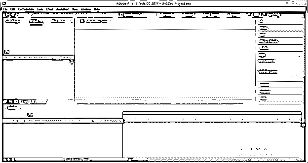

现在让我们来学习一篇新的作文。对于菜单，合成进入本软件菜单栏的合成菜单并点击它。将打开一个下拉列表，从列表中选择“新组合”选项。

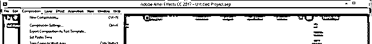

现在构图设置框将被打开。在此进行所需的设置，然后单击此对话框中的“确定”按钮。

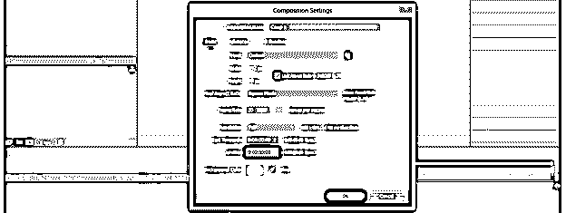

现在让我们有一个我从 www.freepik.com 下载的卡通人物的矢量文件。你也可以从那里下载任何角色。现在在 Illustrator 中打开这个文件，你可以看到这个角色的所有部分都在不同的图层上。

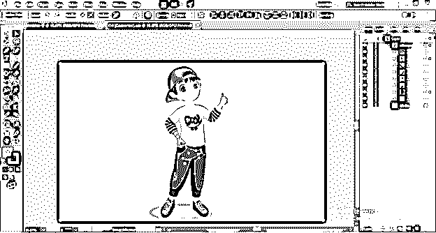

将这个卡通人物的一部分组合在一个新的图层上，你要像这样制作动画。

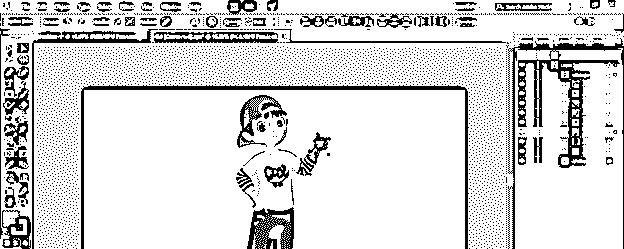

现在保存这个角色的 AI 文件。

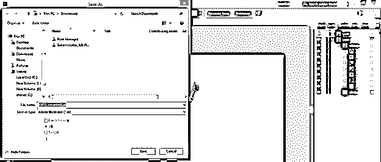

将此文件放在 after effect 中。

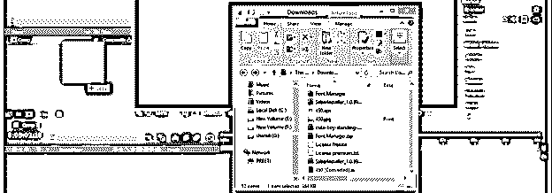

在此框中选择合成选项，然后单击此对话框中的确定按钮。

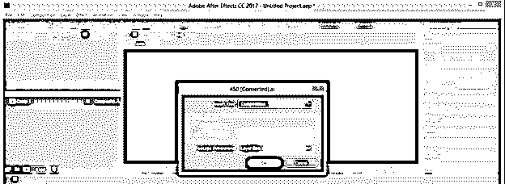

现在拖动图层面板中的这个组成。

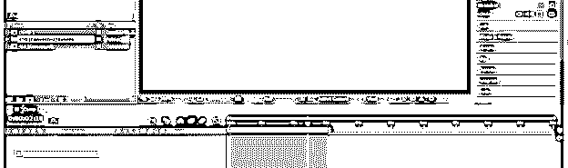

现在拿着工具后面的平底锅，拖动这只手在肩关节的锚点。

现在选择这一部分的层，并按下旋转属性的 R 按钮。在第一帧添加关键点，并将播放头移动一秒钟，然后将旋转值指定为 9 度。

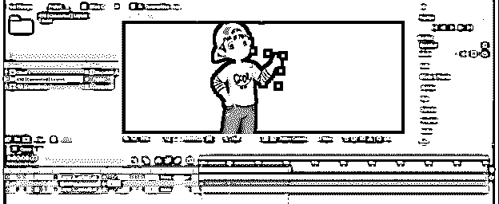

现在你可以播放动画了。你可以用同样的方法制作这个卡通角色的其他部分的动画。

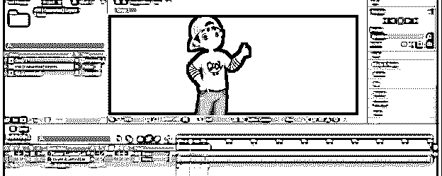

现在让我们了解其他方法。把你下载的向量放在这里。为了放置一个矢量文件，打开你保存它的文件夹，从那里选择它，然后把它放到这个软件的项目面板中。

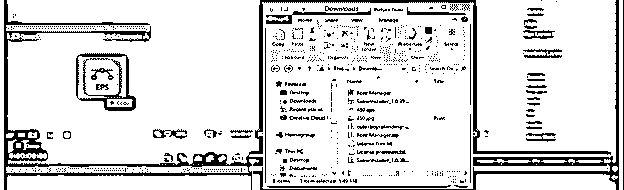

现在拖动这个文件到图层面板。

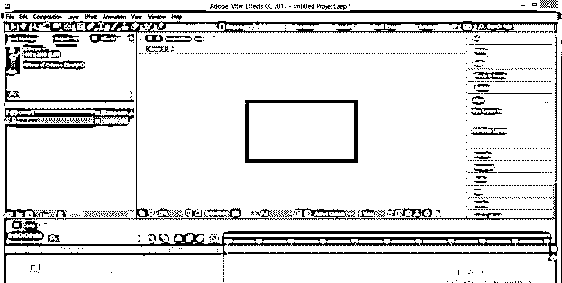

转到图层面板，选择这个卡通人物的图层，然后按下键盘上的 S 键，获得这个图层的缩放属性。现在减少这一层的比例为 30%。

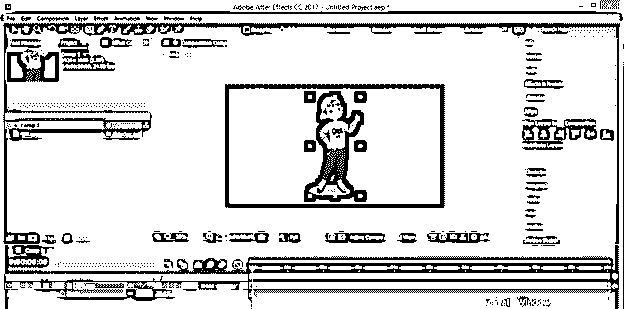

现在转到工具面板，点击木偶针工具。

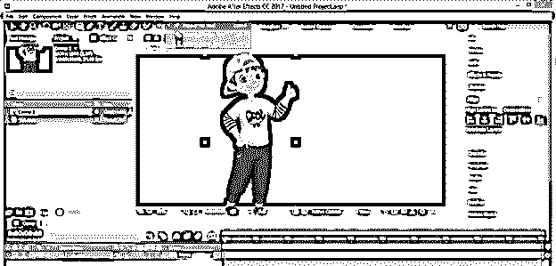

使用此工具在角色的身体上单击，以便在身体上标记大头针。卡通人物上的标签别针固定一些点和移动一些点。我会在上面的部分标记三个针，在腿上标记两个针，使这些部分不可移动。现在我将在右边制作两个标签，因为我想将它们制作成动画。你可以根据你来标记大头针。

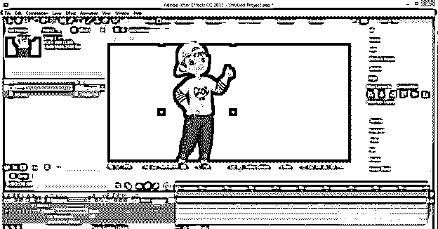

现在从工具面板中取出木偶淀粉工具。

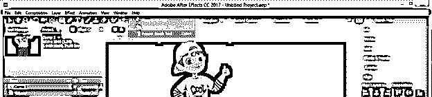

用这个工具点击手的区域，使这些部分像骨头一样坚硬。你可以看到这些红色的大头针。

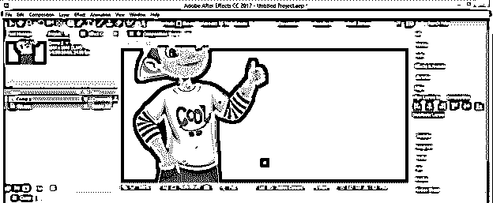

现在通过点击选择一个红色的大头针，增加这个大头针的消耗属性的值，以增加这个角色手部区域的刚性面积。

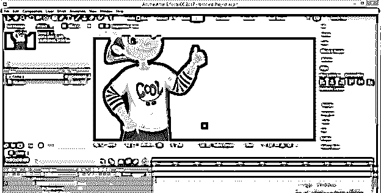

对手的上半部分做同样的动作。

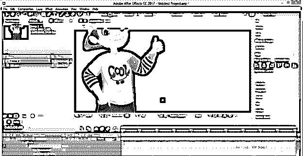

现在再一次，使用木偶针工具。

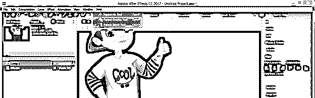

现在为动画，这个卡通人物的手，选择你想要移动的大头针。我将选择这个角色右手手掌的大头针，然后按住键盘的 Ctrl 键来记录我在这个大头针上的移动。一旦你按住 Ctrl 键，鼠标指针上就会出现一个秒表图标。

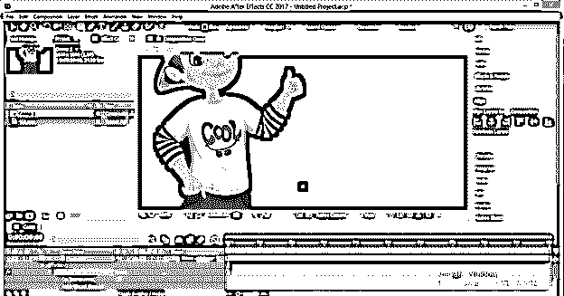

我会像这样移动这只手。

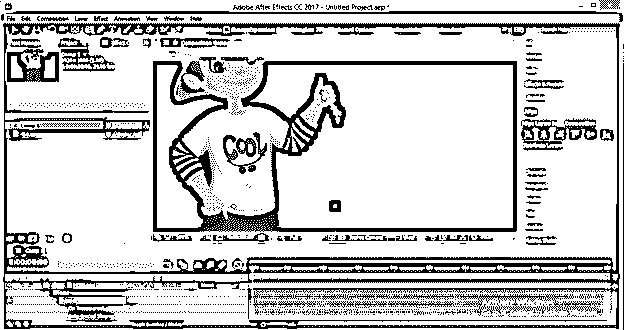

你可以通过放大来查看运动路径，并根据你的选择进行编辑。

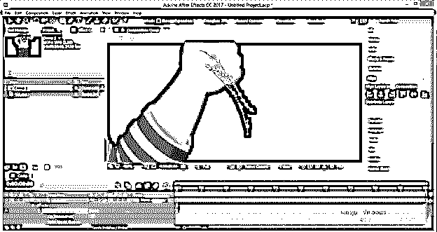

你可以在这个软件的时间线部分看到路径动画的关键点。

打开木偶的网格 1 选项，然后点击变形选项箭头按钮，你会发现你在你的角色上标记的所有大头针。您也可以像这样看到动画大头针的动画关键点。

现在播放这个动画，你会发现很好的手部动作。

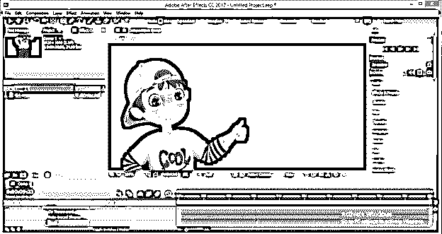

减少或增加关键点的时间帧，以增加或减少手部运动的速度。

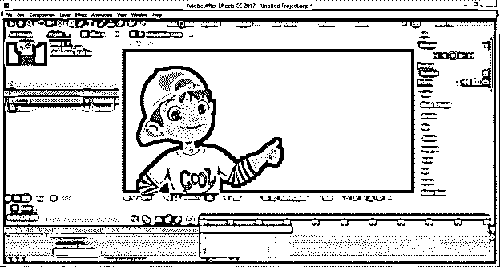

你可以做同样的事情来制作其他部分的动画。

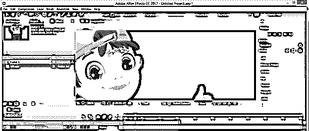

你可以在这个软件中用这个角色来制作卡通背景，以获得好的卡通动画。现在，通过这种方式，您可以在 After effect 中创建卡通人物并制作动画。

**结论**

现在，在这篇文章之后，你可以理解什么是卡通在 after effect 中，以及你如何在这个软件中处理卡通人物的创作和动画的不同参数。你可以通过练习来掌握后效的这个特性。

### 推荐文章

这是一个动画效果指南。在这里，我们讨论什么是动画后期效果，以及如何创建一个动画后期效果。您也可以看看以下文章，了解更多信息–

1.  [摩卡在后效](https://www.educba.com/mocha-in-after-effects/)
2.  [后效表情](https://www.educba.com/after-effects-expressions/)
3.  [特效渲染后](https://www.educba.com/after-effects-render/)
4.  [后效中的旋转观测](https://www.educba.com/rotoscoping-in-after-effects/)

