# After Effects 循环表达式

> 原文：<https://www.educba.com/after-effects-loop-expression/>

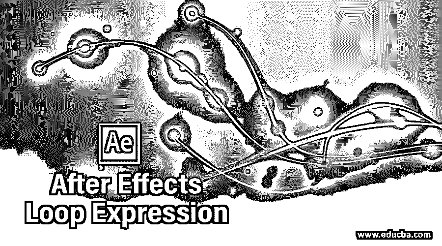

## After Effect 中的循环表达式介绍

循环表达式是一种 after effect 表达式，允许您重复、偏移和继续关键帧动画。我们使用 loopOut()作为循环表达式的语法。我们可以用这个表达式一次又一次地重复任何动画，而不用制作动画层的多个副本。您可以将此表达式应用于任何对象的任何属性，以动画显示该属性的继续、重复或乒乓模式。在这篇文章中，我们将讨论如何使用这个表达式和处理它的参数来获得动画的最佳效果，并学习如何在这个软件中使用表达式来节省时间。

### 如何在 After Effect 中使用循环表达式？

我们可以通过使用这个表达式的一些简单步骤来使用这个表达式，也可以学习这个表达式的语法意义，但在开始之前，我们应该看看这个软件的工作屏幕，这样在我们学习这个主题的过程中就不会出现问题。

<small>3D 动画、建模、仿真、游戏开发&其他</small>

在工作屏幕的顶部，有一个包含几个菜单的菜单栏。在这下面，我们有一个工具栏和一个活动工具的属性栏。在这个工具栏下面，我们有三个部分，例如在左侧，我们有项目面板和效果控制面板，在中心，有一个组成窗口，我们可以在其中看到我们当前的工作，在右侧，我们有一些参数的部分，如预览标签，对齐标签，效果和预设标签和其他一些。在这些部分下面，我们还有两个部分，位于该软件屏幕的下端，在左侧，右侧是图层面板和时间轴帧部分。您可以在工作屏幕的任何其他位置根据您的选择调整所有这些部分。

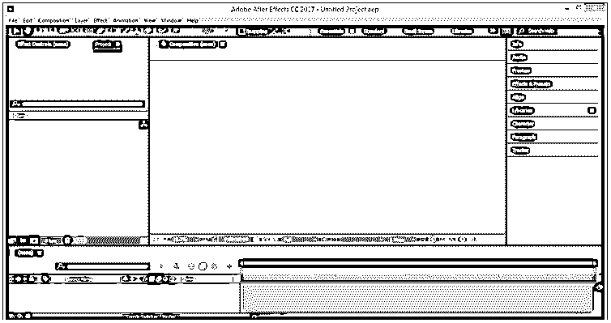

现在让我们来学习一篇新的作文。对于新组合，请转到菜单栏的组合菜单并单击它。从下拉列表中选择“新组合”选项，或者您可以按下键盘上的 Ctrl + N 按钮进行新组合。

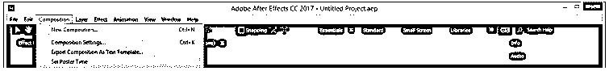

构图设置框将会打开。在合成设置框中进行所需的设置，并点击此对话框的确定按钮。

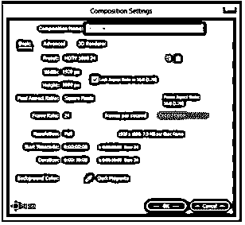

现在让我们为我们的学习做一个圆圈。对于圆，进入这个软件的工具栏，点击它的图标选择椭圆工具。

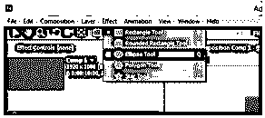

现在按住键盘上的 shift 键，用这个工具画一个任意半径和颜色的圆。

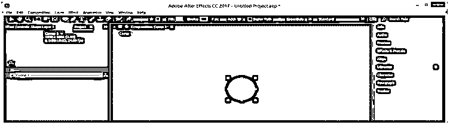

命名为圆。为了学习循环表达式，我将首先制作其 scale 属性的动画。所以为了这个圆形图层的 scale 属性，按下键盘的 S 键。

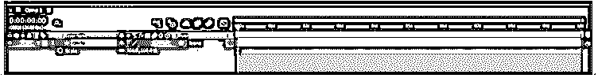

现在，我将单击缩放属性的秒表，在关键帧部分添加第一个关键点，然后我将关键帧播放头放置在大约 2 秒处，并将其缩放减少 50 %，以制作其缩放动画。

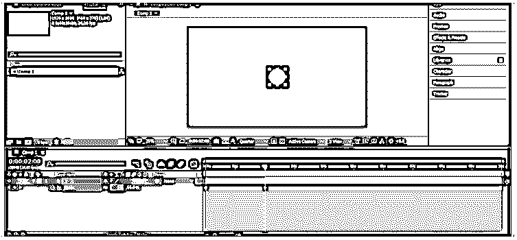

现在，如果你想一次又一次地重复这个动画，那么你可以做一件事，通过按键盘上的 Ctrl + Shift + D 按钮来剪切动画层的这一部分，然后通过按键盘上的 delete 按钮来删除多余的部分。

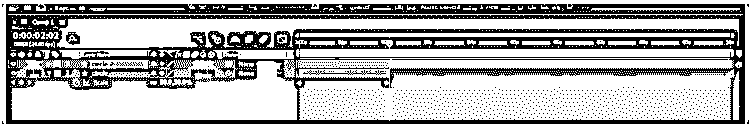

现在根据你想要的动画的重复次数，选择这个图层后，按 Ctrl + d 键复制这个图层。

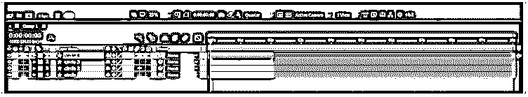

现在通过按键盘的 shift 键选择所有层，进入菜单栏的动画菜单并点击它。转到下拉列表的“关键帧助手”选项，并从新的下拉列表中选择“序列层”选项。

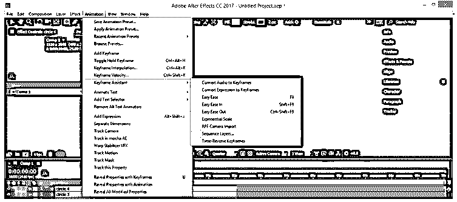

你选择的层将会像这样按顺序排列。

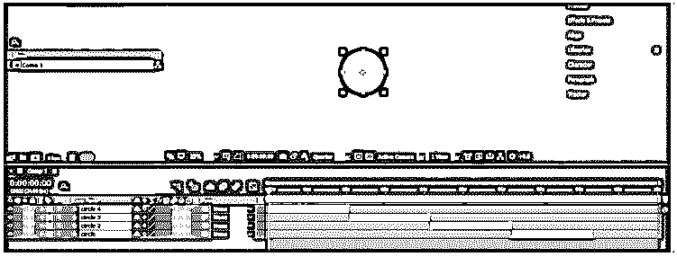

现在当你播放动画时，它会以重复模式播放。

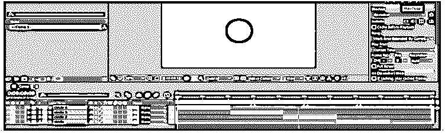

现在，如果你想节省时间，不想制作动画层的多个副本，那么你应该使用循环表达式。所以让我们来讨论一下。

按住关键帧部分中循环表达式框键盘上的 Alt 键，单击圆形图层的秒表缩放属性。

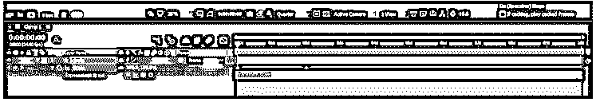

现在，在表达式框中键入循环表达式的语法 loopOut()，然后单击此框外的任意位置。

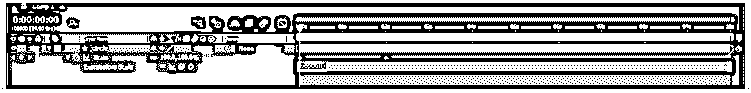

现在，当你播放这个圆形层的比例属性的动画时，它会一次又一次的循环播放。确保在循环表达式的语法中 O 应该是大写字母，否则表达式将不起作用。

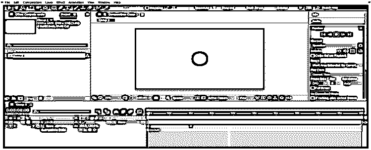

现在，如果您希望圆在某个时间变大，在另一个时间变小，则在圆图层的比例属性的表达式框中输入 loopOut("pingpong ")作为循环表达式的表达式。

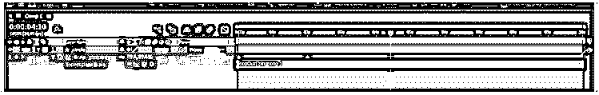

现在播放一下就能看到这个表情的效果了。

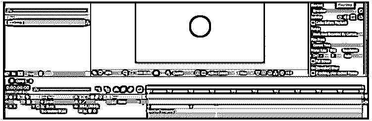

现在让我们对这个圆形图层的位置属性做些什么，按下键盘上的 P 键来设置这个图层的位置属性，并根据你的选择制作动画。我会让它变成这样。

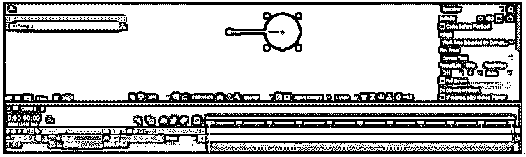

按住表达式框键盘上的 Alt 键，单击此图层位置属性的秒表图标。在框中键入 loop out(“cycle”)。

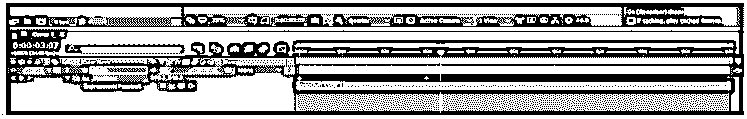

当你播放它的时候，你的动画位置也会按照这个语法在循环中一遍又一遍的重复。

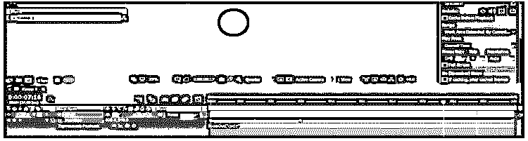

您可以在循环表达式的语法中键入 loop out(“Offset”)，它将在每个循环中使用最后一个关键帧来激活您的对象，这意味着您的对象将在每个循环中增加其运动路径。

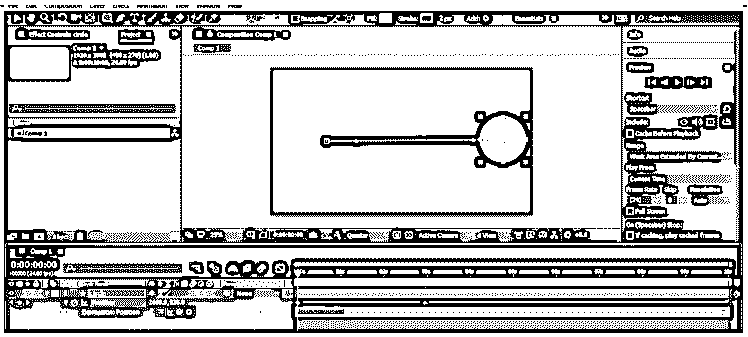

这样，在循环表达式的帮助下，您可以在循环的 after effect 中激活对象的任何属性。

### 结论

阅读完本文后，您可以很容易地理解什么是循环表达式，以及如何处理它的参数来理解它的语法。一旦你理解了这个表达的语法，你就可以很容易地用这个 after effect 的表达产生好的效果。你可以通过练习不同类型的后效表现来增加你的动画技巧。

### 推荐文章

这是一个后效应循环表达式的指南。这里我们讨论如何在 After Effect 中使用循环表达式及其步骤。您也可以看看以下文章，了解更多信息–

1.  [特效跟踪后](https://www.educba.com/after-effects-tracking/)
2.  [后效中的陷码](https://www.educba.com/trapcode-in-after-effects/)
3.  [后效表情](https://www.educba.com/after-effects-expressions/)
4.  [后效便携](https://www.educba.com/after-effects-portable/)

