# 余波光学耀斑

> 原文：<https://www.educba.com/after-effects-optical-flares/>

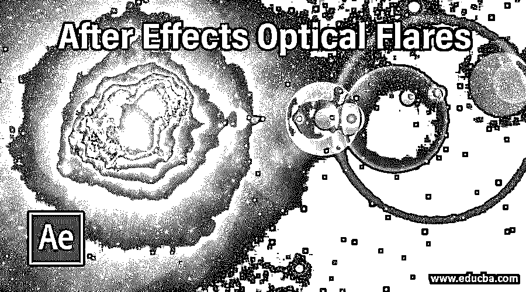

## 后效应光学耀斑介绍

光学耀斑是一个插件软件，它通过透镜创建光源扩散的效果，并给你一种光散射的错觉，使你的对象在项目工作的任何动画中发光。您可以创建一个非常美丽的灯光效果，如汽车前灯，灯光，任何光源，以及任何其他这种类型的物体使用光学耀斑在这个软件中。正如我们所知，光晕是 after effect 的插件软件，所以你必须从它的官方网站下载并安装它，以便在你的项目工作中使用。因此，在本文中，我们将通过一个示例来讨论使用光学耀斑的所有主要问题。

### Photoshop 中光学光斑怎么用？

光学耀斑是插件软件，所以在使用它之前，我们必须安装它，并将其文件夹放在 after effect 的插件文件夹中。一旦你安装了它，你就可以使用它，我会在这里告诉你如何使用它，但在我们开始讨论它之前，让我们看看这个软件的工作屏幕，以便我们更好地理解这一点。

<small>3D 动画、建模、仿真、游戏开发&其他</small>

该软件用户界面的最顶端是菜单栏，有几个菜单。在这下面，有一个工具面板，里面有一些重要的工具，可以帮助我们在这个软件中工作。在这个栏下面，我们在用户屏幕中有三个部分，例如在左侧有项目面板和效果控制面板，在中心我们有作为该软件的显示窗口的合成窗口，在右侧我们有一些重要的参数标签，如预览，库，效果和预设以及其他一些重要的标签。在这个部分下面，在用户屏幕的下部，我们在左侧有一个图层面板，在右侧有一个时间轴。

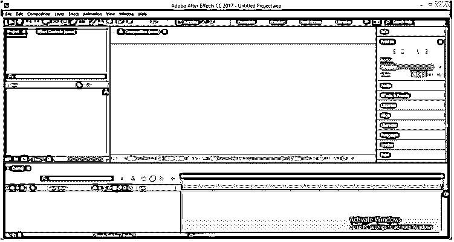

现在让我们从新作品的创作开始学习。对于新的组成，在该软件的项目面板区域中右键单击。将打开一个下拉列表，从这里选择新的合成选项。

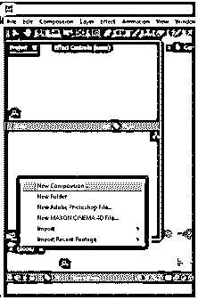

点击以上选项后，将会打开一个构图设置框。在这里为你的作文做你想要的设置，然后点击这个框的 Ok 按钮。

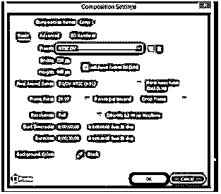

现在转到图层面板，然后右键单击。将打开一个下拉列表，转到列表的“新建”选项，然后从新的下拉列表中选择实体选项。我们正在制作一个固体层，因为你必须在固体层上应用光学耀斑才能使用它。

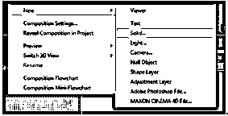

对实体层进行所需的设置，然后单击“确定”按钮。确保固体层的尺寸等于所选成分的尺寸。

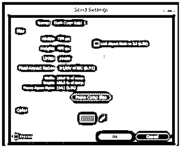

转到菜单栏的效果菜单并点击它。转到列表中的 Video Copilot 选项，并单击新下拉列表中的 Optical Flares 选项。

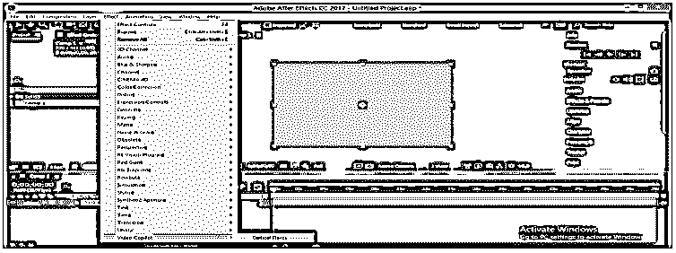

光学耀斑效应会在这样的固体层上出现。一旦你打开它，你会在这个软件的效果控制面板部分找到它的不同参数。

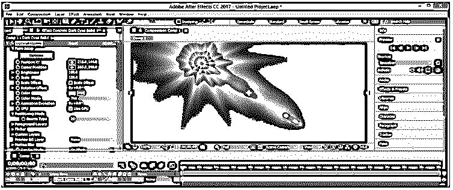

点击光学耀斑参数的选项选项卡，您会发现这种类型的窗口，其中有一些光学耀斑的预置。您还可以在这里管理光学耀斑的其他一些参数。只有当您可以访问此插件的完整版本时，您才能打开此预设窗口。

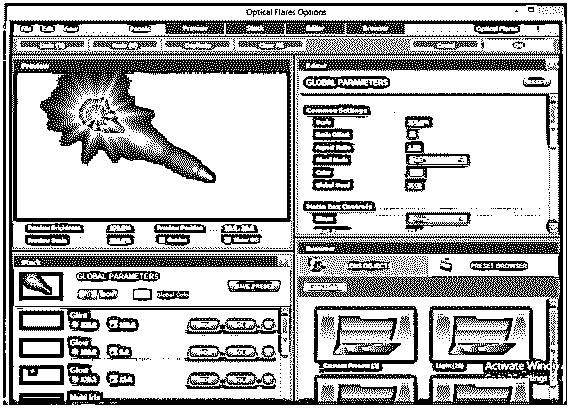

现在让我们用一个例子来理解一下。从工具面板中选择椭圆工具。

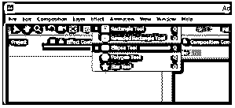

像这样在不同的层上做两个椭圆。

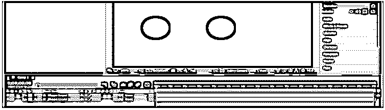

现在从列表中选择灯光选项，在图层面板中点击右键。

使用点光源，然后按下确定按钮。

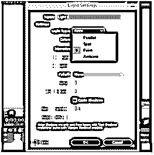

光线作用于 3d 图层，因此将两个形状图层都作为 3d 图层。

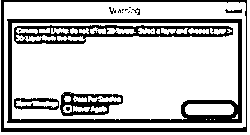

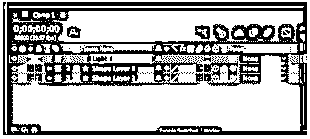

现在在第一个圆的中心调整这个光源。

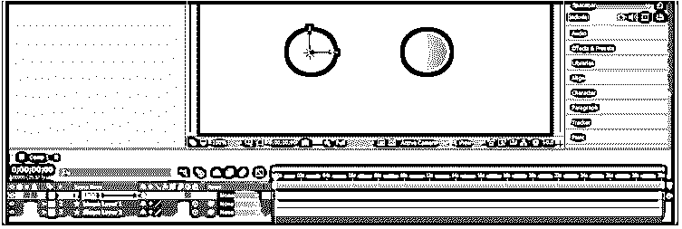

现在用和我们之前一样的方法来制作实体层，并根据你的需要来设置这个盒子。

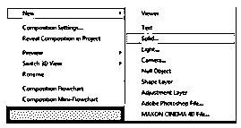

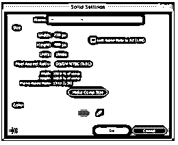

转到效果菜单并点击它。转到视频 Copilot 选项的下拉列表，并选择光学耀斑选项的新下拉 lsit。

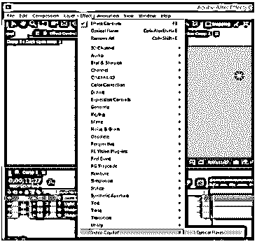

当光学耀斑打开时，点击它的参数的选项选项卡。这扇窗户将会打开。您可以从这里选择您想要的预设。

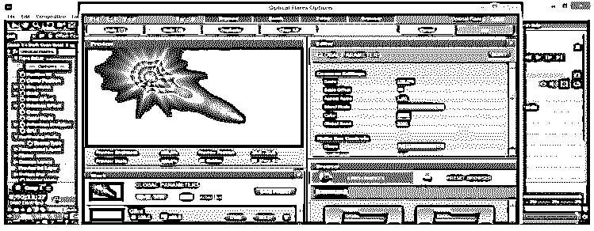

我将单击此对话框的运动图形文件夹。

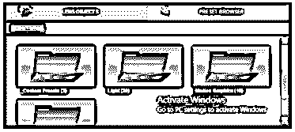

并从该文件夹中选择怪物耀斑预设。

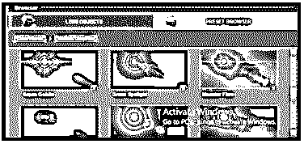

您将在此窗口中选择预设。

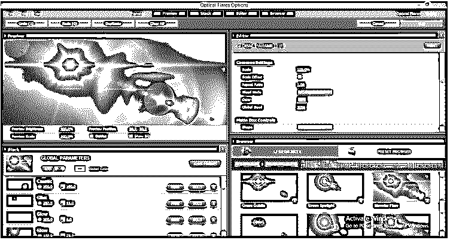

你可以通过减少它的发光选项的值来减少它的发光，完成后点击 Ok 按钮。

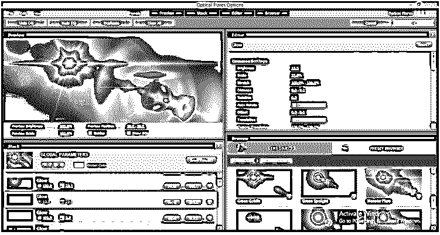

现在转到效果控制标签，点击源类型选项的下拉箭头按钮，然后选择跟踪灯光选项，将这个光晕效果附加到灯光层。

现在点击下拉箭头按钮的固体层，并选择添加选项从列表中添加这个耀斑效果与您的组成。

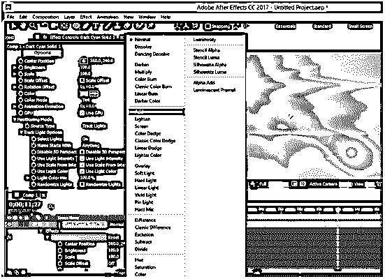

光学耀斑会像这样增加。这是一个非常好的光源效果。你可以使用它作为任何汽车动画的前灯，任何光源，以及许多其他用途。

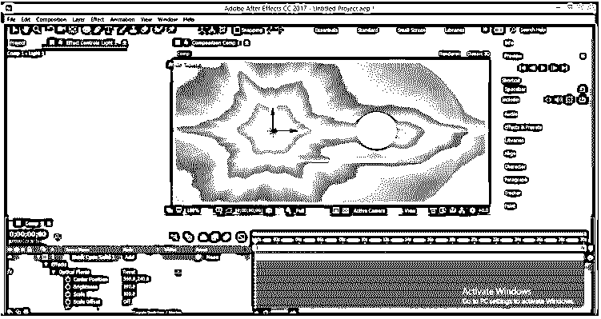

您可以通过降低实体层的不透明度来降低光学眩光的不透明度，从而最大限度地减少光晕效果。

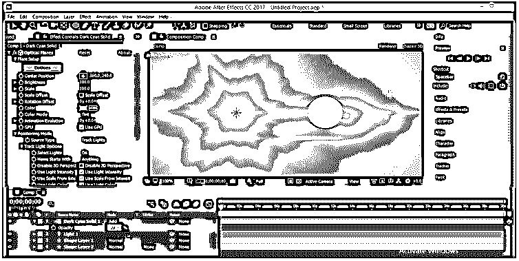

复制固体层和轻层，然后将它们拖动到第二个圆。你将有两个大灯效果灯这一点。您可以根据自己的选择，从光学耀斑参数的亮度选项中降低它们的亮度。

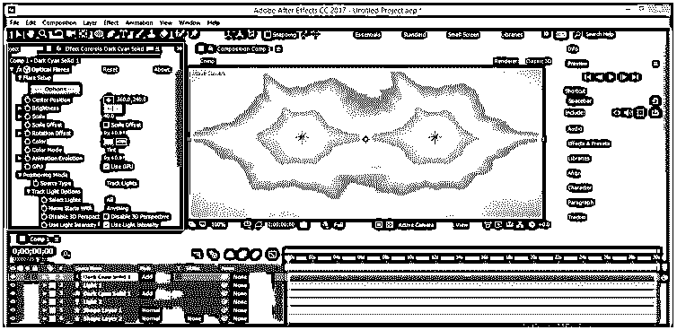

您可以从光斑参数的颜色选项中更改灯光的颜色。

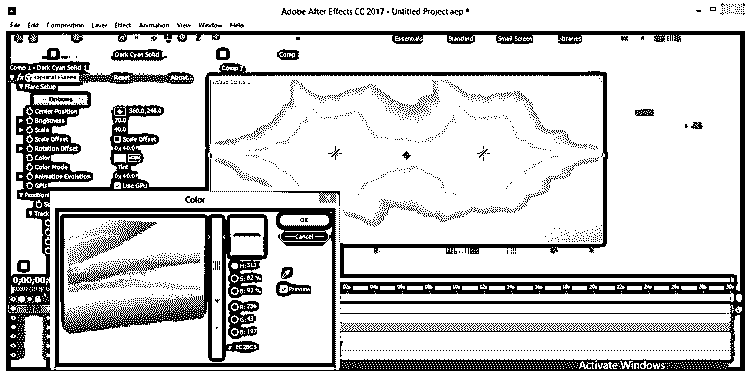

降低两个形状层的不透明度可以忽略真实的光源效果。我会把它降低 10%。

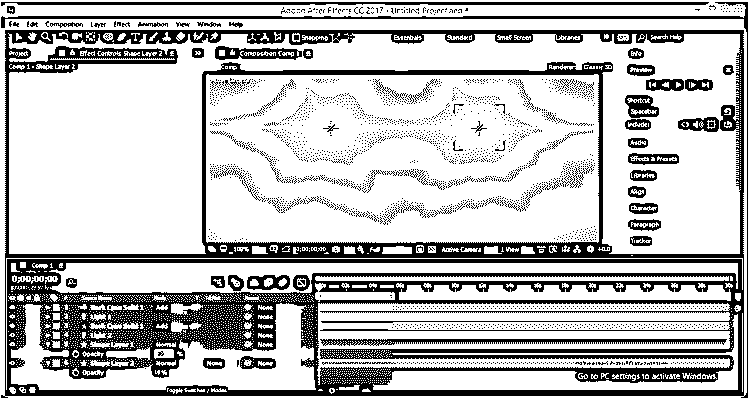

你可以根据自己的喜好来制作这个光源的动画，这样你就可以在特效中使用光学光斑。

### 结论

现在看完这篇文章后，你可以理解什么是光晕，以及你如何处理它的参数来创造一个好的光源效果。你可以从这篇文章中得到灵感，运用你的想法，通过 after effect 的这个特性来制作好的效果。

### 推荐文章

这是一个关于光学耀斑后效应的指南。这里我们通过一个例子来讨论如何在 Photoshop 中使用光晕以及使用光晕的所有主要事项。您也可以阅读以下文章，了解更多信息——

1.  [后效时间线](https://www.educba.com/after-effects-timeline/)
2.  [Duik After Effects](https://www.educba.com/duik-after-effects/)
3.  [特效渲染后](https://www.educba.com/after-effects-render/)
4.  [后效便携](https://www.educba.com/after-effects-portable/)

