# 在效果后发光

> 原文：<https://www.educba.com/glow-in-after-effects/>

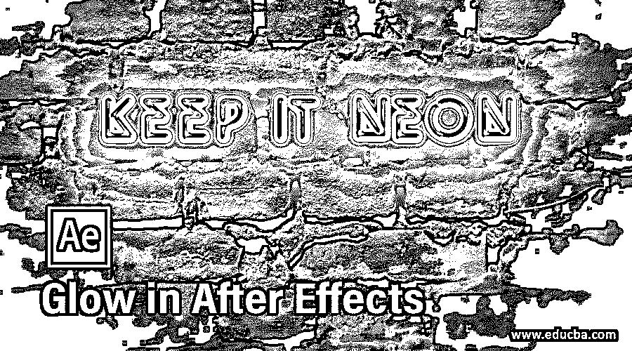

## 余光效果简介

Adobe After Effects 是一款动画和视频编辑软件，在本文中，我们将学习如何创建发光效果。为此，首先，我们将看看内置的发光效果，然后我们将从各种效果和插件的使用创建一个自定义的发光效果。

### 余光效果的步骤

下面是下面提到的步骤

<small>3D 动画、建模、仿真、游戏开发&其他</small>

#### 第一步

在开始更好地理解之前，让我们先熟悉一下界面。顶部是菜单栏，如文件、编辑等。每个都有自己的子菜单。接下来，就在它的下面，我们有一个工具面板和它们的属性。在左侧是项目面板，由项目文件和效果控制面板组成，显示应用于特定层的效果。然后是显示动画或视频预览的合成面板。在右上角，我们有各种布局预设，将根据工作类型进行排列。我们甚至可以创建自己的自定义布局。右边是用于编辑视频的各个部分。在底部，有层和时间轴面板，用于添加媒体和添加动画关键帧。

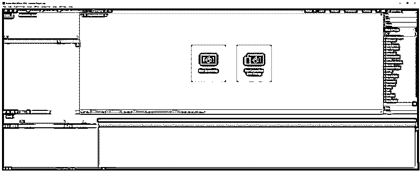

#### 第二步

双击项目面板导入视频素材。这是一个舞蹈视频，我们将添加一个发光效果。

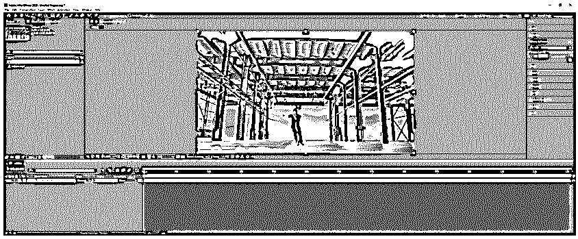

#### 第三步

接下来，右键点击图层面板创建一个实体，命名为 Light，颜色设置为黑色。

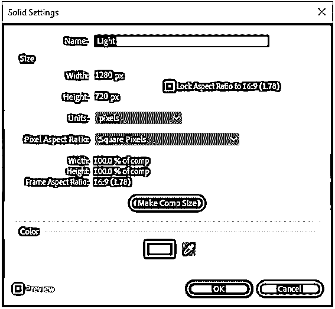

现在隐藏固体层，双击视频，现在我们处于层编辑模式，因为我们可以看到它有自己的时间线，改变它不会改变主时间线。然后打开画笔面板，从窗口->画笔，然后选择画笔工具或按 Ctrl + B。在画笔面板中，我们选择一个软轮 5 像素画笔。同样，打开窗口->绘画中的绘画面板并选择颜色。设置模式为正常，通道为 RGBA，因为我们也将得到阿尔法通道输出和持续时间为一个单一的框架。

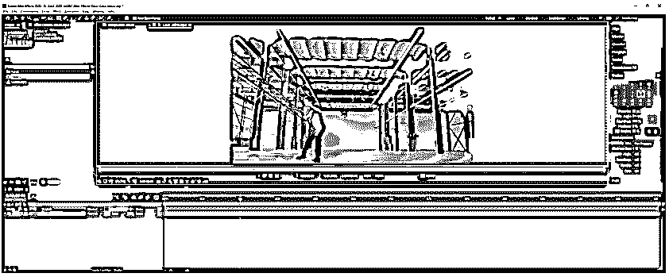

#### 第四步

让我们将当前时间指示器移动到大约 5 秒标记处，我们开始这个效果，我双击图层面板使其全屏显示，在笔刷动态部分，我们已经将大小和流量设置为钢笔压力，因为在这个例子中我们使用的是图形表。如果你没有一个可以用鼠标创建的图形输入板，在这种情况下，根据笔刷设置来设置动态是没有关系的。

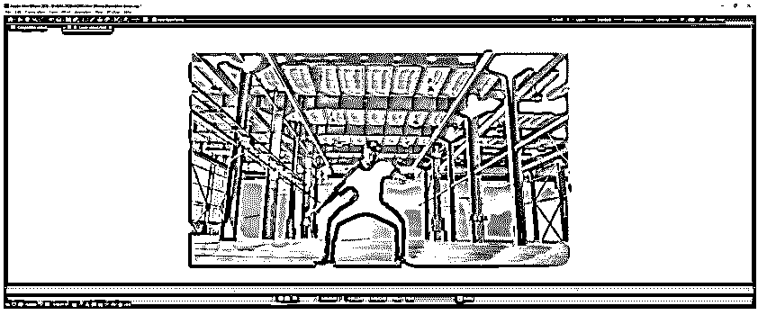

#### 第五步

我们已经创建了一个如图所示的笔触。现在，我们将围绕人物的边缘创建类似的笔画，但我们将通过按 Ctrl 和右箭头键来更改帧。

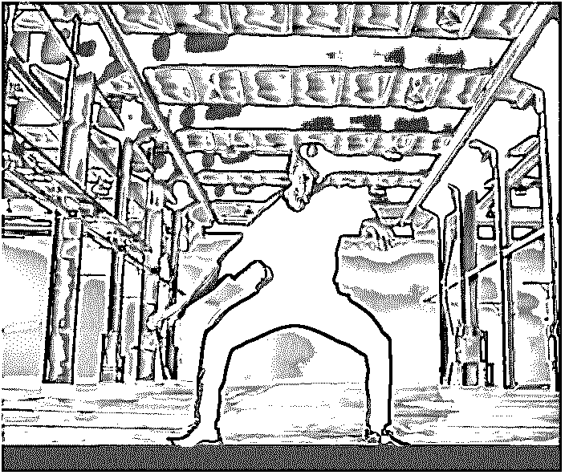

#### 第六步

我们在不同的帧中创建了不同的笔画，其中一些如图所示。

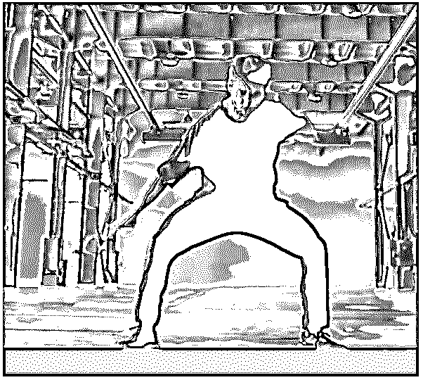

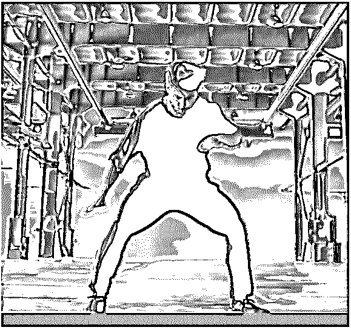

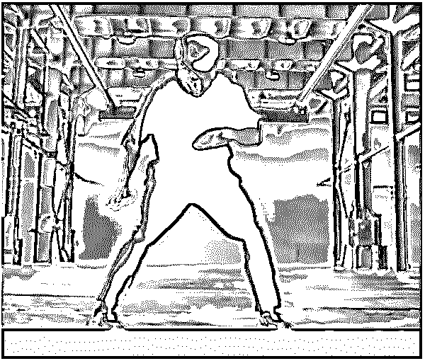

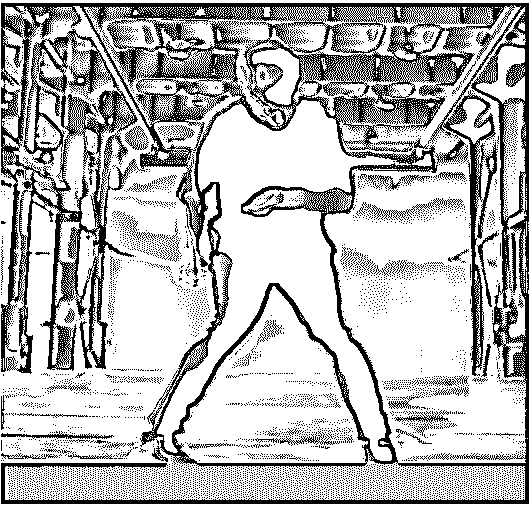

#### 第七步

然后我们改变颜色，前面几帧我们已经创建了如图所示的笔画。

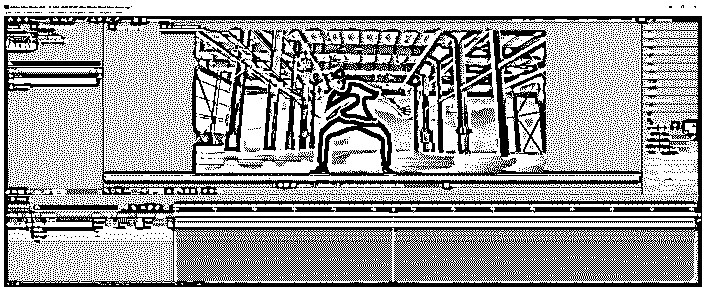

#### 第八步

然后，我们将使用另一种颜色显示手的运动，并在几帧中这样做，同样，我们可以在整个视频中这样做。

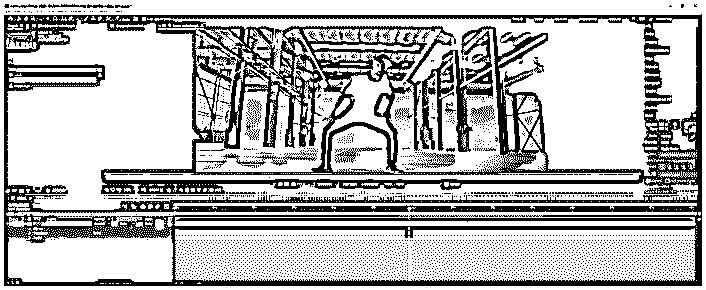

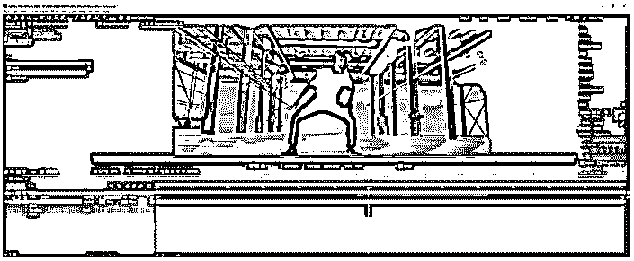

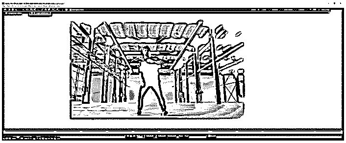

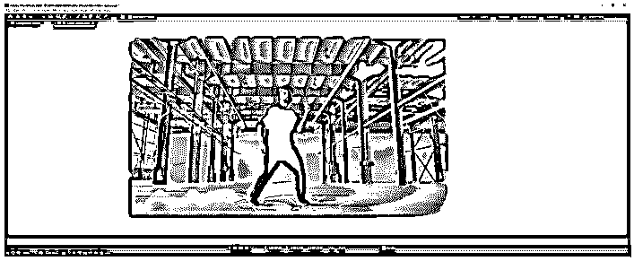

#### 第九步

接下来，我们将退出层编辑模式，在我们的主构图中，我们将从视频层剪切效果并粘贴到实体层，确保播放头在第一帧，现在我们可以看到效果只在实体上。

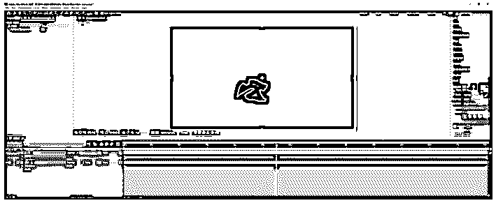

#### 步骤 10

改变灯光层的模式从正常到屏幕，并从效果菜单中添加一个光晕效果，这是风格化的。

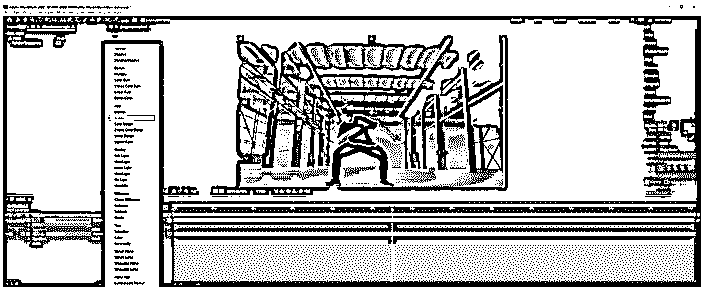

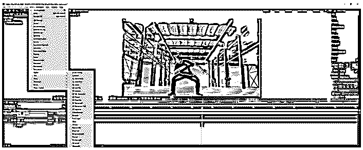

#### 步骤 11

现在让我们了解发光效果的各种参数，首先，我们将发光强度更改为 3.0，正如我们所见，线条变得更粗了。

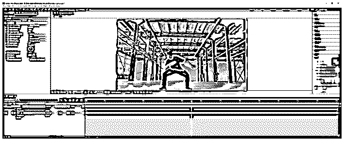

#### 第 12 步

接下来，我们改变发光半径为 20.0，这给了一个光晕效果

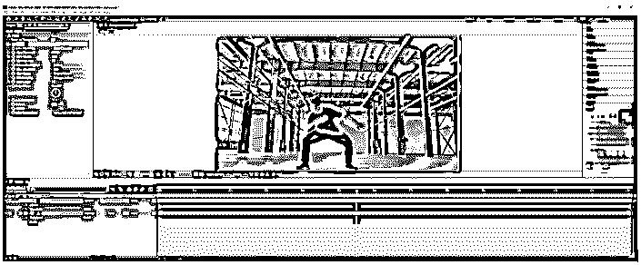

#### 步骤 13

接下来，将流动尺寸更改为水平，以获得不同的效果。

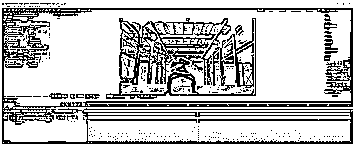

#### 第 14 步

接下来，我们将看看如何从除光晕以外的效果创建自定义光晕。为此，我们将使用 illustrator 文件，并通过在图层面板中拖动它来创建构图。

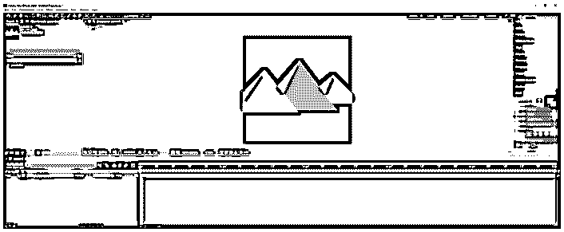

#### 第 15 步

然后复制层，然后从效果和预设面板添加快速框模糊，设置模糊半径为 18.0，迭代为 4，设置模式为添加，这将创建一个很好的发光效果

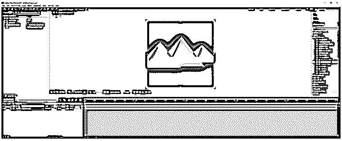

#### 步骤 16

现在我们将看到使用一个名为 Saber 的插件来创建一把光剑。我们已经导入了素材并创建了一个构图。然后创建了一个实体，并在实体上拖动 saber 效果，并将模式设置为添加。

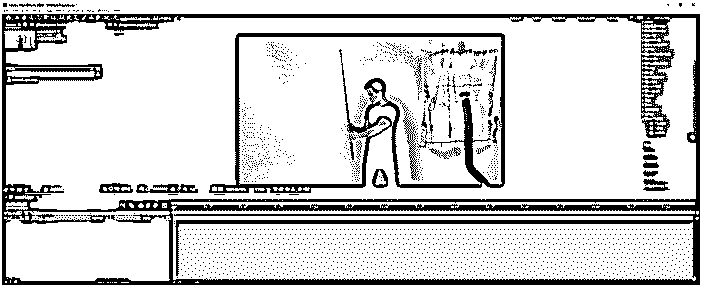

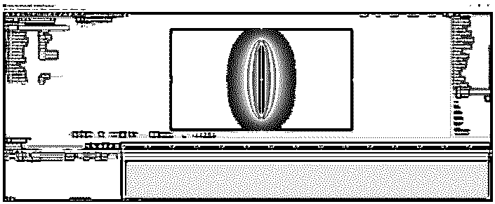

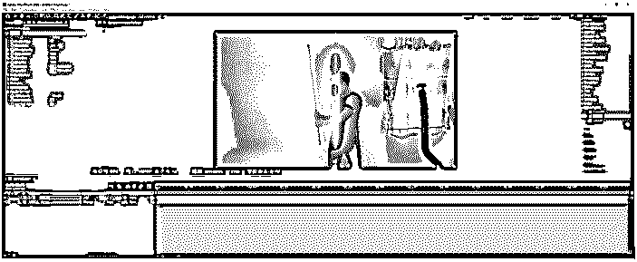

#### 第 17 步

然后将军刀与棍子对齐，并将运动模糊设置为关闭，将关键帧设置为核心开始和结束，并将纯黑色修剪为大约 2 秒。

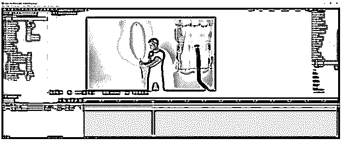

#### 步骤 18

然后一帧一帧地不断调整核心结束到处理开始，并减少工作面积。

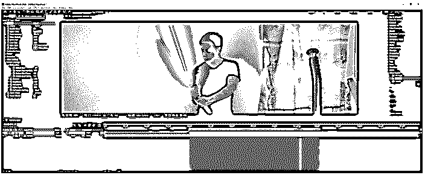

#### 步骤 19

类似地，现在开始逐帧调整核心开始

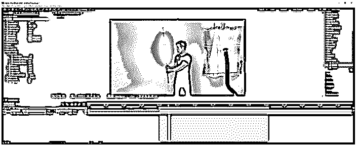

#### 第 20 步

在完成核心的逐帧调整后，从“合成”菜单或按 Ctrl + Shift + X 开始“修剪补偿至工作区域”

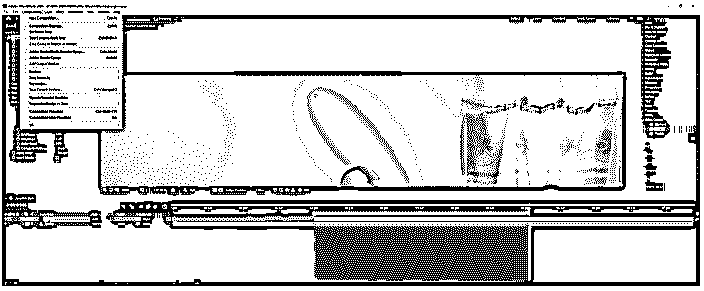

#### 步骤 21

现在我们可以从效果和预设面板中为 saber 选择各种预设。我们也可以改变颜色。

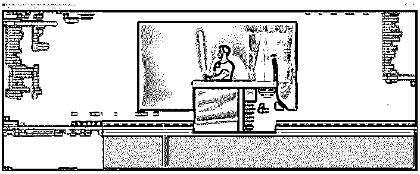

#### 第 22 步

现在让我们看看各种参数，对于硬核效果，我们已经设置强度为 50%

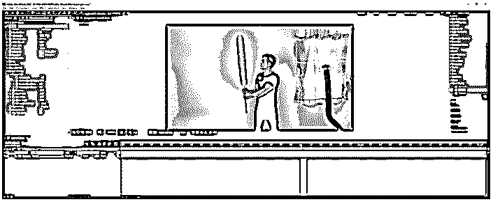

#### 步骤 23

然后，我们改变传播为 0.60，减少辉光。

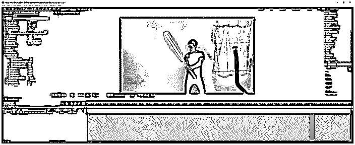

#### 第 24 步

然后，我们改变闪烁强度和闪烁速度，使闪烁产生辉光。同样，我们可以通过其他设置来获得所需的效果或咒语。

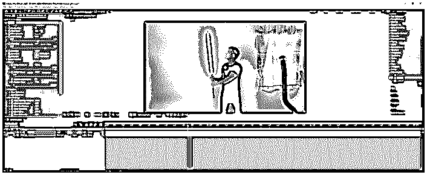

### 结论

在这篇文章中，我们不仅学习了如何在 After effects 中使用默认的光晕效果，还学习了如何创建自定义的光晕效果。除此之外，我们已经看到了如何使用一个插件来实现一个很酷的剑光效果，就像在星球大战中一样。

### 推荐文章

这是一个指南发光后的效果。在这里，我们讨论如何使用默认的辉光效果，以及适当的步骤。您也可以看看以下文章，了解更多信息–

1.  [后期特效中的变形](https://www.educba.com/morphing-in-after-effects/)
2.  [在特效之后抽动](https://www.educba.com/twitch-in-after-effects/)
3.  [后效粒子](https://www.educba.com/after-effects-particles/)
4.  [Logo 展示后效果](https://www.educba.com/logo-reveal-after-effects/)

