# 后效运动跟踪

> 原文：<https://www.educba.com/after-effects-motion-tracking/>

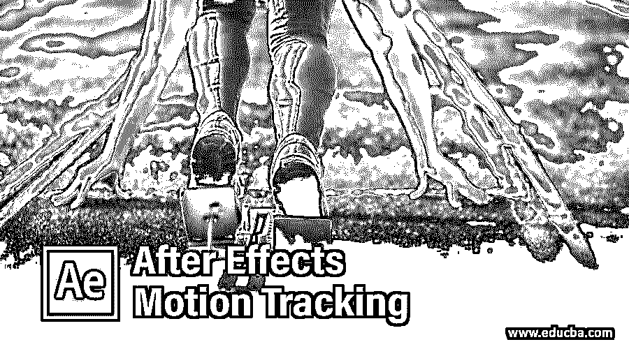

## After Effects 运动跟踪简介

Adobe After Effects 是一款动画和视频编辑软件，在本文中，我们将了解它如何用于运动跟踪。我们将深入探讨如何使用跟踪方法，将任何层或对象与视频中的一个点连接起来，并在整个视频中逐帧跟踪该点，以便我们可以使用它来显示视频镜头的附加信息。可以分析许多参数以获得可能的最佳结果。

### 如何使用 After Effects 进行运动追踪？

下面是下面提到的步骤:

<small>3D 动画、建模、仿真、游戏开发&其他</small>

#### 第一步

在开始更好地理解之前，让我们先熟悉一下界面。顶部是菜单栏，如文件、编辑等。每个都有它的子菜单。接下来，在它的正下方，我们有一个工具面板及其属性。在左侧，有一个由项目文件组成的项目面板和一个显示应用于特定层的效果的效果控制面板。然后是显示动画或视频预览的合成面板。在右上角，我们有各种布局预设，将根据工作类型进行排列。我们甚至可以创建自己的自定义布局。右边是用于编辑视频的各个部分。在底部，有层和时间轴面板，用于添加媒体和添加动画关键帧。

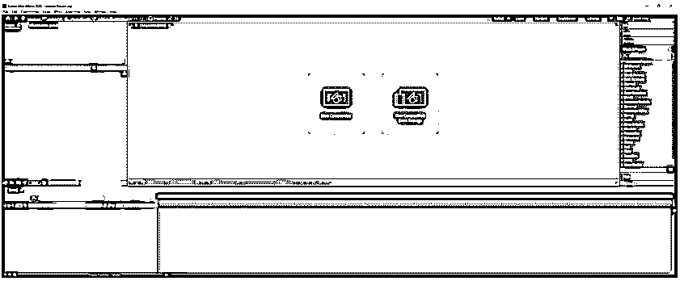

#### 第二步

要打开视频，请在项目面板中双击以导入视频

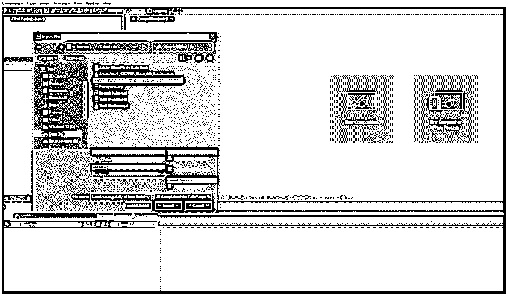

#### 第三步

从选择中创建构图，并将构图重命名为点线

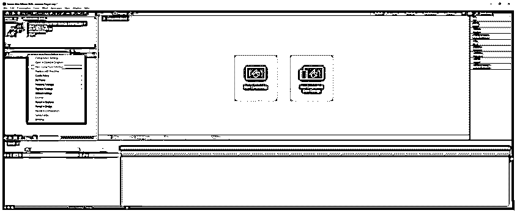

#### 第四步

我们有了视频，我们想做的是用一些文字指向建筑的一扇窗户。

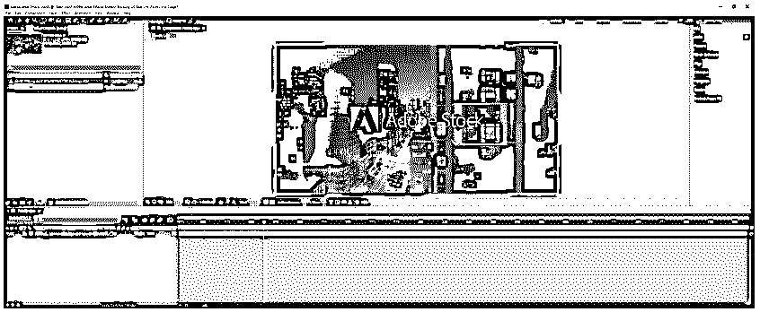

#### 第五步

现在，我们将创建一个矩形或按 Q 并拖动一个方框，如图所示，但请确保您不要选择视频，否则它会创建一个遮罩。

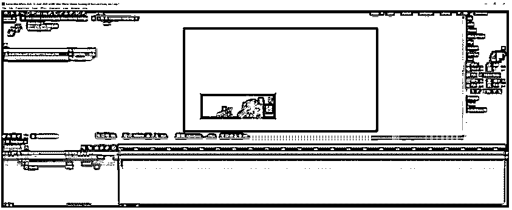

#### 第六步

所以，点击关闭视频拖动矩形。设置填充为黑色，描边为无。对于形状层设置不透明度为 75%。要仅选择不透明度，请在选择图层时按 T 或 transparency。

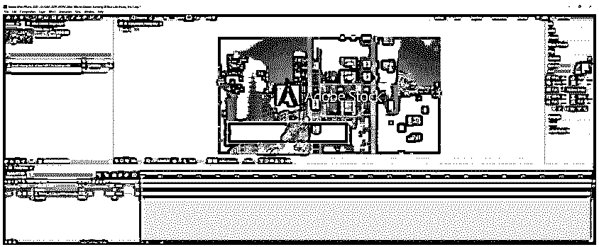

#### 第七步

使用水平文字工具或按 Ctrl + T 并单击排版，然后添加文字，如图所示。字体设置为 Museo Slab

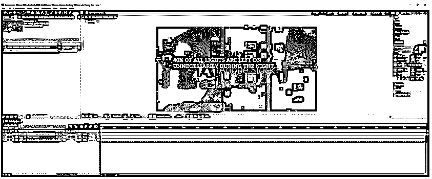

#### 第八步

调整并移动文本，使其适合我们创建的矩形。您可以从“字符”面板中更改字体大小。

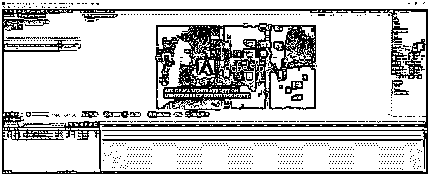

#### 第九步

接下来，使用钢笔工具或按 G 键创建一条从文本到建筑的一个窗户的线。设置笔画为 5px，颜色为灰白色。

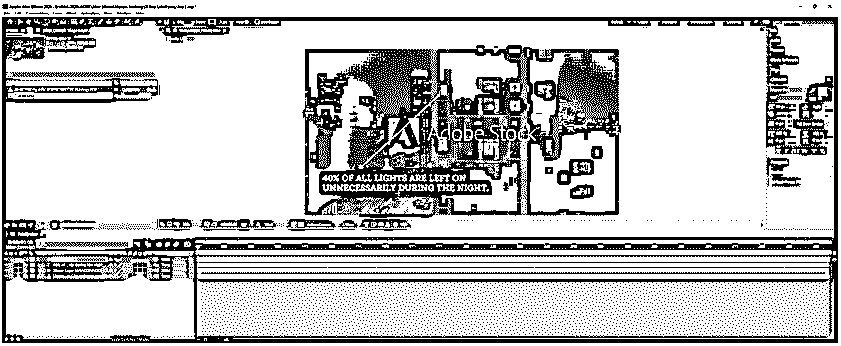

#### 步骤 10

我们可以看到，通过按空格键预览后，文本和线条停留在同一个地方，所以我们必须使用运动跟踪动画

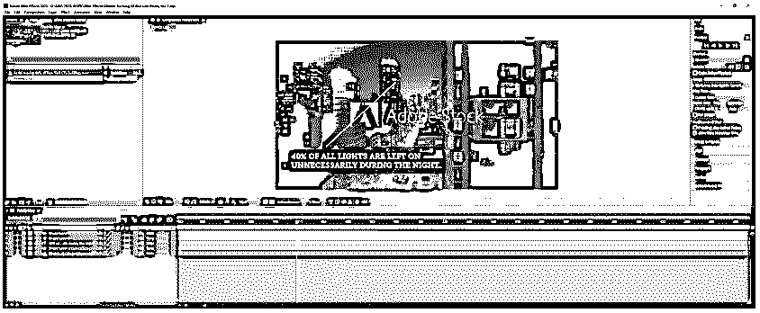

#### 步骤 11

现在，我们将动画线的路径，我们重命名为钢笔。为此，将时间轴移动到开头，并设置路径关键帧。然后将时间线移动到窗口消失时。使用钢笔工具拖动顶点，如图所示。

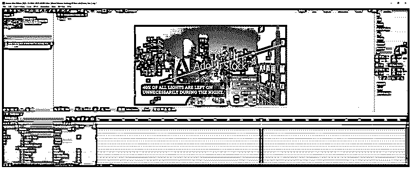

#### 第 12 步

接下来，我们将排版裁剪到工作区域。因此，我们已经使用路径工具完成了运动跟踪。氖

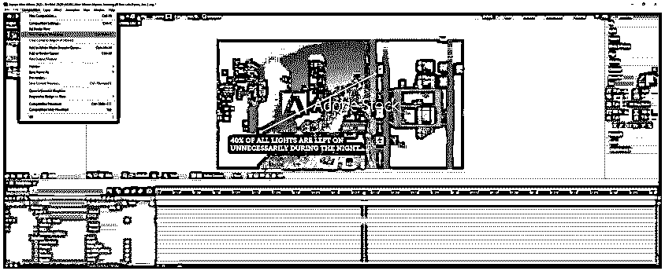

#### 步骤 13

现在，我们将使用内置的运动跟踪功能，我们将使用以下镜头，并从中创建构图。进入窗口->跟踪器，点击跟踪运动，这将打开图层面板，你会得到一个跟踪点。

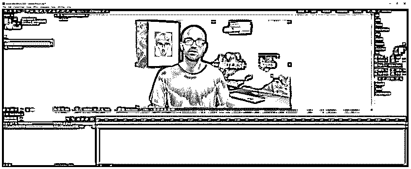

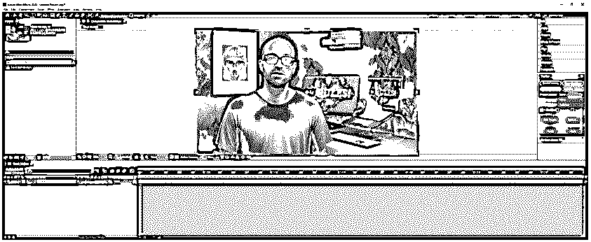

#### 第 14 步

使用选择工具，使方块更大，在这个镜头中，我们将跟踪人的右眼镜点。所以，把点排成一行，如图所示。

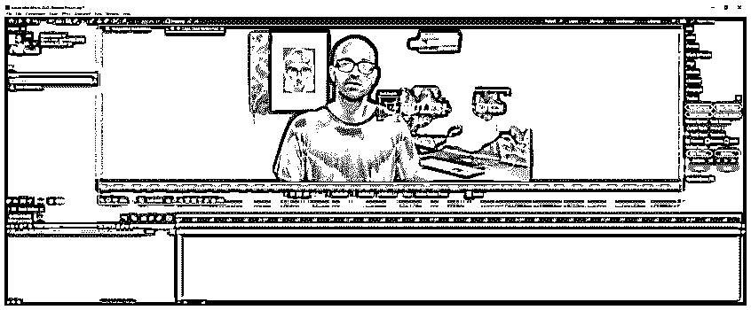

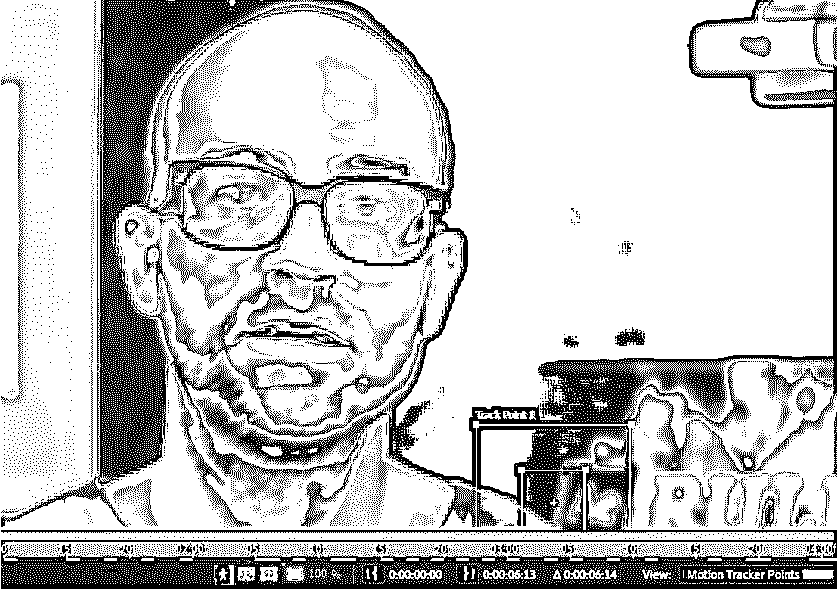

#### 第 15 步

有两个框，外面的一个是 after-effects 搜索跟踪点的通用区域。它应该根据点的运动范围来保持。如果我们保持它太大，那么整个区域将在每一帧被扫描，这将是非常系统的要求。当头部移动时，内部的盒子将跟踪特定的东西，在这种情况下是玻璃和边缘。此外，在点上设置跟踪标记。

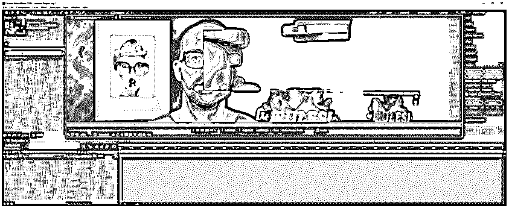

#### 步骤 16

现在，在追踪器面板中，您可以开始分析，但是首先，我们已经单击了向前分析 1 帧。

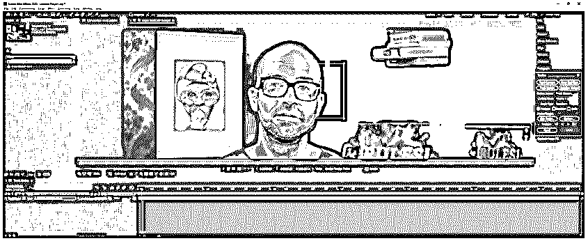

#### 第 17 步

现在我们正在逐帧分析，跟踪点保持在该位置。如果没有，那么你必须调整矩形到脸的其他部分。

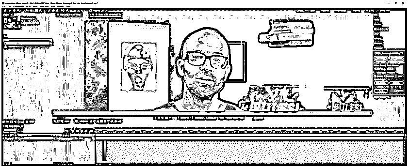

#### 步骤 18

选择向前分析，这将需要一些时间，所以放松一下或喝点咖啡。我们得到了所有的跟踪点。现在我们将附加一个空对象，这样我们就可以将我们的语音气泡附加到它上面。

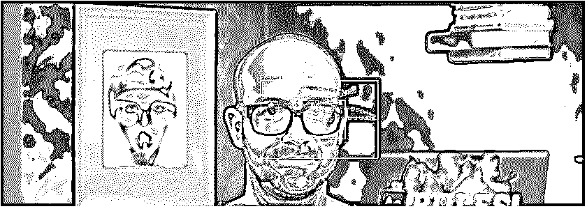

#### 步骤 19

我们在图层面板中创建一个空对象，跟踪器编辑目标为空，然后应用于 X 和 y。

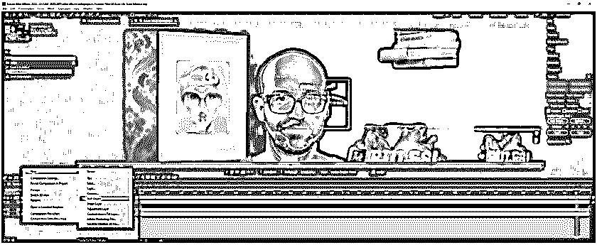

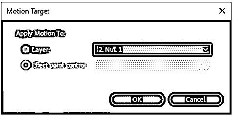

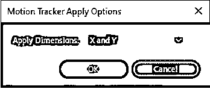

#### 第 20 步

现在我们可以将任何文本或图形附加到这个空对象上。我们将导入一个在 adobe illustrator 中制作的语音气泡。

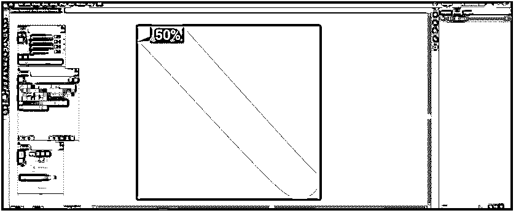

#### 步骤 21

将 Speech Bubble.ai 文件拖到我们的主构图上，并调整它在头部附近的位置，如图所示。

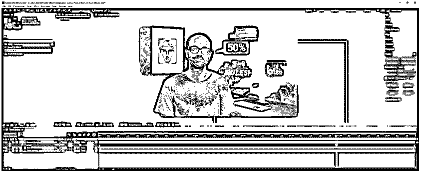

#### 第 22 步

现在，我们必须将图形嵌套在空对象下，为此，我们将使空对象成为图形的父对象，如图所示。

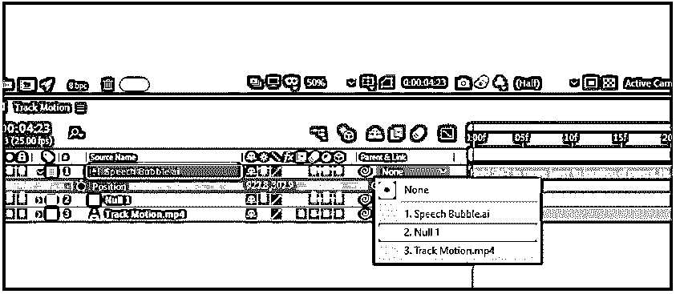

#### 步骤 23

最后，预览视频和语音气泡遵循跟踪点路径，这是 adobe after effects 中的运动跟踪。

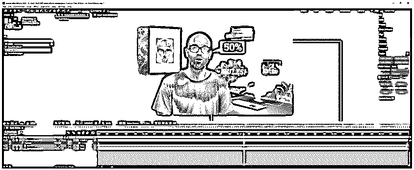

### 结论

在本文中，我们不仅学习了如何使用 Adobe After Effects 的内置运动跟踪器功能，还学习了为线条的路径属性设定关键帧以实现运动图形动画的技术。除此之外，我们还学习了如何将对象父化为空对象。

### 推荐文章

这是一个关于运动跟踪效果的指南。在这里，我们讨论了使用运动跟踪后的效果的步骤，以及截图，以便更好地理解。您也可以看看以下文章，了解更多信息–

1.  [后效时间线](https://www.educba.com/after-effects-timeline/)
2.  [特效跟踪后](https://www.educba.com/after-effects-tracking/)
3.  [丛后效应](https://www.educba.com/plexus-after-effects/)
4.  [特效后按键灯](https://www.educba.com/keylight-in-after-effects/)

