# 后效动态印刷

> 原文：<https://www.educba.com/after-effect-kinetic-typography/>

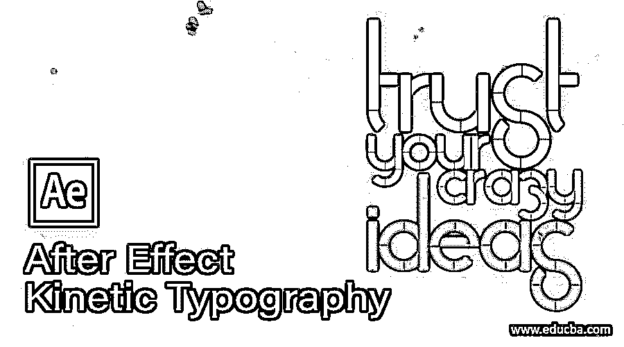

## 后效动态印刷介绍

after effect 中的动态排版是一种排版类型，通过这种排版，您可以在 After Effect 的不同层中使用您自己的音频或任何其他音频文件以非常有效的动作动画来排列文本。为了在这个软件中创建动态排版，我们必须对文本参数、时间轴参数、图层参数和音频文件参数进行一些安排。因此，在本文中，我们将讨论这个软件的不同功能，以获得关于这个主题的知识。我们将通过一个使用文本的一些颜色管理参数在不同层上创建不同文本的例子来理解它。

### 如何在 After Effect 中做动态排版？

我们可以按照一些重要的步骤在这个软件中进行动态印刷。但是在开始之前，你应该了解这个软件的用户界面，这样你就可以理解我们在学习这个主题时会用到的这个软件的不同术语。所以让我们看看这个软件的用户界面。

<small>3D 动画、建模、仿真、游戏开发&其他</small>

在工作屏幕的顶部，有一个菜单栏，其中有不同类型的菜单，如文件菜单，编辑菜单，合成菜单，以及其他一些。在这个菜单栏下面，我们有一个带有属性栏的工具栏。在这个工具栏下面，我们有三个部分，在左侧，我们有一个项目面板和效果控制面板，在中心，有一个显示窗口，我们可以在其中看到我们当前的工作，在右侧，我们有一些参数选项卡，用于进行一些参数的安排。在此屏幕的下方，我们有两个部分，左侧是图层面板，右侧是时间轴帧部分。

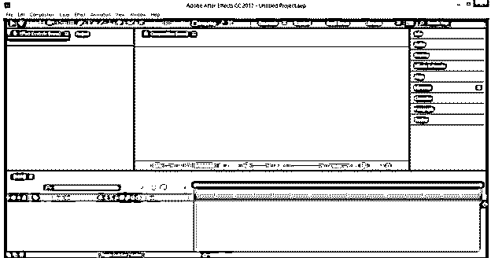

现在让我们为学习这个话题做一篇新的作文。对于新组合，请转到菜单栏的组合菜单并单击它。从列表中选择新合成选项。

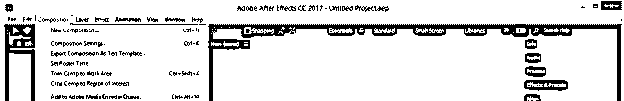

在构图设置框中进行所需的构图设置。

现在，我们需要一个音频文件或视频文件，我们希望这个过程的声音或语音。因此，请转到您保存它的文件夹，并将其拖动到该软件的项目面板区域，以便将其放置在该软件中。

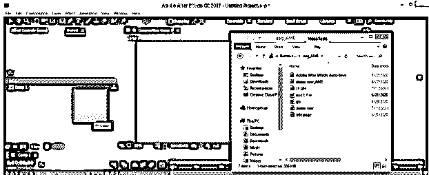

将此文件拖到图层面板区域。

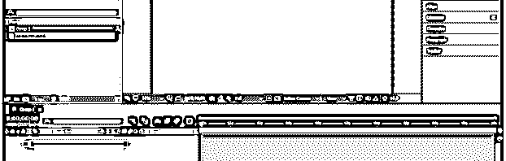

我将通过点击这一层的眼睛按钮关闭显示这个文件，因为我只需要这个文件的声音。现在按两次 L 键来查看文件的声音波形。

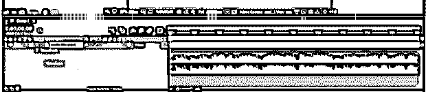

调整工作区域，从您想要启动排版动画的声音帧开始。

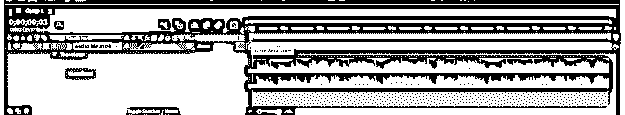

现在，调整声音帧处的工作结束区域，您要在此处停止字体动画。

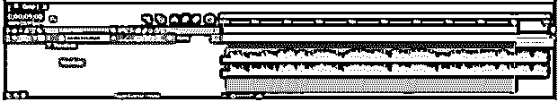

现在右击工作区，选择列表中的“修剪构图到工作区”选项。

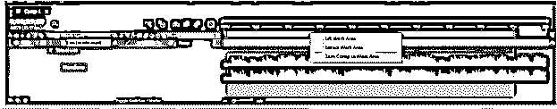

现在你可以在你选择的领域工作了。

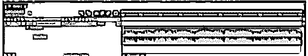

现在让我们使用文本工具来输入我们的文本。

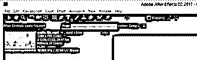

我们将在不同的层中键入句子中的单词，因此键入句子的第一个单词，并按下键盘上的 Ctrl + enter 按钮来完成这个单词。

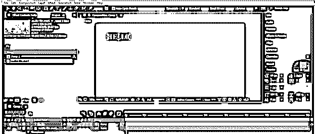

现在点击写作窗口区域，在新的图层中输入下一个单词。

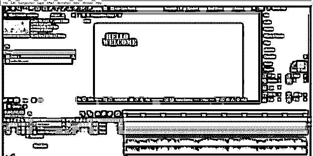

对句子中的所有单词重复这个步骤。

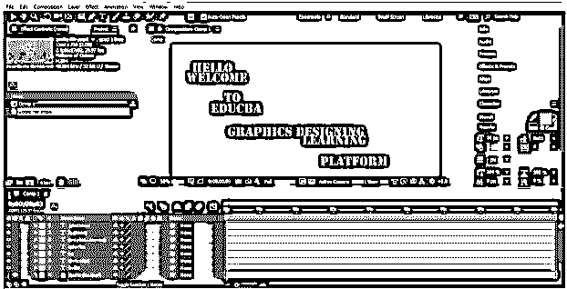

现在按下 Ctrl + R 按钮，为周围的组成窗口区域的标尺。

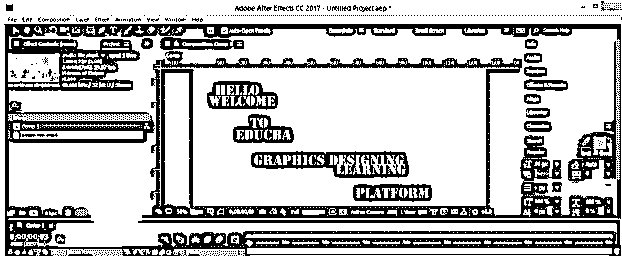

现在，从标尺的垂直和水平方向拖动参考线，创建一个框，我将在其中排列我的文本，使这些文本具有良好的排版效果。

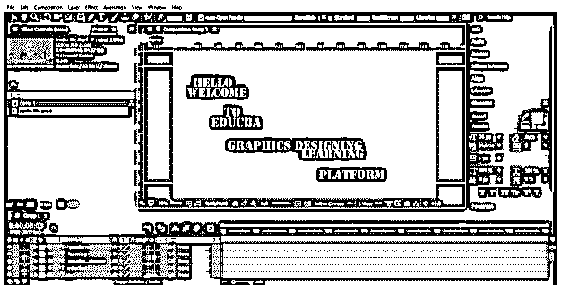

根据你的想法调整这个框中的文本。我会像这样设置它。

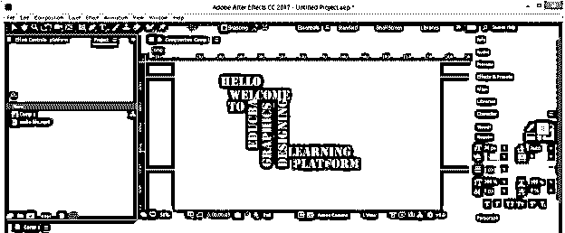

现在，我将使一些字变小，一些变大，以给它一个有效的外观。

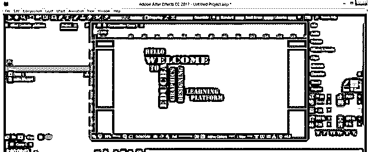

我还会改变一些文字的颜色，就像这样。你可以按照你的想法去做。

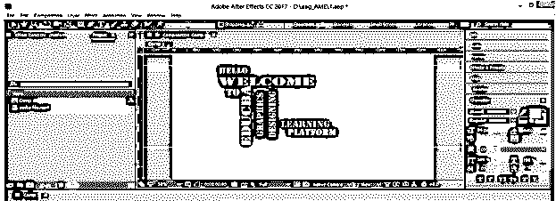

现在选择第一个单词的层，将播放头放在你想要开始这个单词的音频帧上，然后按 Alt + [从你选择的帧开始这个层。

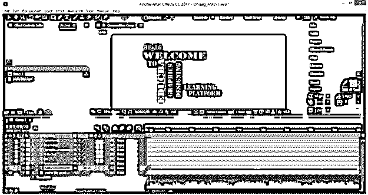

现在将播放头放在下一个单词的下一个音频帧，按 Alt + [从这一帧开始播放这一层。

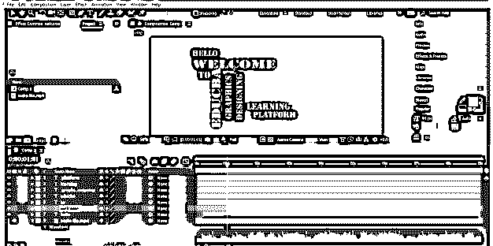

对这个句子的每个单词做同样的动作。

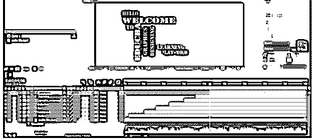

现在，我们将为这些文本添加一个空对象来制作动画。因此，对于空对象，进入图层菜单，然后进入下拉列表的新选项。现在从新的下拉列表中选择 Null 选项。

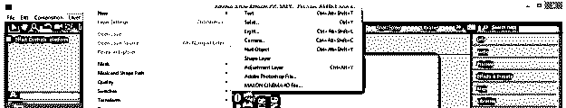

我将这个空的物体层命名为运动。可以根据你来命名。

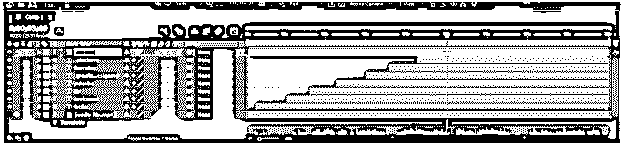

现在选择所有的文本层和空对象层，然后点击任何一层的 3d 选项，使它们成为 3d 层。通过使它们成为 3d 层，我们可以在 x，y 和 z 方向上给这些文本添加运动。

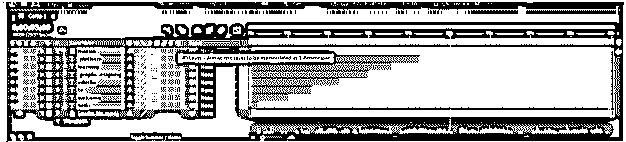

所有的图层都像这样变成了 3d。

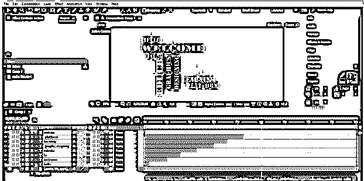

现在，使所有文字层的运动层(空对象层)成为父层。

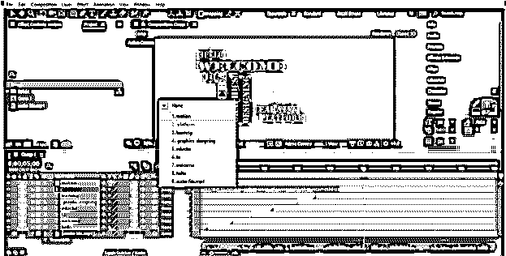

您可以从该列表中选择标题/动作安全选项，以便在用空对象制作动画时对齐文本。

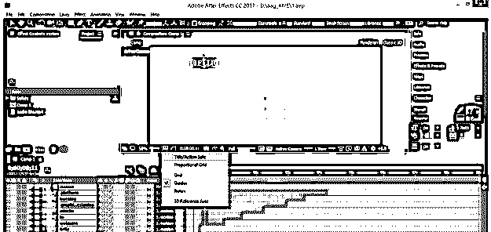

我将动画这个空对象的位置来动画我的文本。将播放头移动到第一个单词，在空对象的位置上添加一个键，然后根据您想要移动的第一个单词来更改其位置。我会把它向上移动。

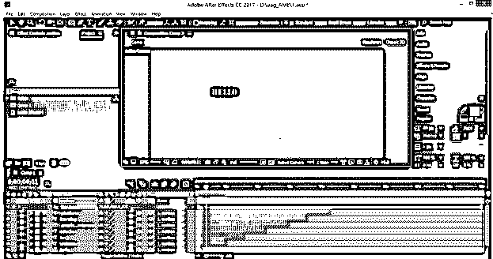

转到下一个单词层，向上改变空对象的位置，也向上移动这个单词

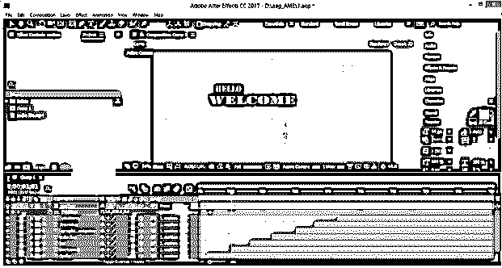

用每个单词改变空对象的位置。您也可以根据自己的选择，使用空对象的 scale 属性制作文本动画。

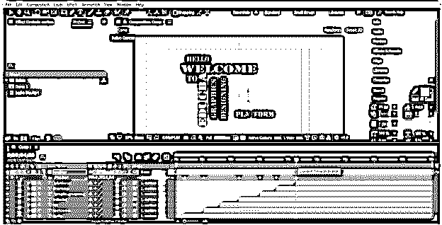

现在你可以通过播放动画看到你的动态排版。

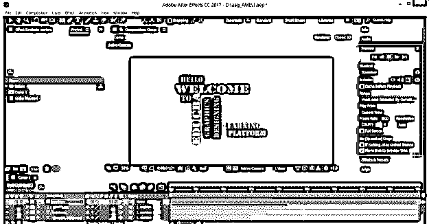

### 结论

现在，读完这篇文章后，你可以理解什么是动态印刷，以及你如何处理这个软件的参数，用你自己的想法为你的项目创造良好的动态印刷。通过练习这种字体，你可以为你的图形技能加分。

### 推荐文章

这是一个关于后效动态印刷的指南。这里我们讨论入门，如何在 After Effect 中做动态排版？.您也可以看看以下文章，了解更多信息–

1.  [特效分割剪辑后](https://www.educba.com/after-effects-split-clip/)
2.  [特效动画后](https://www.educba.com/after-effects-cartoon/)
3.  [后效复读机](https://www.educba.com/after-effects-repeater/)
4.  [后效时间线](https://www.educba.com/after-effects-timeline/)

