# 下三分之一后效

> 原文：<https://www.educba.com/lower-third-after-effect/>

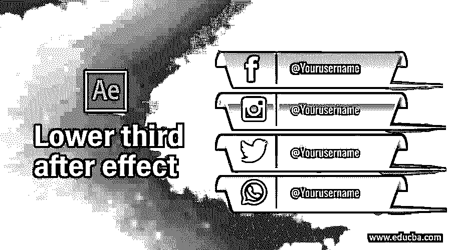

## 下三分之一余音介绍

after effects 中的 Lower third 是社交媒体平台的一种动画标签行形式，通过它您可以宣传您的品牌，或者您可以在视频素材中显示任何标签行，以提供有关您公司的详细信息或任何其他详细信息。目前，您可以从不同的网站找到不同类型的下三分之一预设，并根据您的个人使用要求进行定制。在本文中，我们将了解下三分之一的概念，并学习如何为我们的项目工作创建下三分之一。所以让我们以一种非常激动人心的方式开始一场关于这个话题的讨论。

### 如何在 After Effects 中创建下三分之一？

我们可以在几个简单的步骤中创建一个较低的三分之一的后效，学习它非常容易，适合我们的专业使用，但在开始之前，让我们看看这个软件的工作屏幕，以便在我们学习这个主题时不会出现问题。

<small>3D 动画、建模、仿真、游戏开发&其他</small>

在工作屏幕的顶部，有一个菜单栏和几个菜单。在这下面，我们有一个工具面板，里面有几个工具。在这个栏下面，我们有三个部分，在左边的项目面板，在中间的合成窗口，我们可以看到我们当前的工作，在右边，我们有一些参数的部分，如预览标签，效果和预设，以及其他一些。在工作屏幕的最后，有两个面板，如左侧的图层面板和右侧的时间轴部分。您可以根据自己的选择重新排列所有这些部分。

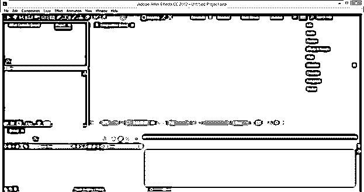

首先，让我们有一个新的组成为我们的学习。对于新组合，在项目面板区域的任何地方右键单击，并从下拉列表中选择“新组合”选项。

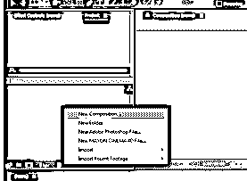

在“合成设置”框中进行所需的设置，然后按此对话框中的“确定”按钮。

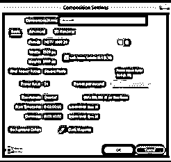

现在让我们有一个 EduCBA 的 logo 的 PNG 文件来学习 after effect 的第三个特性。为了放置这个文件，我将转到我保存它的那个文件夹，从那里选择它，然后把它放到项目面板区域。

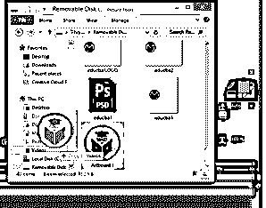

现在在这个软件的图层面板中拖动这个 logo。

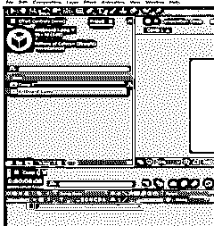

我会放大它，因为我想要这个尺寸。

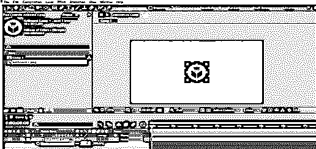

将此徽标放在撰写窗口的左侧。

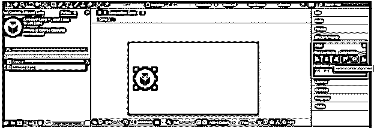

现在，我将使用文本工具键入我们网站的名称，即 EDUCBA。

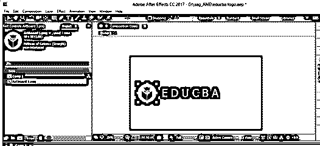

通过点击图层的眼睛按钮隐藏该文本，因为我们将首先为第三个图标制作动画。

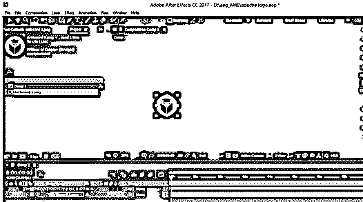

现在打开这个标志的属性，点击秒表图标的旋转和缩放属性来制作动画。选择两个关键点，并在“关键帧时间线”部分将它们拖移大约 1 秒钟。

现在开始时，将旋转值设置为 180 度。

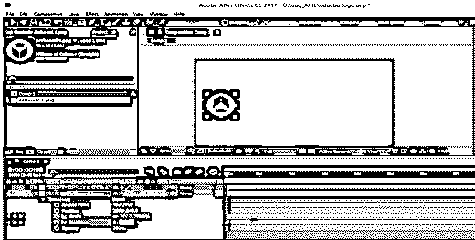

并将比例值设置为 0。

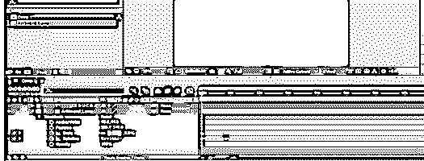

现在播放这个动画并检查它。

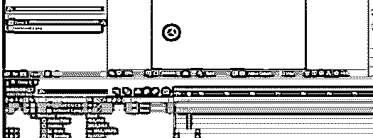

我将选择这两个键，并按 F9 键，使它们容易缓解。

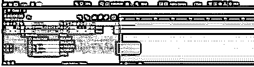

我将点击图形编辑器来调整这个标志的旋转速度和比例动画。

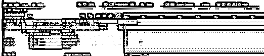

从列表中选择速度图。

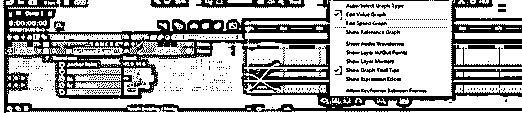

选择缩放属性，然后按住并拖动缩放图形的手柄，并像这样调整图形的选择，因为我希望在动画中心的缩放动画速度很高。

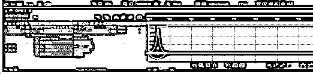

选择旋转属性，然后按住并拖动旋转图形的手柄，并像这样调整图形的选择，因为我希望在动画中心旋转动画速度高。

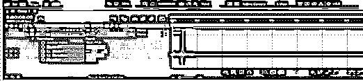

点击文字层的眼睛按钮查看。现在，将关键帧播放头放在第一个动画的末尾，并单击 position 属性的秒表图标，因为现在我们将动画显示该徽标的位置，然后将播放头向前放一帧。

现在以这种方式在 x 方向拖动徽标，这样我将在 x 方向浏览文本。

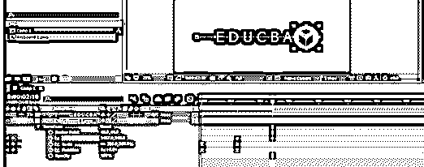

让这些键也变得简单容易。

打开速度图并像这样设置位置的速度图，因为如果需要，标志的速度会在开始位置动画时变快。

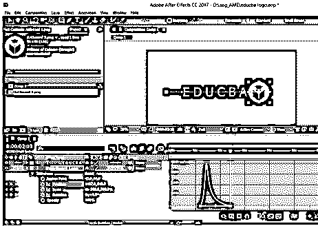

现在用矩形工具在文字层上制作蒙版，就像这样。

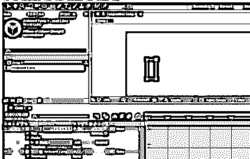

现在，将播放头放在第一个动画的末尾，并在文本图层蒙版的蒙版路径属性中添加一个关键点。

现在，将播放头放置在位置属性动画的末尾，并选择这两个遮罩点。

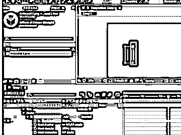

以这种方式拖动这两个点，使它们像这样覆盖整个文本。

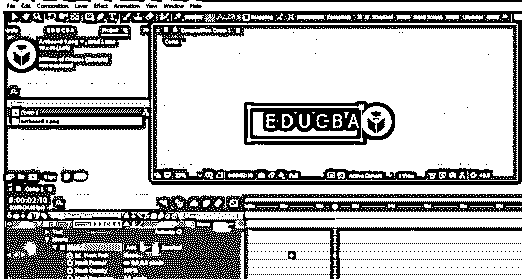

当您移动播放头观看动画时，您会注意到显示文本的蒙版速度和徽标在 x 方向上的移动速度是不同的。

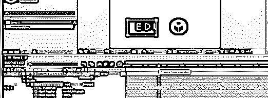

因此，为了再次匹配它们，请转到遮罩路径的速度图，并通过拖动曲线手柄将其速度与徽标的速度相匹配。

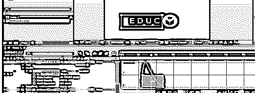

现在选择这两层，然后点击右键。从下拉列表中选择预合成选项，将它们合并到一个图层中。

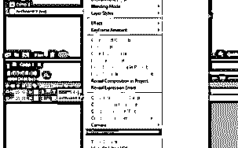

我将它命名为低三分之一，然后按下确定按钮。

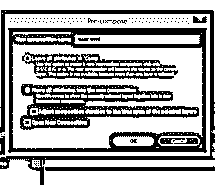

现在将播放头放在动画的末尾。

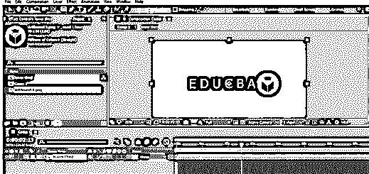

按键盘上的 Alt + ]键从这里开始修剪这一层。

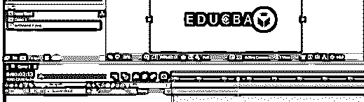

现在通过按键盘上的 Ctrl + D 键复制这个图层，然后右键点击复制图层。转到下拉列表的时间选项，然后从新列表中选择时间反转层选项，以反向播放我们的动画。

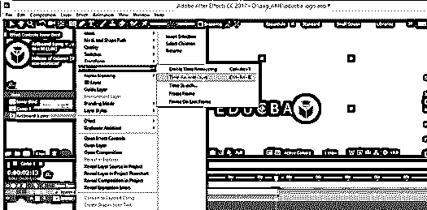

现在将这一层放在第一层的末端。

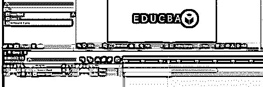

现在当你播放这个动画时，它会先向前播放，然后反向播放。

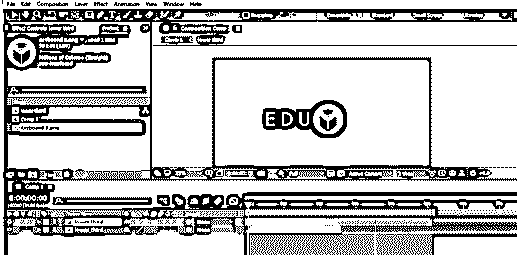

这样，你就可以在 After Effect 中做一个低三分之一。

### 结论——后效降低三分之一

现在看完这篇文章后，你可以理解什么是下三分之一，以及你如何处理不同的参数，以及这个软件的功能，使一个好的下三分之一。从这篇文章中获得灵感，你可以用自己的想法制作不同类型的下三分之一。

### 推荐文章

这是一个降低三分之一后效应的指南。在这里，我们讨论如何处理不同的参数，以及这个软件的功能，使一个良好的低三分之一。您也可以看看以下文章，了解更多信息–

1.  [特效动画后](https://www.educba.com/after-effects-cartoon/)
2.  [摩卡在后效](https://www.educba.com/mocha-in-after-effects/)
3.  [特效预置后](https://www.educba.com/after-effects-presets/)
4.  [特效渲染后](https://www.educba.com/after-effects-render/)

