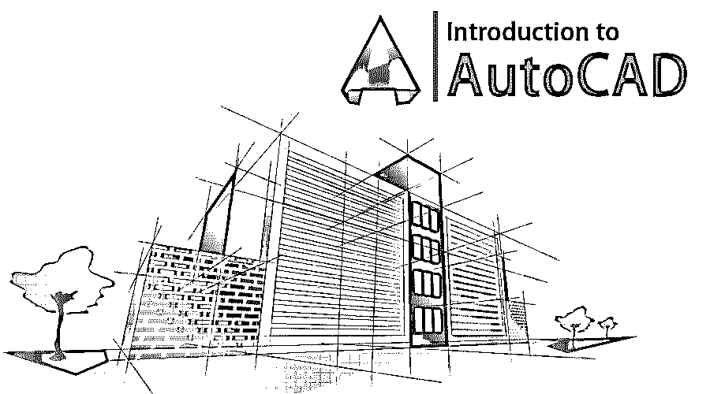

# AutoCAD 简介

> 原文：<https://www.educba.com/introduction-to-autocad/>

## AutoCAD 简介

AutoCAD 允许设计者使用网络许可**在多台机器上使用和管理它。**作为一个容易获得的程序， [AutoCAD 在全球范围内被学生](https://www.educba.com/install-autocad/)，教师，建筑师，自由职业者，工程师，时装设计师**所使用。与其他 CAD 程序一样，AutoCAD 也处理几何系统数据库，包括点、线、弧等。用户通过命令在应用程序上工作；编辑或绘图是通过内置的命令行完成的。AutoCAD 免费提供给学生、教育工作者和机构。**

AutoCAD 在全球范围内被测量员、设计师、工程师和绘图员广泛使用。在全球范围内，AutoCAD 已被证明是一个高效且用户友好的程序。商业制图和计算机辅助设计(CAD)软件应用程序是 AutoCAD。AutoCAD 软件因其卓越的编辑能力而在国际上得到认可，这使得它有可能以数字方式绘制建筑平面图或重建 3D 图像。这个软件是由 Autodesk 在 1982 年开发的。

<small>3D 动画、建模、仿真、游戏开发&其他</small>

### AutoCAD 的亮点

在 AutoCAD 发明之前，所有的设计和建模都是手工完成的。这是一项耗时的任务，会导致大量代价高昂的错误。但是，随着 AutoCAD 的发明，建模和设计过程得到了数字化和简化。这项技术已经成为大多数设计师、工程师和建筑师的解决方案。

AutoCAD 的一些最强大的组件是

*   设计师和建筑师可以使用 AutoCAD 创建精确的模型、草图和图纸。手动完成时，这几乎是不可能的。
*   随着 AutoCAD 的引入，用户甚至可以使用可应用于各种表面的颜色&材料[来建模 3D 对象](https://www.educba.com/careers-in-3d/)，使用户更容易预测结果，这在手工 3D 草图中是无法实现的。
*   手动创建图形是一项耗时的任务。当设计者用计算机软件在数字平台上绘制图形时，他们可以从应用程序界面中获益。使用 AutoCAD 进行编辑也很容易，因为它有许多编辑命令。
*   AutoCAD 是一个高级程序，在应用程序中集成了默认命令。使用这些命令，用户可以不受任何限制地编辑和更改他们的文件。

### AutoCAD 的特点

在上面的章节中，我们已经学习了 AutoCAD 简介；人们需要一些主要的特征:

*   AutoCAD 是一个全球性的应用程序。它正在全球范围内被产品开发团队、制造工厂、医疗专业人员、教育机构、专业人员和工程师所使用。
*   三维建模和可视化是该计划的两个主要的重要特点。AutoCAD 允许建模者通过使用各种 3d 工具和命令来创建强大的 3D 模型、线框、网格和表面。
*   AutoCAD 是一种专业应用程序，在设计更改方面具有灵活性，并且具有自动规范检查功能。设计或产品中的错误可以避免，并可以在需要时重新编辑。
*   AutoCAD 具有创建剖面的功能。这些剖面有助于获得 3D 对象的横截面视图。用户可以改变、选择或移动剖面来检查三维物体的内部细节。
*   AutoCAD 帮助用户开发、修改和设计更好的基础设施，交付可扩展和可行的建筑任务，监督生产财务，并预见项目结果。
*   使用 AutoCAD 还可以重新创建和编辑 2D 图像及其文本属性。
*   AutoCAD 图形也可以直接链接到 Microsoft Excel 电子表格。使用这种技术，可以将 Excel 中的公式和数据直接导入到 AutoCAD 中。该功能是一个自动更新命令。
*   AutoCAD 还附带了一个 SHF 文本识别工具，可以帮助用户将 SHF 字体的文本转换为文本对象。
*   借助 AutoCAD，学生甚至可以导入 PDF 文件用于任何项目参考。
*   其他 CAD 应用程序中的 3D 模型也可以导入到 AutoCAD 中。设计人员还可以处理导入的在线地图或位置。

### AutoCAD 的应用

在学习了 AutoCAD 的介绍，它的组成部分，以及 AutoCAD 的特点之后，我们现在来学习 AutoCAD 的应用。数字素养不仅是学生的福音，也是职业发展的必备技能。AutoCAD 是一个巨大的程序，它可以提供所需的输出，并在许多方面得到应用。

学生可以使用 AutoCAD 进行以下工作:

*   AutoCAD 与 3D Max 等其他应用程序兼容。设计师甚至可以导入或导出 DWG & DXG 文件到应用程序中。此外，这些文件甚至可以从 AutoCAD 导出到其他应用程序，以创建更好的项目和演示文稿。
*   3D 打印机使用并非所有 CAD 软件都支持的各种文件格式。另一方面，AutoCAD 支持大多数 3D 打印机首选的这些文件格式。
*   AutoCAD 适用于 CAD 界面及其使用。AutoCAD 允许专业人员在设计阶段检查框架的工作情况。设计师可以将这个框架用于项目和演示。
*   AutoCAD 包括为建筑规划和基础设施建设专门设计的各种模板的集成设计布局；用户可以在不掌握软件的情况下制定计划，包括为建筑目的创建建筑布局。
*   AutoCAD 不仅是一个强大的应用程序，而且有一个更简单的用户界面。它附带了许多功能和命令，这些功能和命令切中要害，没有任何混乱。设计师也在时装业使用 AutoCAD，因为他们可以毫无问题地设计出困难的形状和设计。
*   工程师也使用 AutoCAD，因为它包含了更简单的绘图工具，有助于对工程设计、蓝图和其他组件进行建模。使用 AutoCAD，工程师可以设计出误差最小的真实模型。AutoCAD 充当用户为其项目设计机械零件和部件的媒介。

### AutoCAD 的优缺点

在浏览了所有的组件、特征和对 AutoCAD 的广泛介绍之后，我们将探讨 AutoCAD 的优点和缺点:

*   有了 AutoCAD，用户可以将他们的文件链接到多个平台；他们可以导入和导出各种文件。
*   用户甚至可以通过编程扩展基础程序；因此，AutoCAD 是一个通用的应用程序，在计算机设计中已经标准化。
*   AutoCAD 还有项目管理工具，允许用户同时有效地共享信息。
*   由于许可证的原因，该程序的成本相当高。
*   该软件是一个耗时的应用程序。它有许多具体而中肯的功能和特点。
*   应用程序需要一台具有良好 RAM 和硬盘的功能强大的计算机才能高速运行。

### 推荐文章

这是一本介绍 AutoCAD 的指南。这里我们讨论了 AutoCAD 的组成、特点、应用、优点和缺点。您也可以阅读以下文章，了解更多信息——

1.  [学生用 AutoCAD】](https://www.educba.com/autocad-for-students/)
2.  [AutoCAD 拉伸](https://www.educba.com/autocad-stretch/)
3.  [Autocad 中的单位](https://www.educba.com/units-in-autocad/)
4.  [AutoCAD 插件](https://www.educba.com/autocad-plugins/)

