# 安装 AutoCAD

> 原文：<https://www.educba.com/install-autocad/>

## AutoCAD 安装介绍

AutoCAD 是由 Autodesk 开发的计算机辅助绘图(CAD)软件应用[。它有助于创建实体和网格表面的 2D(二维)和 3D(三维)模型，这有助于工程师、建筑师、绘图员和其他设计专业人员设计模型，而不是使用诸如铅笔、尺子、圆规、绘图板等手工绘图工具。这些常规方法既费时又不准确。1982 年发布的 AutoCAD 从那以后，由于它的准确性、强大的功能和自动绘图工具，它被广泛使用。AutoCAD 帮助您设计和创建模型，将该模型转换为三维模型渲染，并创建动画演示。](https://www.educba.com/what-is-autodesk/)

AutoCAD 为用户提供了许多内置布局。这个内置布局包含各种类型的模板，用于架构规划和构建建筑物。在本文中，我们将看到在 windows 系统上安装 AutoCAD 的步骤，以便我们可以使用它来创建设计。

<small>3D 动画、建模、仿真、游戏开发&其他</small>

### 如何在 Windows 上安装 AutoCAD？

在 windows 系统上安装 AutoCAD 的步骤如下:

**步骤 1:** 访问 Autodesk 网站

使用像谷歌 Chrome、Mozilla Firefox 等网络浏览器。然后用这个链接去 AutoCAD 官网:[https://www.autodesk.com](https://www.autodesk.com/)。

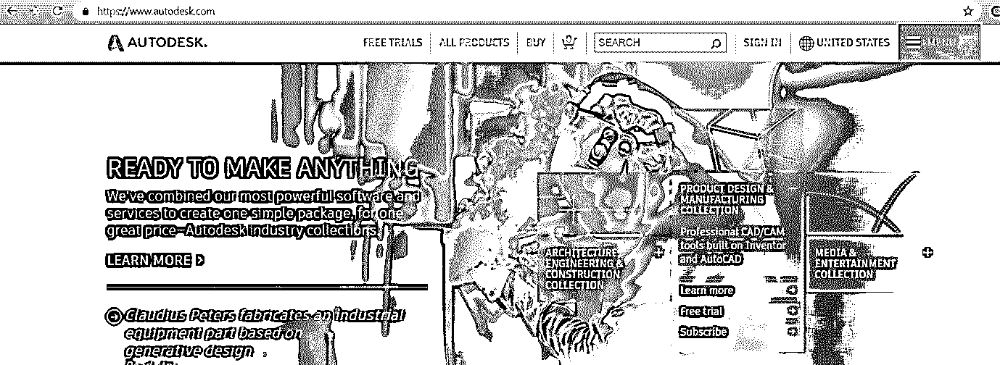

**步骤 2:** 从菜单的下拉列表中选择学生和教育工作者。

它会给你三个选择，即免费试用，学生和教育工作者，以及全球网站。在这里，我选择了学生和教师选项。

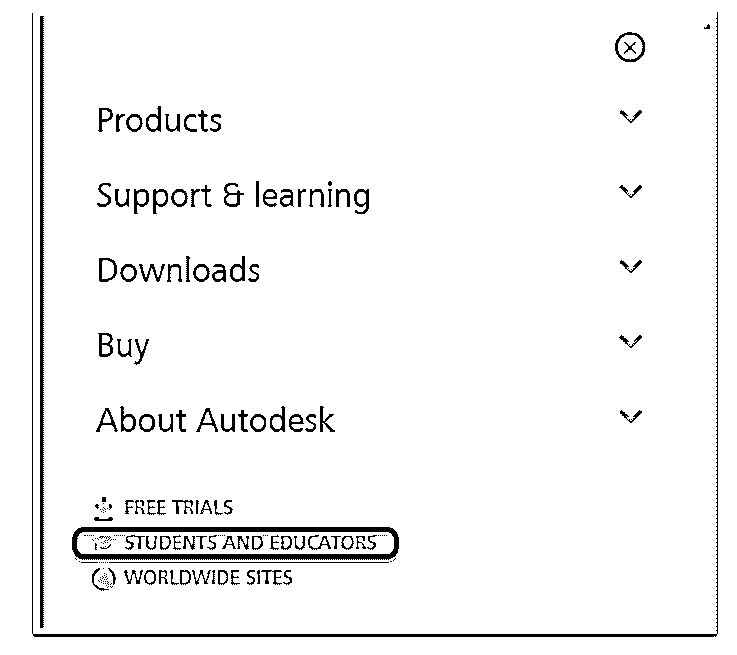

**步骤 3:** 然后，您将看到 Autodesk 选项卡为职业成功做好准备。在该选项卡中，单击下载免费软件选项下立即开始。

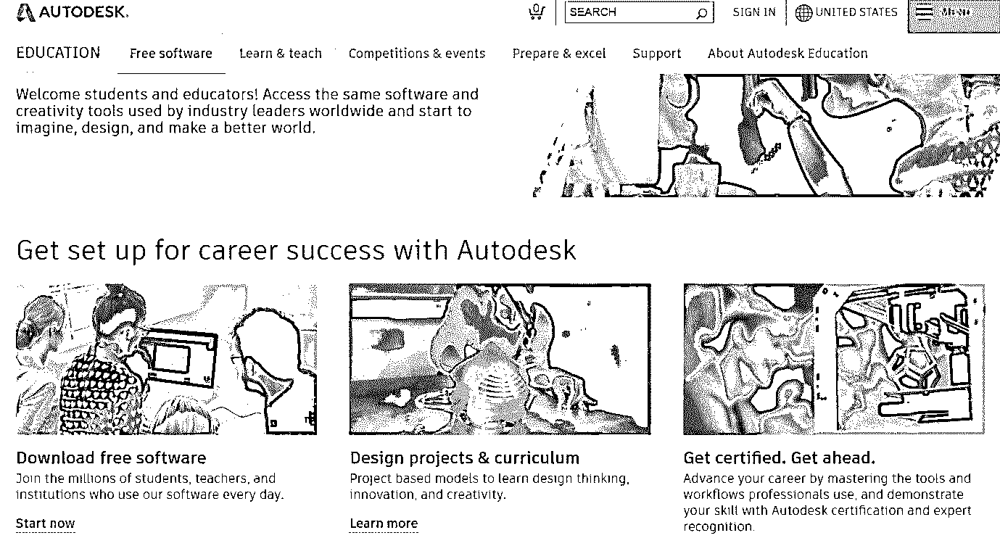

**第四步:**会给出一个类似 3DS Max，Maya，AutoCAD 等 Autodesk 产品的列表。在该选项下，单击列表中的 AutoCAD 选项。

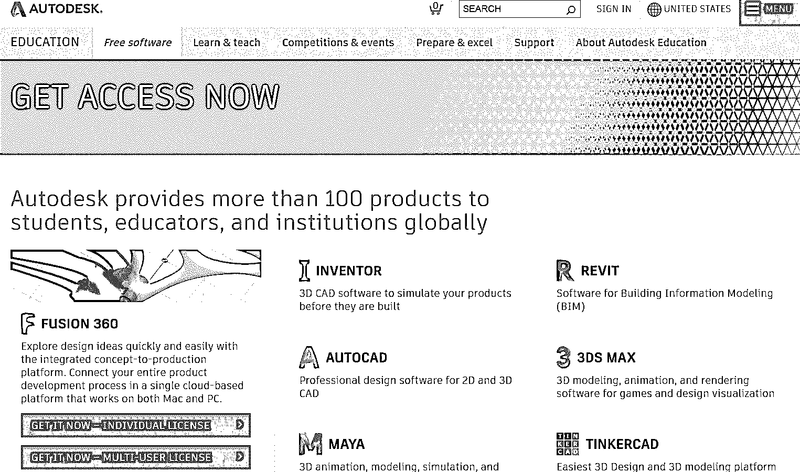

**第 5 步:**如果您已经注册，然后点击登录，您将被转到您的 Autodesk 登录信息。否则，点击创建帐户并使用您的电子邮件 ID 创建一个新帐户。

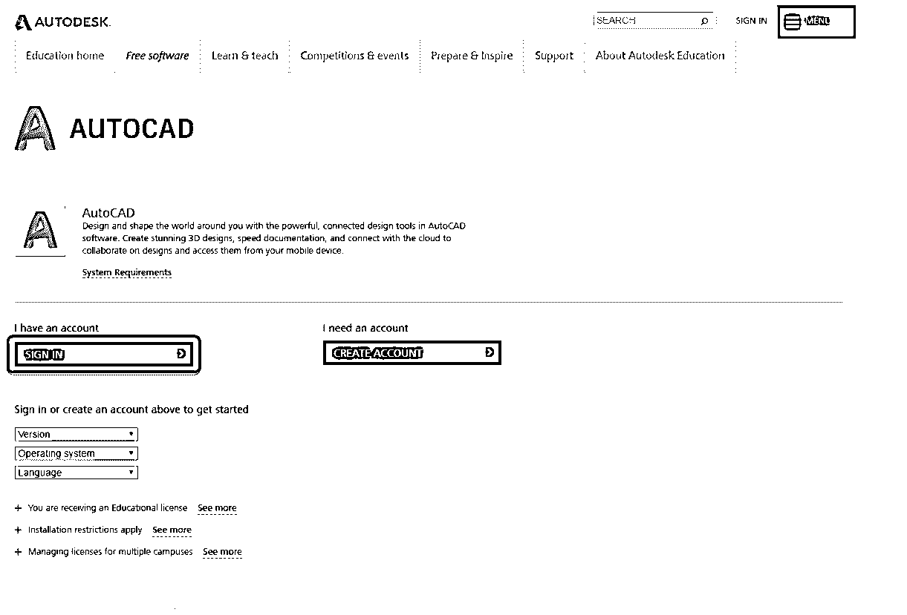

**第六步:**选择版本

登录后，您可以选择要下载和安装的 AutoCAD 版本以及操作系统:32 位或 64 位。

**注意:**要检查你的操作系统是 [32 位还是 64 位](https://www.educba.com/32-bit-vs-64-bit-operating-system/)去控制面板>系统和安全>系统。它将显示您运行的是 32 位系统还是 64 位系统。

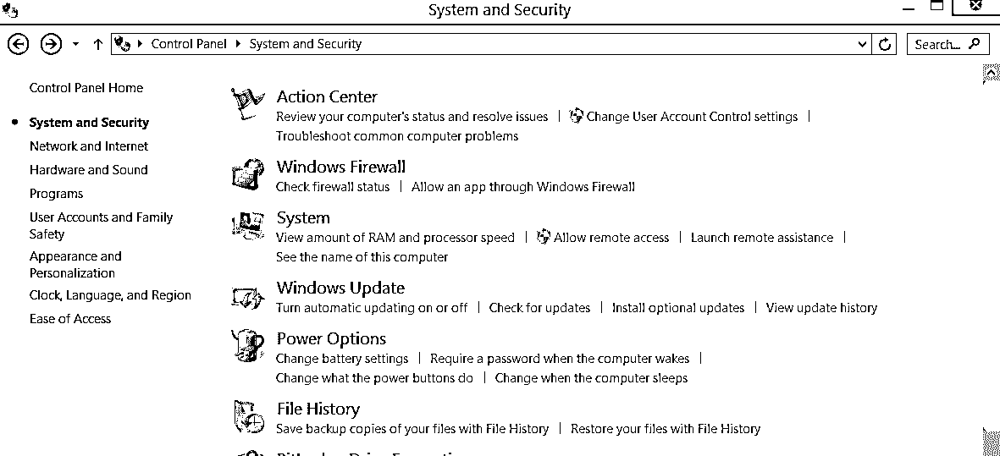

然后选择一种更适合你的语言。

将显示序列号和产品密钥。复制此信息，因为在安装软件以验证下载后，激活需要此信息。

现在点击下载。您将从下载中看到一个带有安全警告的提示。在提示中，单击“运行”或“确定”(适用于继续下载过程)，因为 Autodesk 产品相对安全。

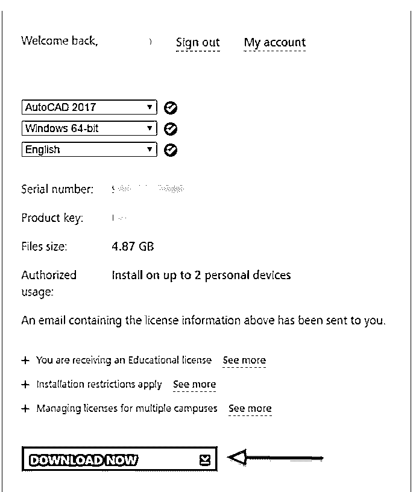

**第 7 步:**许可和服务协议

之后，您将看到“许可和服务协议”提示。仔细阅读，然后点击“我接受”选项，然后点击下一步按钮将 AutoCAD 安装在[您的 Windows 系统](https://www.educba.com/windows-operators/)上。

将显示 AutoCAD 下载管理器。这可能需要一些时间。

**步骤 8:** 安装管理器后，会看到一个“Autodesk 下载管理器”窗口。指定想要保存该文件的路径，然后单击确定。

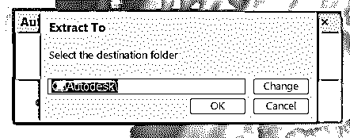

将加载 Autodesk 下载管理器。这可能需要一些时间。

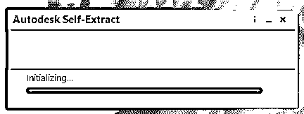

**第九步:**之后，你会看到一个窗口，可以在这里配置 Autocad 的安装过程。在这里给出你想要保存文件的路径。

**第十步:**在下一个窗口中，选择自定义选项。确保下拉框下的所有功能都已选中。

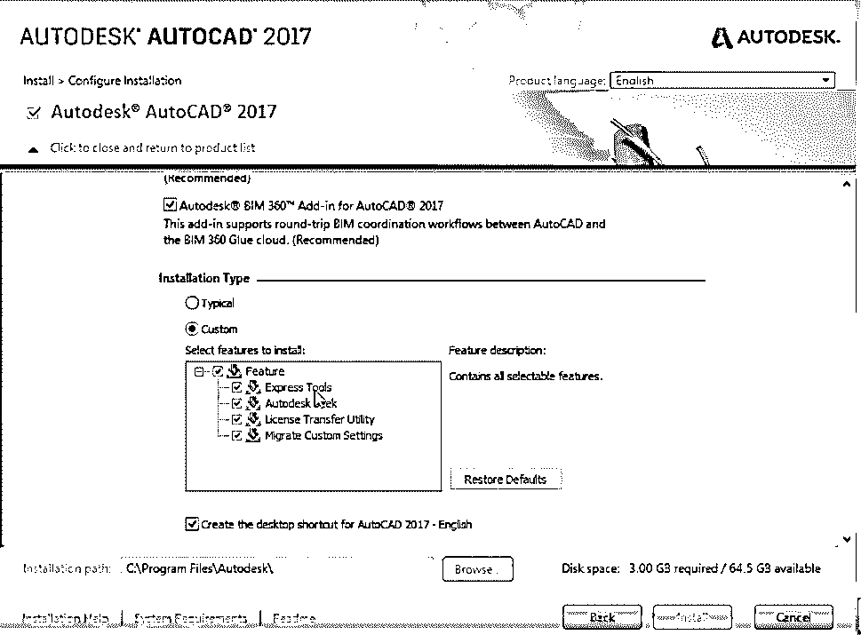

**第十一步:**然后，会提示你下一个窗口。然后点击安装选项。

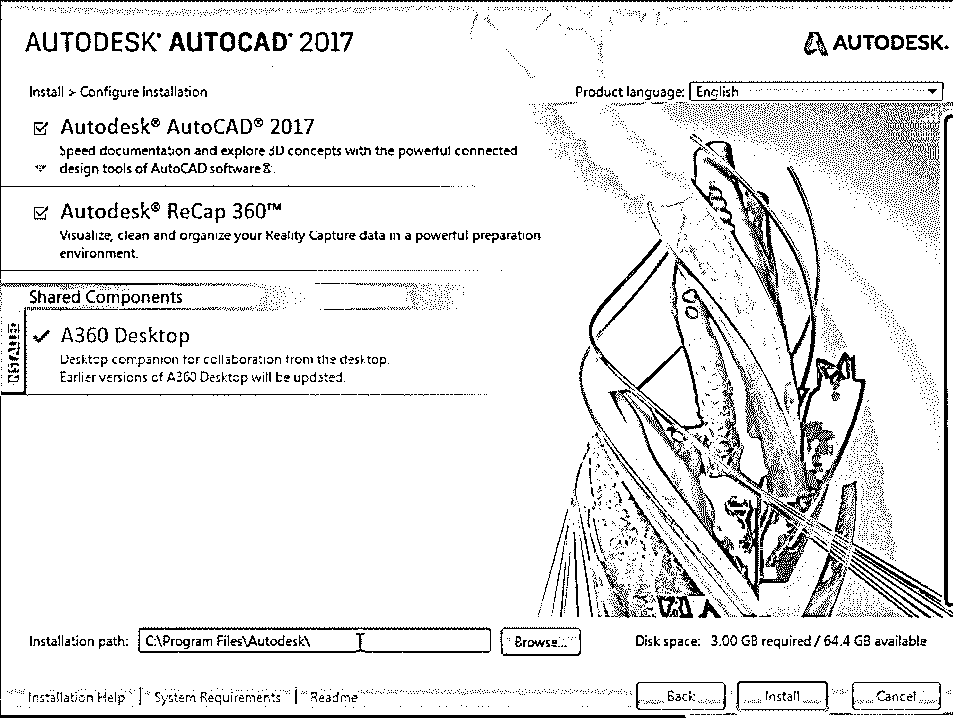

这需要一些时间。

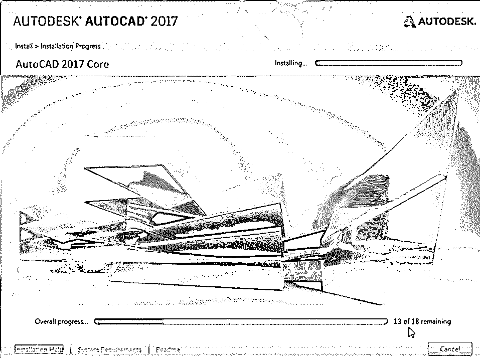

**第十二步:**安装好所有与 AutoCAD 相关的产品和工具后，点击完成。

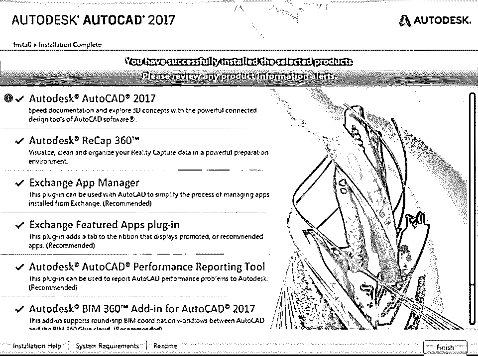

**步骤 13:** 完成安装后，您需要提供产品密钥，以便进一步使用 AutoCAD。

如果您之前没有复制产品密钥，请登录网站上的 AutoDesk 帐户->单击您的用户名->单击 AutoDesk 帐户。

**第 14 步:**点击“所有产品和服务”选项。这将显示您已下载的产品。

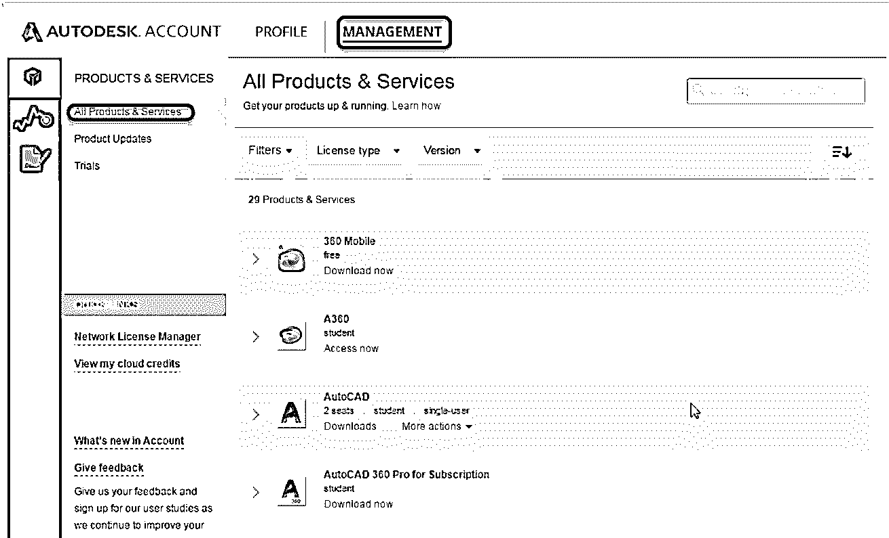

**第十五步:**在 AutoCAD 选项下，点击“更多操作”下拉菜单- >点击“序号”。

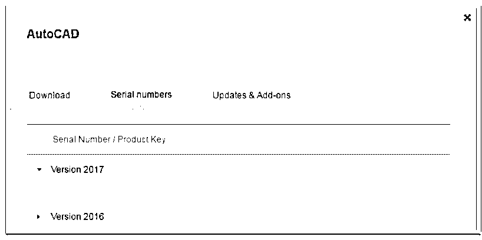

现在，您可以看到您下载的所有产品的序列号和产品密钥。复制此信息并激活您的 Autodesk 产品。

现在你可以使用 AutoCAD 软件，轻松设计自己的模型。

### 结论–安装 AutoCAD

在本文中，我们看到了 Autocad 的定义和一些简介，我们也看到了 Autocad 的安装过程中的一步一步的方法。

### 推荐文章

这是一个安装 AutoCAD 的指南。这里我们讨论了在 Windows 系统上安装 AutoCAD 的概念和步骤。您也可以浏览我们推荐的其他文章，了解更多信息——

1.  [AutoCAD 插件](https://www.educba.com/autocad-plugins/)
2.  [AutoCAD 工具](https://www.educba.com/autocad-tools/)
3.  [AutoCAD 拉伸](https://www.educba.com/autocad-stretch/)
4.  [AutoCAD 中的图层命令](https://www.educba.com/layer-command-in-autocad/)

