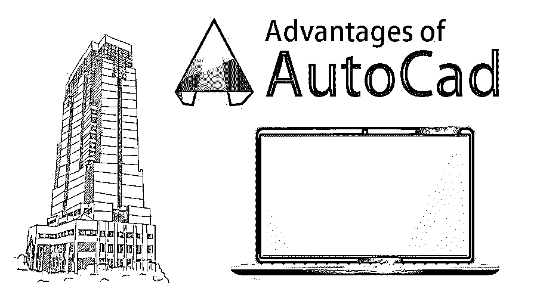

# AutoCAD 的优势

> 原文：<https://www.educba.com/advantages-of-autocad/>

## AutoCAD 的优势介绍

AutoCAD 是由 Autodesk 创建的计算机辅助软件程序，它使绘图员、建筑师、工程师和其他有经验的专业人员能够创建固体表面和网格的二维和三维模型。AutoCAD 被广泛使用，它有助于防止产品故障和保修问题。凭借创新的想法和创造性的想象力，用户可以用 AutoCAD 创建逼真的演示。它提供了必要的工具和工作流程来设计和构建优秀的产品。

在 CAD 程序发明之前，像绘图板和铅笔、平行尺、圆规和三角形这样的手工绘图工具只是设计者创造 2D 设计的选择。AutoCAD 于 1982 年发布，从那时起，由于其自动化的工具和功能，AutoCAD 迅速成为使用最广泛的 CAD 应用程序。这在 AutoCad 流中是一个很大的优势。

<small>3D 动画、建模、仿真、游戏开发&其他</small>

目前，根据用户的要求，AutoCAD 还开发了其他一些定制版本。这些程序[包括 AutoCAD Architecture](https://www.educba.com/autocad-architecture/) 、Civil 3D、Plant 3D、Map 3D&AutoCAD lt。AutoCAD 的功能包括命令文本的视觉方面、自动设计尺寸样式、向 3D 模型添加照明和材料、控制 3D 模型的阴影和边缘。这些功能有助于用户实现逼真的渲染和外观。

许多行业的专业人员使用 AutoCAD 做各种事情，从设计和创建不同的建筑、构造和基础设施。AutoCAD 使公司能够虚拟地设计和规划项目。AutoCAD 支持一个强大而简单的工作流，它可以纠正并帮助用户有效而精确地执行命令。

### AutoCAD 的优势

以下是 12 大优势:

#### 1.准确并减少错误

AutoCAD 的工作原理是动态工程模型。该模型将设计和生产制图融合在一起，允许在整个项目的任何时间点对设计的任何部分进行更改。这导致错误减少和更少的出错机会。此外，数字化设计总是有增强和改进的空间。

#### 2.节省时间和金钱

有了特定的和用户友好的界面和工作流程，AutoCAD 工作速度很快，节省了设计师的时间。AutoCAD 支持文档工具，这些工具可以提高生产率，并帮助设计师和建筑师简化设计和文档工作流程。它还提供了在项目中实现修改的解决方案，从而减少了花费的时间。这是一个有效的程序，承担设计师的工作过程，并有助于节省时间和金钱，减少错误。

#### 3.更轻松的数据传输

在建筑设计中使用 AutoCAD 使多人同时共享文件变得更加容易。处理大量文件并在不丢失任何数据的情况下共享它们并不容易。但是，这个软件使得在互联网上上传设计数据并与众多其他设计师分享变得很容易。

#### 4.本质上可控

AutoCAD 的这一优势支持数据的扫描功能。这项技术有助于测量所用材料的数量。它还有助于计算产品的确切成本。最终，它有助于管理生产和后期制作过程。

#### 5.制造业数据库

AutoCAD 允许创建制造数据，如组件所需的材料、模型的尺寸和形状、产品和组件图纸。这有助于创建和管理广泛的数据库，这是生产过程的重要组成部分。

#### 6.更轻松地导入/导出文件

AutoCAD Inventor 支持文件导入和导出功能。AutoCAD 允许用户从 Inventor 导入模型，并且它还能够非常容易和快速地完成这项工作。AutoCAD 还支持提高程序生产率的各种其他工具和功能。其中一些是；PDF 支持，兼容 Autodesk 360，社交媒体共享，AutoCAD WS，DWG 转换，等等。AutoCAD 还支持推拉操作，允许用户轻松创建曲面、实体和偏移曲线。这些网格本质上是动态的，可以很容易地被操纵。设计师可以利用 AutoCAD 的 [3D 打印功能](https://www.educba.com/careers-in-3d-printing/)轻松开发他们设计的物理 3D 框架。

#### 7.应用点云

点云是由 3D 激光扫描仪产生的大量点的集合，用于创建默认结构的 3D 表示。用户可以加入这些点云作为他们设计的起点。

#### 8.分层特征

此功能允许用户隐藏或显示一组复杂的绘图的具体细节，以便清晰理解。

#### 9.计算

用户可以立即计算质量、面积、体积、重心。该程序具有自动标注尺寸的功能，有助于设计简单而精确的草图。用户还可以从三维模型生成 2D 图纸。

#### 10.命令

像填充、图案填充、剖面线、倒角和圆角使 AutoCAD 成为许多设计师的一站式解决方案，因为这些操作在手动制图中是不可能的。

#### 11.图像跟踪功能

这有助于传统图表和绘图的数字跟踪。

#### 12.PDF 导入增强功能

它还有一个 SHF 文本识别工具，可以将从 PDF 文本导入的几何图形转换为可以更方便地编辑的文本对象。

以上是 AutoCAD 的一些优点。而最新版本的 AutoCAD 更先进，并带有一套令人惊叹的工具和命令。使用新的 Autodesk print studio，用户可以创建一个 3D 打印就绪文件，然后直接打印。这个文件几乎可以在所有的 3D 打印机上打印。

AutoCAD 的高级和更新版本还具有新的移植自定义设置窗口，该窗口更具吸引力且易于理解。它还增强了 2D 和 3D 图形，带来了更新和流畅的特色和即兴表演。使用 AutoCAD 的另一个优势是，设计师甚至可以在他们的移动设备或任何网络浏览器上查看、创建、编辑或共享 CAD 绘图。

设计师甚至可以发布他们的设计，并在社交媒体或网络浏览器上分享，以获得更多视图。AutoCAD 是一个节省时间的程序，有可定制的调色板和命令窗口。

### 推荐文章

这是 AutoCAD 优势的指南。这里我们讨论了 AutoCAD 的 12 大优势。您也可以阅读以下文章，了解更多信息——

1.  [AutoCAD 3D 命令列表](https://www.educba.com/autocad-3d-commands/)
2.  [AutoCAD 命令](https://www.educba.com/autocad-commands/)
3.  [AutoCAD 中的块](https://www.educba.com/block-in-autocad/)
4.  [安装 AutoCAD](https://www.educba.com/install-autocad/)

