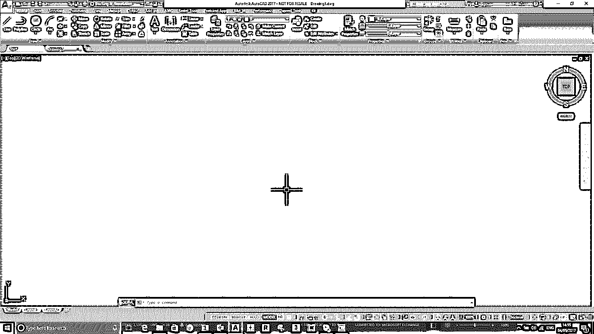
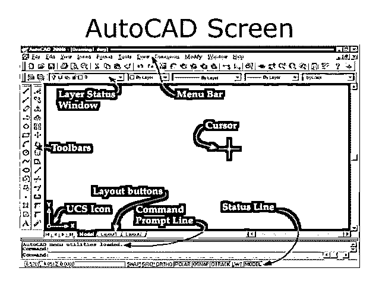
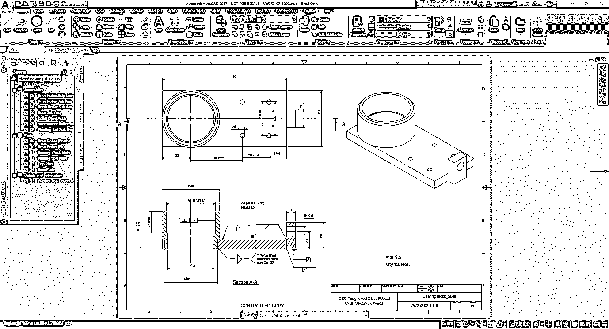

# AutoCAD 的使用

> 原文：<https://www.educba.com/uses-of-autocad/>

## 什么是 AutoCAD？

AutoCAD 可以定义为使用计算机系统来辅助设计的创建、修改和优化。在这种情况下，我们可以创建用于建筑和制造的 2D 和 3D 绘图。它是由约翰·沃克在 AUTODESK 的帮助下于 1982 年开发的，并成功维护了它。它最常用于创建和修改专业制图的 2D 和三维设计，具有关于产品概念设计和布局的详细测量信息，也有 14 种不同语言的版本。用户可以根据项目要求，使用可用的附加应用程序定制 CAD 软件。可以进行用户专用工具设置，以在线框和表面建模中查看和设计产品。广泛应用于机械、电信、土木、建筑工程等行业。由于它的要求，它对学生和行业都有需求。

### 实施 CAD 系统的原因

*   以提高设计者的生产率。
*   提高设计质量。
*   为生产创建数据库。
*   通过文档改善沟通。

在实施该软件之前，所有工程师都使用绘图仪和图纸来绘制设计产品。设计师设计一个产品花了这么多时间。如果制造的产品不能满足客户的需求，或者制造商在制造后发现产品中有任何错误，那么他们需要改变产品的设计，这是一个耗时的过程。设计师需要通过擦除来改变产品的设计，或者有时他需要使用新的图表来设计它。

<small>3D 动画、建模、仿真、游戏开发&其他</small>

这会导致以下问题:

*   生产延迟。
*   废品率增加。

为了减少上述问题，本软件是其解决方案之一。在这个软件中，我们可以保存产品的设计修改；我们可以编辑之前保存的设计，这减少了设计产品的时间。这也减少了人力。

在这个软件中，最初，我们可以很容易地使用命令创建设计，然后在软件中添加图标。使用 AutoCAD，我们可以非常精确地设计产品。

### AutoCAD 代表什么？

AutoCAD 代表计算机辅助设计。这个软件用于设计和绘图。它允许用户将想法、产品设计和图纸概念化到所需的技术精度水平，在制造业领域执行快速设计计算和模拟。

#### 历史与发展

第一版于 1982 年 12 月 23 日发布。它分为两部分。

1.  AutoCAD 360。
2.  AutoCAD LT.

AutoCAD 360 用于 2D、三维和等轴测视图，而 AutoCAD LT 仅用于 2D。

*   AutoCAD 2000 I (Internet)
*   AutoCAD 2006(添加了工作空间)

1.  制图和注释
2.  AutoCAD 经典
3.  3D 基础
4.  三维建模

*   在 AutoCAD 2010 中(3D 质量即兴创作)。
*   在 2011 年，添加了视窗控制系统。
*   2012 年增加了 View cube 或 Navigation cube。
*   2013 年增加了图标。
*   2014 年，增加了一个实时映射。
*   2015 年，AutoCAD classic 从工作区中移除。
*   2016 年增加一个几何中心“O snap”。

### 你用 AutoCAD 做什么？

使用 AutoCAD 有助于创建发动机气门和发动机备件的蓝图，以便进行精确测量。设计好的蓝图将在生产团队、质量团队和机器操作团队之间从开始到交付的整个阶段进行，在理解上有任何问题的情况下审查设计，并参考蓝图继续加工。绘图员可以在两种类型的接线图和表面模型图中完成，用于零件的制造、组装和维修。它还用于跟踪在要求的时间范围内完成的订单数量。

#### 应用程序

*   航空航天称他们的最终设计为一个组件。
*   汽车制造商称他们的最终设计为零件设计。
*   电气和电子称他们的最终设计为蓝图和电路设计。
*   铁路和海运把他们的最终设计称为布局或蓝图。
*   结构和土木称他们的最终设计为布局。

### 使用 AutoCAD 有什么好处？

CAD 界面使其成为学习和工程设计生涯初级阶段的最佳技术设计初学者软件。也有一些被用作研究生教育的技能发展申请。除了它们的优势之外，两者都有项目支持需求，即设计多个组件，并根据未来的技术变化对其进行改造。

#### AUTOCAD 的优势:

*   它有能力做出非常精确的设计
*   可以在 2D 或 3D 中创建绘图并旋转。
*   其他计算机程序可以与设计软件连接。
*   **作为建筑规划工具的 AutoCAD:**它使建筑师能够在设计阶段的水平上设计、规划、执行和分析一个建筑的强度。
*   **作为工程制图工具的 AutoCAD:**它帮助工程师设计、分析和解决设计问题，从而实现精确的设计。
*   **在 3D 打印方面:**对于设计师来说，3D 打印有自己的优势，对于这个软件来说，帮助他们。设计可以导出为各种首选格式。
*   **时尚界的 AutoCAD:**它拥有为珠宝、玩具和其他精致物件的制造进行规划设计所必需的工具。
*   **AutoCAD 作为一种工业设计工具:**它有助于降低制造成本，因为它节省了手工设计所需的时间和精力。

### AutoCAD 是怎么用的？

这是一个用于建筑、施工和制造的二维和三维计算机辅助绘图软件应用程序，用于指导工程计划的蓝图制作。专业人士被称为设计工程师。

#### 1.培训计划

这种 CAD 和计算机辅助设计可以在许多机构中找到，通过 AutoCAD 中的认证和学位程序进行技能更新；他们为学生提供培训，让他们能够使用软件进行工业制图和装配，并获得认证。中央工具设计学院就是这样一个学院。

#### 2.职业信息

而绘图员在 CAD 中的工作在下面的工程流列表中使用。

机械、建筑、土木、电气和电子。

*   设备和机械装置备件的机械设计计划。
*   住宅和商业建筑的平面布局和 3D 建筑设计。
*   道路、3D 建筑、工厂和其他主要项目的设计和施工的土木设计。
*   电气设计工作涉及尺寸较小的电路和机器的电气布线系统布局。

它的界面与所有其他设计软件应用程序非常相似，工程师使用节点、线和多边形为他们的项目需求创建产品草图。

下面列出的快捷方式有助于用更少的时间起草设计。

https://www.autodesk.com/shortcuts/autocad

### 推荐文章

这是 AutoCAD 的主要用途指南。在这里，我们讨论了 AutoCAD 的使用，它的历史，应用，好处，实施 AutoCAD 系统等。您也可以阅读以下文章，了解更多信息——

1.  [AutoCAD 面试问题](https://www.educba.com/autocad-interview-questions/)
2.  [Adobe Photoshop Element 工具](https://www.educba.com/adobe-photoshop-element-tools/)
3.  [面向初学者的 Adobe Illustrator】](https://www.educba.com/adobe-illustrator-for-beginners/)
4.  [如何使用 Adobe Illustrator](https://www.educba.com/how-to-use-adobe-illustrator/)

