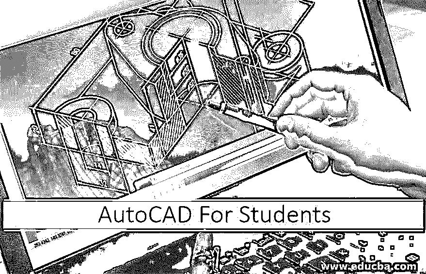

# 学生用 AutoCAD

> 原文：<https://www.educba.com/autocad-for-students/>

## 学生用 AutoCAD 简介

AutoCAD 是一个商业软件应用程序，用来在计算机的帮助下绘制 2D T2 的三维模型。它通常被归类为 CAD 程序和绘图应用程序。AutoCAD 是 1982 年由 Autodesk 发现的。AutoCAD 也有学生版，可以从网站下载。学生版就像完整的商业版。学生、教育工作者和机构可以免费使用 AutoCAD。AutoCAD 被设计师、工程师、绘图员和测量员广泛使用。对于大多数设计师和工程师来说，AutoCAD 已经证明是一个省时高效的程序。

### 面向技能学生的 AutoCAD

数字素养是当今时代学生必须具备的技能之一。AutoCAD 可以在很多方面为学生所用。由于 AutoCAD 是一个庞大的程序，它在许多方面包含了应用程序。

<small>3D 动画、建模、仿真、游戏开发&其他</small>

学生可以使用 AutoCAD 进行下列操作:-

#### 工程制图工具

AutoCAD 提供了独特的绘图工具，用于工程零部件、设计和基础设施的绘图。它还最大限度地减少了人为错误，并帮助用户准确地发挥他们的想象力。它还为设计机械部件和解决可能出现的设计问题提供解决方案。

#### 充当图形设计工具

AutoCAD 支持 DWG 和 DXG 文件的操作，这些文件可以从其界面导出到其他 CAD 应用程序，用于更高级的动画项目。AutoCAD 甚至可以同时使用 3D Max 和其他应用程序。

#### 用作建筑设计工具

有了内置设计布局(包括许多专门为建筑规划和建筑施工设计的模板),用户只需了解最少的软件知识，就可以从事创建建筑布局的项目。

#### 在 3D 打印中使用

AutoCAD 与大多数 3D 打印机和切片软件使用的文件格式兼容。设计可以以最喜欢的格式导出，即。几乎所有 3D 打印机都使用的 stl。AutoCAD 帮助用户在其工作空间上创建逼真的三维模型。

#### 用于工业规划和设计工具。

AutoCAD 非常熟悉 CAD 界面，通过使用它，工业家可以创建一个对象的工作原型，并在设计过程中测试其功能。设计师甚至可以使用基本原型进行演示，以推广他们的设计。

#### 也用于时尚行业。

CAD 软件拥有最令人惊叹的界面，可以轻松混合并简化设计复杂的形状，如八角形、四面体和许多其他通常用于设计时尚物品的形状。

### 学生如何使用 AutoCAD？

第一步是下载程序并安装在电脑上。学生可以从 Autodesk 获得免费许可证，所有功能都是免费的。学习如何使用 2D 首先将是首要的一步，然后进行三维绘图。学生必须知道工作空间中不同工具和工具栏的使用及其功能。

以下是使用 AutoCAD 的步骤-

1.  首先，理解并了解工作空间、工具和菜单。
2.  开始绘制图纸，并尝试了解不同的基本工具，如平移、缩放、捕捉、极坐标、绘图等。
3.  使用基本的 2D 工具创建不同的形状，如多边形、折线、直线、圆形、矩形、弧形、倒角、圆角、连接、修剪、复制、文本等。他们可以使用 Autodesk 网站上的教程来更好地理解它。
4.  了解命令行输出，并通过创建不同的形状和设计来练习。
5.  学习不同的尺寸样式、字体样式、表格、阴影、镜像、块、线型等。
6.  学习使用宏，自定义命令，LISP 等。

### 给学生的概述提示

*   内容浏览器工具位于插件功能区选项卡下的内容面板中。这个搜索栏允许用户查找搜索词的所有例子。从图层到文本或用户想要搜索的任何内容都显示在内容浏览器中。此搜索不限于图形内部的文本。
*   使用 MTEXT 命令并从工具面板导入文本，用户可以轻松地在 AutoCAD 中导入 TXT 和 RTF 文件。
*   用户甚至可以创建自己的模板，通过按 Ctrl+ Shift+ S。他们可以将文件类型从 DWG 转换为 DWT。

### 功能强大的 AutoCAD 行业

AutoCAD 是一个实时程序，可以减少出现在它存在之前的问题。它不仅仅是软件，而是一个行业，对于大多数设计师、工程师和建筑师来说，AutoCAD 是他们许多问题的一站式解决方案。

一些最强大的功能是

*   使用复制、镜像、拉伸、缩放等命令，可以在 AutoCAD 中轻松编辑。因此，在 AutoCAD 中创建绘图比手动创建更容易、更快捷。
*   它使用户能够创建最小尺寸的图纸，并定义精确到任意小数位数，这在手绘图纸中几乎是不可能的。
*   它甚至有助于用颜色模拟 3D 物体；材料应用于不同的表面，使用户更容易看到最终产品，这是手工 3D 草图无法实现的。
*   它节省了修订和修改所需的时间。它有内置的工具，允许任何数量的修改容易和快速。用户甚至可以保存文件的以前版本。

### 结论

AutoCAD for Students 是用于绘制建筑图纸的最广泛使用的计算机辅助软件。它不仅在电脑上，而且还可以作为一个需求巨大的移动应用程序，吸引了许多学生和初学者。

因此，使用 CAD 应用程序的机会是一种在未来可以很好服务的技能。随着数字世界的进步和技术的日益发展，学习 CAD 程序将提高投资组合和工作质量。

### 推荐文章:

这是学生学习 AutoCAD 的指南。这里我们讨论了学生使用 AutoCAD 的基本方法，学生如何使用 AutoCAD 等。您也可以阅读以下文章，了解更多信息——

1.  [什么是 AutoCAD？](https://www.educba.com/what-is-autocad/)
2.  [AutoCAD 拉伸](https://www.educba.com/autocad-stretch/)
3.  [AutoCAD 建筑](https://www.educba.com/autocad-architecture/)
4.  [AutoCAD 中的图层命令](https://www.educba.com/layer-command-in-autocad/)

