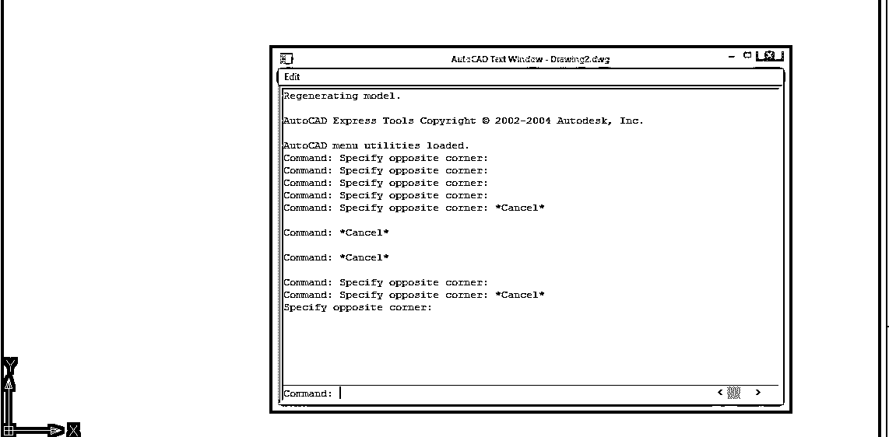
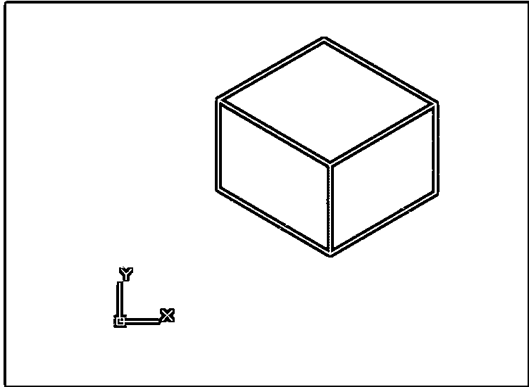
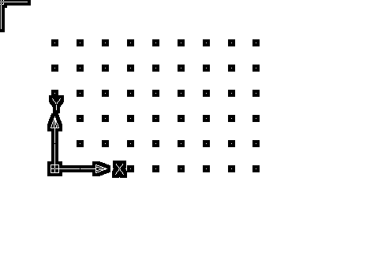
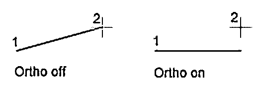

# AutoCAD 功能键

> 原文：<https://www.educba.com/autocad-function-keys/>

## AutoCAD 功能键介绍

AutoCAD 是一个制图软件，几乎用于所有领域的基本制图和绘图。在 AutoCAD 中，为了使绘图更容易、更省时，功能键提供了一些快捷方式。一旦你熟悉了这些快捷键，你会开始享受甚至基本的起草工作。

### 基本 AutoCAD 功能键

键盘的功能键可用于控制几个 AutoCAD 设置；让我们看下面几个例子。

<small>3D 动画、建模、仿真、游戏开发&其他</small>

#### 1.子一代

此功能键打开 AutoCAD 帮助窗口。如果用户在该软件中遇到任何功能问题，它允许用户在线寻求帮助。如果用户正在脱机工作，那么按下这个键，这个软件的所有功能将以 PDF 格式打开。

#### 2.第二子代

该键打开一个弹出屏幕，在屏幕底部显示命令行。该命令对于在屏幕底部看不到命令窗口的用户很有用。

#### 3.第三子代

该命令自动激活 AutoCAD 的 O 捕捉功能。该软件的捕捉功能有助于准确绘制您的图纸。这将允许您在拾取任何点时捕捉对象的特定位置。例如，用户可以准确地选取线的两点、圆心等。如果你再次按下这个键，软件将从这个命令中出来。

#### 4.法乐四联症

在三维模式下工作时，此键将打开 O 捕捉功能。这个命令可以让我们精确地确定一具尸体的具体位置。

#### 5.F5

等面是与水平面成 30 度角的平面。通过使用这个快捷键，我们可以在 ISOPLANE 中创建任何图形。

使用三维模型的 2D 等轴测视图时，等轴测平面提供以下模式:

1.  正交方向
2.  捕捉方向
3.  网格方向
4.  极坐标跟踪角度
5.  等距圆的方向

仅当捕捉样式设置为等轴测时，该命令才会影响光标移动。如果捕捉样式设置为等轴测，正交模式将使用 30 度、90 度和 150 度范围内的适当轴对。

通过再次按下该命令，我们可以在顶部、右侧和左侧三个 ISO 平面之间切换。

#### 6.F6

此功能键打开或关闭动态 UCS。UCS 是用户可以根据自己的要求定义的用户坐标系。在 2007 年之前，当此命令在工作时不可用时，3D 用户必须在每次更改其绘图视图时创建一个新的坐标系。该命令仅在处理三维对象时使用。

#### 7.F7

此功能键将在您的 AutoCAD 绘图中显示网格。网格系统允许用户重新定位他，之后，他可以专注于他的设计。他/她可以通过再次按下该键来关闭网格可见性。通过更改等轴测平面，用户在 AutoCAD 的等轴测模式下工作时会更改其视点。这允许他/她相对于 2D 等轴测对象移动视点。

#### 8.F8

此命令将打开或关闭正交模式。这是 AutoCAD 中最有用的键之一。当用户必须使用定点设备通过两点指定角度或距离时，使用此模式。通过使用此模式，光标移动将被限制在相对于用户坐标系的水平或垂直方向。

#### 9.F9

该键将打开或关闭捕捉栅格。栅格是 AutoCAD 中点状结构的矩形图案，覆盖用户坐标系的整个 XY 平面。在 AutoCAD 中使用网格就像在绘图下使用网格纸一样。这将允许用户对齐对象并可视化它们之间的距离。通过使用此键，您可以轻松地捕捉到矩形网格，并更轻松有效地创建您的绘图。

#### 10.F10

该功能键将允许用户使用 AutoCAD 软件的极坐标追踪选项。“极轴捕捉”命令将光标移动限制在指定的增量和极轴角度范围内。极轴追踪将显示由您之前指定的极轴角度定义的临时对齐路径。它还提供了额外的上下对齐功能。当对象的一部分相对于另一部分旋转 45 度时，该命令在处理具有多个不同方向的对象时非常有用。使用此命令时,“正交”命令将自动关闭。

#### 11.F11

此键将允许使用对象捕捉跟踪命令。对象捕捉允许用户在拾取点时捕捉到特定的对象位置。这与其他命令一起使用，以便更准确地绘制设计。指挥是如此重要，没有它你永远也不能准确地画画。一些设计人员使用“对象捕捉追踪”命令，并且永远不关闭它。

#### 12.F12

这个命令将允许我们使用这个软件的动态输入命令。动态输入提供用户光标输入、尺寸输入和动态提示。选择动态输入后右键单击，可以根据需要选择任意输入。通过使用这种方法，您可以在光标附近提供尺寸输入，而不是在命令行上指定它们。

### 推荐文章

这是一个 AutoCAD 功能键的指南。这里我们已经讨论了控制 AutoCAD 设置的简介和基本功能键。您也可以浏览我们的其他相关文章，了解更多信息——

1.  [安装 AutoCAD](https://www.educba.com/install-autocad/)
2.  [AutoCAD 中的模板](https://www.educba.com/template-in-autocad/)
3.  [AutoCAD 中的样条](https://www.educba.com/spline-in-autocad/)
4.  [AutoCAD 圆角](https://www.educba.com/autocad-fillet/)

