# AutoCAD 中的布局

> 原文：<https://www.educba.com/layout-in-autocad/>

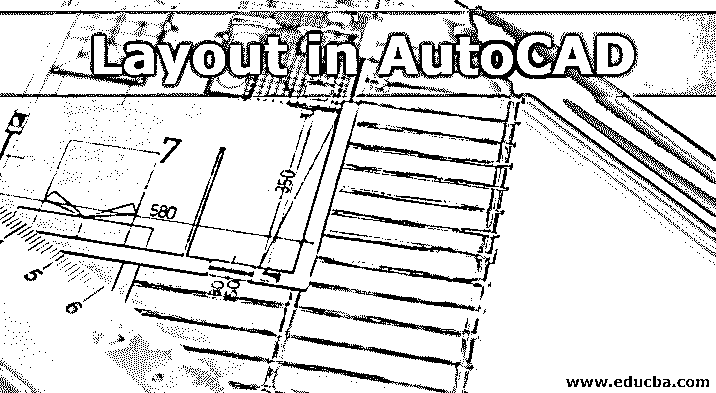

## AutoCAD 简介

AutoCAD 是建筑师、室内设计师、工程师和平面设计师使用的著名和流行的计算机辅助设计软件。该程序由 Autodesk 公司自行开发和销售。AutoCAD 用于创建蓝图、地图、道路方向信号、绘图和其他 2d 模型。该软件支持用于修改和安装目的的 API 语言。这些是。NET、ObjectARX、Visual LISP 等等。除了 AutoCAD，我们还有 AutoCAD Advance Steel、AutoCAD Civil 3D、AutoCAD Electrical、AutoCAD Map3D 以及许多其他程序。AutoCAD 中引入视口的时间早于布局选项出现的时间。

### 什么是 AutoCAD 中的布局？

*   基本上，AutoCAD 中的布局表示一个二维空间，用户可以在其中确定绘图板的大小，编辑标题栏并同时查看对象的多个场景。
*   在 AutoCAD 中，用户可以使用两种类型的空间创建图形。模型空间和布局空间。模型空间由用户创建的三维对象组成。要在 2D 维度结构中查看它，用户必须使用“布局”选项卡。
*   此布局选项卡可用于查看用户在模型空间中创建的 3d 对象的不同 2d 视图。此外，用户可以向布局中添加任意数量的视图，还可以修改图纸的大小。布局空间也称为图纸空间，通常用于指定所创建模型的次要细节。布局永远不可能是三维的，因为它只是一张纸，按照用户的要求显示和编辑模型的各种元素。
*   开始时，用户开始在模型空间(即 3D 空间)上工作来绘制对象。慢慢地，为了获得更大更合适的视角，我们使用菜单中的布局选项卡。为了创建用于打印目的的绘图和蓝图，我们使用布局选项卡本身。“布局”选项卡能够修改与布局模式相关的模型大小。在布局面板中，承印物的一个单位被视为承印物上的实际距离。这个单位是以毫米或英寸来计数和测量的。
*   AutoCAD 中用于创建布局的一些重要命令有 PLOT、VPORTS、LAYOUT、MODEL、VPMIN、PAGESETUP 等。

### 在 AutoCAD 中创建布局

请参考以下步骤在 Autocad 中创建布局。

<small>3D 动画、建模、仿真、游戏开发&其他</small>

**步骤 1:** 要开始一个新项目，打开 AutoCAD。

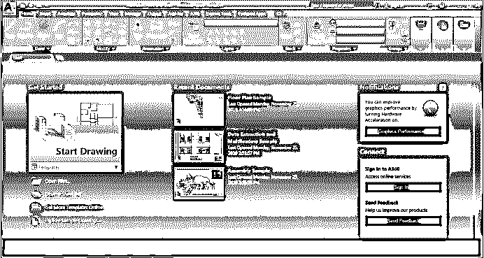

**第二步:**点击界面左上角的新建按钮。

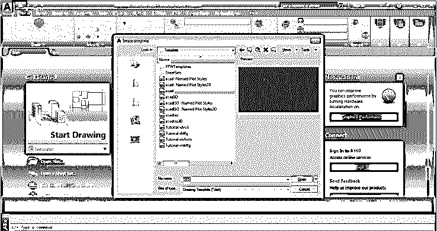

**第三步:**我们会看到一个名为模板的对话框将会打开。从框中的列表中选择任何模板。+

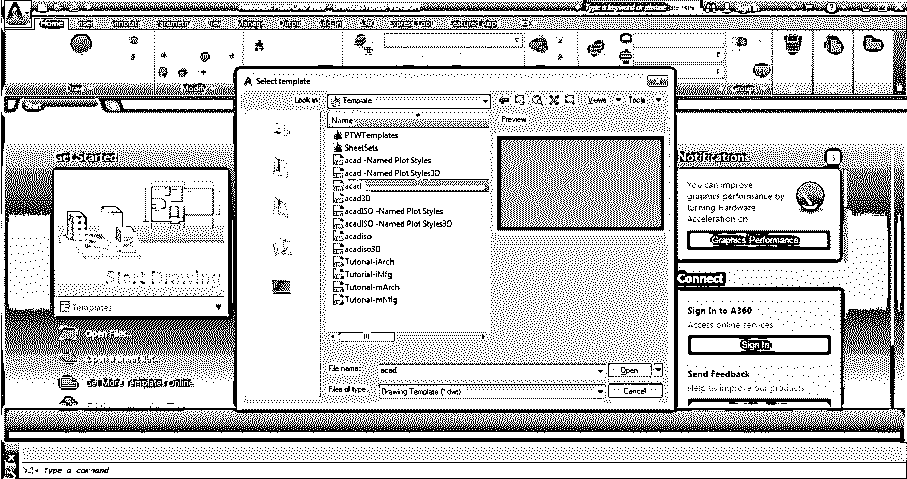

一旦我们选择了模板，一个屏幕将被激活。我们可以在屏幕界面的底部看到模型、布局 1、布局 2 选项。

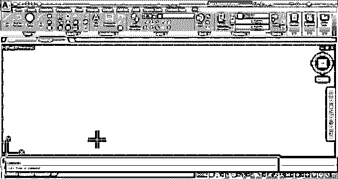

**第四步:**创建一个 3d 对象，只留在模型空间。点击绘制面板中的圆形工具，创建一个圆形，如下图所示。

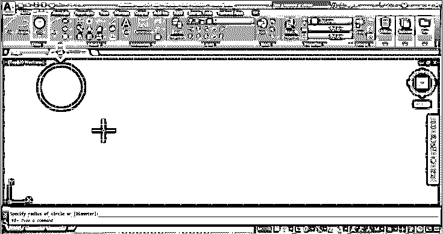

第五步:现在，点击折线工具，创建一个随机对象，如下图所示。

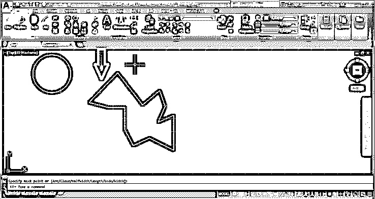

**第六步:**现在，我们可以看到页面底部的布局 1 和布局 2。要添加布局，请单击末尾的+号。或者，右键单击布局 2 并选择新建布局。

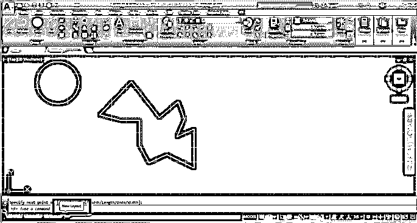

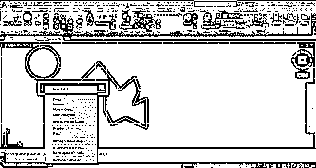

**步骤 7:** 将添加一个新的布局 3。右键单击布局 3，将其重命名为最终布局。

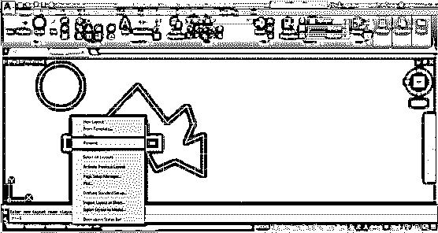

在模型空间中创建的模型也将显示在布局空间中。但是，它对用户来说将是可见的绘图。

**步骤 8:** 要调整页面尺寸，右击最终布局，选择页面设置管理器。

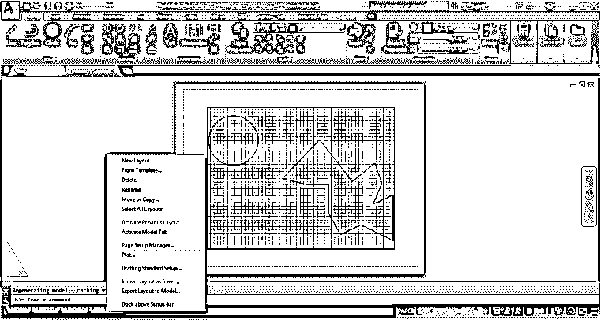

查看下图中的变化。

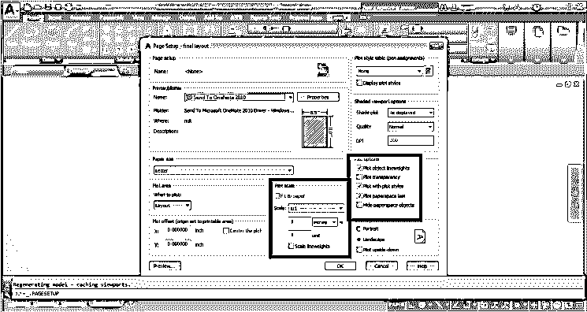

从对话框中编辑设置和属性。同样，我们可以编辑其他布局空间，也可以更改和添加标题名称。

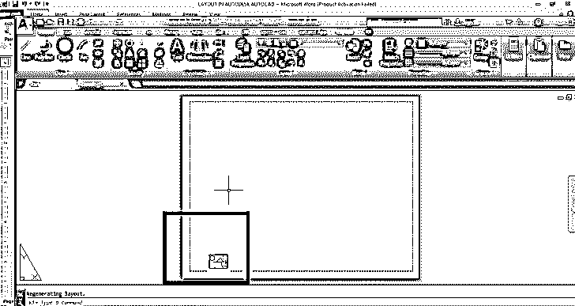

需要页面设置来查看创建的 3D 模型的不同视图。

软件中的布局选项卡是一个非常有用的功能，主要由用户用于不同的目的。布局选项卡很容易控制，我们也可以在布局空间中使用注释缩放。此外,“布局”选项卡用于修改和更改对象的样式。创建一个模型后，给对象赋予尺寸和样式变得非常困难。这可以通过使用软件中的布局空间轻松实现。

### 结论

就像我们在 Max 上创造任何东西的时候；我们看到同样使用不同的视口来调整和修改对象的设计。使用相同的技术，AutoCAD 使用两个不同的空间来创建和查看不同的结构。我们有一个对象，通过使用布局选项卡，我们可以用 10 种不同的方式来查看和表示一个对象。建筑师和设计师发现这个空间在绘画和印刷中是有益和有用的。此外，这个布局空间最近已经添加到程序中，从那时起，它也促进了 AutoCAD 的使用。

### 推荐文章

这是 AutoCAD 中的布局指南。在此，我们将讨论 AutoCAD 简介、在 AutoCAD 中创建布局以及在 Autocad 中创建布局所使用的命令。您也可以浏览我们的其他相关文章，了解更多信息——

1.  [使用 AutoCAD 的优势](https://www.educba.com/what-is-autocad/)
2.  【AutoCAD 的各种工具有哪些？
3.  [学习基本的 AutoCAD 命令](https://www.educba.com/autocad-commands/)
4.  [特点&AutoCAD 的应用](https://www.educba.com/introduction-to-autocad/)
5.  [AutoCAD 中的样条|创建步骤](https://www.educba.com/spline-in-autocad/)
6.  [AutoCAD press pull 指南](https://www.educba.com/autocad-presspull/)
7.  [AutoCAD 中的倒角|如何使用？](https://www.educba.com/chamfer-in-autocad/)

