# AutoCAD Units

> 原文：<https://www.educba.com/autocad-units/>

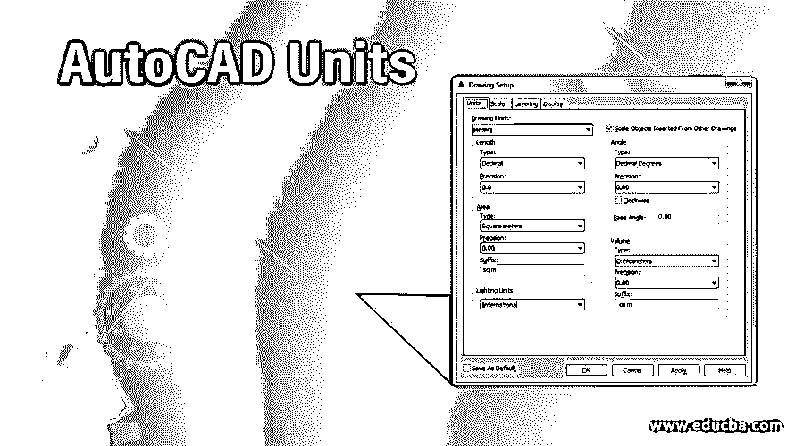

## AutoCAD 单位介绍

Auto cad 是 Autodesk 作为其工程设计软件开发的二维和三维计算机辅助设计软件。当您开始在此软件中绘制任何图形或布局时，您必须设置单位，以便您可以用特定单位输入图形值。所以为了管理这些单元的格式，我们必须分析这个软件的单元命令。我们将在本文中了解 auto cad 软件单位设置的所有重要术语，并了解如何处理 auto cad 软件的单位设置。让我们开始讨论吧。

### 如何在 AutoCAD 中设置单位？

在 auto cad 中，只需简单的几步，就可以根据自己的需要设置单位，而且绘图效率很高。但是在我们开始学习这个主题之前，我们必须了解这个软件的工作屏幕，这样在我们学习这篇文章中的这个主题时就不会出现问题。

<small>3D 动画、建模、仿真、游戏开发&其他</small>

**步骤 1:** 在工作屏幕的顶部有一个功能区，其中有不同类型的选项卡，用于管理该软件中不同类型的命令，如主页选项卡、插入选项卡、注释选项卡和其他一些命令，在该功能区下方有一个工作窗口，我们可以在其中看到我们当前的工作，在该工作窗口下方有一些导航按钮，用于管理我们在该软件中绘图期间的工作。

**第二步:**现在，我们来讨论一下这个软件的单元。对于开口，单位框转到 Auto Cad 的图标，该图标位于该软件的左上角，单击它的下拉箭头。单击该图标的下拉箭头后，将会打开一个下拉列表。这个软件有许多选项；转到绘图实用程序选项，将鼠标光标移动到该选项的箭头按钮。将打开一个新列表；点击这个新列表的单位选项。

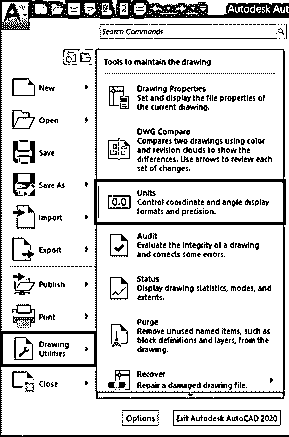

**步骤 3:** 或者您可以使用快捷键打开机组设置框。对于单位的快捷方式，从键盘按钮键入 UN，然后按键盘按钮回车。

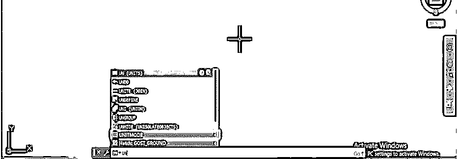

**步骤 4:** 当您按下这些按钮时，绘图单位框将会像这样打开。你可以通过上面两个选项中的任何一个来打开它。在此绘图单位框中，我们有 auto cad 中特定绘图的设置单位的参数数量。

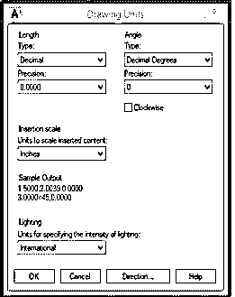

**第五步:**让我们逐一分析。第一个选项是长度；在此选项中，我们可以根据图纸参数从列表中选择不同类型的单位。如果您的绘图以米、厘米、毫米或千米为单位，请选择十进制，或者如果您的绘图以英尺&英寸为单位，请从该列表中选择建筑或工程选项，或者如果您的绘图具有非常大的单位，请选择科学单位。所以你可以根据你的画选择这些列表中的任何一个。

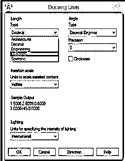

**第六步:**长度选项卡的下一个选项是精度。此选项指定绘图的精度，精确到您想要测量绘图尺寸的位数。因此，您可以在绘图的尺寸中选择点后的数字位置。

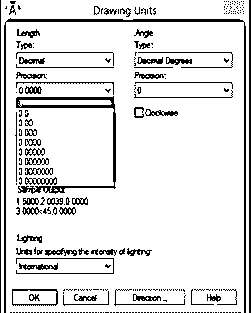

**第七步:**现在，下一个选项是角度；在角度选项中，您可以根据需要从该列表中选择绘图的角度格式。

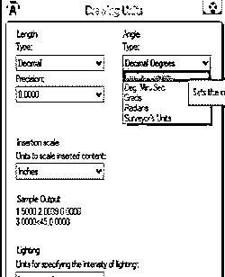

**步骤 8:** 角度选项卡的这个选项类似于长度选项卡的精度选项。它还指定了绘图角度的准确性。

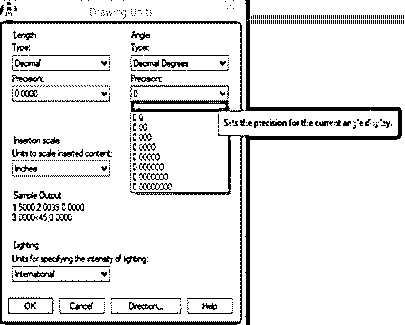

**第九步:**角度选项卡的这个选项帮助你决定从哪个方向开始计算你的角度。一般来说，auto，cad 开始以逆时针方向计算我们的角度。您可以启用此框，auto cad 将开始按顺时针方向计算角度。

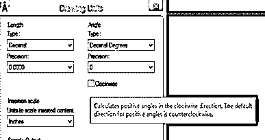

**第十步:**下一个选项是插入比例。在此选项中，您应该选择长度选项中所选单位的最小单位。这些单位将与您的绘图一起书写，用于在您的绘图上显示尺寸。因此，在用特定测量单位的最小单位制作图纸时，要考虑图纸的价值。

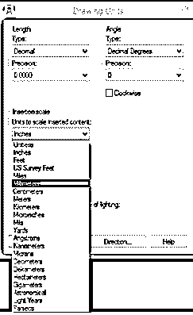

**步骤 11:** 在此对话框的样本输出部分，您可以看到您选择的单位的格式。

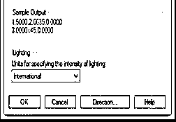

**第十二步:**现在，这个对话框的底端多了一个选项卡:方向。单击此选项卡；点击该选项卡时，将会打开一个选择底角方向的对话框。您可以从该框中选择底角的方向，例如，如果您选择“东”，则底角将从 0 度开始，或者如果您选择“北”，则底角将从 90 度开始。因此，您可以根据您的绘图要求从列表中选择任何人，然后按下此框的“确定”按钮。

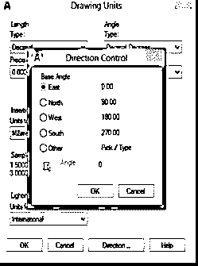

**步骤 13:** 现在按下绘图单位框中的确定按钮，应用该框中您想要的设置。

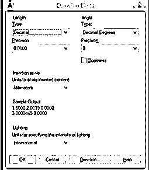

**第十四步:**现在，你要为你的画设定限额，以便制作你的画。我们为指定绘图区域设置了限制。所以，取极限值比你的图的尺寸更重要，因为在 auto cad 中，我们不得不在一张图纸中提及一些其他的点，而不是绘图。要指定限制，请从键盘键入 limit，然后按键盘的 enter 键。

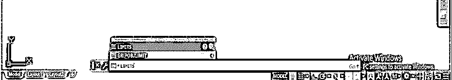

**第 15 步:**取右下角的值为(0，0 ),因为它是我们图纸中的原点，然后按键盘上的回车键。

第 16 步:现在指定图纸的右上角，我将它作为(200，200)。即绘图区域的长度和宽度，然后按键盘的 enter 键。

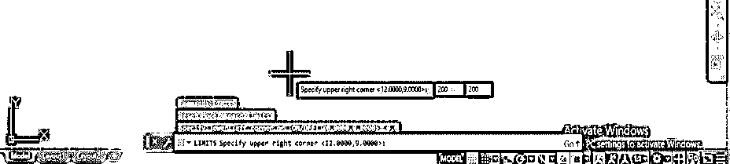

**步骤 17:** 现在，为了应用这些限制，按 Z 然后进入按钮。

**步骤 18:** 然后按 A，从键盘上按下回车键。

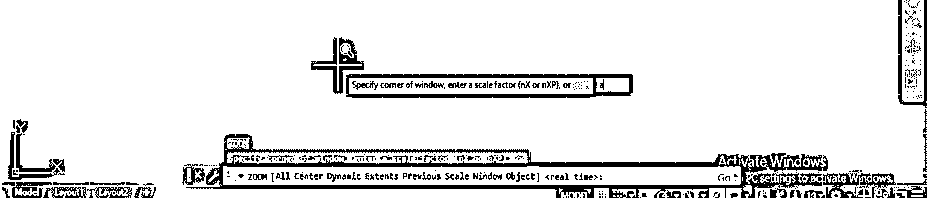

第 19 步:，你的屏幕会根据你的要求设定在你指定的极限。

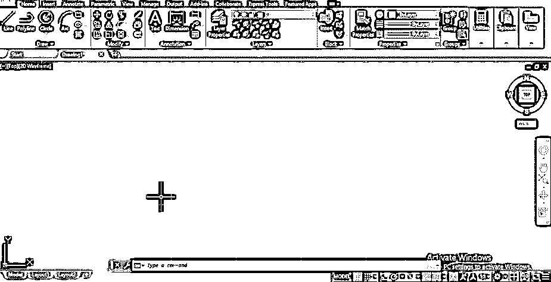

这样，您可以在 auto cad 软件中设置单位，并在该软件中处理单位设置框的参数。

### 结论

现在，学习完本文后，您将了解什么是 AutoCAD 单位，为什么在 auto cad 中设置单位对于您的绘图是必要的，以及如何根据绘图尺寸的要求设置单位的参数。通过设置单位，您可以在 auto cad 软件中提高项目工作的效率。

### 推荐文章

这是 AutoCAD 单位指南。在这里，我们讨论的介绍，如何设置 AutoCAD 的单位，在一步一步的方式。您也可以浏览我们的其他相关文章，了解更多信息——

1.  [AutoCAD 插件](https://www.educba.com/autocad-plugins/)
2.  [AutoCAD 中的工具栏](https://www.educba.com/toolbars-in-autocad/)
3.  [AutoCAD 中的布局](https://www.educba.com/layout-in-autocad/)
4.  [在 AutoCAD 中挤出](https://www.educba.com/extrude-in-autocad/)

