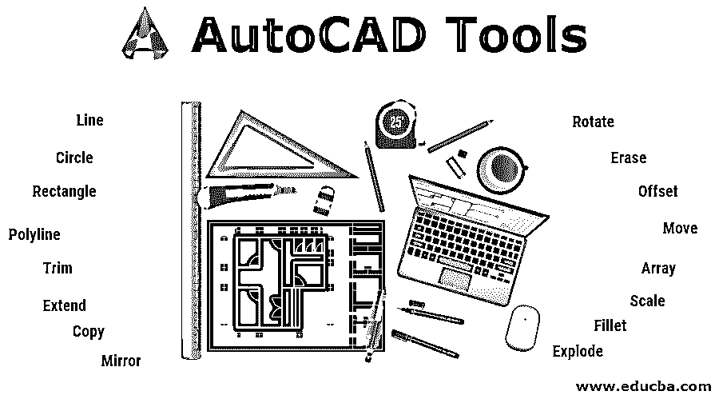
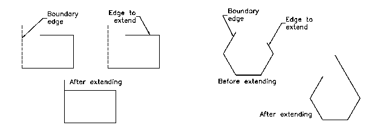

# AutoCAD Tools

> 原文：<https://www.educba.com/autocad-tools/>

## AutoCAD 工具简介

基本 AutoCAD 屏幕的各种组件包括菜单栏、绘图区、[几个工具栏](https://www.educba.com/toolbars-in-autocad/)、命令窗口、模型和布局选项卡以及状态栏。标题栏有一个 AutoCAD 符号，当前图形名称显示在屏幕顶部。现有的各种 AutoCAD 工具有助于绘制某个零件/部件，最基本的使用类型有:

*   线条
*   圆
*   矩形
*   多叉线
*   附加装饰
*   扩展
*   复制
*   镜子
*   辐状的
*   抹去
*   抵消
*   移动
*   排列
*   规模
*   鱼片
*   激增

### 各种 AutoCAD 工具

以下是各种 AutoCAD 工具

<small>3D 动画、建模、仿真、游戏开发&其他</small>

#### 1.线条

可以通过从“绘制”面板中选择“直线”工具来调用“直线”命令，也可以通过在命令提示下输入 LINE 或 L 来调用“直线”工具。您必须通过单击鼠标来指定直线的起点，然后系统会提示您指定第二个点。可以通过按 ENTER 键、ESC 键或空格键来终止“直线”命令。

#### 2.圆

使用 circle 命令绘制圆。您可以使用六种不同的工具来绘制圆，即指定圆心和半径、指定圆心和直径、指定两个直径端点、指定圆上的三个点、与两个对象相切、与三个对象相切。

#### 3.矩形

通过指定矩形的两个对角，指定其中一个边的面积和大小，或者指定矩形的尺寸，可以绘制矩形。

#### 4.多叉线

折线意味着许多线条。要绘制多段线，需要调用 PLINE 命令。调用 PLINE 命令并指定起点后，将显示以下提示:

指定起点:指定起点或输入其坐标

当前线宽为:nn.nnnn(00.0000)

指定下一点或[弧/半宽/长度/撤消/宽度]:指定第一条多段线线段的端点。

指定下一点或[圆弧/闭合/半宽/长度/撤消/宽度]:指定第二条多段线线段的端点，或按 ENTER 键退出命令。

#### 5.附加装饰

创建设计时，您可能需要移除不需要的延伸边。在这种情况下，您可以使用修剪工具。调用修剪工具时，系统会提示您选择切割边。这些边可以是直线、多段线、圆、圆弧、椭圆、射线、样条曲线、文本、块、构造线甚至视口。选择切割边后，必须选择要修剪的每个对象。

#### 6.扩展

延伸工具可以被认为是修剪工具的对立面。使用“延伸”工具，可以延伸直线、多段线、射线和圆弧以与其他对象相交。如果要延伸实际上不与边界边相交但在延伸边界边时会与其边相交的对象，可以使用此选项。

#### 7.复制

此工具用于制作选定对象的副本，并将其放置在指定位置。调用此工具时，您需要选择对象，然后指定基点。接下来，您需要指定复制对象必须放置的第二个点。您可以继续指定第二个点来创建所选图元的多个副本。

#### 8.镜子

该工具用于创建选定对象的镜像副本。对象可以在任何角度镜像。这个工具有助于画对称图形。调用该工具时，系统会提示您选择对象。选择要镜像的对象时，系统会提示您输入镜像线的第一点和镜像线的第二点。镜像线是一条假想的线，物体围绕这条线镜像。

#### 9.辐状的

调用该工具时，系统会提示您选择对象和基点，所选对象将围绕该基点旋转。默认情况下，正角度导致逆时针旋转，而负角度导致顺时针旋转。也可以从快捷菜单中调用“旋转”工具，方法是选择一个对象并在绘图区域中单击鼠标右键，然后从快捷菜单中选择“旋转”。

#### 10.抹去

有时，您需要从绘制的对象中删除不需要的对象。要擦除对象，请从“修改”面板中选择“擦除工具”。要调用“修改”工具栏，请从功能区中选择“视图”>“窗口”>“工具栏”>“AutoCAD”>“修改”。调用擦除工具时，一个称为拾取框的小框会代替屏幕光标。要擦除对象，请使用拾取框选择它。选定的对象将以虚线显示，并再次显示“选择对象”提示。您可以继续选择对象，也可以按 ENTER 键终止对象选择过程并删除选定的对象。

#### 11.抵消

您可以使用偏移工具绘制平行线、折线、同心圆、圆弧、曲线等。，偏移对象时，需要指定偏移距离和要偏移的边。

#### 12.移动

移动工具用于将一个或多个对象从其当前位置移动到新位置，而不改变其大小或方向。

#### 13.排列

在某些情况下，您可能需要以矩形或圆形排列多次创建一个对象。这种类型的排列可以通过创建对象数组来获得。在矩形阵列中，您需要提到行数和列数以及行偏移距离和列偏移距离。而在环形阵列中，您需要指定中心点，围绕该点您需要对象的数量。

#### 14.规模

有时您需要更改图形中对象的大小。为此，缩放工具就派上了用场。

#### 15.鱼片

模型中的边通常经过圆角处理，以减少应力集中的区域。圆角工具有助于在任何两个形成尖顶点的实体之间形成圆角。

#### 16.激增

当您插入了整个图形，并且需要修改一个小细节时，此工具非常有用。调用分解工具后，系统会提示您选择要分解的对象。选择对象后，按 ENTER 键或单击鼠标右键以分解选定的对象，然后结束命令。

### 结论

因此，我们已经看到，可以从上述工具中绘制和进一步修改图形，缩放和复制。这些工具帮助我们使用 AutoCAD 软件进行绘制[的主要操作。除此之外，我们还可以用特定的线型和线宽来给线条上色。](https://www.educba.com/autocad-vs-solidworks/)

### 推荐文章

这是一个 AutoCAD 工具指南。在这里，我们讨论了各种 AutoCAD 工具，以帮助绘制某个零件/组件。您也可以阅读以下文章，了解更多信息——

1.  [Adobe Photoshop 工具](https://www.educba.com/adobe-photoshop-tools/)
2.  [安装 AutoCAD](https://www.educba.com/install-autocad/)
3.  [AutoCAD 的优势](https://www.educba.com/advantages-of-autocad/)
4.  [AutoCAD 建筑](https://www.educba.com/autocad-architecture/)

