# AutoCAD 中的工具栏

> 原文：<https://www.educba.com/toolbars-in-autocad/>

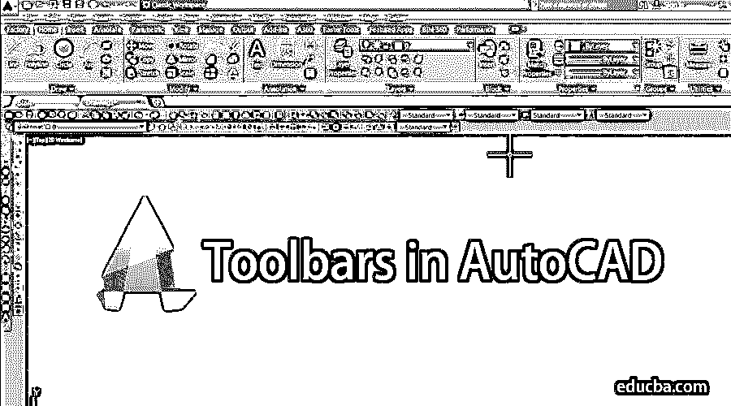

## AutoCAD 工具栏简介

AutoCAD 是一个商业辅助设计软件，用于不同的设计目的。当你第一次学习 AutoCAD 时，你必须学习工具栏。有了这个教程，你会很好地掌握工具栏，一旦你很好地掌握了操作 [AutoCAD](https://www.educba.com/what-is-autocad/) 对你来说就变成了一个简单的游戏。

在工具栏中，我们学习了不同类型的设计工具，如线条命令、圆形命令、尺寸命令、文本命令等等。让我们以极大的热情开始我们的教程，让 AutoCAD 成为我们的一项简单任务。

<small>3D 动画、建模、仿真、游戏开发&其他</small>

### 熟悉 AutoCAD 的工具栏

在这里，我们一步一步地了解工具栏的所有主要工具。根据我们的绘图，我们还学习了在 AutoCAD 中设置限制，因为这是 AutoCAD 绘图的必要部分。如果工具栏没有显示在我们的工作区中，我们还将了解如何恢复工具栏。

#### 工具栏的恢复

这里我们的工作区没有工具栏。

**步骤 1:** 对于恢复工具栏，只需点击 AutoCAD 符号，即‘A’并点击选项按钮。

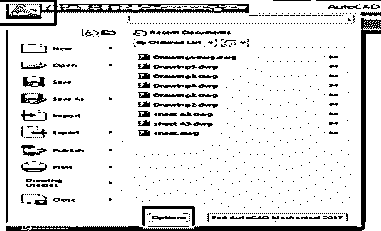

**步骤 2:** 然后点击个人资料，选择下图所示的蓝色高亮选项，并点击重置按钮。

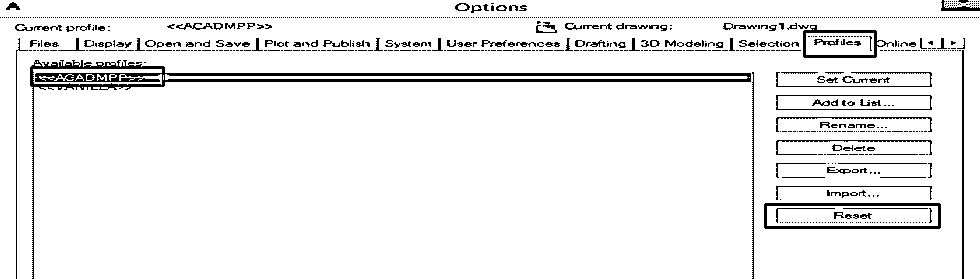

**第三步:**复位后，会打开如下图所示的对话框，然后点击是或按确定。

**第四步:**你的工具栏现在将被恢复，你可以在这里看到它们。

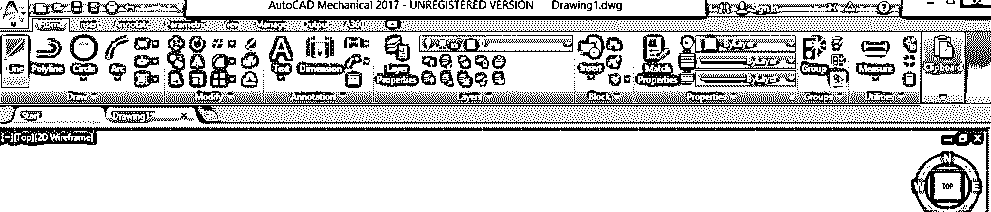

#### 在 AutoCAD 中设置限制

**第一步:**输入极限指令的前三个字母，即 lim，将自动显示极限选项；然后，选择它并按回车键，它会逐个询问您的工作空间的下限和上限。

**第二步:**我会设置一个下限(0，0)。在这里，我考虑的单位是毫米。应用限制后，按 Enter 键，再次按“z ”,然后输入，再次按“A ”,然后输入。

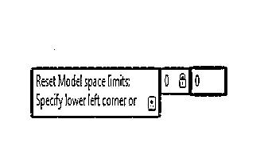

**第三步:**根据我的图纸设定上限假设(100，100)。在这里，我考虑的单位是毫米。在应用限制后，按 Enter 键，再次按“z”键，然后按“A”键。

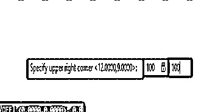

现在工作区已经根据我们的图纸设置好了。

### 工具组

让我们开始逐一介绍工具。我们这里有不同组的工具，如绘制、修改、注释等。我们将了解所有的团体。

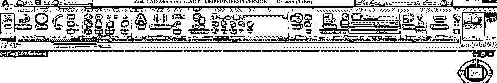

#### 1.画线工具

**步骤 1:** 通过简单的左键点击，从绘制组工具中选择线条命令。

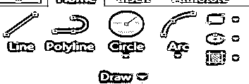

**第 2 步:**接下来，我们将通过简单地点击工作区域来指定我们想要开始我们的线的第一个点，然后设置 60 mm 的长度-然后按回车键。

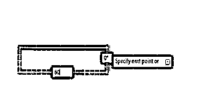

**步骤 3:** 要创建一条直线，按下键盘上的 F8 或点击右下角的 Orth 选项打开“Orth On”。

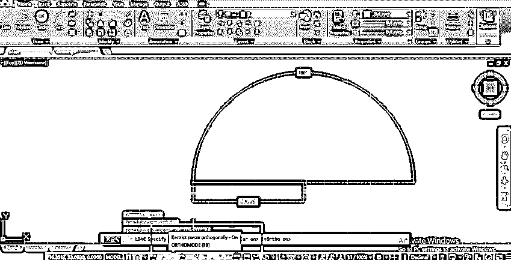

**第四步:**这里可以画任意角度的线并先给长度，按 tab 键，给角度。我将给出长度 40 毫米，角度 30 度，并按回车键。

**第五步:**退出任何命令，按键盘上的 Enter 或 Esc 键。

#### 2.折线工具

**步骤 1:** 使用折线命令绘制工具栏组，并遵循与线条命令相同的步骤。

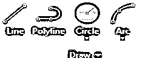

**第二步:**直线和折线的主要区别在于，直线创建的对象不是一个对象，而折线创建一个对象，如下图所示。

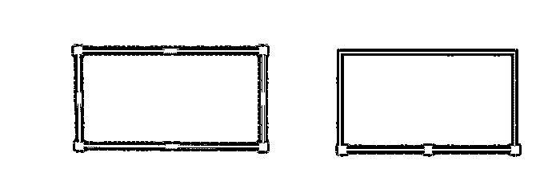

#### 3.圆形工具

**第一步:**从拖动工具组中选择圆形命令。

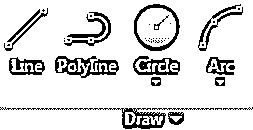

**第二步:**现在指定第一个点。

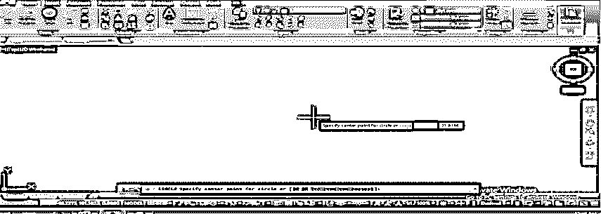

**第三步:**给出半径，按回车键。

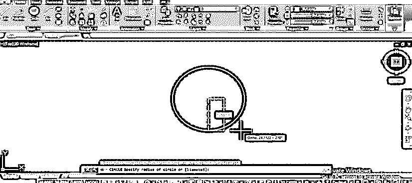

**第四步:**我们在 circle 命令中有不同类型的圆绘制选项；你可以根据你的需要来使用它们。

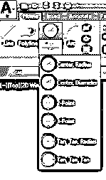

#### 4.弧形工具

**步骤 1:** Arc 命令用于在不同类型的图纸中创建一个圆弧。

**第二步:**使用圆弧命令，点击任意一点指定起点。

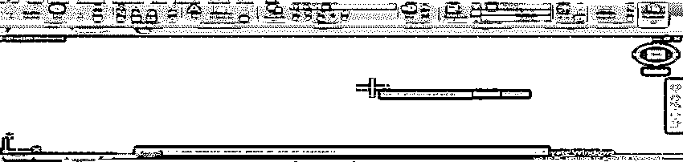

**第三步:**给出你想要圆弧的第二点的值。

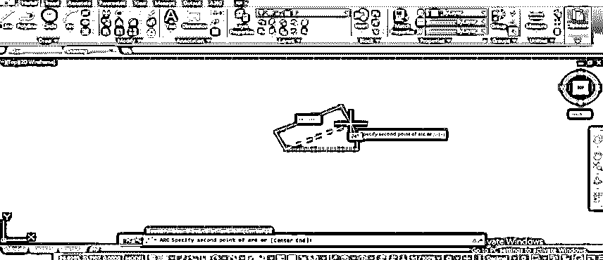

**步骤 4:** 指定可以连接圆弧或结束圆弧的端点或值。

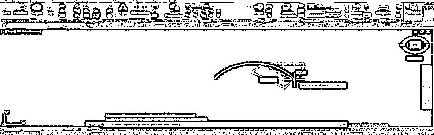

**第五步:**我们这里有不同类型的圆弧，我们根据自己的需求来使用。

#### 5.矩形工具

**第一步:**从绘制工具组中取出一个矩形工具。

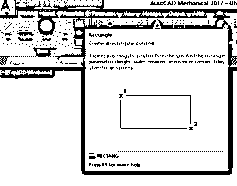

第二步:给出你要画矩形的第一个角。

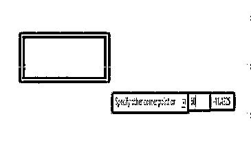

**第三步:**然后给出长度，按 tab 根据你给出宽度，按 Enter。

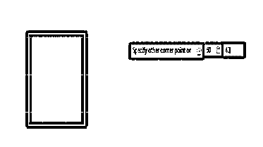

#### 6.五边形工具

**第一步:**从绘图工具组中选择五边形命令。要画它，首先，给出边数，按回车键。

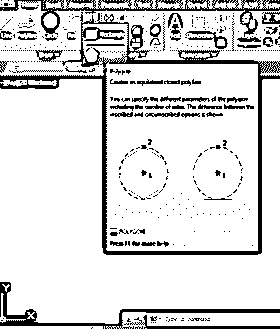

**第二步:**给出五边形的中心点。

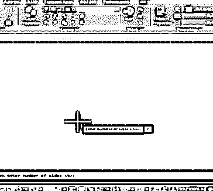

**第三步:**它现在会问它是内接于圆还是外切于圆；根据你的要求选择任何人。

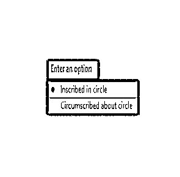

**第四步:**给出半径，回车完成命令。

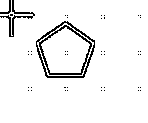

#### 7.椭圆工具

第一步:从绘图工具组中选择椭圆工具。

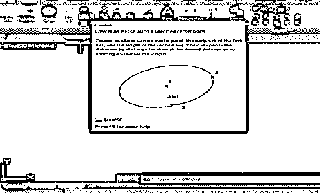

**第二步:**指定中心点，给出端点。

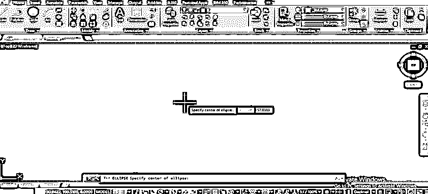

**第三步:**根据你的要求设置半径，点击左键完成命令。

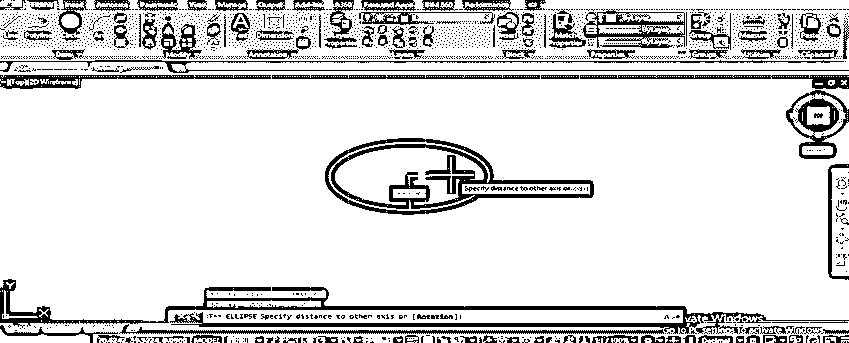

### 修改 AutoCAD 工具栏中的命令

我们使用此命令组在绘制的对象中创建任何类型的修改。让我们来看看一些修改过的命令。

#### 1.移动

**步骤 1:** 用于将物体从一个地方移动到另一个地方。

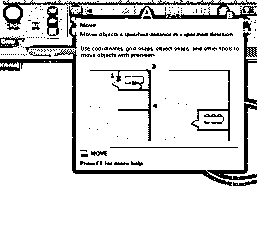

**第二步:**移动，取移动命令，选择对象，按回车键，给基点。

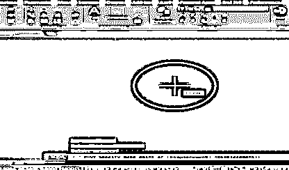

**第三步:**给出你想要的点的方向和距离。

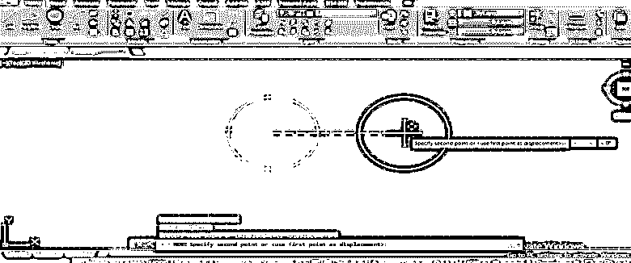

#### 2.复制

**第一步:**用于复制对象。使用复制命令并选择对象，然后按回车键并给出基点。

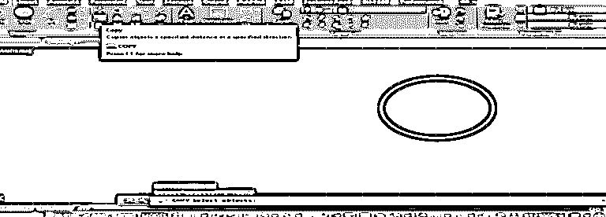

**第二步:**指点方向，点击离开复制的对象。您可以一次复印多份。

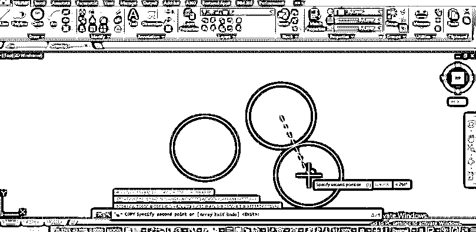

#### 3.镜子

**第一步:**用于制作物体的镜面。

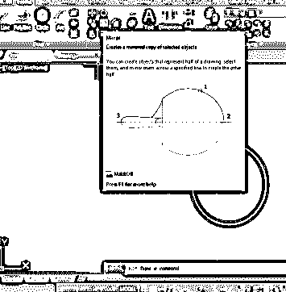

**第二步:**使用镜像命令并选择对象，然后按回车键。

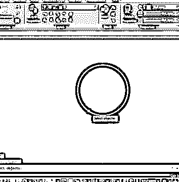

**第三步:**给出镜像线，然后按回车键；如果您不想删除原始对象，请说“是”或“否”。

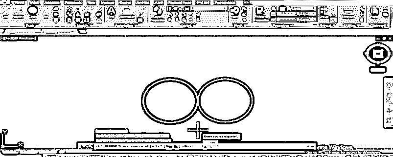

#### 4.规模

**第一步:**拿秤选择对象，然后给基点。

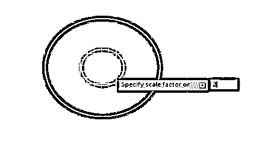

**第二步:**给出比例因子，按回车键。

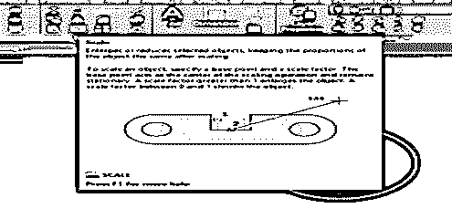

#### 5.附加装饰

第一步:修剪

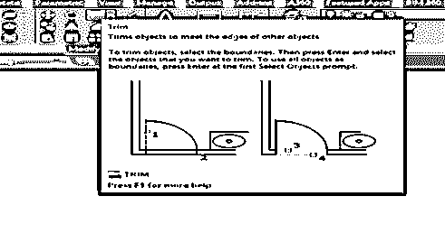

**第二步:**选择切割边，然后按回车键。

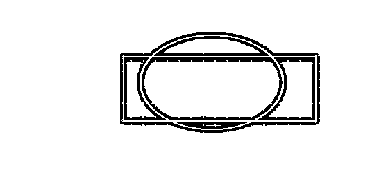

**第三步:**选择修剪线，点击进行修剪。

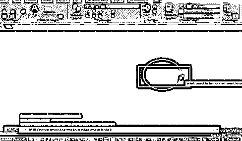

#### 6.抵消

**第一步:**取偏移量，给基点。

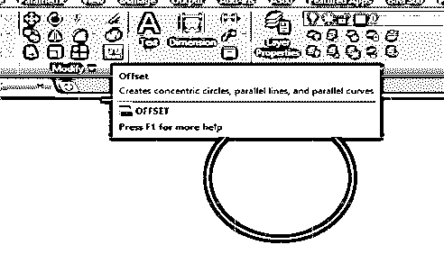

**第二步:**按回车键给出方向，点击应用该命令。

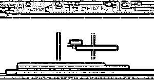

#### 7.擦除

**第一步:**选择擦除选项。

**第二步:**选择对象，按回车。

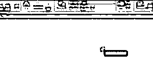

### 注释命令组

让我们看看注释命令组中的选项。

#### 尺寸命令

选择对象的第一个点并拖动到第二个点，单击并沿垂直方向拖动以显示尺寸。

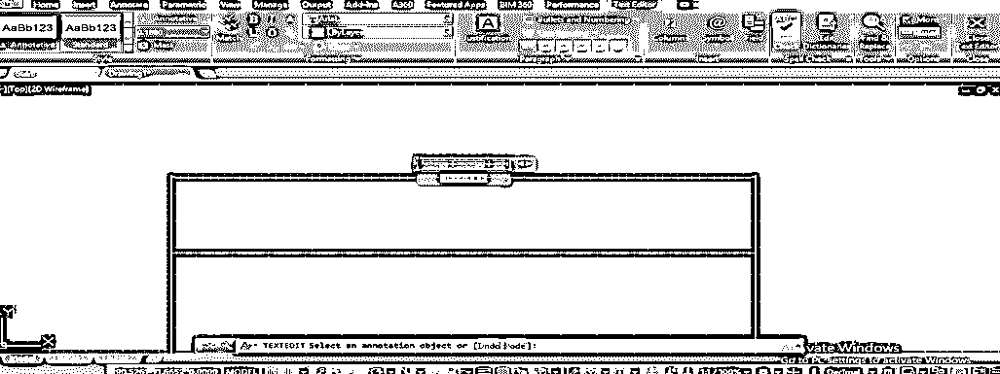

#### 图层命令

继续图层属性。

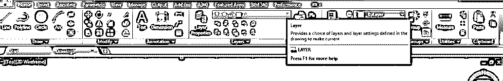

创建不同的层。

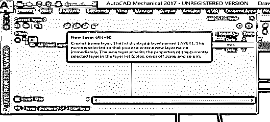

设置颜色和样式。

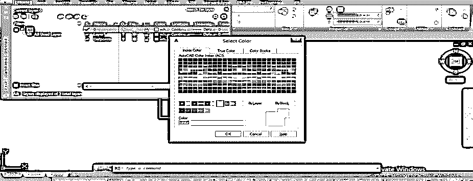

通过一次一个地选择它们来根据用途使用它们。

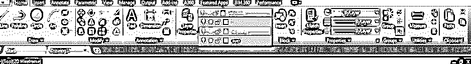

最终结果。

### 结论

现在，在熟悉了 AutoCAD 的工具之后，你会发现你对 AutoCAD 工具的认识有了很大的变化。AutoCAD 工具对你来说不再是问号。通过这次课程，你一定会提高你在 AutoCAD 设计方面的专业知识。

### 推荐文章

这是 AutoCAD 中的工具栏指南。在这里，我们讨论了关于 AutoCAD 的概述，恢复 AutoCAD 中的工具栏，工具栏中有不同的组。您也可以浏览我们的其他相关文章，了解更多信息——

1.  [AutoCAD 中的模板](https://www.educba.com/template-in-autocad/)
2.  [安装 AutoCAD](https://www.educba.com/install-autocad/)
3.  [AutoCAD 的优势](https://www.educba.com/advantages-of-autocad/)
4.  [AutoCAD 中的线条](https://www.educba.com/lines-in-autocad/)

