# AutoCAD 中的线

> 原文：<https://www.educba.com/lines-in-autocad/>

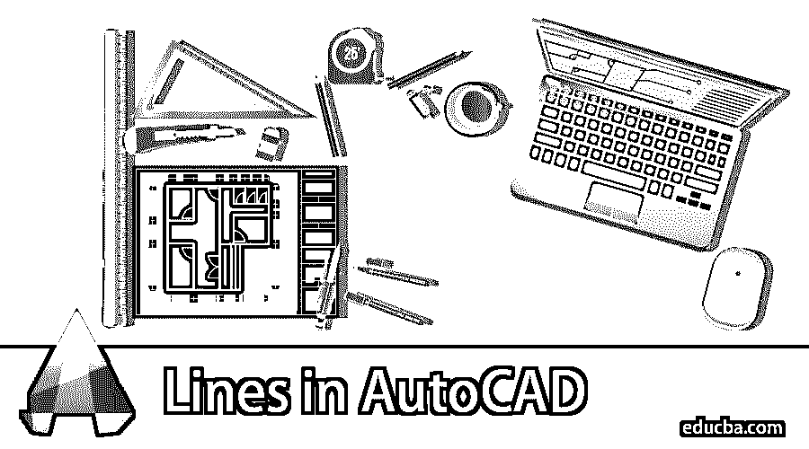

## AutoCAD 中线的介绍

AutoCAD 是一种设计和绘图应用软件，其中 CAD 代表计算机辅助设计。 [AutoCAD](https://www.educba.com/what-is-autocad/) 中有很多设计工具，如画图工具、修改工具、竖琴、注释等。台词是他们的。线条实际上是几乎每个绘图中使用的命令；没有线，就不能在绘图项目中绘制任何对象。线条是 AutoCAD 中一个有趣的工具，熟悉了是一种很好的感觉；在对 AutoCAD 中的线条有了很好的了解之后，你会发现你已经很好的掌握了 AutoCAD 设计软件。

### 在 AutoCAD 中设置限制

在 AutoCAD 中绘图之前，我们必须根据我们的绘图尺寸设置工作空间的限制。假设我的绘图尺寸是 200 x 200，那么我将从键盘输入限制到活动限制命令，然后按回车键。

<small>3D 动画、建模、仿真、游戏开发&其他</small>

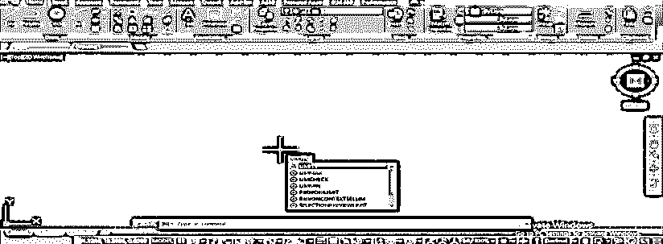

**第一步:**给一个下限角为(0，0)。

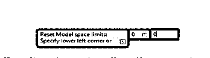

**第二步:**，上限角为(200，200)并按回车键。

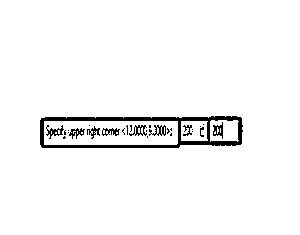

**步骤 3:** 为了应用该限制，我将按下“z”+Enter 键。

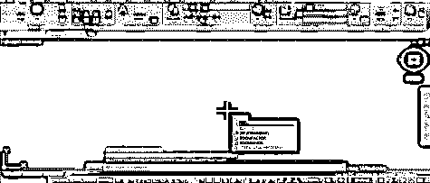

**第四步:**和‘a’+回车键。

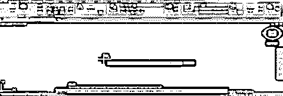

现在我的工作空间已经根据我的图纸准备好了。让我们从 AutoCAD 中的 lines 命令开始我们的教程。线是在 AutoCAD 中绘图的基本命令。我们将学习行内命令的所有方面。

### 如何在 AutoCAD 中画直线？

从绘图工具中选择直线命令。

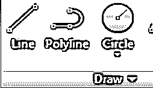

第一步:给出第一个点，从这里开始你的线条。

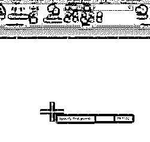

**第二步:**打开正交，创建直线；要打开“正交”,可以按 F8 键或单击“打开正交”选项，如下图所示。

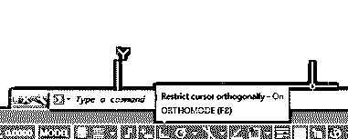

**第三步:**给出方向，给出长度，然后点击 OK 或者直接从键盘上按回车键。要退出任何命令，只需按键盘上的 Enter 或 Esc 键。

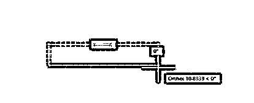

**第四步:**这里我举例说明；我将使用绘图工具中的直线命令。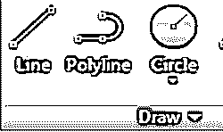

**第五步:**在工作区的任何地方取点，按下 F8 键打开正交。

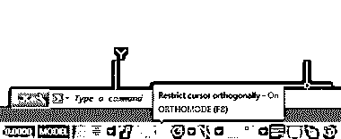

**第 6 步:**现在，我将向右拖动鼠标，通过键盘输入给出 40 mm 的长度，然后单击 Ok 应用我的命令，并按 Enter 退出。

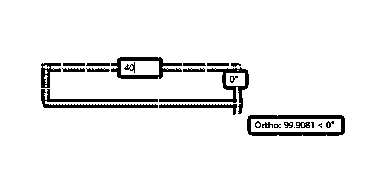

**第七步:**你可以通过点击选择任何线条或对象。选择将显示在蓝色的一些点。这些点是该线或对象的捕捉点，即线的中心点、线的端点等。捕捉使在 AutoCAD 软件中绘图变得容易。

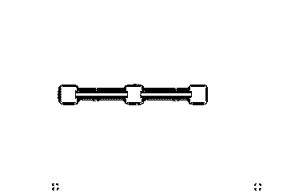

### 如何在 AutoCAD 中画斜线？

让我们用几个例子来理解这个方法:

#### 示例#1

在 AutoCAD 中画一条斜线并不是一件难事。只要给出倾斜角度就可以很容易画出来。要绘制斜线，请从绘图工具中选择直线命令。

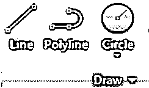

**第一步:**给出第一点。

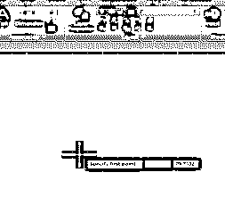

**第二步:**指明方向。

**第三步:**确保 Ortho 处于‘Ortho off’模式；要关机，请按 F8 键。

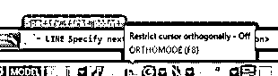

**第四步:**给出长度。

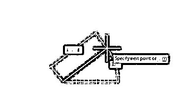

**第五步:**按 tab 给出倾斜角度，按回车键。

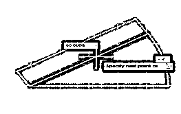

**第六步:**再次按回车键或 Esc 退出命令。

#### 实施例 2

让我们像我将要做的那样和我一起画它。我将接受一线指挥。

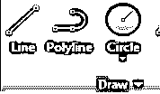

**第一步:**在我的工作区给出第一个点。

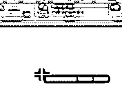

**第 2 步:**我将确保我的矫形器处于关闭模式。

**第三步:**给出 60 mm 的长度。

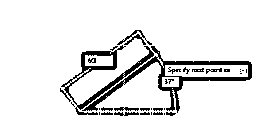

**步骤 4:** 按 tab 给出倾斜角度，键入 30°作为角度，然后按 Enter 应用命令，再次按 Enter 退出。

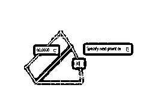

如果要在其他方向和倾斜度上继续行，那么不要从行命令中退出；再次给出线的长度和倾斜角度，按照我们之前做的相同步骤。

第五步:我会告诉你如何继续你的路线。我将再次给出 40 毫米的长度。

**步骤 6:** 给定倾斜角 150，然后按回车键应用该命令。

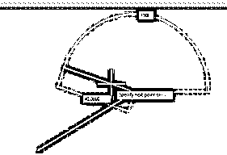

你想继续多久都可以。

### 如何通过 Line 命令创建一个对象？

进一步的示例说明了如何通过直线命令创建对象。

#### 示例#1

在彻底学习了 line 命令之后，你可以很容易地使用 line 命令创建一个对象。

**第一步:**创建一个对象，取一条线命令。

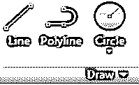

**第二步:**指定第一个点。

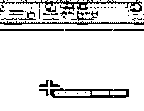

**第三步:**给出你要画线的方向，给出长度，然后按回车键。

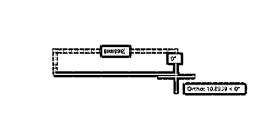

**第四步:**不退出线命令。给出另一个方向，然后再次给出长度，并按回车键。

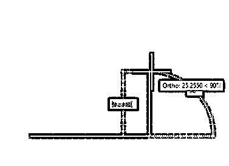

#### 实施例 2

我将通过使用 line 命令创建一个矩形来展示它。

**第一步:**开始吧。我将接受一线指挥。

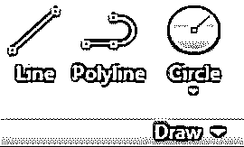

**第二步:**给出第一点。

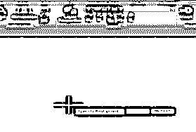

**第三步:**打开直线的正交。

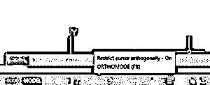

**第四步:**现在，我将光标向右拖动，给出 60 mm 的长度——按回车键。

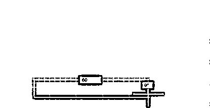

**第五步:**再次，我在垂直位置给方向，给长度 40 mm，然后按回车键。

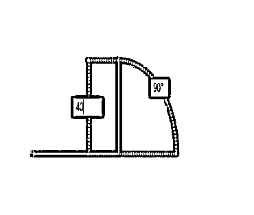

**第六步:**然后在水平位置向左方向给出方向，长度 60 mm，然后按回车键。

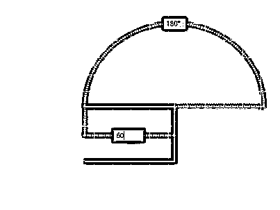

**第七步:**在下字方向的垂直位置给出方向，给出长度 40 mm。

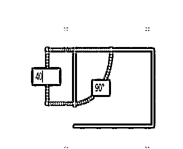

**第八步:**你可以选择工作区左下角的关闭选项来关闭对象。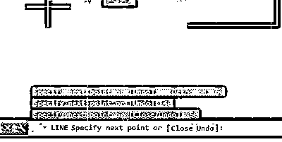

**第九步:**按回车键退出命令。

这样，你就可以用线条命令制作矩形或任何对象。

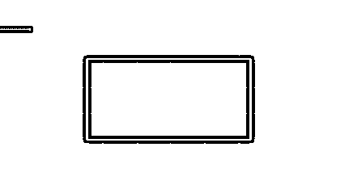

### 如何在单幅绘图中同时使用直线和斜线？

通过打开或关闭“正交”命令，我们可以在一个图形中使用线的两种特性。让我们来看看如何使用这个。

**第一步:**我来拿 line 命令。

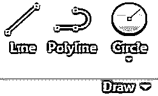

**第二步:**取第一点。

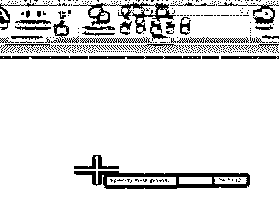

**第三步:**打开正交。

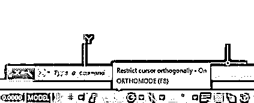

**步骤 4:** 给出 40 mm 的方向和长度-按回车键。

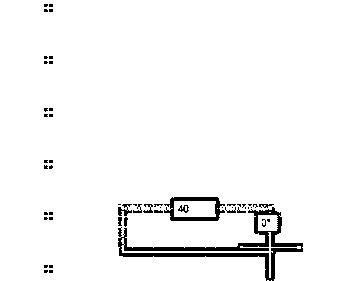

**第五步:**现在关闭正交。

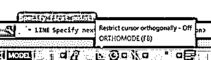

**第六步:**给出方向和长度 40 mm。

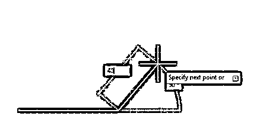

**第七步:**按 tab，给出 30°作为倾角，然后按回车键。

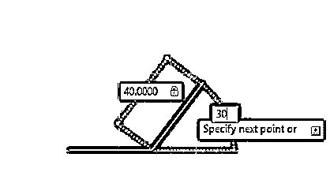

**第 8 步**:按照同样的步骤，长度为 40 mm。

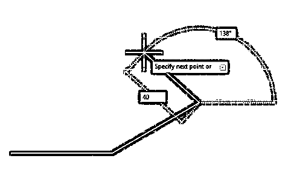

**第九步:**向其他方向倾斜 150，然后按回车键。

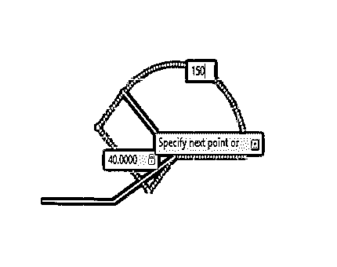

**步骤 10:** 打开正交，给出 40 mm 的长度，按回车键。

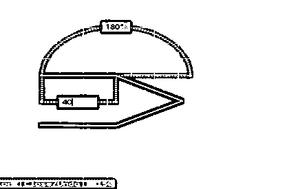

**步骤 11:** 点击关闭，关闭图。

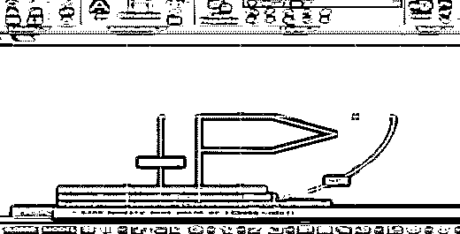

**最终图像**

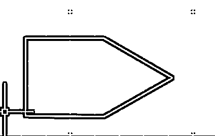

### 结论

在学习了不同期望中的线条后，你很容易发现你的知识有很大的不同。现在你可以用非常专业的方式画任何类型的画。每个人都说‘当基础清楚了，那么在任何工作中获得专业知识就变得容易了，所以在这个教程之后你的基础就清楚了。

### 推荐文章

这是 AutoCAD 中的线条指南。这里我们讨论了在 AutoCAD 中设置极限，画直线和斜线，以及用 line 命令制作对象。你也可以浏览我们的文章来了解更多-

1.  [安装 AutoCAD](https://www.educba.com/install-autocad/)
2.  [什么是 AutoCAD](https://www.educba.com/what-is-autocad/)
3.  [AutoCAD 中的偏移](https://www.educba.com/offset-in-autocad/)
4.  [AutoCAD 中的粗线](https://www.educba.com/thick-lines-in-autocad/)

