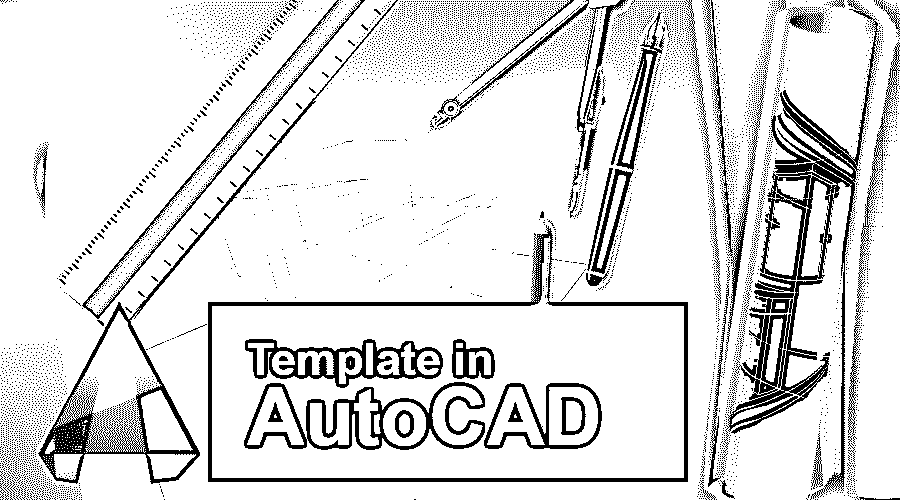
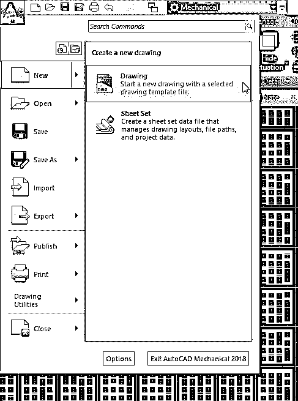
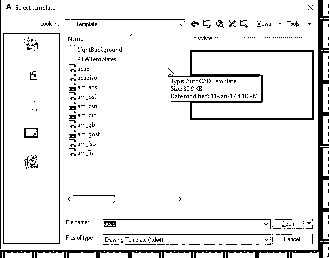
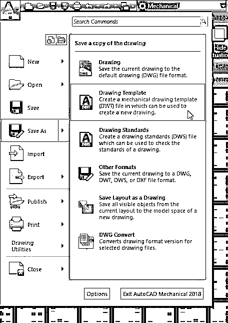
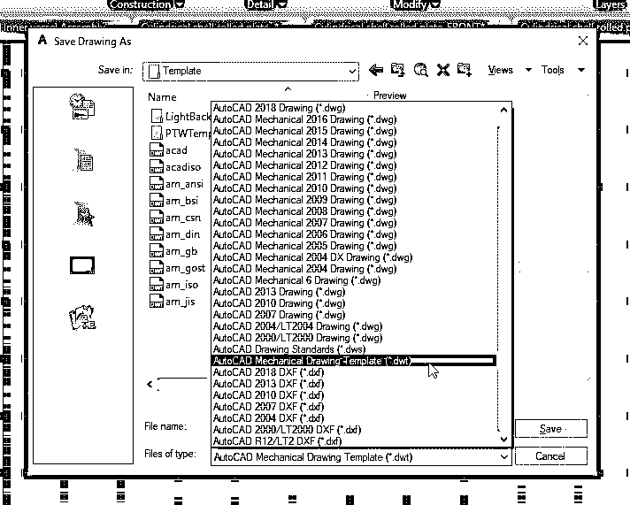
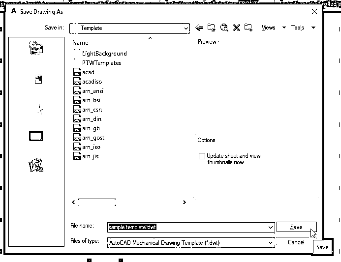
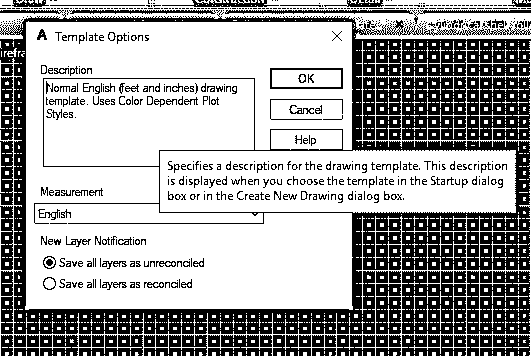
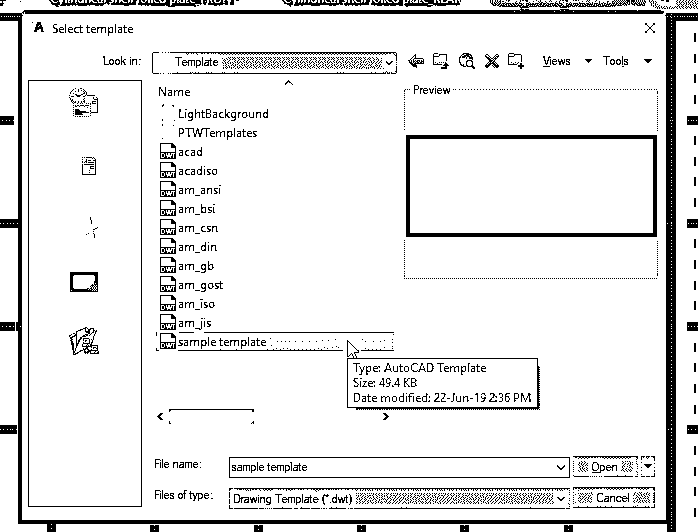
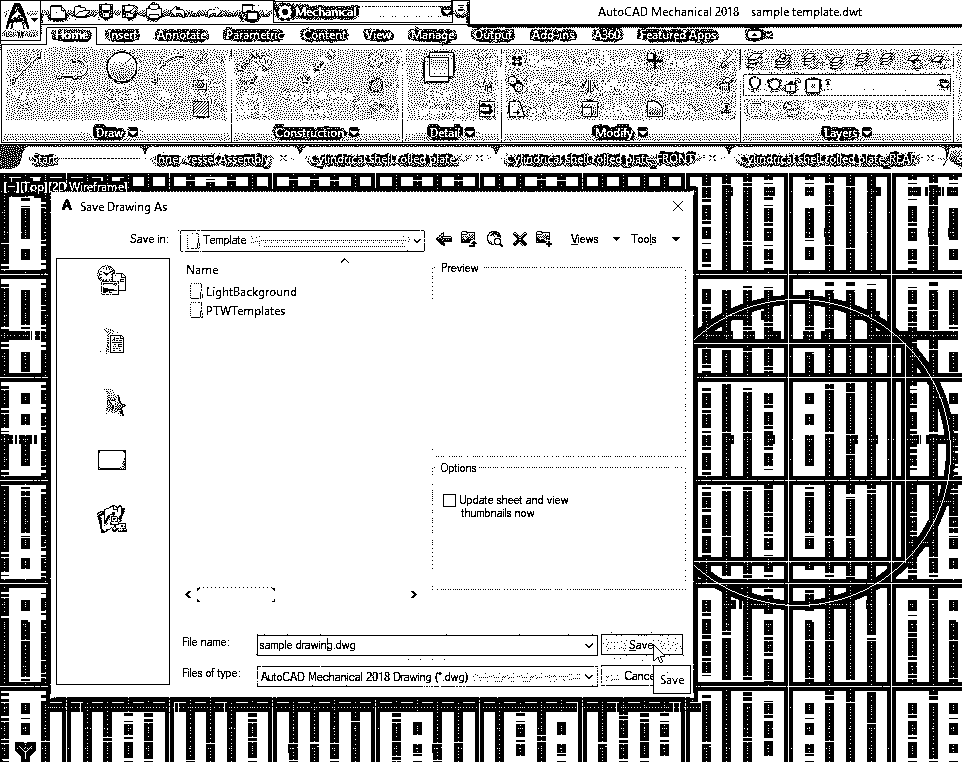

# AutoCAD 中的模板

> 原文：<https://www.educba.com/template-in-autocad/>

## AutoCAD 中的模板介绍

众所周知，AutoCAD 是 Autodesk 开发的计算机添加设计和绘图软件。它被用于各种领域，如建筑、制造、研究等。根据作品的特点，该软件有多种版本。AutoCAD 帮助用户绘制 2D 以及产品或项目的 3D 图纸。作为一名设计工程师或专业设计人员，我们的主要目标是让我们的工作更简单、更省时。为此，我们尝试了许多方法来降低工作的难度。AutoCAD 中的模板就是这样一个功能，它可以帮助我们减少工作量，节省时间。在开始新的设计项目之前，我们必须更改绘图页上的许多设置，如单位、大小、尺寸样式、图层等。每次开始绘制新图面时都进行设定并不容易，也不实际。

要完成此任务，您可以在 AutoCAD 中使用带有您希望在特定项目中使用的所有设置的模板。使用所有自定义设置设置此绘图模板后，您可以保存它并随时将其用于您的绘图。样板以 DWT 扩展名保存，当您将工作保存在样板文件中后，它会以 DWG 扩展名保存。

<small>3D 动画、建模、仿真、游戏开发&其他</small>

今天我们将讨论创建您自己的自定义设置，并将它们保存为模板文件。

### 如何在 AutoCAD 中创建模板

以下是在 AutoCAD 中创建模板的不同步骤:

**第一步:**创建自定义模板的第一步是打开 AutoCAD 软件，选择新建绘图选项，如下图所示。对于所有[不同类型的 AutoCAD](https://www.educba.com/autocad-vs-solidworks/) 软件都是一样的，如机械、MEP、电气等。

**第二步:**选择绘图选项后，屏幕上将打开另一个页面，显示不同的已保存模板。从给定的各种文件中，选择如上图所示的 acad 模板，然后单击“打开”。这是保存模板的位置。保存自定义模板后，您可以从该位置打开它。

**第三步:**之后，你的软件中会打开一个新的绘图页。这是您可以设置自定义设置的模板。更改您想要在项目中使用的任何设置。您可以在绘图中设置首选项或尺寸；您可以编辑标题栏，删除或添加图形元素，更新标注样式等。更新所有设置后，您需要保存模板文件。

**第四步:**要在 AutoCAD 中保存模板，需要点击页面左上角的‘A’符号。然后单击“另存为”选项，将绘图的副本另存为绘图模板。检查上面给你的参考图片。

**第五步:**保存模板文件时，选择。从下拉菜单中选择“dwt”扩展名。你可以看到许多其他的扩展，包括。' dwg '，在下拉列表中。如你所知，。dwt 是图形模板的文件扩展名。

**第六步:**选择扩展名后，给你的文件起个名字。你可以给任何你喜欢的名字。然后保存模板，如上图所示。

**第七步:**点击保存按钮，会打开一个对话框。这允许您为模板添加描述。在“模板”选项中，对话框会添加对添加到模板中的设置的简要描述，如上图所示。这有助于您在项目开始前概述 AutoCAD 中的每个样板。

**第八步:**一旦你在 AutoCAD 中保存了一个模板，它将在 template 文件夹中可用，当你打开一个新的绘图时，你可以选择你新制作的模板。如上图所示，您的模板将出现在另一个模板列表的末尾。选择您的模板，然后单击“打开”开始使用您的自定义模板进行绘制。

**第九步:**打开你的模板后，你就可以在你的模板文件里画任何你想要的东西了。完成工作后，您可以使用。dwg 扩展名。因此，它将保存为 acad 图形文件，而不是模板。如上图所示，单击另存为，并在对话框中选择。dwg 扩展名，然后单击“保存”。

### 结论

AutoCAD 中的样板是您工作的基准。它有助于您轻松创建未来的绘图，而无需初始设置。使用模板减少了工作时间，减少了在设置中出错的机会，并使单个项目中的每项工作保持一致。创建模板总是最好的，因为它为你当前的工作和未来的工作服务。我们可以设置单位、绘图设置、图层及其特性、比例、标注样式、文本样式、打印设置等。，在我们的模板中。

从本文中，您了解了模板在 AutoCAD 中的重要性，并学习了如何创建、编辑和保存自定义模板。在你的项目中尝试这种方法，它会让你的工作更加容易和有效。

### 推荐文章

这是 AutoCAD 中的模板指南。这里我们讨论了它的概念和在 AutoCAD 中创建模板的一步一步的过程。您也可以阅读以下文章，了解更多信息——

1.  [安装 AutoCAD](https://www.educba.com/install-autocad/)
2.  [AutoCAD 简介](https://www.educba.com/introduction-to-autocad/)
3.  [学生用 AutoCAD】](https://www.educba.com/autocad-for-students/)
4.  [各种 AutoCAD 工具](https://www.educba.com/autocad-tools/)

